# Pendulum — restless legs, measured at the ankle

**[Project site](https://konsomejona.github.io/pendulum/)** ·
**[Download a release](https://github.com/KonsomeJona/pendulum/releases/latest)** ·
**[Documentation](docs/)**

Some people's legs twitch or jerk all night. It is the thing a bed partner notices and the sleeper
never does, because it happens during sleep. Those movements are the motor sign sleep physicians
look for in **restless legs syndrome** (RLS) and **periodic limb movement disorder** (PLMD), and
most people who have them never find out.

**Pendulum records those movements with an ordinary smartwatch strapped to the ankle, and measures
the rhythm between them.** Over several nights it produces a real measurement you can put in front
of a doctor, instead of a description from memory.

It measures; it does not interpret. It can show you that your legs move in a regular rhythm at
night, and it cannot tell you what that means. That distinction is the whole design.

## What this is, and what it is not

> **It is** a real measurement. The accelerometer readings are real, the processing follows
> published scoring rules, and the numbers mean something. Used over several nights, it can give
> you a well-founded reason to book an appointment — or a well-founded reason not to worry.
>
> **It is not** a medical device, an official health application, or a diagnosis. It has not been
> reviewed or approved by any health authority, it is not affiliated with any medical body, and it
> has never been validated against a sleep study. Its numbers are on a different scale from the
> ones a laboratory produces, for reasons set out in [Limits](#limits).
>
> **It is not finished.** Everything below describes a program that builds, installs and runs. See
> [where the project stands](#where-the-project-stands).
>
> **So:** take any result to a physician. Do not take a treatment decision from it, and do not let
> a reassuring number stop you from seeing someone if you have symptoms.

**Depending on why you are here.** If your legs move at night and you want the plain version, the
[project site](https://konsomejona.github.io/pendulum/) is the only page written for a reader who is
not an engineer. If you are a physician, [`docs/02-science.md`](docs/02-science.md) states what is
claimed and what is inferred, and [`docs/07-validation.md`](docs/07-validation.md) states what has
and has not been tested. If you want to read or change the code, start at
[`docs/01-overview.md`](docs/01-overview.md), then [`docs/04-architecture.md`](docs/04-architecture.md).

## How a night goes

1. **In the evening**, you fill in a short record on the phone — dose, which leg, which strap,
   alcohol, coffee after 16:00, alone in bed — and seal it. It cannot be edited afterwards.
2. **The watch will not start recording until that record is sealed.** This is a refusal in the
   code, not a reminder: a context entered after seeing the result would be shaped by the result.
3. **You wear the watch at the ankle**, on the front of the shin, just above the ankle bones. Same
   leg, same strap, every night. The orientation of the case does not matter.
4. **Overnight** the watch samples its accelerometer and pushes what it has recorded to the phone
   every fifteen minutes, so an interruption costs about twenty minutes rather than the whole night.
5. **In the morning** you put the watch on its charger. The phone collects the rest, asks Health
   Connect for last night's sleep period, and scores the night. If the sleep period has not arrived
   yet — it often arrives hours later — the result is marked provisional and recomputed on its own.


Nothing aggregate is shown before **three eligible nights**, and there is no way to override that. A
single night carries no information about a trend: in confirmed patients, the clinical threshold is
exceeded on only about one night in three.

## What you need

Pendulum deliberately requires **two** devices, and this is not a limitation that can be engineered
away.

| Where | What | Why |
|---|---|---|
| **Ankle** | A Wear OS watch, API 33 or later (developed against a Pixel Watch 3) | The only class of consumer device whose **raw** accelerometer a third-party application can read for eight hours. Fitbit, Oura, Whoop and Garmin expose aggregated vendor metrics, never the sample stream. |
| **Wrist, finger, or under the mattress** | Any source that writes sleep sessions to **Health Connect** | It supplies the denominator. One sensor cannot honestly measure both the movements and the sleep they happen in — signal processing that suppresses movements would lower the count and raise the sleep time in the same gesture. |

For the second device, [`docs/05-devices.md`](docs/05-devices.md) compares eleven sources and ranks
them; the two that cost nothing if you already own the hardware are a Galaxy Watch with Samsung
Health, and Sleep as Android. The phone application needs Android 11 or later.

**Nothing you record leaves your phone over the network.** Neither application declares the
`INTERNET` permission, so neither can open a connection at all — it is a property of the manifest
rather than a promise. Data leaves only as a file you ask for, saved where you choose: a report
meant for a physician, or a raw bundle of one night.

## What you see

| | |
|---|---|
|  |  |
| **The application says when it cannot tell.** Here the confidence interval spans the 15/h threshold, so it says so in a box rather than picking a side. Below it, nightly values are drawn as points and never joined — a line would assert a continuity the measurement does not have — with a dashed band for the smallest change this method can detect, and a Y axis anchored at zero. | **One night, including what undermines it.** Movements detected, of which in sleep and awake, and deliberately next to them the ones excluded for posture or duration. The estimated rhythm carries its own caveat: a sensor on one leg sees a doubled interval when movements alternate between legs. |
|  |  |
| **A disabled button always says why.** This is a fresh installation with no nights in it. A card with nothing to say is disabled rather than removed, because a screen whose layout changes between 23:00 and 05:00 is worse than one that admits it has nothing. | **The watch refuses to start.** One static screen, no animation — every recomposition wakes the processor. It will not begin recording until the evening record is sealed on the phone. |

The full set, with the three defects that only a real render exposed, is in
[`docs/08-screens.md`](docs/08-screens.md). Three of the four above were captured on emulators on
1 August 2026 and predate a change to the navigation bar; the home screen is from real hardware on
4 August.

## Your first nights, step by step

What follows is one run of the current build, in the order you would meet it: the six setup steps,
one evening, the watch, the morning after, and the screen you will look at when nothing seems to be
happening. Captured on 13 August 2026 on a phone emulator (Android 14, 1080 × 2400) and on a Pixel
Watch 3.

**The nights on these screens are synthetic.** The populated screens were filled by a seeding path
that exists in the debug build only and is not compiled into a release. The screens are real; the
nights are not.

### Setting up, in six steps

| | |
|---|---|
| 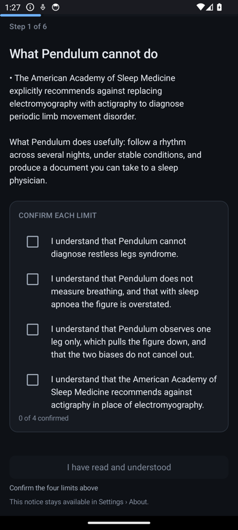 | 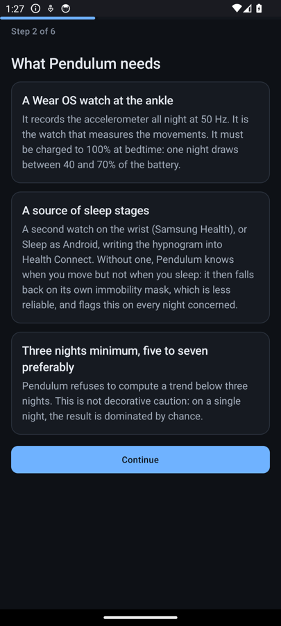 |
| **1 — What it cannot do.** The notice cannot be swiped past. The button stays disabled until the text has been scrolled to the end and each of the four limits has been ticked separately, and the greyed button carries whichever of the two is still missing. | **2 — What it needs.** Stated before anything is installed: a watch at the ankle, a separate source of sleep stages, and three nights before there is anything to read. |
| 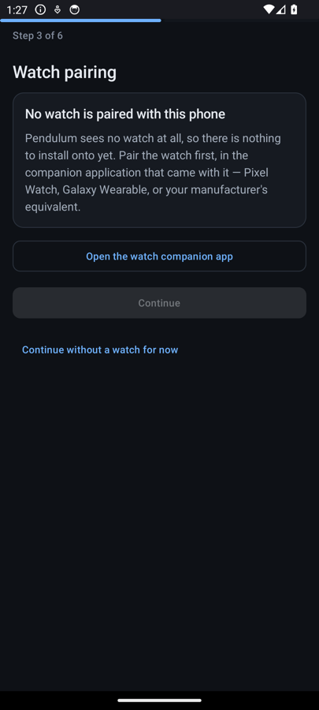 | 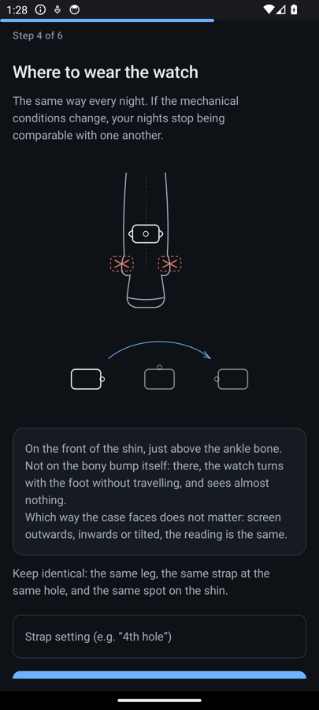 |
| **3 — The watch.** The check happens before the first night rather than after it. Here nothing is paired, so `Continue` is disabled and the only way past is an explicit choice to go on without a watch. | **4 — Where to wear it.** On the front of the shin, just above the ankle bone; never on the bone itself. The case orientation is free. The strap hole is recorded here, because a looser strap changes the amplitude. |
| 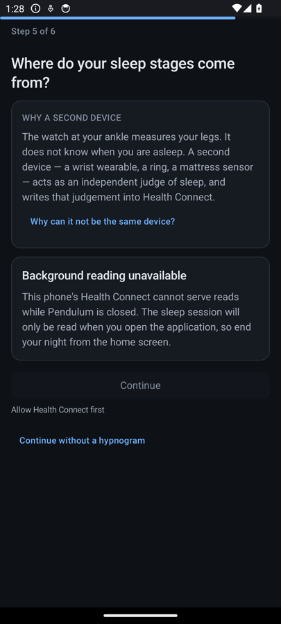 | 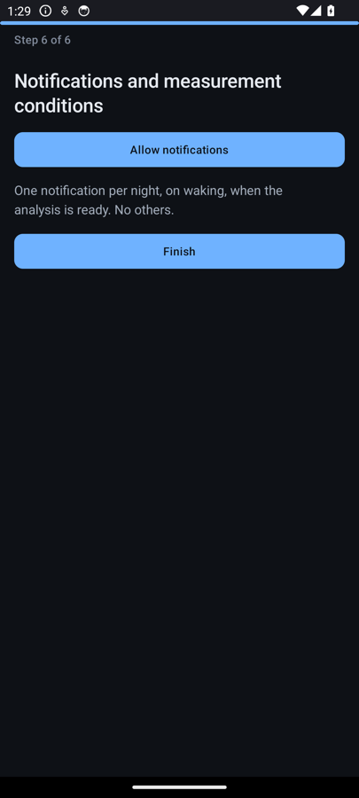 |
| **5 — Where sleep comes from.** The second device is not optional, and the step says why: one sensor cannot honestly measure both the movements and the sleep they happen in. This phone had no source at all, which is the state described under [when nothing appears](#when-nothing-appears). | **6 — Notifications.** One per night, on waking, when the analysis is ready. No others. |

### The evening, and the seal

| | | |
|---|---|---|
| 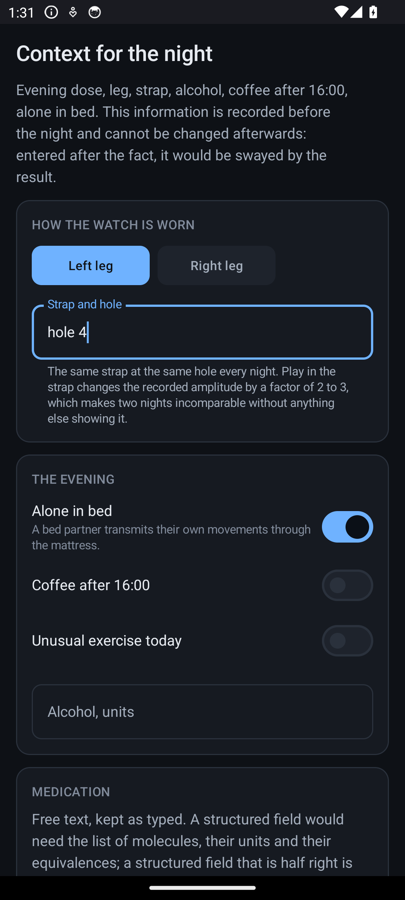 | 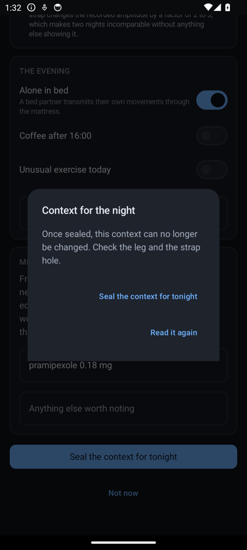 | 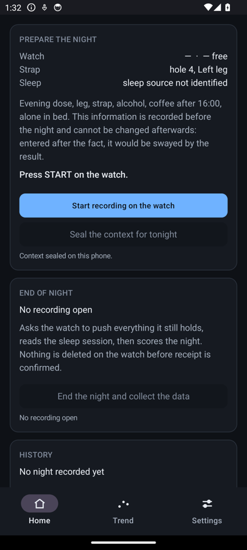 |
| **The record.** Which leg, which strap hole, alone in bed, coffee after 16:00, unusual exercise, alcohol, and the evening dose as free text. | **What sealing costs.** The dialog states it before you agree: once sealed, this context cannot be changed. | **Armed.** The phone now says what to do next, and it is on the watch. |

### The watch, and the two ways to lose a night

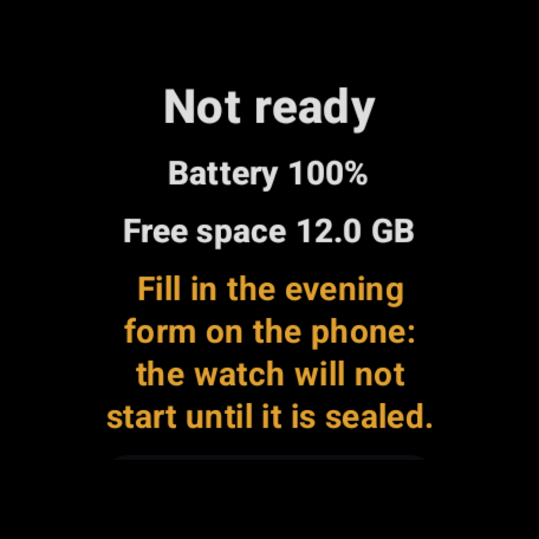

One static screen, no animation, and no result of any kind. Two things routinely cost a night here:

- **The seal comes first.** The watch will not start until the evening record is sealed on the
  phone. This is a refusal in the code, not a reminder, and the watch says so rather than failing
  quietly.
- **The charger stops the recording.** Charging sustained for a minute is read as the end of the
  night, alongside waking and a ten-hour limit. Starting a recording with the watch still on its
  charger therefore ends it about a minute later.

### The morning

| | |
|---|---|
| 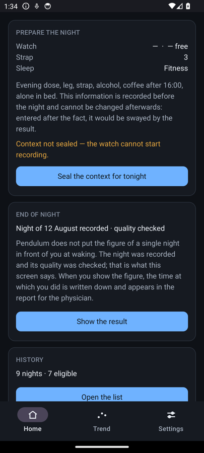 | 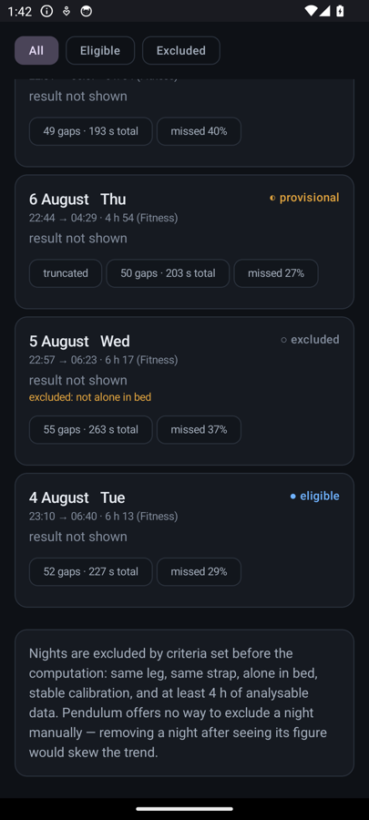 |
| **The figure is not put in front of you.** The night is recorded and its quality checked; showing the figure is a deliberate tap, and the time of that tap is written into the report. | **Every night keeps its state and its reason.** Eligible, provisional, excluded — and no button to exclude a night by hand, since a night removed after seeing its figure would manufacture the trend. |

### Three eligible nights, then a trend

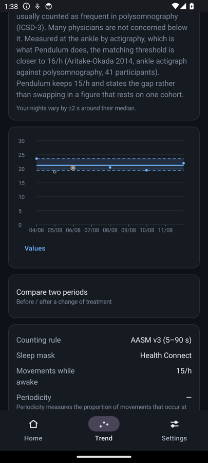

Points, never a line. Two dashed bands: the interval, and the smallest change this method can
detect. A calendar X axis, so a night not recorded leaves a hole rather than being closed up. Y
anchored at zero. What each element is for is argued in
[`docs/06-interface.md`](docs/06-interface.md).

### When nothing appears

| | |
|---|---|
| 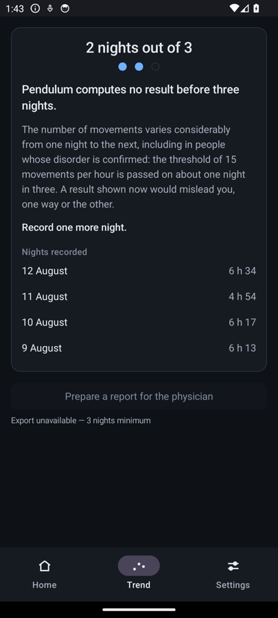 | 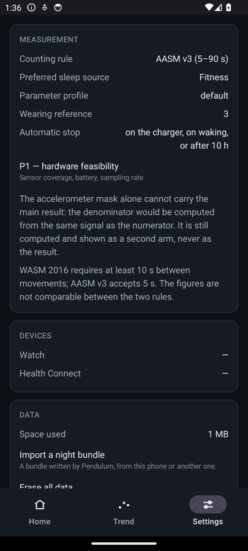 |
| **This is the ordinary case, not a fault.** Below three eligible nights there is no chart, no median and no export — and there is no code path that produces one. Four nights were recorded here and two of them are eligible; the refusal lists all four, so you can see they arrived. | **Where to look.** `Preferred sleep source` and the `Health Connect` line say whether a second source was found. Home carries the same line, as `sleep source not identified`. |

The discouraging case is the one that looks exactly like a bug and is not. **A night recorded
without an independent sleep record is captured, transferred, analysed and stored like any other. It
appears in the list, scored against Pendulum's own accelerometer denominator and marked provisional,
and it never enters the trend** — so the count of eligible nights does not move and the chart stays
refused, night after night. The night is not lost: it is on the phone, with its raw signal and its
result, and it is re-scored from raw the day a hypnogram covers it. What the list cannot show is
that none is coming: a provisional row reads the same whether its sleep period is an hour late or
will never exist, which is why this page insists on the point. The reason is on the settings screen
in the application's own words: *the accelerometer mask alone cannot carry the main result — the
denominator would be computed from the same signal as the numerator.* The fix is not in Pendulum: it
is a second application writing sleep sessions into Health Connect — a wrist wearable, a ring, an
under-mattress sensor. [`docs/05-devices.md`](docs/05-devices.md) compares eleven sources and marks
which of them are confirmed to write there rather than assumed to.

The screens this walk-through leaves out — one night in detail, the report for a physician, the
hardware feasibility gate, erasure — are in [`docs/08-screens.md`](docs/08-screens.md), and what the
application does with a night from reception to score is in
[`docs/01-overview.md`](docs/01-overview.md).

## Why the rhythm, and not the usual number

A pendulum's period does not depend on how far it swings. Huygens proved it in 1656, and it is why
pendulums became clocks: the *amplitude* decays, the *period* holds. The same split runs through
this project.

The clinical convention is the PLM index — movements per hour of sleep, with a threshold at 15/h.
Pendulum computes it and puts it in the report a physician would read, because that is the number a
sleep specialist looks for. But it is not the number the application tracks over time:

- **It is unstable.** Night to night, the hourly count varies by 43.2 %; the mean log interval
  between movements, by 3.6 % (Skeba et al., *Sleep Med* 2016). Twelve times less.
- **It needs a denominator**, and the interval does not — an interval is computed from the movement
  times alone, so it cannot be inflated by an error in the sleep estimate.
- **It is on the wrong scale.** About 39 % of movements scored on EMG in a laboratory produce no
  detectable motion at an ankle-worn sensor (Terrill et al., EMBC 2013). An accelerometric count is
  a different quantity, not a noisy version of the laboratory one, so the 15/h threshold does not
  transfer to it.

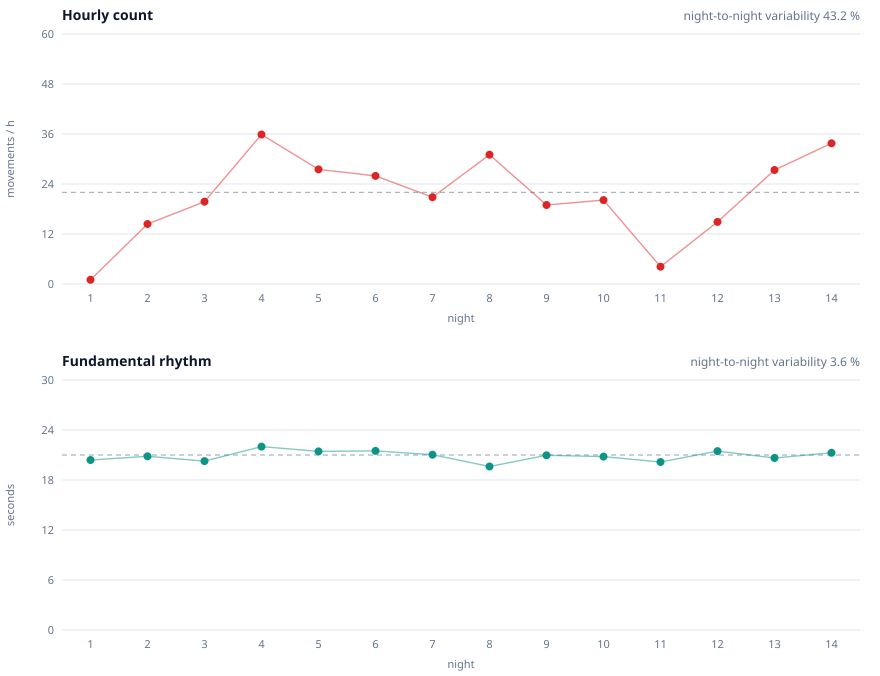

*Fourteen synthetic nights. The scatter is drawn from the published night-to-night variability of
the movements themselves — not from recorded data, and not from this application's output. Same
person, same disorder, both panels.*

So the quantity tracked is the **fundamental rhythm in seconds**, recovered by separating the
harmonics of the interval distribution: a missed movement merges two 21 s intervals into one 42 s
interval, which is structure rather than noise. The full argument is in
[`docs/02-science.md`](docs/02-science.md) §3, the estimator in
[`docs/03-algorithm.md`](docs/03-algorithm.md) §6.

**What this software's estimator achieves is worse than that, and it is measured rather than
assumed.** The 3.6 % is a property of the physiological quantity, not of the code. On the nominal
synthetic night the estimator's relative error on the fundamental is **11.3 %** — about three times
the effect it is meant to track — and the deconvolution declares only **2 fits valid out of 20**;
sweeping the one threshold that governs this reaches 11 out of 20 at an error near 6 % and no
further, because underneath sits the 39 % of movements no threshold can recover
([`docs/07-validation.md`](docs/07-validation.md) §4.3 and §4.4). The argument for tracking the
rhythm is unaffected, since it is an argument about the quantity; what is established is narrower
and worse — **the current estimator does not reach that quantity under the current settings.** The
part that works is the refusal: on a night it cannot resolve, the application publishes nothing
rather than a confident wrong number, and says so on screen.

## Limits

These are not disclaimers added for form. They are the reasons the output must not be read as a
diagnosis.

- **A leg sensor cannot diagnose restless legs syndrome.** The diagnosis is clinical — five IRLSSG
  criteria based on waking symptoms. Periodic limb movements are a supporting criterion, nothing
  more.
- **The AASM issues a strong recommendation against actigraphy** as a replacement for EMG in
  diagnosing periodic limb movement disorder (Smith et al., *JCSM* 2018).
- **Without a respiratory channel**, respiratory-related leg movements cannot be excluded. In the
  presence of sleep apnoea the index is structurally **overestimated**.
- **A unilateral sensor** misses movements of the opposite leg, biasing the count downward. This
  does not cancel the previous bias; do not assume the two compensate.
- **A single night means nothing.** The interface refuses to draw a trend below three nights, by
  design and not by warning.

The application is built to make the convenient mistake hard rather than merely discouraged: the
evening record is sealed before the watch will start, the result is hidden by default on waking and
revealing it is logged, parameters cannot be changed for one night only, there is no button to
exclude a night by hand, and no word meaning *improvement* exists anywhere in the interface strings —
a unit test asserts that on the resource file itself. The reasoning behind each of these is in
[`docs/01-overview.md`](docs/01-overview.md) §4.

## Where the project stands

**Pre-alpha.** All modules build. The two pure-JVM modules carry 238 unit tests and the two
applications 395 more, plus twenty-six that need a real device or an emulator; the signal
chain is exercised against synthetic nights with injected ground truth, by a harness that reports
where it fails and not only where it passes ([`docs/07-validation.md`](docs/07-validation.md)).

The roadmap declares a hardware feasibility gate blocking — three consecutive nights at 99 % sample
coverage with battery to spare — and the rest of the project was built before passing it. That gate
is now instrumented, displayed in the settings and exportable, so its verdict is calculable.
[`docs/01-overview.md`](docs/01-overview.md) §5 records the departure from the plan and what it costs.

Nothing has been validated against polysomnography, and there is no plan that would make that
possible for an individual.

## Installing

Take **both** applications from the same release: they share an application identifier and a
signature, and the Wearable Data Layer only exchanges data between applications that share both.
Mixing a release build with a local one produces two applications that never see each other, and the
failure mode is silence.

```bash
adb install pendulum-phone-<version>.apk
adb connect <watch-ip>:5555 && adb -s <watch-ip>:5555 install pendulum-watch-<version>.apk
```

[`docs/09-release.md`](docs/09-release.md) covers verifying the signature and the checksums — worth
doing for a health-adjacent application distributed by sideloading — the first-run sequence, and how
to cut a release.

## Building

```
pendulum/
├─ format/   Kotlin JVM   append-only chunk codec, CRC-protected, wire structures
├─ algo/     Kotlin JVM   integrity, timeline, DSP, detection, sleep mask, indices, synthetic truth
├─ wear/     Android      foreground capture service, incremental sync
└─ phone/    Android      ingestion, Health Connect, storage, Compose UI
```

Everything testable on a JVM lives outside the Android modules. `algo` depends on nothing at all —
not on Android, not even on `format` — so it can be exercised against synthetic signals with
injected ground truth.

```bash
./gradlew :format:test :algo:test                                # pure JVM
./gradlew :wear:testDebugUnitTest :phone:testDebugUnitTest
./gradlew :wear:assembleDebug :phone:assembleDebug
```

Requires JDK 17 and an Android SDK with platform 36. On WSL, a build directory on a `drvfs`/9p
Windows mount makes Gradle fail on `chmod`; remount with the `metadata` option, or point
`-Ppendulum.buildRoot` at a native filesystem path.
[`docs/04-architecture.md`](docs/04-architecture.md) is the module map, the capture path and the
transfer protocol.

## Documentation

Nineteen documents, and they are the substance of this project rather than an appendix to it. Start at
[`docs/README.md`](docs/README.md), which is a short index with three suggested reading orders.

| Document | Contents |
|---|---|
| [`docs/01-overview.md`](docs/01-overview.md) | What the project is, how a night flows through it, the design decisions, the guard rails, and the roadmap with its honest status |
| [`docs/02-science.md`](docs/02-science.md) | The phenomenon, the two scoring rule sets, why periodicity rather than a count, and an explicit list of what is genuinely unknown |
| [`docs/03-algorithm.md`](docs/03-algorithm.md) | The processing chain stage by stage, rejected alternatives, a worked numerical example, full parameter tables |
| [`docs/04-architecture.md`](docs/04-architecture.md) | Module map, capture on the watch, chunk format, transfer protocol, energy budget |
| [`docs/05-devices.md`](docs/05-devices.md) | Choosing the hardware and the sleep source; eleven sources compared; Health Connect integration and its traps |
| [`docs/06-interface.md`](docs/06-interface.md) | Interface principles as verifiable constraints, screen by screen, and how an uncertain number is displayed |
| [`docs/07-validation.md`](docs/07-validation.md) | The synthetic ground truth, the non-regression suite, and the current status including what fails and why |
| [`docs/08-screens.md`](docs/08-screens.md) | Screenshots of the running application, and the three defects only a real render exposed |
| [`docs/09-release.md`](docs/09-release.md) | Installing a release, verifying it, and cutting the next one |
| [`docs/references.md`](docs/references.md) | Bibliography, each source marked by whether it was read in full, as an abstract, or not at all |

The original working documents are under [`docs/workings/`](docs/workings/) and are considerably more
detailed: the full parameter tables, the energy arithmetic, and the things that were checked and
turned out to be wrong. [`docs/workings/BENCH-LOG.md`](docs/workings/BENCH-LOG.md) has no condensed
counterpart — it is the bench log, every measurement taken on real hardware, and the most frequently
updated file in the repository. Authority is by subject; `docs/README.md` says which document wins on
which subject.

## Licence

Pendulum is **dual-licensed**. The source code is under the **GNU Affero General Public License
v3.0** ([`LICENSE`](LICENSE)): use, study, modify and redistribute it freely, including for research,
provided derivative works stay under the AGPL and a modified version offered over a network makes
its source available to its users. The documentation in `docs/` is under
**[CC BY-NC-SA 4.0](https://creativecommons.org/licenses/by-nc-sa/4.0/)**
([`LICENSE-docs`](LICENSE-docs)).

**Commercial licensing.** To incorporate Pendulum into a closed-source product without the
obligations of the AGPL, a separate commercial licence is available — open an issue titled
`commercial licence`. A licence cannot compel anyone to share revenue; it can only make a commercial
user's cheapest legal path lead through a conversation, and nothing stops a company reading the
specification and reimplementing the method, since copyright protects the expression and not the
algorithm.

## Contributing

Contributions are welcome and require signing a Contributor Licence Agreement — see
[`CONTRIBUTING.md`](CONTRIBUTING.md). Without it the project could not offer commercial licences at
all, since that requires holding the rights to the whole work. Security reports go through
[`SECURITY.md`](SECURITY.md).

## Prior art

No consumer application or open-source project performing this measurement was found. The precedents
are medical and out of reach (SOMNOwatch), discontinued (Philips PAM-RL, Actiwatch), or
single-subject academic prototypes. The feasibility argument rests on Spektor et al., *Clocks &
Sleep* 2024, which validates a unilateral ankle triaxial accelerometer against polysomnography — with
the important caveat that its scoring was **manual**, not algorithmic. Note also US patent
10,335,085 (Johns Hopkins), which mentions an accelerometer held on the leg by a strap for detecting
periodic leg movements; its claims and status have not been examined. That is raised as a fact worth
knowing, not as legal advice.
