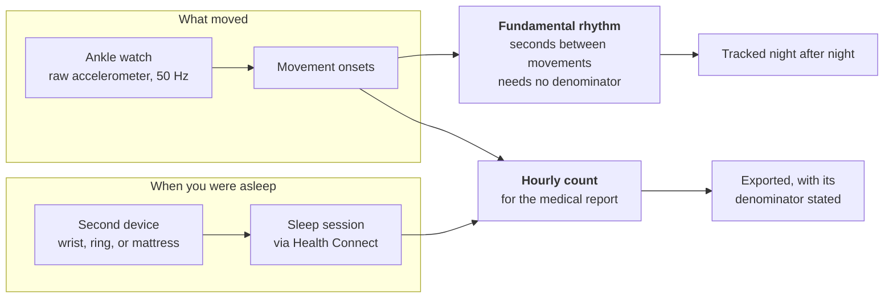
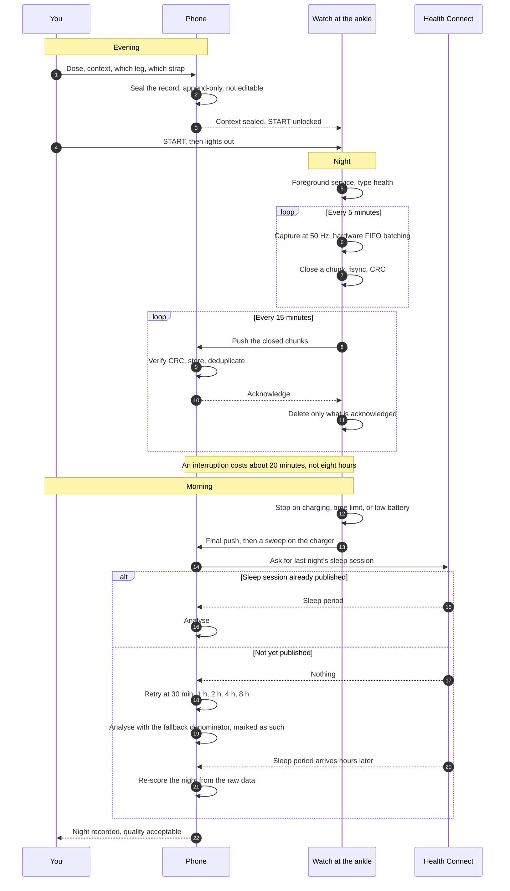

# What Pendulum is, and how a night passes through it

> **Pendulum** measures periodic limb movements in sleep from a smartwatch worn at the ankle, and
> tracks the *rhythm* between them rather than their number. It is it measures, it does not
> interpret — a real measurement to take to a physician, not a diagnosis and not a medical device — see
> [what this is, and what it is not](../README.md#what-this-is-and-what-it-is-not).

Pendulum records raw acceleration from a Wear OS watch worn at the ankle and estimates the rhythm and
rate of periodic limb movements in sleep. This document is the entry point: the problem, the flow of
one night from evening to result, the decisions that shaped the design, the guard rails, and the
current state of the work.

It stays deliberately shallow. The science is in [`02-science.md`](02-science.md), the signal chain
in [`03-algorithm.md`](03-algorithm.md), the software in [`04-architecture.md`](04-architecture.md).

---

## 1. The problem, in plain terms

Periodic limb movements in sleep are repetitive leg movements, mostly a flexion of the ankle, that
recur roughly every 20 to 40 seconds in runs lasting minutes to hours. They are the motor sign
associated with restless legs syndrome. In a sleep laboratory they are scored from surface EMG of
*tibialis anterior*, counted, and divided by hours of sleep.

Pendulum counts something related but not identical: the movements that actually shift a sensor strapped
above the ankle joint. That distinction is not a detail, and [`02-science.md`](02-science.md) spends
a section on it.

### Why an ankle

The movement is a movement of the leg. A wrist sensor sees it only when it propagates through the
body, which it mostly does not. Nothing else about the wrist is preferable; the watch is at the
ankle because that is where the signal is.

### Why the sensor is an accelerometer and not a gyroscope

A movement lasting 0.5 to 10 seconds is fully described by acceleration. A gyroscope adds nothing to
that description and costs 3 to 40 times the current, depending on mode. On the BMI270, 210 µA
against 685 µA in normal mode, 10 µA against 420 µA in low power at 25 Hz. There is no argument for
paying it.

The consequence matters more than the comparison itself. Because the gyroscope is irrelevant, the
device-selection criterion is not "which wearable has the better sensor package". It is a much
cruder question:

> **Can a third-party application read the raw sensor at all?**

That question rules out Fitbit, Oura, Whoop and Garmin, regardless of the specifications printed on
their datasheets. They expose aggregated vendor metrics — a sleep score, a movement index, a
readiness figure — and never the sample stream. Wear OS exposes the sample stream. That is the whole
reason a Wear OS watch is the device. See [`05-devices.md`](05-devices.md).

### Why a second, independent device

The clinical index is movements per hour of *sleep*. The count is the numerator; sleep time is the
denominator. If both come from the same accelerometer, the metric becomes circular: signal
processing that suppresses movements lowers the numerator and, in the same gesture, raises the
denominator, because fewer movements look like more sleep. A treatment with no effect can then
display as a clear improvement.

So the sleep period comes from a separate source — a wrist wearable, a ring, a mattress sensor —
through Health Connect. Consumer devices estimate total sleep time well and sleep *stages* poorly,
and total sleep time is all the index needs.

Two chains, two independent devices, and only one of the two outputs depends on both. That asymmetry
is the reason the rhythm, not the count, is the quantity the application tracks.

---

## 2. A night, end to end

Three things in that flow are load-bearing.

**The evening record is sealed before the watch will start.** Not "should be filled in first" — the
START button is refused until it exists. See §4.

**Chunks leave the watch during the night, not at the end.** Each five-minute chunk is about 91 kB,
which fits the payload limit of a single replicated data item. A chunk pushed at 02:00 is already on
the phone; the watch dying at 03:00 no longer concerns it. Bounded loss, roughly 20 minutes.

**The analysis is not a one-shot.** The sleep session may reach Health Connect long after waking —
the manufacturer's own documentation describes watch-to-phone transfer as governed by "the watch's
own policy due to battery considerations", with no guaranteed delay. So the night is analysed with
what is available, marked with its independence level, and re-scored from the raw data when the
hypnogram finally arrives. Re-scoring is always from raw; nothing downstream is treated as
irreversible.

---

## 3. Design decisions, and the reasons

| Decision | Alternative rejected | Reason |
|---|---|---|
| **Transport: a replicated, persistent data store** (Wear `DataClient`) | A channel or socket (`ChannelClient`), which v1 had selected | Both cap at 100 kB, but the store has the semantics of a replicated database: it buffers, it survives disconnection, and it synchronises on reconnection without being asked. This is the single choice that makes an interrupted night survivable. A channel is now only the catch-up path. |
| **Chunk size: 5 minutes, about 91 kB** | 30 minutes, 8 MB | 91 kB fits one data item, so the nominal path needs no assets, no channel, no handshake. Loss granularity falls from 30 minutes to 5. |
| **Push every 15 minutes rather than continuously** | Streaming at 1 Hz | Incremental synchronisation costs 1 to 3.6 % of the battery over a night. Streaming keeps the Bluetooth link out of sniff mode and the processor out of suspend: 52 to 100 %, and it still does not carry the raw signal. |
| **Capture: a foreground service of type `health`** | Type `dataSync`; an always-on activity | `dataSync` has a six-hour timeout per 24 hours under Android 15. An eight-hour night crosses it. `health` has no documented timeout, and unlike `dataSync` it may be started from `BOOT_COMPLETED`, which is what makes recovery after a reboot legal. An always-on activity lights the screen all night, costs more, and is killed sooner. |
| **A 15-minute watchdog alongside the service** | Relying on `START_STICKY` | `START_STICKY` is not reliable against the low-memory killer. The watchdog checks that the recording is genuinely alive rather than nominally restarted. |
| **Metric: the fundamental rhythm, in seconds** | The hourly count | See below. |

### The metric, in one paragraph

The clinical convention is movements per hour of sleep, and Pendulum computes it and puts it in the
report a physician would read. But it is not the number tracked over time. Night-to-night
variability of the hourly count is 43.2 % ± 37.1; of the mean log inter-movement interval,
3.6 % ± 3.7 — roughly twelve times less. The interval also needs no denominator, so it escapes the
circularity described above, and it is a property of the rhythm rather than of the amplitude, so it
does not inherit a laboratory threshold that an accelerometer cannot honour. A missed movement
merges two 21-second intervals into one 42-second interval, which is a harmonic and not noise; the
mixture model that separates the harmonics also returns the estimated miss rate, which doubles as a
night-comparability check. The full argument, with the three publications it rests on, is in
[`02-science.md`](02-science.md) §3; the estimator itself is in
[`03-algorithm.md`](03-algorithm.md) §6.

One correction belongs in the same paragraph rather than in a footnote, because it bears on the
central claim. **The 3.6 % is a property of the physiological quantity, not of Pendulum's
estimator.** It is measured by Skeba et al. on movements scored in a laboratory. Measured on the
nominal synthetic night, the estimator's own relative error on the fundamental is **11.3 %** —
roughly three times the effect it is meant to track — and the deconvolution declares only **2 fits
valid out of 20**, refusing far more often than it answers.
[`07-validation.md`](07-validation.md) §4.3 is that measurement, and §4.4 traces the cause to a
single threshold parameter whose best reachable setting still leaves the estimator short. The
argument for tracking the rhythm rather than the count is unchanged, because it is an argument about
the quantity: it needs no denominator, it inherits no laboratory threshold, and the physiological
figure stands. What the measurement establishes is narrower and worse — **the current estimator does
not reach that quantity under the current threshold policy.** The refusal is the part that works: on
the nights it cannot identify, the product publishes nothing rather than a confident wrong number.

---

## 4. The guard rails

This project produces a number that may influence how someone talks to their doctor about a dose.
The dominant failure mode is not a bug in the detector. It is a number that is crisp, plausible, and
wrong — and a user who, without any dishonest intent, keeps the nights that agree with what they
already believe.

So the guard rails are written as code, not as warnings. A warning is advice you can decline. These
cannot be declined.

| Guard rail | What it prevents |
|---|---|
| **The evening record is sealed before the watch will start.** Append-only, not editable afterwards. | Adjusting the reported context after seeing the result. |
| **The result is hidden by default on waking.** The morning screen says the night was recorded and that quality was acceptable. Revealing it is logged, and the log is exported. | Reading the number in the state where you are least able to judge it, and doing so without trace. |
| **No per-night parameter adjustment.** A parameter change is global, bumps a hash, and triggers a re-score of every night from raw. The trend refuses to mix two hashes. | Tuning until last night looks the way you expected. |
| **No "exclude this night" button.** Exclusions are deterministic predicates evaluated before the computation — same leg, same strap, alone in the bed, calibration gain within tolerance, at least four analysable hours. Excluded nights stay visible, greyed out, with their reason shown. | Silently dropping the inconvenient nights. |
| **A minimum-detectable-change band is computed and drawn.** Below it the interface states that the variation is indistinguishable from night-to-night noise. No verb of change appears in the string resources, and a unit test asserts that on the resource file itself. | Reading a trend out of a difference smaller than the measurement error. |
| **The metric is named `aPLM-i`** — ankle periodic limb movement index, estimated, not validated — in the code, the database and the export. | Calling it PLMI, which guarantees it is read as a laboratory PLMI. |

The reasoning is uncomfortable but simple. Every one of these could be a recommendation in a manual,
and every one would then be quietly bypassed on the night it mattered. A project whose output
touches a health decision has to make self-deception structurally difficult rather than merely
discouraged, and the only place that can be enforced is the code. The interface principles that
follow from this are in [`06-interface.md`](06-interface.md); the adversarial review that motivated
them is in [`07-validation.md`](07-validation.md).

### The honest framing, stated once

The intended user is already under treatment. Without a reference period without treatment, this
device **cannot measure the effect of the treatment**. It measures variability under treatment, and
possibly the effect of a dose change if that change is decided by a physician, applied in long
blocks, and declared in advance. The only defensible goal of this project is to help obtain a real
examination, not to replace one. No dose is adjusted on this number.

---

## 5. Status and roadmap

**Today: pre-alpha.** All four modules build, and all four are written. The two pure-JVM modules
carry **201 unit tests**; the two Android applications run on emulators and carry **250 tests of
their own** — 244 on the JVM plus 6 instrumented tests of the guard rails. What does not exist is a single
night of real data — the hardware feasibility gate (P1) has not been passed.

| Module | Language | State |
|---|---|---|
| `format` | Kotlin, pure JVM | Implemented and tested. 5 source files, 53 tests. Append-only chunk codec, CRC-protected. |
| `algo` | Kotlin, pure JVM | Implemented and tested. 25 source files, 148 tests, of which 3 are long-running measurements kept `@Disabled`. Integrity, timeline, DSP, detection, sleep mask, indices, synthetic ground truth. Depends on nothing, not even on `format`. |
| `wear` | Android | Written. 19 source files, 37 unit tests. Foreground capture service, sensor strategy, gap monitor, stop conditions, watchdog, boot recovery, incremental synchronisation over the data store. |
| `phone` | Android | Written. 76 source files, 207 unit tests plus 6 instrumented tests of the guard rails. Ingestion, Health Connect, Room storage, background workers, Compose interface, PDF and CSV export. |

Nothing has been validated against polysomnography, and there is no plan that would make that
possible for an individual.

The phases run in order, and each has an exit criterion that can be checked rather than judged.

| Phase | Contents | Exit criterion |
|---|---|---|
| **P0** | Four-module skeleton; `format` compiles and its tests pass | `./gradlew :format:test` green, both application packages installed |
| **P1 — blocking** | Sensor spike alone, 3 to 5 nights. **No line of algorithm is written before this passes.** | Coverage at or above 99 % of expected samples, **measured on the differences between `SensorEvent.timestamp` values and never on arrival time** — with FIFO batching, an arrival-time rule fires on every night and measures nothing. Battery above 20 % remaining at eight hours. Reproducible across three nights. If it fails, seriously consider a dedicated logger such as an Axivity AX3 or a GENEActiv rather than persisting. |
| **P2** | Format hardening: CRC extended over the block header, flush-overlap forbidden, time zone recorded, end marker, resynchronisation on a corrupt block | Killing the process mid-night leaves the session resumable, with loss of at most one block — 10 seconds — not one chunk |
| **P3** | Incremental transfer over the data store, plus the channel-based catch-up sweep | A full night received with Bluetooth cut in the middle; watch killed at 03:00 leaves everything already pushed intact and marks the night truncated |
| **P4** | Algorithm, written test-first against synthetic signals with injected ground truth | The 17 non-regression assertions of [`03-algorithm.md`](03-algorithm.md) |
| **P5** | Sleep mask, Health Connect, local database, background workers | Agreement between the computed mask and the external hypnogram reported as a kappa; one real night producing results under both clinical rule sets |
| **P6** | Phone interface, questionnaires, export | A cold run from night to charger to result, with no intervention |
| **P7** | A seven-night campaign, plus a voluntary-movement protocol | A minimum-detectable-change band, and a parametric sensitivity curve |

Two orderings in that table were declared not negotiable. **P1 blocks everything**, because an
algorithm written against data that the hardware cannot actually deliver is wasted work, and the
failure would surface only after months. And **P4 is test-first**: the synthetic generator carries two label sets,
one for what an EMG would have scored and one for what an accelerometer can mechanically see,
because roughly 39 % of EMG-scored movements produce no detectable motion at an ankle sensor at all.
Without that distinction, a target such as "F1 at or above 0.90" is unreachable for a reason that is
not the algorithm's fault.

One verification should ideally happen before P0 and must happen before P5: confirm that the chosen
sleep source actually writes sleep *stages*, and not merely a duration, into Health Connect — and
measure how long after waking it does so. The entire denominator rests on that. See
[`05-devices.md`](05-devices.md).

### The order was not followed, and P1 is still not passed

The table above says P1 blocks everything, and the sentence inside it says that no line of algorithm
is written before it passes. **That is not what happened.** P2 through P6 have been built — format
hardening, incremental transfer, the algorithm and its synthetic harness, the sleep mask and the
background workers, the phone interface and the export — and **P1 has not been passed. No
accelerometer has spent a night at an ankle with this software.** A piece of P7 arrived early as
well: the parametric sensitivity curve listed as a P7 deliverable was written to settle a question
inside `algo` ([`07-validation.md`](07-validation.md) §4.1), while the seven-night campaign it
exists to serve has not been run.

This is written down rather than smoothed over. Departing from a plan is not dishonourable; claiming
to have followed it is. And the risk the ordering was written to avoid is exactly the risk now
carried: the detector, its thresholds and the entire test suite are calibrated against a synthetic
signal, and the hardware has never been asked whether it can deliver the samples that signal assumes.

What has changed is that the gate is now **instrumented**. `PorteP1.kt` computes the verdict per
night and per campaign from `night_session` alone, Settings › Measurement displays it, and a CSV
export carries it out of the application. Three criteria per night, each with its measured value,
its threshold and its state: coverage at or above 99 % — read from the same function the rest of the
application uses, so that two implementations of one percentage cannot diverge on the number that
decides the project — battery strictly above 20 % at eight hours, and delivered sample rate within
5 % of nominal. Each has **three** outcomes rather than two: a six-hour night says nothing about the
battery at eight hours, and *indeterminate* is its own verdict rather than being filed with the
successes, which would let a campaign clear a gate it has not cleared.

The gate also asks for three **consecutive** evenings, not three conforming nights collected over
three months, and the code checks consecutiveness on the night key — the same midday boundary that
attaches a night to its sealed context — rather than counting conformances. A skipped evening breaks
the run exactly as a failed one does, because reproducibility is the property that separates a rig
that holds from a rig that held once.

So the verdict is calculable, displayable and exportable. What is missing is the nights.
