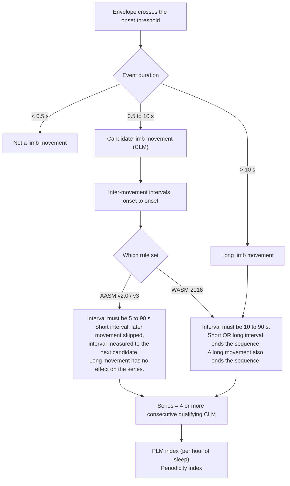
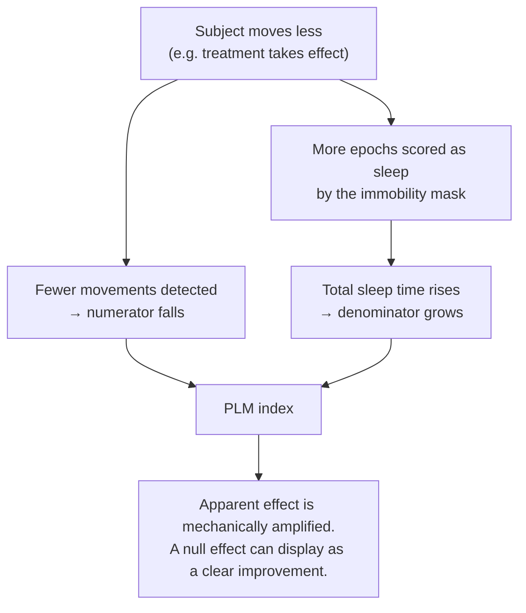

# The science behind Pendulum

> **Pendulum** measures periodic limb movements in sleep from a smartwatch worn at the ankle, and
> tracks the *rhythm* between them rather than their number. It measures; it does not
> interpret — a real measurement to take to a physician, not a diagnosis and not a medical device — see
> [what this is, and what it is not](../README.md#what-this-is-and-what-it-is-not).

This document explains what periodic limb movements in sleep are, how they are scored in a sleep
laboratory, why Pendulum tracks the *rhythm* of those movements rather than their hourly count, and what
an accelerometer strapped to an ankle can and cannot see. It is written for a curious reader or for a
sleep physician who wants to know what the software is actually claiming.

It also states, at length, what is not known. Several of the numbers used in this project are
inferences rather than citations, and the section [What is genuinely unknown](#what-is-genuinely-unknown)
lists every one of them. Full bibliography with access status in [`references.md`](references.md).

---

## 1. The phenomenon

Periodic limb movements in sleep (PLMS) are repetitive, stereotyped movements of the limbs — almost
always the legs — that occur during sleep at intervals of roughly 20 to 40 seconds, in runs lasting
minutes to hours.

The classical clinical picture is a **triple-flexion response**: dorsiflexion of the ankle and
extension of the great toe, often with flexion of the knee and sometimes the hip. The resemblance to
the Babinski sign is old and deliberate; Smith (1985) described the movements as tonic, clonic, or
mixed, and reported the tonic/clonic pattern in about 75 % of cases. That paper was not read in full
for this project — the figure is taken from secondary citation and should be treated accordingly.

PLMS are the motor sign associated with restless legs syndrome (RLS) and, when they cause clinical
consequences of their own, with periodic limb movement disorder (PLMD). They are common in the
general population and increase with age, which is one reason a count on its own is a weak
discriminator.

### What is known about their morphology, and what is not

Known, with reasonable confidence:

- Duration at the ankle averages **4.2 s** in RLS (Sforza et al. 2005, measured with the
  PAM-RL) and **4.5 ± 0.4 s** for sleep movements generally (Sicbaldi et al. 2025, Axivity AX6).
  The figure often quoted as "4.2 ± 0.14 s" is **mean ± standard error of the mean**, not a
  standard deviation: Sforza §2.5 states that "results in the text and in the tables are expressed
  as mean ± standard error of the mean", and the RLS group is 11 patients. The between-patient
  standard deviation of the per-patient mean duration is therefore `0.14 × √11 ≈ 0.46 s`, and the
  **event-to-event** dispersion — the one a generator actually needs — is not published at all.
  Only the 0.5–10 s scoring window bounds it.
- The inter-movement interval (IMI) distribution is **log-normal**, with a mode at **22–26 s** in
  RLS (Ferri), and a distinct secondary mode at **2–4 s** corresponding to sub-movements within a
  single event.
- Typical movement magnitude at the ankle during sleep is **377 ± 63 mg** (Sicbaldi et al. 2025).

Not known:

- **There is no published spectral analysis of PLMS recorded by accelerometry.** No paper reports the
  frequency content of the acceleration signal a leg movement produces. Pendulum assumes the useful
  energy is below about 6 Hz. That is an inference (see §5), not a citation.
- **There is no published peak acceleration for a PLMS.** The range Pendulum works with, roughly
  15–600 mg at the ankle, is bracketed from detection thresholds of validated devices and from a
  forward physical model — not measured.
- The often-repeated claim that the duration distribution has a mode around 2–3 s is **not supported
  by any published histogram** that could be located.

For completeness, the forward model Pendulum uses for synthetic ground truth treats the movement as a
minimum-jerk angular trajectory of the shank about the knee, giving a bipolar acceleration pulse
whose spectral peak sits at roughly `0.8 / T_rise`. For rise times of 0.15–0.50 s that is
**1.6–5.3 Hz**. The model reproduces the published magnitude range without being fitted to it, which
is the strongest validity argument available in the absence of a published spectrum. It remains a
model.

---

## 2. How PLMS are scored

Two rule sets are in current use: the AASM scoring manual (v2.0, 2012, carried into v3, 2023) and the
World Association of Sleep Medicine standards (WASM 2016, revising WASM 2006). Both operate on
surface EMG of the anterior tibialis muscle.

### The numeric criteria

| Criterion | AASM v2.0 / v3 | WASM 2016 |
|---|---|---|
| Onset of a limb movement | EMG rises **8 µV above resting EMG** | Same |
| Offset | **start** of a period lasting **≥ 0.5 s** during which EMG does not exceed **2 µV above resting** | Same |
| Duration of a candidate movement (CLM) | **0.5–10 s** | **≥ 0.5 s**, no upper bound (see below) |
| Morphology | no rule | must contain a **≥ 0.5 s** period whose **median** amplitude exceeds the offset threshold (rule 3.2.1-d, new in 2016) |
| Series length | **≥ 4** consecutive CLM | **≥ 4** CLM (= 3 intervals) |
| Inter-movement interval, onset to onset | **5–90 s** | **10–90 s** |
| Effect of a short interval | not specified in the manual | **ends the sequence** (rule 3.3.6) |
| Effect of a long (> 90 s) interval | ends the sequence | **ends the sequence** (rule 3.3.6) |
| Effect of a movement longer than 10 s | movement is not a CLM; sequence unaffected | movement **ends the sequence** (rule 3.2.1 / 3.3.6) |
| Relation to sleep | at least a portion of each CLM must fall in an epoch of sleep (change introduced in v3) | a sequence may **cross** a wake/sleep transition (rule 2.4.4) |
| Bilateral combination | two legs combine if onsets are **< 5 s** apart | two legs combine if offset-to-onset is **< 0.5 s** |

Two notes on the duration bound. The frequently cited range **0.5–5 s** is the AASM v1 rule from
2007 and has been obsolete since v2.0 in 2012; a number of secondary sources still quote it. And the
WASM 2016 change is not "movements longer than 10 s are ignored" — the manual is explicit that such a
movement *terminates the sequence in progress*.

### The structural difference is the series-breaking rule, not the interval bound

Most secondary summaries reduce the AASM/WASM difference to "5–90 s versus 10–90 s". That is the
smaller of the two differences, and on its own it barely matters.

Ferri et al. (2015, PMID 26429751) separated the two effects in 107 RLS patients and 63 controls.
They defined `Alt1` as raising the lower interval bound from 5 s to 10 s alone, and `Alt2` as `Alt1`
plus terminating the sequence on a short interval. Their conclusion: **only the `Alt2` algorithm
produced significantly different results.** Raising the bound changes almost nothing. Breaking the
series changes everything.

The mechanism is simple. Under AASM, a movement that arrives too soon after its predecessor is
skipped, and the interval is measured through to the next candidate — the run survives. Under WASM,
the run is cut in two, and each fragment must independently reach four movements to count at all.
Because the series rule is a hard threshold on run length, this makes the count **non-linear** in the
detection error: near the boundary, a single spurious or missed event can delete an entire run of
movements from the index.

Pendulum implements both rule sets **literally and separately**, never as a single parameterised rule,
and reports which one produced a given figure. Where the AASM manual is silent — it says nothing
about what to do with a short interval — Pendulum adopts the WASM 2006 convention and labels the result
as an interpretation rather than a citation.

The bilateral combination rules are listed above for completeness only. **Pendulum measures one leg**, so
neither applies. The only merging that happens in a unilateral recording is already implicit in the
offset definition: two events cannot be separated by less than 0.5 s, because the offset is not
declared until the signal has stayed below threshold for that long.

The **periodicity index** (PI) of Ferri is computed on the same movement train. Intervals qualify if
they fall in `10 < IMI ≤ 90` s; the interval sequence is cut into maximal runs of consecutive
qualifying intervals; the PI is the total length of all runs of length ≥ 3, divided by the total
number of intervals. The bounds are **10–90 s** — the value 10–50 s appears in several secondary
sources and is wrong. The index is uninterpretable below roughly 10 limb movements per hour, because
the denominator is then a handful of intervals (Drakatos et al. 2021).

---

## 3. Why Pendulum tracks periodicity rather than the hourly count

The clinical convention is the PLM index: movements in series per hour of sleep, with a threshold of
> 15/h in adults. Pendulum computes it, and puts it in the report intended for a physician, because that
is the number a sleep specialist reads. It is not the number the app tracks over time.

### The three results

| Source | Cohort | Result |
|---|---|---|
| Skeba, Hiranniramol, Earley & Allen, *Sleep Med* 2016;17:138–43 (PMID 26847989) | 29 untreated RLS patients + 22 controls, two consecutive nights | Night-to-night variability, as a percentage of the two-night mean: **mean log IMI = 3.6 % ± 3.7** against **PLMS/h = 43.2 % ± 37.1** (p < 0.001). The IMI is log-normally distributed. Log IMI was also more stable than the periodicity index. |
| Ferri et al., *Sleep Med* 2013;14(3):293–6 (PMID 23068780) | RLS and PLMD | The periodicity index varies **more than 6.5× less** than the PLMS index in RLS (about 2× less in PLMD). |
| Ferri et al., *Sleep Med* 2016;22:97–9 (PMID 26922620) | 107 RLS patients + 48 controls | Optimal diagnostic cut-offs: **15–16/h** for the standard index, **≈ 13/h** for the alternative index, **≈ 0.5** for the periodicity index, with similar areas under the ROC curve. |

A 2026 review in *Sleep* by Ferri (PMID 42213077) argues the same point directly: periodicity,
clustering into bursts, sleep-stage dependence and autonomic coupling carry more clinical information
than event counts alone.

For reference, published periodicity index values are **0.601 ± 0.189** in RLS against
**0.092 ± 0.152** in controls (Ferri, *JCSM* 2022) — but **0.220 ± 0.229** for controls in Mogavero
2024. The instability of the control group is exactly the low-denominator effect the validity
condition above is meant to catch.

### The two structural advantages

**No denominator, and therefore no circularity.** The mean log IMI and the periodicity index are
computed from movement onsets alone. The hourly index needs hours of sleep, and when that estimate is
derived from the same accelerometer that supplies the movements, the metric becomes circular and
self-amplifying:

Pendulum forbids the accelerometric mask as the source of the denominator for the headline figure — the
constraint is enforced at the data-access layer, not in the interface. But the cleanest fix is to use
a metric with no denominator at all.

**The rhythm survives a miss rate that the count does not.** If the detector misses a fraction of the
movements, the count falls in direct proportion. The rhythm does not: a missed movement merges two
21 s intervals into a single 42 s interval, which is a **harmonic of the fundamental, not noise**.
The information is displaced, not destroyed.

That said, the raw mean log IMI is *not* robust to a miss rate, and it is worth being precise about
how badly. If misses are independent with probability `p`, an observed interval spans `N` true
intervals with `N` geometric, and the bias on the mean log interval is
`E[ln N] = Σ p^(k−1)(1−p)·ln k`:

| Miss rate `p` | Bias on mean log IMI | Multiplier on the apparent interval |
|---|---|---|
| 0.20 | +0.158 nats | ×1.17 |
| 0.30 | +0.255 nats | ×1.29 |
| **0.39** (Terrill, mechanical misses) | **+0.357 nats** | **×1.43** |
| 0.50 | +0.508 nats | ×1.66 |
| **0.70** (mechanical misses *and* left/right alternation) | **+0.915 nats** | **×2.50** |

*The last row read +0.901 / ×2.46 until 2026-08-05. It was wrong and `03-algorithm.md` had already
said so: the series converges slowly at p = 0.70, and 0.901 corresponds to a sum stopped near
k = 15. The two documents published contradictory values for a year of reading, one of them
declaring the other false. The other four rows are exact to three decimals, and the function is
exposed as `rawLogBias(p)` so the correction stays checkable.*

Published night-to-night variability of the mean log IMI is 3.6 %, or about 0.11 nats at a 21 s
interval. The bias at a 39 % miss rate is **3.3 times that variability**. Taking the raw mean log IMI
at face value would be worse than useless.

The remedy is to model the observed distribution as a mixture over harmonics —
`log I_obs ~ Σ w_k · N(μ + ln k, σ²)` with `w_k = p^(k−1)(1−p)` — and estimate `(μ, σ, p)` by
expectation-maximisation. Centroids are separated by `ln 2 ≈ 0.69` nats against a typical `σ` of
0.2–0.4, so the deconvolution is well posed even at `p = 0.39`, where the fundamental peak still
carries 61 % of the mass and the first harmonic 24 %.

This yields three things, two of which were not sought:

- `μ` is the **fundamental period**, free of the miss rate;
- `p` is **estimated**, which makes the miss rate a measured quantity and a free quality metric — a
  `p` that jumps between nights is precisely the non-comparability flag the project needs;
- a `p` near 0.5 combined with a weak fundamental peak is the signature of **left/right alternation**,
  which is a clinical result in itself.

One honest reservation: the independence assumption is probably false. An accelerometer misses
low-amplitude movements first, so if a burst decays in amplitude the misses cluster at the end of the
run and the 2× peak will be under-populated relative to the geometric model. This is to be simulated
before the estimate of `p` is trusted.

### What is displayed

| Use | Metric | Reason |
|---|---|---|
| Night-to-night tracking (the trend, the main screen) | Fundamental period `μ` in seconds, and the periodicity index | Stable, no denominator, no improperly transposed threshold |
| Report for a physician (export) | Hourly count, with its denominator stated explicitly, its error bars, and the estimated miss rate | It is what a sleep specialist can read |

The screens show no bare "0.58". Periodicity is presented there as **a rhythm in seconds** and, for
the index itself, as a qualifier that appears only once five nights carry a valid index: an interval
is intuitive, a dimensionless index is not. The exported report does print the median index as a
number, because it is written for a reader who knows that scale.

---

## 4. What an ankle accelerometer actually measures

An EMG electrode over the anterior tibialis measures **muscle activation**. An accelerometer strapped
above the ankle measures the **acceleration of a point on the shank**. These are different physical
quantities, and the difference is not small.

Terrill et al. (EMBC 2013, PMID 24111321) recorded both simultaneously and reported that **39.0 % of
movements scored on EMG produced no detectable toe movement at all** (54.9 % for movements scored on
a piezoelectric sensor).

The mechanism is geometry, not instrument quality. A pure dorsiflexion rotates the foot about the
talocrural joint. A sensor sitting a few centimetres *above* that axis has an effective radius near
zero and therefore barely translates. The forward model makes this explicit:

| Case | θ_max | T_rise | radius r | Peak tangential acceleration |
|---|---|---|---|---|
| Small movement | 4° | 0.45 s | 0.15 m | 30 mg |
| Medium movement | 10° | 0.35 s | 0.22 m | 184 mg |
| Large movement | 20° | 0.25 s | 0.30 m | 985 mg |
| **Ankle rotation only** | 15° | 0.30 s | 0.02 m | **34 mg**, and 0 mg if the housing sits on the tibia |

That last row is a wearing instruction as much as a physical result, and
[`09-release.md`](09-release.md) §1 draws where the watch has to sit for the radius to be non-zero.

The design consequence is stated plainly because it governs everything downstream: **an
accelerometric count is a different quantity, not a noisy estimate of the EMG one.** It is on a
different scale. Sensitivity and specificity against EMG are therefore the wrong frame — a detector
can be perfect at its own job and still recover only 61 % of the EMG events.

Two things follow directly:

1. **The 15/h threshold does not transfer.** It is defined on bilateral EMG. Comparing an
   accelerometric index to it is a category error, and Pendulum does not draw a line at 15/h in any
   graph.
2. **Synthetic ground truth must carry two label sets**, `emgTruth` and `accelTruth`. Detector
   performance is scored against `accelTruth`. Scored against `emgTruth`, the F1 score would be
   capped near 0.76 by sensitivity alone, for reasons that have nothing to do with the algorithm.
   The ratio between the two label sets is the measured, reportable conversion factor between the
   two scales.

---

## What is genuinely unknown

This section exists because the alternative — burying uncertainty in footnotes — is how a plausible
number becomes a wrong decision.

**There is no published spectral analysis of PLMS accelerometry.** None. The working assumption that
the useful energy is below about 6 Hz is inferred from two indirect observations: Athavale et al.
(*SLEEP* 2019) achieve 87.9 % sensitivity / 94.1 % specificity for PLMI ≥ 15 using a **low-pass**
filter at 0.4 Hz (stopband 1.6 Hz); and Gschliesser et al. (2009) show that the Actiwatch, the only
device high-passing at 3 Hz, **massively under-counts** (PLMI 21.2 ± 25.6 against 34.4 ± 30.7 on PSG,
p < 0.001), while the PAM-RL with a 0.3 Hz corner over-counts (63.6 ± 39.3 against 37.0 ± 33.5,
p = 0.009). The physical model recovers the same band independently. Two independent inferences
agreeing is encouraging; it is not a measurement.

**There is no published measurement of mattress transmission to an ankle sensor.** Every value in the
project describing transmitted vibration — amplitude, ring-down duration, resonance band — is a
hypothesis to be measured, not a citation. This matters because a partner turning over, or the
subject's own upper body moving, couples into the sensor through the mattress and can satisfy the
duration criteria of a limb movement.

**There is no published peak acceleration for a PLMS.** The figures Pendulum uses are bracketed between
the 15 mg detection threshold of Sicbaldi et al. (2025) and the 377 ± 63 mg typical sleep movement
from the same paper, with commercial device thresholds (Actiwatch 50 mg; NeuroMetrix patents
20/30 mg; PAM-RL 200 mg onset / 100 mg offset) as further anchors.

**There is no data on the intra-subject stability of left/right laterality.** PLMS can be bilateral
and simultaneous, alternating, or unilateral. A sensor on one leg sees, under perfect alternation, an
interval exactly doubled — a pure harmonic. If laterality varies from night to night, the very
stability that justifies tracking periodicity collapses. No study of within-subject symmetry
stability could be found. Two nights with the watch on the opposite leg would settle the question
cheaply.

**There is no published quantification of respiration at the ankle.** The literature documents
respiratory modulation of accelerometry at the thorax and marginally at the wrist. The high-pass
corner Pendulum uses at 0.5 Hz is cheap insurance against a problem whose existence at this measurement
site has not been established.

**The wrist-versus-ankle sleep-mask bias rests on a single study of 29 children.** No adult
wrist-versus-ankle validation could be found. This is uncomfortable, because that choice is the
largest single error term in the whole system (see below).

### Which numbers in this project are inferences rather than citations

| Quantity | Status |
|---|---|
| Useful band 0.5–8 Hz | Inference from Athavale and Gschliesser, corroborated by the forward model |
| Absolute detection floor `Θ_abs = 0.020 g` | Engineering choice, bracketed by Sicbaldi (15 mg) and NeuroMetrix (20/30 mg) |
| Log-amplitude spread `σ_log = 0.6` of the synthetic generator | Engineering choice, calibrated so the 5 % quantile falls below threshold; not a published value |
| Mattress-vibration parameters (amplitude, 0.05–0.4 s ring-down, 8–20 Hz) | Hypothesis, unmeasured |
| `ankleOnlyFraction = 0.39` in the generator | Taken from Terrill's EMG-versus-accelerometer figure and transposed to a mechanism-level parameter |
| Calibration fraction `f_cal = 0.12` (a movement counts if it reaches 12 % of a voluntary dorsiflexion) | Engineering choice |
| AASM v3 numeric criteria | Triangulated from the official Summary of Updates, the AASM FAQ and the Sleep ISR help pages. **The v3 manual itself is paywalled and was not read.** |
| Periodicity index formula: strict lower bound, inclusive upper bound, numerator in intervals | Reconstructed from three verbatim citations. Ferri 2006 was not read; both an interval-based and a movement-based form exist in Ferri's own papers, and they must never be mixed |

---

## The limits that follow

**No respiratory channel, so respiratory-related leg movements are not excluded.** Both published
exclusion rules require a respiratory signal: the AASM excludes any limb movement from 0.5 s before
to 0.5 s after an apnoea, hypopnoea or RERA; WASM 2016 recommends, among others, the Manconi (2015)
window of −2.0 s to +10.25 s around the *end* of the respiratory event. Without the channel, neither
is computable.

Periodicity does not rescue this. The PLMS IMI mode is 22–26 s; the apnoeic cycle in obstructive
sleep apnoea is typically 25–45 s. **The distributions overlap, and respiratory-related leg movements
are themselves periodic.** Any rule based on the interval alone would confuse the two.

The magnitude of the resulting uncertainty is not marginal. On the same cohort, the WASM window
classifies **90.7 ± 112.1 events/h** as respiratory-related against **50.5 ± 70.2** for the AASM
window — a factor of 1.8 **between two official definitions**, with the respiratory channel
available. The uncertainty introduced by the choice of exclusion window alone exceeds the detector's
own error by an order of magnitude. Claiming ±10 % on the index of an apnoeic subject would be
dishonest.

**Pendulum does not screen for sleep apnoea, and will not.** It measures leg movements, in the
context of restless legs syndrome, and nothing else. An earlier version of this document said the
report was gated behind an apnoea screen; that gate existed in the code but was never fed by
anything — every night was recorded at the same confidence level, and the gate could not close. A
protection that never fires is worse than an absent one, because it gets documented as a protection.
Both the gate and the confidence level have been removed.

What remains is a reservation on the figure itself, not a screen: `plmiRespWorstCase` recomputes the
index while discarding **every** series whose median interval falls in the 25–45 s band, where causes
other than restless legs are common. It detects nothing and claims nothing. It gives a guaranteed
lower bound, and the width of the bracket `[plmiRespWorstCase, plmi]` is the uncertainty to read.
Since this bias runs **upward** and no respiratory channel is recorded, a reader who has reason to
suspect sleep apnoea should treat these figures as unusable and say so to their physician.

**Unilateral measurement biases the index downward.** The opposite leg is not observed. Combined with
Terrill's 39 %, the accelerometric index sits structurally below an EMG index. This does **not**
cancel the respiratory bias above. The two depend on different subjects and different mechanisms;
their variances add.

**The AASM issues a strong recommendation against actigraphy** as a replacement for EMG in
diagnosing periodic limb movement disorder (Smith et al., *JCSM* 2018). This project does not dispute
that recommendation. Consistent with it, Marino et al. (2013) report actigraphy against PSG with
sensitivity 0.965 and specificity **0.329** — actigraphy is very good at calling sleep and very poor
at calling wake.

**The choice of sleep-mask algorithm moves the index more than the detector does.** In the only study
comparing wrist and ankle in the same subjects (n = 29, children), total sleep time against PSG was
biased by **+43 min [20, 66]** for Cole-Kripke at the ankle and **−89 min [−116, −63]** for
van Hees / GGIR at the ankle. On a 420-minute night, that shifts the PLM index by **−9.3 %** in one
case and **+26.8 %** in the other: a **36 % spread between two equally defensible algorithm choices**.
This is why the denominator comes from a separate device wherever possible.

Even then the denominator is not clean. A consumer wrist device detects sleep well and wake poorly —
for the Galaxy Watch 3 against PSG, sensitivity 0.954, specificity 0.524, TST bias +9.5 min
(Kim et al. 2023). Over-reported sleep inflates the denominator and **under-states** the index. Sleep
*stages* from such devices are worse still (four-stage accuracy 0.651, Cohen's κ 0.34–0.47), which is
why Pendulum uses them for the wake/sleep boundary only and never reports an index by stage.

The coarsest form of that same error is removed rather than tolerated. The other device knows nothing
of when the ankle watch stopped, so its sleep session routinely runs on for hours past the last
recorded sample — a watch whose battery died at 3 a.m. does not stop the phone that goes on scoring
the night. That sleep can enter no numerator, since no movement can be detected where nothing was
recorded, and it used to divide the index by as much as two. External sleep is therefore clipped to
the span actually recorded before it becomes a denominator. What clipping cannot reach is the
over-reporting *inside* that span, which is the bias described above.

**A single night means nothing.** In confirmed RLS patients the 15/h threshold is exceeded on only
about **34 %** of individual nights (52 % at 10/h, 70 % at 5/h); across five nights the probability
of exceeding it at least once rises to 63 %.

> **These four figures carry no source, and until one is found they should be read as an
> illustration rather than as data.** They appear in six places across this repository and the
> project site, including the structured data a search engine indexes, and no entry in
> `references.md` supports them. Either the paper they come from is identified and cited here, or
> the sentence is rewritten to say only what is sourced — that within-subject variability is large
> enough to make a single night uninformative, which Skeba 2016 does establish. Leaving four precise
> percentages unsourced in the document written for physicians is the one thing this file exists to
> avoid.

Within-subject night-to-night variability is of the same
order as the effect being looked for, before any measurement error is added. Comparing last night to
last week's night carries no information. The interface refuses to draw a trend below three nights,
and refuses to fit a trend line below ten comparable nights, by construction rather than by warning.

**And the diagnosis is not this measurement.** Restless legs syndrome is diagnosed clinically, on
five IRLSSG criteria concerning waking symptoms. Periodic limb movements are a supporting criterion.
No leg sensor changes that.

---

*Sources, with access status for each, are listed in [`references.md`](references.md). The detailed
design documents — considerably more quantitative than this one — are in [`workings/`](workings/).*
