# From raw acceleration to numbers

> **Pendulum** measures periodic limb movements in sleep from a smartwatch worn at the ankle, and
> tracks the *rhythm* between them rather than their number. It is a screening aid: a real
> measurement to take to a physician, not a diagnosis and not a medical device — see
> [what this is, and what it is not](../README.md#what-this-is-and-what-it-is-not).

How a night of tri-axial ankle acceleration, sampled at 50 Hz, becomes a small set of clinical
quantities: a count of periodic limb movements per hour, a periodicity index, and a fundamental
inter-movement rhythm.

This document is written for a reader who knows signal processing but nothing about this project.
It gives, for each stage, the formula, the default parameter values, and — more importantly — the
reasoning behind them. Where a value is an engineering choice rather than a published figure, that
is stated in the same sentence.

---

## 0. What is being measured, and why it is hard

Periodic limb movements in sleep (PLMS) are stereotyped, roughly periodic movements of the legs —
most often a triple-flexion response: dorsiflexion of the foot, flexion of the knee, sometimes the
hip. Clinically they are scored from surface EMG of *tibialis anterior*, and the standard indices
are defined on that signal by two rule sets: **AASM v3** and **WASM 2016**.

We do not have EMG. We have one accelerometer on one ankle, at 50 Hz, at ±16 g nominal range, in a
consumer smartwatch strapped above the talocrural joint. Four consequences shape the entire chain:

1. **The accelerometer does not measure the same physical quantity as EMG.** Terrill et al. (EMBC
   2013) found that **39.0 %** of movements scored on EMG produce *no* detectable accelerometric
   movement at all. This is mechanics, not noise: a pure ankle rotation does not translate a sensor
   mounted above the joint axis. The accelerometric count is therefore on a **different scale**,
   not a noisy estimate of the EMG count. The ICSD-3 threshold of 15/h is not transferable.

2. **The spectral content of an accelerometric PLMS is sub-6 Hz.** No spectral analysis of
   accelerometric PLMS is published; the physical model in §7 puts the peak of the bipolar
   acceleration impulse at `f_peak ≈ 0.8 / T_rise`, which for `T_rise ∈ [0.15, 0.50] s` gives
   **1.6–5.3 Hz**. All published device bands bracket this.

3. **The choice of sleep mask dominates every other error source.** The only study comparing wrist
   and ankle on the same subjects (n = 29 children) reports, against PSG total sleep time,
   Cole-Kripke at the ankle **+43 min [20, 66]** and van Hees/GGIR at the ankle
   **−89 min [−116, −63]**. On a 420-minute night that moves the index by −9.3 % in one case and
   +26.8 % in the other: a **36 % spread between two equally defensible algorithms**, larger than
   anything the detector itself can win or lose.

4. **The denominator is derived from the same signal as the numerator, unless care is taken.** This
   is the subtlest problem in the project and it has its own section (§5).

Because of (1), the published quantity is deliberately **not** called PLMI. It is called
**`aPLM-i`** — *ankle periodic limb movement index, estimated, not validated*. Calling it PLMI would
guarantee it is read as a laboratory PLMI.

**Notation.** `fs` is always explicit and always 50.000 Hz after resampling. All durations are in
seconds, all amplitudes in **g**. `ĝ` is the estimated gravity vector, `a_lin` the linear
(movement) channel, `env_c` and `env_f` the coarse and fine envelopes, `floor(t)` the adaptive noise
floor, `Θ_on` / `Θ_off` the onset and offset thresholds.

---

## 1. The pipeline

```mermaid
flowchart TD
    A["<b>Raw blocks</b><br/>tFirstNs, tLastNs, flags, x/y/z in g"]
    B["<b>Stage −1 · Integrity</b><br/>11 O(n) checks: rate, monotonicity, overlap,<br/>impossible jerk, saturation, gravity plausibility<br/>&gt; 1 % blocks rejected ⇒ night void"]
    C["<b>Stage 0 · Timeline</b><br/>fs re-estimated from timestamps, resampled to 50.000 Hz<br/>gaps classified: micro / blind zone / segment break<br/>warm-up 5 s per segment excluded from the denominator"]
    D["<b>Stage 1 · Gravity / movement split</b><br/>ĝ = Butterworth LP 0.15 Hz<br/>a_lin = Butterworth BP 0.5–8.0 Hz<br/>streaming stateful biquads, one pass per segment"]
    P["<b>Posture detector</b><br/>Δφ of ĝ over ±2 s &gt; 20°, held within 10° for 10 s"]
    E["<b>Stage 2 · Dual envelope</b><br/>m = ‖a_lin‖<br/>env_c = RMS over 0.50 s → decision<br/>env_f = RMS over 0.15 s → edges and morphology"]
    F["<b>Stage 3 · Adaptive noise floor</b><br/>p25 over ±60 s → mask samples &gt; 4× → median of survivors<br/>windows never cross a segment or posture boundary<br/>clamped below at Θ_abs / k_on"]
    G["<b>Stage 4 · Thresholds</b><br/>Θ_on = max(8·floor, 0.020 g, 0.12·gainCal)<br/>Θ_off = 0.3125 × the same three terms"]
    H["<b>Stage 5 · Candidate detection</b><br/>onset/offset on env_c, edges refined on env_f<br/>morphology (WASM 3.2.1-d), duration 0.5–10 s,<br/>gross body movement, posture guard, blind zones"]
    I["<b>Sleep mask</b><br/>sustained-inactivity rule, van Hees type<br/>blind to periodic movements (layer 1)<br/>bounded fixed point, exactly 2 iterations (layer 2)<br/>fused with Health Connect / diary if available (layer 3)"]
    J["<b>Stage 6 · Series building</b><br/>AASM v3 and WASM 2016 built separately,<br/>never one parametric rule"]
    K["<b>Stage 7 · Indices</b><br/>aPLM-i and aPLM-i/SPT · Periodicity Index<br/>fundamental rhythm μ by harmonic deconvolution<br/>publication gate + independence level"]

    A --> B --> C --> D
    D -->|ĝ| P
    D -->|a_lin| E --> F --> G --> H
    P -.->|boundaries| F
    P -.->|guard window| H
    H --> J
    H -.->|"CLM intervals — layer 1"| I
    I --> J
    I -.->|"denominator + independence"| K
    J --> K
```



Two feedback edges are dashed because they are the only places where the chain is not strictly
feed-forward: posture boundaries cut the noise-floor windows, and detected movements are fed back
into the sleep mask so that the mask does not treat them as evidence of wakefulness. That second
loop is the subject of §5.

---

## 2. Stage by stage

### Stage −1 — Integrity checks: the algorithm trusts nothing

The on-wire CRC covers **only the payload**. The block header fields — `count`, `tFirstNs`,
`tLastNs`, `flags` — are protected by nothing. A corrupted time base therefore passes the decoder
silently, and every downstream quantity (sampling rate, resampling grid, durations, inter-movement
intervals) is built on those timestamps. The algorithm module revalidates them itself, independently
of what the codec accepted. This is a design requirement, not a precaution.

| # | Check | Rejects |
|---|---|---|
| 1 | `1 ≤ N ≤ MAX_SAMPLES_PER_BLOCK`, all three axes of length `N` | block |
| 2 | `tFirstNs ≤ tLastNs`, both strictly positive | block |
| 3 | `fs_block = (N−1)·1e9/(tLastNs−tFirstNs)` within ±20 % of nominal | block |
| 4 | Inter-block monotonicity: `tFirstNs(b+1) ≥ tLastNs(b)` | block b+1 |
| 5 | Non-overlap: `tFirstNs(b+1) − tLastNs(b) ≥ 0.5/fs` | block b+1 |
| 6 | Plausible gap: `tFirstNs(b+1) − tLastNs(b) ≤ 14 h` (beyond that, a clock reset) | session split |
| 7 | `chunkIndex` strictly increasing, `sessionUuid` constant | chunk |
| 8 | Impossible jerk: `‖a[i] − a[i−1]‖ > 8 g` between consecutive samples at 50 Hz | block |
| 9 | Gravity plausibility: on static windows, `median(‖a‖) ∈ [0.80, 1.20] g` | session flagged |
| 10 | Saturation: > 5 % of samples at ±32767 LSB means corruption, not saturation | block |
| 11 | `FLAG_GAP_BEFORE` consistent with the measured gap | flag only |

Check 8 exists specifically because a badly implemented saturation clamp produces **sign wrapping**
— ±16 g flipping between adjacent samples. It detects that failure independently of whether the
codec bug is fixed, and it costs one subtraction per sample. It should not be removed once the codec
is corrected.

Rejected blocks become **gaps** of their nominal duration. A rejection rate above **1 %** voids the
night.

### Stage 0 — Timeline reconstruction and resampling

```
fs_block(b)   = (N_b − 1) · 1e9 / (tLast_b − tFirst_b)
fs_session    = N-weighted median of fs_block, after discarding blocks with
                |fs_block − median| / median > 0.05
t_sample(b,i) = tFirst_b + round( i · (tLast_b − tFirst_b) / (N_b − 1) )
```

then linear interpolation onto a uniform grid at `targetFsHz = 50.000 Hz`.

**Why resample rather than adapt the filter coefficients.** A sampling rate wrong by 5.2 %
(50 → 52.6 Hz) moves the filter corner from 0.500 to 0.526 Hz, which is irrelevant — but it
falsifies **every duration by 5.2 %**. A movement measured at 10.0 s really lasted 9.5 s; an
interval of 90 s is really 85.5 s. Events at the rule boundaries change class. Adapting the biquads
to a drifting `fs` would require recomputing coefficients mid-session, which injects a transient at
every recomputation: one 5 % bias would be traded for localised artefacts. Resampling costs one
linear interpolation; the point-wise attenuation it introduces at 3 Hz is at most **1.8 %**.

> **Correction, 2026-07-31.** This paragraph previously claimed "under 0.2 % for a resampling ratio
> below 1.06". That is not true of linear interpolation, and the ratio is not what governs it — the
> **source** sample period does. For a fractional offset `μ ∈ [0,1]` between two source samples the
> interpolator's magnitude response is `|H| = √(1 − 4μ(1−μ)·sin²(πfT))`, worst at `μ = 0.5` where it
> reduces to `|cos(πfT)|`. At `f = 3 Hz` and `T = 1/52 s` that is **1.6 %**, and **1.8 %** at
> `T = 1/50 s`; the closed bound is `(πfT)²/2`. Averaging over a uniform `μ` — the reading under
> which 0.2 % might have been meant — still gives ≈ **1.1 %**, so no interpretation rescues the
> published figure. The engineering conclusion survives: under 2 % of attenuation on a 3 Hz component
> is negligible next to the 5.2 % duration bias that resampling removes. `TimelineTest` asserts the
> verifiable bound (instantaneous error below 3 %) rather than the published number.

Never trust the `nominalRateHz` header field. It exists for traceability, not for arithmetic.

**Gap policy.**

| Gap length | Treatment |
|---|---|
| < 0.10 s (≤ 5 samples) | silent linear interpolation, no flag — shorter than the fastest CLM feature (`T_rise ≥ 0.15 s`) |
| 0.10–2.0 s | samples marked `NaN`. The movement channel treats them as zero, the gravity channel **holds its last value**. A **blind zone** is marked over `[start − 2 s, end + 2 s]`; no movement may start or end inside it, and one that spans it is rejected |
| > 2.0 s | **hard segment boundary**. All filter states are reset, any open series is terminated. This is WASM rule 3.3.3 verbatim: the prior interval is not measured for the first movement after restarting the recording |

Blind time and gap time are **removed from the denominator**. On a healthy night (cumulative gaps
under 2 min in 8 h, i.e. 0.42 %) the effect is nil; on a degraded night with 30 min of gaps, failing
to do this would deflate the index by 7 %.

The clock triple in the header (`startWallMs`, `startElapsedRealtimeNs`, `firstEventTimestampNs`)
serves a distinct purpose: detecting drift between the `SensorEvent.timestamp` scale and wall clock,
since some vendors exclude suspend time. Drift is estimated by regressing wall-clock deltas on event
deltas across chunks; a slope departing from 1 by more than 1e-4 (> 2.9 s over 8 h) raises
`CLOCK_DRIFT`, because fusion with an externally supplied hypnogram would then be misaligned and
movements would be attributed to the wrong stage.

### Stage 1 — Gravity / movement separation

```
ĝ(t)     = ButterLP(order 2, fc = 0.15 Hz)      applied per axis
a_lin(t) = ButterBP(0.5 Hz – 8.0 Hz, order 2)   applied per axis
```

**Two parallel paths, not a subtraction.** `a − LP(a)` is a mathematically valid high-pass, but the
point is not mathematical: it is that **`ĝ` becomes a first-class signal**, consumed by the posture
detector (§2, stage 5), by the per-event tilt features, by the sleep mask, and by autocalibration.

`fc_g = 0.15 Hz`, not 0.25: a 10-second movement has a fundamental at 0.1 Hz, and a gravity low-pass
that is too fast would swallow the slow part of long movements and corrupt the tilt excursion
feature.

#### Why 0.5 Hz at the low corner

The low corner rejects the respiratory artefact, whose band at the trunk is **0.20–0.33 Hz**.

| Filter | \|H\| at 0.25 Hz | \|H\| at 0.7 Hz | Ringing on a gravity step |
|---|---|---|---|
| Butterworth HP order 2, fc = 0.3 Hz | 0.570 (−4.9 dB) | 0.984 | ≈ 2 s |
| **Butterworth HP order 2, fc = 0.5 Hz (retained)** | **0.243 (−12.3 dB)** | **0.891** | **≈ 2 s** |
| Butterworth HP order 4, fc = 0.5 Hz | 0.062 (−24.1 dB) | 0.968 | ≈ 4 s |

Moving from order 2 at 0.3 Hz to order 2 at 0.5 Hz buys **7.4 dB (a factor 2.35)** of respiratory
rejection for **−0.9 dB** on a 0.7 Hz movement component. That is a good exchange.

> **Correction, 2026-07-31.** The 0.7 Hz column previously read **0.915** for the retained filter and
> **0.982** for the order-2 filter at 0.3 Hz, and the exchange was stated as −0.6 dB. The exact
> magnitude of an order-2 Butterworth high-pass is `(f/fc)² / √(1 + (f/fc)⁴)`, giving
> `1.96/2.2004 = 0.891` at 0.7 Hz for fc = 0.5 Hz and `5.4444/5.5355 = 0.984` for fc = 0.3 Hz; the
> resulting exchange is −0.9 dB, not −0.6 dB. The 0.25 Hz column and the whole order-4 row were
> already exact. The conclusion is unchanged — the exchange is still good — but the table is a
> reference others read off, so the wrong cells are corrected rather than preserved as historical
> record. `FiltersTest` asserts the exact values.

**Order 4 is rejected**, although the same logic would seem to call for it (19.2 dB, a factor 9.1).
Its step response rings roughly **twice as long** (≈ 4 s against ≈ 2 s). A posture change produces a
gravity step of up to **1 g** — fifty times a typical movement. Four seconds of ringing lands
squarely inside the 0.5–10 s duration window of a valid movement, where two seconds is already
painful. That would trade a hypothetical artefact (respiration at the ankle, never quantified in the
literature) for a worsening of a certain and enormous one. Order 4 remains available behind a
parameter.

Honest caveat: Athavale et al. (SLEEP 2019) achieved 87.9 % sensitivity / 94.1 % specificity for
PLMI ≥ 15 with a **low-pass** at 0.4 Hz. That proves real discriminative information lives *below*
0.5 Hz — the net displacement of the limb, not the acceleration burst. A high-pass at 0.5 Hz throws
that away. It is recovered not through a second detection channel (which would reopen the
respiratory door) but through **per-event features extracted from the gravity channel**:

```
tiltChangeDeg    = angle( ĝ_u(offset + 2 s), ĝ_u(onset − 2 s) )                   // net, persistent
tiltExcursionDeg = max over [onset, offset] of angle( ĝ_u(t), ĝ_u(onset − 2 s) )  // transient
```

These separate three classes: excursion ≈ 0 → transmitted vibration or noise; moderate excursion
with small net change → a genuine movement (the limb moves and returns); large and persistent net
change → posture.

#### Why 8 Hz at the high corner

Going from no low-pass at all (band 0.5–25 Hz, BW 24.5 Hz) to a low-pass at 8 Hz (BW 7.5 Hz) reduces
in-band RMS noise by `√(24.5/7.5) = 1.81`, i.e. **+5.1 dB of signal-to-noise, free**, without
touching the useful signal — whose spectral peak is at 1.6–5.3 Hz. 8 Hz rather than 10 Hz: the extra
gain from 10 → 8 Hz is only 0.6 dB, but 8 Hz still sits at ≥ 1.5× the peak of the fastest movement
(5.3 Hz).

#### Why the biquads must be stateful and streamed

**Filtering block by block without carrying filter state creates a periodic artefact.** A 512-sample
block at 50 Hz is 10.24 s. Restarting a biquad from zero state at each block injects a settling
transient every ~10 s. That transient is **periodic**, and a periodic amplitude modulation in the
envelope is exactly what stage 6 reads as a perfect PLM series. It is the most insidious false
positive in the whole chain, because it looks precisely like the signal being searched for.

A segment is therefore filtered in **a single pass**, first sample to last, regardless of how the
data were fragmented into blocks upstream.

Two further implementation points:

- **Direct form II transposed, not DF I**, because it minimises state-variable excursion. That
  matters here: the gravity low-pass has `fc/fs = 0.15/50 = 0.003`, so its poles sit very close to
  the unit circle.
- Each section is initialised to the **steady state for a constant input** equal to the mean of the
  first 2 s of the segment (`resetToDc`), rather than to zero state. Zero state would make the
  gravity low-pass start at 0 while its input is ~1 g, producing a 1000 mg transient where a real
  movement is 30–200 mg. The steady state is `y = x·(b0+b1+b2)/(1+a1+a2)`, hence
  `s1 = (b1+b2)·x − (a1+a2)·y` and `s2 = b2·x − a2·y`.

The first **5 s** of every segment (`warmupSec`) are excluded from analysis and from the denominator
anyway — about 2.5 settling times, and roughly 0.03 % of an 8-hour night.

### Stage 2 — Magnitude and the dual envelope

```
m(t)     = √(a_lin,x² + a_lin,y² + a_lin,z²)             invariant under constant rotation of the case
env_c(t) = √( moving_mean( m², W_c = 0.50 s ) )          decision
env_f(t) = √( moving_mean( m², W_f = 0.15 s ) )          onset/offset refinement, morphology
```

The L2 magnitude is invariant under a **constant** rotation of the watch about the ankle: the case
can be worn at a different angle from night to night without changing the measured amplitude by one
part. It is *not* invariant to a change of **gain** (strap tightness — see the calibration term in
stage 4), nor to rotation *during* the event.

**A statistical point worth knowing and not "fixing":** on isotropic Gaussian noise, `m` follows a
Maxwell distribution with mean `1.596 σ` and coefficient of variation 42 %. **The L2 magnitude does
not have zero mean; it has a pedestal.** This is harmless as long as the noise floor is estimated on
*the same quantity* — which stage 3 does — because the ratio `k_on` is then self-consistent. One
simply has to know that "8× the floor" means 8× a Maxwell mean, not 8× a per-axis standard deviation
(which would be 12.8 σ).

#### Why the coarse window is 0.50 s and not 0.15 s

The 0.15 s RMS window inherited from S-PLMAD **was a bug, not a parameter**. S-PLMAD operates on EMG
at 512 Hz in a 10–300 Hz band. For a signal whose useful content is at 1–5 Hz, 0.15 s = 7.5 samples
**does not average even half a period of a 2 Hz component** (half a period is 0.25 s). The envelope
therefore retains the `2f` ripple of the rectified signal, with a modulation depth near 100 %. The
comparator chatters around the threshold and **a single movement is fragmented into three or four
short events**, each too brief to survive the 0.5 s minimum-duration rule. The movement is lost
*and* counting noise is manufactured.

A rectangular window of duration exactly `1/f` places an exact null on the ripple at frequency `f`.
At 0.50 s it nulls the 2 Hz ripple of a 1 Hz signal and applies sinc attenuation to higher ones. The
envelope is stable and does not chatter.

The fine envelope at 0.15 s is kept for **two narrow jobs only**: pulling the onset and offset back
onto sharp edges once a candidate is confirmed, and evaluating the WASM morphology criterion. There
the requirement is temporal resolution, not decision stability. Two sliding sums instead of one,
both O(n).

Windows are truncated at segment boundaries and normalised by the number of valid samples. A window
must never straddle a segment boundary: on either side, the mechanical coupling and the filter state
have nothing in common.

### Stage 3 — Adaptive noise floor

Three passes, non-causal, segmented:

```
Pass 1 : floor₀(t) = p25 of env_c over a BILATERAL window of W = 120 s, truncated at boundaries
Pass 2 : mask M    = { i : env_c[i] > k_excl · floor₀[i] }            k_excl = 4
Pass 3 : floor(t)  = median of env_c over the same window, restricted to { i ∉ M }
                     if fewer than 0.25·W·fs valid samples survive → nearest valid value,
                     flag FLOOR_EXTRAPOLATED
Then   : floor(t) ← max( floor(t), Θ_abs / k_on )
```

#### Why not a rolling median

The usual claim is that a rolling median contaminates itself as soon as a series of movements
crosses it. That is true, but the arithmetic behind it is usually wrong, and getting it right changes
what the fix should be.

A PLMS series barely contaminates a median. Mean movement duration at the ankle is **4.2 s**
(Sforza 2005; the ± 0.14 s usually quoted with it is a *standard error of the mean* over 11 RLS
patients, not a dispersion — see §7.5), mean inter-movement interval 31.3 s: a duty cycle of
**13–18 %**. A median only
breaks down beyond 50 % contamination. Concretely, with 18 % purely-high contamination, the overall
median sits at the `0.50/0.82 = 61st` percentile of the clean distribution; for a Rayleigh-like
envelope that is `Q(0.61)/Q(0.50) = +16.6 %`. The floor rises by 17 %, not by a factor that "cuts
out at the third movement".

A low percentile alone is a **weak** remedy: still Rayleigh, at 18 % contamination the p10 moves to
the 12.2nd percentile, i.e. **+11.1 %**. That recovers 5.5 points out of 16.6 — not an order of
magnitude.

**What actually breaks the estimator is gross body movement.** A 20-second turn inside a 25-second
window is 80 % contamination: complete collapse. Hence the two real protections:

- **`W = 120 s`, not 25 s.** The same 20-second turn now weighs 17 % instead of 80 %. The cost is
  coarser temporal resolution, which does not matter: the mechanical floor varies on the timescale of
  posture (minutes), not of the second. `W = 120 s` is an engineering choice justified by that
  arithmetic, not a published figure.
- **Explicit iterative exclusion** of high samples before the final median. `k_excl = 4` is
  deliberately **below** `k_on = 8`, so that sub-threshold movements — which are signal even though
  they will not be counted — are also excluded. Without that, they would raise the floor and thereby
  eliminate themselves. `k_excl = 4` is an engineering choice within the range 3–6.

#### Why the window never crosses a boundary

The floor is not thermal noise; it is a **mechanical** floor. It changes in **steps** at every
posture change, because the strap–ankle–bedding coupling changes. A window straddling such a step
averages two regimes and produces a wrong threshold on both sides. Windows are therefore truncated
at **segment boundaries and at posture-change boundaries** alike. This is precisely the defect that
a lagged causal window cannot handle, and the reason the definitive mode stays bilateral (§4.2).

#### Implementation note: evaluation grid

Recomputing two percentiles over 6 000 samples at each of the 1.44 × 10⁶ samples of a night would
cost ~10¹⁰ operations. The floor is instead evaluated every `hopSec = 1 s` and **linearly
interpolated**. This is legitimate because the window is 120 s long: between two evaluation points
1 s apart, 99.2 % of the window content is shared, so the floor cannot vary appreciably. Cost falls
to ~6 × 10⁸ operations. Output is bit-identical run to run for a given `hopSec`; changing `hopSec`
changes the result marginally but really, so it is part of the parameter hash.

### Stage 4 — Thresholds

```
Θ_on(t)  = max( k_on  · floor(t),  Θ_abs,          f_cal · gainCal )
Θ_off(t) = max( k_off · floor(t),  Θ_abs · r,      f_cal · gainCal · r )      r = k_off/k_on
```

With the defaults `k_on = 8.0`, `k_off = 2.5`, `r = 0.3125` and the hysteresis ratio is **3.2**
regardless of which term dominates. The ratio is computed, never hard-coded: freezing 0.31 while
leaving `k_on` and `k_off` adjustable would break that invariance the moment either moved.

The dominant term is recorded **per sample** (`ABS_FLOOR_LIMITED`, `CAL_FLOOR_LIMITED`, or 0 for the
adaptive term). This is not diagnostic luxury: it says whether the detector ran in the relative
regime (sensitivity driven by that night's noise) or in the floor regime (sensitivity capped). Two
nights in different regimes are not comparable, and comparability is the entire value of a 5–7 night
screen.

#### Why an absolute floor of 0.020 g

**Without it, the relative threshold becomes hypersensitive in silence.** Work the noise budget:

- Typical low-power MEMS noise density: 150–300 µg/√Hz. Take 200 µg/√Hz.
- Useful band 0.5–8 Hz → BW = 7.5 Hz → per-axis RMS noise = `200 µg × √7.5` = **548 µg**.
- Format quantisation: LSB = 1/2048 g = 488 µg, RMS = LSB/√12 = 141 µg spread over 25 Hz, i.e.
  28.2 µg/√Hz → **87 µg** in band. Negligible against the analogue noise: **the format resolution is
  not the limiting factor**.
- L2 norm of three i.i.d. Gaussian axes → Maxwell: `E[‖v‖] = 2σ√(2/π) = 1.596 σ` ≈ **875 µg**.
- Onset threshold at 8× that floor = **7.0 mg**.

Published ankle detection thresholds: Sicbaldi et al. (Sci Rep 2025, Axivity AX6, 100 Hz,
0.1–10 Hz) **15 mg**; NeuroMetrix patents US9731126 / US10335595 (50 Hz, HP 0.5 Hz — the
configuration closest to ours) **20/30 mg**; Actiwatch **50 mg**; PAM-RL (Sforza 2005, 40 Hz,
0.3–20 Hz) **200 mg onset / 100 mg offset**. A purely relative threshold is therefore **2 to 30
times too low** in a mechanically silent night.

Note the failure mode precisely: the factor 8 is not itself hypersensitive. For a Rayleigh-like
envelope, `P(E > 8·median) = exp(−0.693 × 64) ≈ e⁻⁴⁴` — strictly zero thermal false positives per
night. The problem is that the **floor estimator collapses towards the thermal floor** when the night
is mechanically quiet, and `8 × (collapsed floor)` then falls below physical plausibility. The fix
belongs on the floor, not on the factor.

**`Θ_abs = 0.020 g`, range 0.010–0.050.** Not 0.05 g: 50 mg is the sensitivity threshold of the
Actiwatch, the device that under-counts by 38 %; 15–30 mg is the range of the systems that work. A
50 mg floor would kill small movements. Sicbaldi measures a typical sleep-movement magnitude of
**377 ± 63 mg**; a 20 mg floor leaves a dynamic ratio of 19:1, a 50 mg floor only 7.5:1. The exact
value of 20 mg is an engineering choice bracketed by those published device thresholds, not itself a
published figure.

The floor estimator is clamped below at `Θ_abs / k_on` = 20/8 = **2.5 mg** for consistency: a
measured floor below that could not produce a threshold below `Θ_abs` anyway, and clamping keeps the
quality statistics readable.

#### Why `k_on = 8` is an anti-artefact budget

The factor is **not** dictated by thermal noise. For a Rayleigh-like envelope with ~2 independent
samples per second after the 0.5 s window — 5.76 × 10⁴ draws over 8 h — a factor of **4.8 over the
median** would already guarantee fewer than 0.01 thermal false positives per night. The 8 is
entirely an **anti-artefact** budget. The practical consequence: never tune `k_on` by looking at
noise, only by looking at real nights. The value 8 is carried over from the first specification for
want of better evidence, and it is the single most sensitive parameter in the chain (10–15 % on the
index for ±20 %).

#### The calibration term

`f_cal · gainCal` normalises across nights. `gainCal` is a **direct measurement of that night's
mechanical gain** — ankle → strap → case → MEMS — obtained from a 70-second bedtime ritual on the
watch: 30 s still (`floorCal`), ten metronome-guided voluntary dorsiflexions at 3 s spacing
(`gainCal` = median of the ten peak envelope amplitudes), 10 s still. A movement is declared if it
reaches **12 % of the amplitude of a comfortable voluntary dorsiflexion of that night**. The 12 % is
an engineering choice within 0.08–0.20.

This is the only one of the three terms that compensates strap tightness, which is the variable that
destroys night-to-night comparability. If the ritual is skipped, the fallback reference is the median
peak amplitude of the night's gross body movements — turns are physiologically stereotyped, frequent
(20–60/night) and reasonably stable (377 ± 63 mg, CV 17 % across subjects). A worse internal
standard than the ritual, much better than nothing. The field `gainSource ∈ {RITUAL, GROSS_BODY,
NONE}` must accompany **every** published index.

If `gainCal` is absent or zero, the third term is simply switched off and the threshold falls back to
`max(k_on·floor, Θ_abs)`, which is still correct — but the night is no longer comparable with
calibrated nights.

### Stage 5 — Candidate detection and classification

A state machine on `env_c`, refined on `env_f`:

1. **Provisional onset**: first `t` with `env_c(t) ≥ Θ_on(t)`.
2. **Provisional offset**: first `t' > t` such that `env_c` stays `< Θ_off` for at least
   `offHoldSec = 0.50 s` continuously. The offset is dated at the **start** of that quiet period.
   This is the literal AASM/WASM wording ("the START of a period lasting at least 0.5 s during which
   the EMG does not exceed…").

   This also **merges** two bursts separated by less than 0.5 s with no dedicated merge step. The
   "merge movements less than 0.5 s apart" rule that circulates is a confusion: in WASM 2016 the
   0.5 s offset-to-onset criterion is the **bilateral combination** rule (fusing left and right legs
   into one bilateral movement). AASM has a *different* bilateral rule (onset-to-onset < 5 s). **We
   measure one leg: neither applies.** Implemented correctly, the offset definition does the work by
   itself.
3. **Edge refinement**: walk the onset back to the last crossing of `env_f` below `Θ_off`; walk the
   offset back to the last crossing of `env_f` above `Θ_off`.
4. **Morphology (WASM 3.2.1-d)**: reject unless the event contains a 0.50 s window whose **median**
   of `env_f` reaches `Θ_off`. Rejection reason `MORPHOLOGY`.
5. **Duration classification**: `< 0.5 s` → `TOO_SHORT`; `0.5–10 s` → **candidate limb movement
   (CLM)**; `> 10 s` → **long LM**, never a CLM, but retained with flag `LM_LONG` because it
   **breaks the series** under WASM 3.3.6.
6. **Gross body movement (GBM)**: `peak ≥ 40 × effective floor` OR `|tiltChange| > 20°` OR
   `duration > 10 s` → `GROSS_BODY`, excluded, with a **refractory period** of 2.0 s on either side.
   The effective floor used here is `Θ_on / k_on`, not the raw floor, so that a collapsed floor
   cannot make the criterion degenerate.
7. **Posture guard**: candidates whose onset falls within `±2.5 s` of a detected posture change are
   flagged `POSTURAL` and excluded by default — but kept in the database with the flag, so a
   recalculation remains possible.

Rejection priority is `MORPHOLOGY > TRUNCATED > TOO_SHORT > BLIND_ZONE > POSTURAL > GROSS_BODY`,
because the specification evaluates morphology at step 4, before duration classification at step 5.
A consequence worth knowing: with `morphologyWinSec == minDurSec` (the default, both 0.50 s),
`TOO_SHORT` is only reachable by lowering `morphologyWinSec`. **Flags**, unlike the rejection reason,
are cumulative: one event can carry both `POSTURAL` and `GROSS_BODY`.

The morphology criterion deserves emphasis: it is **the best anti-mattress-vibration filter available
in the corpus of clinical rules**, and the only filter in this catalogue that is a published rule
rather than an invention. A transmitted vibration is a brief ringing — impulse plus decay over
0.05–0.4 s at the resonance of the mattress/strap pair. Requiring a 0.50 s window whose envelope
*median* exceeds `Θ_off` eliminates by construction anything without a half-second plateau: a 0.3 s
ring has a high peak and a low median.

There is **no published quantification** of partner movement transmitted through a mattress to a
body-worn sensor — no amplitude, no transfer function, no frequency characterisation, and nothing
specific to the ankle. Every value in this defence is an engineering hypothesis to be measured. A
second defence, `tiltExcursionDeg < 1.5°` **and** `duration < 1.5 s` → `TRANSMITTED_SUSPECT`, is
**reported, never excluded**: an isolated dorsiflexion also produces near-zero excursion at the
sensor (that is exactly the Terrill mechanism), and excluding those events would compound the
downward bias already present — two errors in the same direction.

**Posture detection** operates on `ĝ`, not on the envelope:

```
ĝ_u(t)   = ĝ(t) / ‖ĝ(t)‖
Δφ(t, τ) = arccos( clamp( ĝ_u(t+τ) · ĝ_u(t−τ), −1, 1 ) ) · 180/π

posture change at t  ⟺  Δφ(t, 2.0 s) > 20°
                        AND ĝ_u stays within a 10° cone around ĝ_u(t + 2 s) for at least 10 s
```

A turn changes the projection of gravity on an axis by up to **1 g** in 0.5–3 s. Through the
high-pass, that step produces a transient of initial amplitude ≈ the step, with time constant
`τ = 1/(2π·f_c) = 0.32 s` at 0.5 Hz, i.e. noticeable ringing over ~2 s at order 2. A typical movement
is 30–200 mg. **The postural artefact is therefore 5 to 30 times larger than a real movement and
lasts exactly the right duration to be counted.** It is by a wide margin the first source of false
positives.

### Stage 6 — Series building

Two **literal implementations**, never one parametric rule with a switch.

| | AASM v3 | WASM 2016 |
|---|---|---|
| Inter-movement interval (onset-to-onset) | `[5, 90] s` | `[10, 90] s` |
| Minimum movements per series | 4 (3 intervals) | 4 (3 intervals) |
| Interval shorter than the lower bound | `SKIP_LATER` — the later movement is ignored, the period is measured to the next candidate (*interpreted*: AASM is silent; this is the WASM 2006 convention) | **`BREAK_SERIES`** (3.3.6) |
| Interval longer than 90 s | ends the series | ends the series (3.3.6) |
| Limb movement longer than 10 s | does not break the series (`breakOnLongLm = false`) | **breaks the series** (3.2.1: "LM now have no maximum length. A LM > 10 s now ends a PLM sequence.") |
| Sleep constraint | **at least part of each movement must fall in a sleep epoch** (new in v3) | a series may **cross** a wake/sleep transition (2.4.4) |

**Why the two really differ, and why the first specification got it wrong.** It is tempting to
reduce the difference to the lower interval bound (5 s versus 10 s). Ferri et al. (Sleep Med 2015,
107 RLS patients + 63 controls) isolated the two effects: "Alt1" = raising the lower bound alone,
"Alt2" = Alt1 *plus* series breaking on a short interval. The result: "**only the Alt2 algorithm
provided significantly different results**". Raising the lower bound alone changes almost nothing;
**the break rule changes everything**. A single parametric rule set would produce the same number
twice, to within a boundary.

Because the sleep constraint differs, the two implementations must consume the mask **differently**.
A single mask wired into a parametric `SeriesRule` would produce a wrong answer for one of the two.

**What series building deliberately does not do.** A missed movement does not break a series. In the
typical regime (interval ~21 s), missing one movement doubles the interval to ~42 s, which is still
inside `[5, 90] s`: the series survives and only the count falls. Breaking happens only if the
*merged* interval exceeds 90 s. No "protective" heuristic is layered on top of the rule — that would
be inventing a clinical rule. §7.3 quantifies this.

Output: `plmsCount` (in-series movements during sleep), `plmwCount` (in-series movements during
intra-SPT wake — a WASM metric, undefined by AASM), `isolatedCount`, `shortImiCount`. A series
truncated by the start or end of the recording remains valid if it already holds ≥ 4 movements;
otherwise it is dropped and counted in `truncatedSeriesDropped`, which is a **measurable downward
bias** that grows on an interrupted night and must be reported alongside the number.

### Stage 7 — Indices

```
aPLM-i     = plmsCount / analysable_TST_hours
aPLM-i/SPT = plmsCount / analysable_SPT_hours
aPLM-w     = plmwCount / analysable_WASO_hours
```

`analysable TST` = TST ∩ valid segments ∩ outside blind zones ∩ outside off-body ∩ outside warm-up.
**Never raw TST.** Counting movements over a period during which none could have been seen inflates
the denominator and deflates the index — in exactly the direction that makes a screen miss.

**Periodicity Index (Ferri)**, over in-sleep movements:

```
IMI_k = onset_{k+1} − onset_k                       k = 1..N−1
qualifying(k)  ⟺  10 s < IMI_k ≤ 90 s
Split the interval sequence into maximal runs of consecutive qualifying intervals.
PI = ( Σ length(R) over all runs R with length ≥ 3 ) / (N − 1)
valid ⟺ N / analysable_TST_hours ≥ 10
```

Two conventions must be fixed and never mixed, because two contradictory forms circulate **in
Ferri's own publications**: **lower bound strict, upper bound inclusive**, and **numerator counted in
intervals, not in movements** (the movement form `PLMS_alt / LMS_total` is slightly higher). The
window is **10–90 s**, not the widely copied 10–50 s, and the run condition is **≥ 3 consecutive
qualifying intervals** (i.e. ≥ 4 movements). Reference threshold ≈ **0.50**; reference values RLS
0.601 ± 0.189, controls 0.092 ± 0.152 — but 0.220 ± 0.229 for controls in another cohort, and that
instability of the control group is exactly the small-denominator effect the validity gate guards
against.

Also produced: `plmiFirstHalf` / `plmiSecondHalf` (split-half), the **interval histogram** (2 s bins
from 0 to 100 s — the 2–4 s / 22–26 s bimodality is the raw diagnostic information and must be
displayed), and the bracket `[plmiRespWorstCase, plmi]`.

**The respiratory bracket, and why nothing better is possible.** Both published rules for excluding
respiratory-related limb movements are temporal and require a respiratory channel: AASM excludes any
movement from 0.5 s before to 0.5 s after an apnoea/hypopnoea/RERA (the *whole* event is bracketed,
confirmed in the AASM FAQ), while WASM 2016 recommends −2.0 s to +10.25 s around the *end* of the
respiratory event. Without a respiratory channel, neither is computable. Full stop.

Periodicity does not rescue this. The PLMS interval mode is **22–26 s**; the apnoeic cycle in OSA is
typically **25–45 s**. The distributions overlap, and respiratory-related movements are themselves
periodic, so the Periodicity Index is not an anti-RRLM guard and must never be presented as one. The
magnitude of the problem is not marginal: on the same cohort, the WASM rule classifies
**90.7 ± 112.1 events/h** as respiratory-related against **50.5 ± 70.2** for the AASM rule — a factor
1.8 **between two official definitions**, with the channel available. That uncertainty exceeds the
detector's own error by an order of magnitude.

What is done instead: `plmiRespWorstCase` removes **all** movements belonging to a series whose
median interval falls in the apnoeic band 25–45 s. That is not an RRLM exclusion; it is a
**guaranteed lower bound**. The true value lies between the two, and the width of the bracket is
itself the uncertainty indicator to display. A `RespiratoryConfidence` of `LOW` (from a STOP-BANG
questionnaire or a desaturation index, when available) blocks publication of any index at all: a
wrong number displayed is worse than no number.

**Direction of the biases, to be restated in every report.** The respiratory bias is **upward**. The
unilateral-measurement bias and the Terrill bias (39 % of EMG movements mechanically invisible) are
**downward**. They do **not** cancel — different subjects, different mechanisms, and their variances
add.

**Publication gate**, evaluated by code and never reachable from the interface, in order from
hardest refusal to softest:

| Condition | Gate |
|---|---|
| accelerometric mask did not converge | `NO_PLMI` |
| `RespiratoryConfidence == LOW` | `NO_PLMI` |
| analysable TST < 180 min | `NO_PLMI` |
| night truncated, or analysable TST < 240 min | `TRUNCATED_NO_TREND` |
| denominator is `CIRCULAR` | `TRUNCATED_NO_TREND` |
| otherwise | `FULL` |

The Periodicity Index and the fundamental rhythm survive `NO_PLMI`: they have no temporal
denominator. That is the whole point of §6.

---

## 3. Truncated nights and incremental processing

Data arrive as 5-minute chunks pushed roughly every 15 minutes, so analysis *can* be incremental and
the night *can* stop abruptly at 03:00 (battery, crash, watch removed).

**Two modes, one reference result.**

- **Provisional mode** (incremental, every ~15 min): filters, envelopes, posture, detection and the
  series state machine run streaming with a **causal floor**. Output is for **live display and
  in-night quality diagnosis only** ("sensitivity has collapsed, the strap has moved"). It is never
  written to the results table.
- **Definitive mode** (on waking, over the whole session): the entire chain is replayed from the
  chunks with the bilateral floor, full autocalibration, the complete sleep mask, the bounded fixed
  point and mask fusion. **The only mode that produces results.**

A full replay is O(n) over 1.44 × 10⁶ samples: a few hundred milliseconds on a phone. There is no
reason to keep an incremental result as a final one, and doing so to "save" computation would be a
methodological regression.

If the night stops at 03:00:

1. The sleep period has no end. `SPT_end = last valid sample`, flag `TRUNCATED_NIGHT`. Do not
   extrapolate.
2. **The index of a truncated night is biased upward, non-correctably.** PLMS concentrate in N1/N2
   and in the first half of the night, so a night cut at 03:00 preferentially samples the rich part.
   The split-half ratio is the best available indicator of the magnitude of that bias and must be
   displayed next to the number.
3. The last 60 s always carry `FLOOR_EXTRAPOLATED` (the bilateral window is amputated). The stage-3
   machinery handles and reports this; no extra action.
4. The series open at the cut is kept if it already holds ≥ 4 movements, otherwise dropped and
   counted. On a truncated night that counter must be displayed: it quantifies a downward bias that
   partially opposes the upward bias of point 2. The two do not cancel and it would be dishonest to
   imply that they do.

---

## 4. Two rejected proposals, and the numbers that killed them

Documenting rejected options honestly is part of the point: both proposals below are reasonable, both
have a real literature behind them, and both are wrong *here* for quantitative reasons.

### 4.1 The Teager-Kaiser energy operator — rejected

The discrete operator `Ψ[x[n]] = x[n]² − x[n−1]·x[n+1]` equals **exactly** `A²·sin²(Ω)` for
`x[n] = A·cos(Ωn+φ)`, with `Ω` in rad/sample. (The usual `A²Ω²` expression is the small-Ω
approximation, accurate to 1 % up to Ω ≈ 0.35 rad/sample and to 10 % at Ω ≈ 1.1.) The TKEO therefore
weights energy by `sin²(Ω)`.

**Argument 1 — it amplifies exactly what we want to remove.** At `fs = 50 Hz`:

| Component | f | Ω = 2πf/fs | sin²Ω | Relative weight |
|---|---|---|---|---|
| PLMS signal | 2 Hz | 0.251 | 0.0619 | 1.00 |
| Top-of-band MEMS noise | 20 Hz | 2.513 | 0.3455 | **5.59** |

The TKEO raises 20 Hz noise by **5.6× in energy (2.4× in amplitude)** relative to a 2 Hz signal,
compared with a conventional RMS envelope. For a signal whose useful energy is at the bottom of the
band, that is the wrong way round. This is not an accident: the only two published applications of
the TKEO to accelerometry (Aubol & Milner, IEEE TBME 2019, gait event detection) precede it with a
**1–20 Hz band-pass** precisely because, in the paper's own words, the TKEO amplifies high-frequency
noise. Our useful band is narrower and lower still, so the weighting ratio is worse.

**Argument 2 — the gain it buys has no clinical value here.** The documented benefit of the TKEO is
onset timing precision. Solnik et al. (Eur J Appl Physiol 2010) report a pooled mean error on gait
EMG of **124 ms → 55 ms**, with SNR 12.3 → 357.7. Excellent — and irrelevant. Our clinical
granularity is **500 ms** (minimum movement duration) and **5 000 ms** (lower interval bound). Gaining
**69 ms** on the onset does not move a single event across a class boundary. We would pay 5.6× the
noise for a precision no rule uses.

*Attribution note, because the secondary literature gets this wrong:* the frequently cited figure
"40 ± 99 ms vs 229 ± 356 ms, p = 0.023" is **not** from Li, Zhou & Aruin 2007 but from Solnik et al.
2008, Acta Bioeng Biomech.

The objective behind the proposal — sharp onsets and offsets — is nonetheless sound, and the first
specification failed at it because of the 0.15 s RMS window. The answer adopted is the **dual
envelope** of stage 2: the stability of a long window and the sharpness of a short one, for two O(n)
convolutions instead of one, without fighting the physics of the signal.

### 4.2 The lagged causal noise window — rejected for the definitive pass

The proposal: estimate the floor over a causal window `[T−65 s, T−5 s]`, so that the event in
progress cannot contaminate its own floor. Three reasons to reject it as the reference estimator.

1. **It solves a problem we do not have in this pass.** The analysis runs offline, at waking, with
   the whole night in memory. Causality costs nobody anything and loses precision.
2. **It introduces a 35 s lag bias.** The estimator is centred 35 s in the past. But the mechanical
   floor **changes in steps** at every posture change. After a step, the threshold is wrong for at
   least 35 s. A series of four movements at 22 s intervals lasts 66 s: **an entire series can be
   fabricated or destroyed by a single estimator lag.**
3. **It is dominated by a better method** — iterative exclusion, which handles the real contaminant
   (gross body movement) without any lag.

The proposal is nevertheless **exactly right for the incremental mode**, where causality is imposed
by the physics of the problem. It is retained there, with the window lengthened to `[T−125 s, T−5 s]`
to match `floorWinSec = 120 s`, and the 5 s lag keeping the current event out of its own floor. The
35 s lag bias remains — **acceptable in provisional mode, unacceptable in definitive mode**, which is
precisely why the two modes exist. Every result carries `floorMode ∈ {BILATERAL, CAUSAL_LAGGED}`.

---

## 5. The sleep mask and the circularity problem

This is the subtlest part of the project, and the one where a naive implementation fails hardest
exactly on the sickest subject.

### 5.1 Why not Cole-Kripke

1. **It does not take g as input.** It consumes *activity counts* — a proprietary ActiGraph
   transformation (filtering, rectification, thresholding, epoch integration). There is no published
   conversion from raw g to counts. Any "Cole-Kripke on raw g" borrows Cole's coefficients without
   the pre-processing they were fitted to. Open-source implementations do not even agree with each
   other on that pre-processing (one divides by 100 and clips at 300, another does nothing) nor on
   the coefficients (central 30 s weight: 121 in one library, 12 in another).
2. **It is validated at the wrist.** At the ankle it overestimates TST by **+43 min [20, 66]**,
   against −8 min [−28, 13] at the wrist.
3. **The sign of the bias is the worst possible for us.** An overestimated TST **deflates** the
   index: +43 min on 420 min gives ×0.907, so a true 15.0 displays as **13.6** — below the screening
   threshold. The algorithm that is most accurate at the wrist is the one that makes the diagnosis
   be missed at the ankle.

### 5.2 What is used instead

A **sustained-inactivity rule of the van Hees type**, chosen because in the same wrist-vs-ankle study
the GGIR/van Hees algorithms are the **only** ones showing no significant wrist/ankle difference —
exactly the property required, since the position of the case varies from night to night.

Original rule (van Hees 2015): 5 s rolling median per axis, arm angle
`atan(a_z / √(a_x² + a_y²))·180/π`, averaged per 5 s epoch, **sustained inactivity = no angle change
> 5° for ≥ 5 consecutive minutes**. Validated at 83 % accuracy against PSG (n = 28) with a 31 min
overestimate.

Adaptation:

```
ĝ_k         = mean of the unit gravity vectors over epoch k          epochSec = 5 s
Δφ_k        = arccos( ĝ_k · ĝ_{k−1} ) · 180/π                        orientation-invariant
amp_k       = p95( env_c ) over epoch k
immobile(k) ⟺ Δφ_k ≤ 5°  AND  amp_k < 6 · floor(k)

sustained inactivity = a run of consecutive immobile epochs lasting ≥ 5 min
SPT  = from the start of the first run ≥ 15 min to the end of the last
WASO = non-immobile epochs inside the SPT
TST  = SPT − WASO
```

Two deliberate departures from van Hees:

- **The Δ of the unit gravity vector replaces the angle on a named axis.** `atan(a_z / …)` presumes a
  known anatomical orientation of the case. We do not know it, and it changes from night to night.
  `Δφ = angle(ĝ_k, ĝ_{k−1})` measures the same thing — reorientation of the segment — without ever
  naming an axis, so it is invariant under constant rotation of the case.
- **An additional amplitude criterion** `amp_k < moveFactor · floor_k`. A shake that returns to its
  starting position — the typical case of a periodic limb movement, and of any vibratory movement —
  leaves **no angular trace at all**. Without the second criterion the mask would be blind to a whole
  category of mobility. `moveFactor = 6` is an engineering addition, not part of the published rule.

Unit vectors are normalised **before** averaging, not after: averaging raw vectors weights each
sample by its norm, so a second where `‖ĝ‖` drifts to 1.1 g would count 10 % more in the mean
direction. We are measuring an orientation; the modulus has no business there.

**Known, accepted bias:** van Hees at the ankle underestimates TST by **−89 min [−116, −63]** in the
only available study (children, n = 29), which **inflates** the index by about 27 %. We trade a −9 %
bias (Cole-Kripke) for a +27 % bias (van Hees) and gain site invariance. **Neither is acceptable
uncorrected**, which is what the fusion layer is for.

### 5.3 The circularity, stated precisely

```
aPLM-i = numerator( movement ) / denominator( sleep time inferred from the absence of movement )
```

Both terms come out of the same signal, and they are **anti-correlated by construction**. The more
movements the subject has, the more mobility the immobility mask sees, the less sleep it scores, the
lower the TST, the higher the index. **This is positive feedback: the metric amplifies itself.**

**The severity is far worse than a few percent of bias.** The van Hees rule requires **≥ 5
consecutive minutes** without movement. A series at 22 s intervals places `300/22 ≈ 13` movements in
*any* 5-minute window. **The probability that a 5-minute window is free of movement during a series
is zero.** Applied naively, the mask therefore scores **the entire symptomatic period as wake**, and
two contradictory, both catastrophic, effects follow:

- total sleep time collapses → the index explodes;
- and simultaneously the AASM v3 rule "at least a portion of each movement in a sleep epoch"
  **deletes the movements themselves**, because they are now in wake.

**The subject with the most severe presentation is the one the algorithm handles worst.** Left
untreated, this is a disqualifying failure mode.

### 5.4 The answer, in three layers

**Layer 1 — make the mask blind to periodic movements.** The immobility mask must be built on
evidence of mobility from which periodic limb movements are excluded. Clinically this is the only
tenable position: a PLMS is *by definition* a movement **during** sleep; using it as evidence of
wakefulness is a category error. AASM scores PLMS *inside* sleep epochs; a leg movement does not make
an epoch awake absent a cortical arousal criterion, which cannot be evaluated without EEG.

```
ImmobilityMask.build(gravity, env, floor, segments, offBody,
                     ignoreIntervals = detected movement intervals, diary, cfg, blindZones)
```

Epochs overlapping `ignoreIntervals` are **neutralised**: rescored from their nearest
non-neutralised neighbour rather than counted as mobile. What remains as evidence of wakefulness:
**gross body movements**, **posture changes**, and sustained mobility not attributable to a periodic
movement. Both labels are already produced by the GBM classifier and the posture detector.

Two invariants hold the implementation together:

- rescoring **always reads the raw states**, never already-rescored ones, otherwise traversal order
  would change the answer and bit-level determinism would be lost;
- it can only turn `MOBILE → IMMOBILE`. It never fabricates wakefulness, which guarantees
  `TST(M₁) ≥ TST(M₀)` and gives the convergence check its meaning.

One guard: an epoch whose `Δφ` reaches the magnitude of a **posture change** (20°) is never
neutralised, even if a movement was detected in it. Without that guard, a leg movement coinciding
with a turn would erase the only genuinely reliable evidence of wakefulness the device has.

**Layer 2 — a fixed point bounded at two iterations.**

```
1. M₀ : immobility WITHOUT ignoreIntervals                  (degraded, but it bounds the SPT)
2. C₀ : movements detected under M₀                          (the AASM "portion in sleep"
                                                              constraint is NOT applied yet)
3. M₁ : immobility with ignoreIntervals = intervals of C₀
4. C₁ + series : this time with M₁ and all rules
5. convergence : |TST(M₁) − TST(M₀)| must be < 25 % of TST(M₀), else flag MASK_NON_CONVERGENT
```

**Two iterations, never more.** This is not an economy of computation: layer 1 *removes* the feedback
loop rather than attenuating it, so a further pass would add nothing, while an unbounded fixed point
on a non-monotone criterion can oscillate indefinitely between two equally defensible scorings.

Non-convergence is a **signal, not an error to hide**. It marks a night on which movement and
immobility do not separate, and such a night must not produce a publishable index. Note the
consequence and accept it: on a very severe subject `TST(M₀)` collapses to zero, the relative gap
explodes, the night comes out non-convergent, and the gate refuses the index. That is intended — on
such a night the accelerometric TST is simply not determinable — and it is harmless for the tracking
metric, since the Periodicity Index and the fundamental rhythm have no temporal denominator and
survive `NO_PLMI`. The right response is not to loosen the criterion but to supply an independent
denominator.

**Layer 3 — prefer an independent denominator whenever one exists.** This is the decisive argument
for an external sleep source, and it is not merely that such a source supplies stages: **it is
independent**. Another wrist, another sensor, another algorithm, another device. No circularity at
all.

Fusion, in four steps:

```
1. TIME ALIGNMENT. Build s_accel(k) ∈ {0,1} and s_external(k) ∈ {0,1} on the same 5 s grid.
   Search a lag λ ∈ [−10 min, +10 min] maximising agreement. Apply λ. |λ| > 5 min → HC_LAG_SUSPECT.
   Reason: two devices, two clocks, plus a genuinely different sleep-onset latency between
   wrist and ankle. Without this, movements are attributed to the wrong stage.
2. AGREEMENT. Cohen's κ between the two after alignment, plus ΔTST. Reported systematically.
3. LEARNED CORRECTION. On nights with both masks (≥ 3 required), fit TST_ext ≈ α·TST_accel + β.
   n < 3 → no correction at all; 3 ≤ n < 5 → median of the ratio, β = 0; n ≥ 5 → Theil-Sen
   (29 % breakdown point, deterministic). Least squares is avoided: one badly segmented night
   would carry the whole fit.
4. BRACKETING. Always produce all FOUR results (2 rule sets × 2 masks) and publish
   [min, max] over the two masks at fixed rule. The interface displays the interval, not a point.
```

### 5.5 Independence levels, and what they permit

Every result carries a `DenominatorIndependence`, and that field — not the interface — decides what
may be shown.

| Level | Source | Circular? | Permitted use |
|---|---|---|---|
| `INDEPENDENT_HC` | external sleep record (other wrist, other device, other algorithm) | no | primary result, trend, stage breakdown |
| `INDEPENDENT_DIARY` | two manual fields: bedtime and rise time | no | primary result and trend. Denominator is time in bed, so it **overestimates** sleep and deflates the index — a bias that is *constant* and, crucially, **does not depend on the number of movements** |
| `SPT_QUASI_INDEPENDENT` | accelerometric sleep-period time | almost not | fallback primary index. SPT depends only on the **two extreme transitions** of the night, far from the movement-dense core |
| `CIRCULAR` | accelerometric TST | yes | calculated, stored, displayed as a second arm — **never** the primary result, never the trend |

Ranked by cost-effectiveness, when no external sleep source is ever available:

**(a) The manual sleep diary is the cheapest and the best answer.** Two fields in the phone
interface. It is a denominator **totally independent of the signal**, therefore strictly non-circular.
Recall that van Hees 2015 itself *required* a diary; the diary-free version is a later and less
accurate extension. Roughly ten lines of interface code plus an optional `DiaryWindow` in the
algorithm module, and the structural problem disappears. This is the recommendation.

Note carefully what the diary does *not* do when passed to the immobility mask: there it only bounds
the **search** for the SPT, preventing a nap or sofa immobility from pre-empting the start of the
night. It does not make the accelerometric mask independent, and the code does not pretend otherwise
— `ImmobilityMask` always returns `CIRCULAR`.

**(b) Switch the denominator to SPT rather than TST.** `aPLM-i/SPT` is produced systematically and
becomes the primary index without an external source. Being numerically lower than an index over TST
(SPT being longer), it must **never** be compared with the 15/h threshold — and that must be written
in the interface, not only in the code.

**(c) Make the Periodicity Index primary.** The PI is a ratio of intervals over intervals: numerator
and denominator both come from the movement side. **It has no temporal denominator, therefore no
circularity and no dependence on the sleep mask whatsoever.** Structurally it is the most robust
metric available, and the literature agrees independently: its night-to-night variability is
**6.5 times lower** than that of the movement index in RLS and 2 times lower in PLMD. Reference
threshold 0.50; validity condition ≥ 10 LM/h.

**(d) Refuse the comparison.** If (a) is not supplied, the output is the Periodicity Index, the raw
movement count, and `aPLM-i/SPT` with its bracket — and **no display of the form "index = X,
threshold = 15"**.

---

## 6. The rhythm estimator: the metric the project actually tracks

### 6.1 Why the count is not the tracking metric

| Source | Result |
|---|---|
| Skeba, Hiranniramol, Earley & Allen — *Sleep Med* 2016;17:138-43 · 29 untreated RLS + 22 controls, two consecutive nights | Night-to-night variability, as % of the two-night mean: **mean log inter-movement interval = 3.6 % ± 3.7** against **movements/h = 43.2 % ± 37.1** (p < 0.001). The interval is log-normally distributed. Log-interval variability also beats that of the Periodicity Index |
| Ferri et al. — *Sleep Med* 2013;14(3):293-6 | The Periodicity Index varies **more than 6.5 times less** than the movement index in RLS (2× in PLMD) |
| Ferri et al. — *Sleep Med* 2016;17:32-8 · 107 RLS + 48 controls | Optimal diagnostic thresholds: 15-16/h (standard index), ~13/h (alternative index), **~0.5 (Periodicity Index)**, with similar areas under ROC. Periodicity has its own published threshold |

Twelve times less night-to-night variability, no denominator at all (so the circularity of §5
disappears for the tracking metric), and no abusively transposed threshold.

The hourly count **stays**, for a non-technical reason: it is the language sleep physicians read, and
the international thresholds rest on it. But it changes role — count for the medical export, rhythm
for the trend screen.

### 6.2 Why the raw mean of the log interval is unusable

If each movement is missed independently with probability `p`, an observed interval spans `N` true
intervals with `N` geometric, and the bias on the mean log is

```
E[ln N] = Σ_{k≥1} p^(k−1) (1−p) · ln k
```

| `p` | Bias on the mean log interval | Multiplier on the interval |
|---|---|---|
| 0.20 | +0.158 nats | ×1.17 |
| 0.30 | +0.255 nats | ×1.29 |
| **0.39** (Terrill — mechanical misses) | **+0.357 nats** | **×1.43** |
| 0.50 | +0.508 nats | ×1.66 |
| **0.70** (39 % mechanical **and** left/right alternation) | **+0.915 nats** | **×2.50** |

*The last row corrects an earlier figure of +0.901 / ×2.46 that appears in this project's own
specification: the series converges slowly at p = 0.70, and 0.901 corresponds to a sum stopped near
k = 15. The other four rows are exact to three decimals. The function is exposed as `rawLogBias(p)`
so that the correction stays checkable.*

Compare with the published night-to-night variability: 3.6 % of the mean log interval, i.e. ≈ **0.11
nats** for a 21 s interval. **At a 39 % miss rate the bias is 3.3 times the variability being
exploited.** Concretely, a true 21 s rhythm would read as `21 × 1.43 = 30.0 s`. The raw mean is
therefore unusable as it stands, and deconvolution is not a refinement — it is the condition for the
metric to exist at all.

### 6.3 The mixture model

```
log I_obs  ~  Σ_{k=1..K} w_k · N( μ + ln k, σ² )        with  w_k ∝ p^(k−1)(1−p)
```

estimated on `(μ, σ, p)` by expectation-maximisation, with `K = 5` harmonics by default. Centroids are
separated by `ln 2 ≈ 0.69` nats; for a typical `σ` of 0.2 to 0.4 that is a separation of 1.7 to 3.5 σ,
so the deconvolution is well posed even at `p = 0.39`, where the fundamental peak still carries 61 %
of the mass and the first harmonic 24 %.

Implementation notes that matter for reproducibility:

- Initialisation is a **fixed deterministic grid** — two low quantiles of the data (p25 and the
  median) × three starting values of `p` (0.10, 0.40, 0.65) — and the best log-likelihood wins, with
  strict comparison so that ties go to the first grid point. Two runs on the same input are identical
  to the bit. The p25 start matters: under a high miss rate the median can already fall between the
  fundamental and the first harmonic, whereas the lower quartile stays inside the fundamental as long
  as `p < 0.75`.
- `σ` is initialised from the MAD, clipped to [0.08, 0.50].
- The M-step for `p` inverts the **mean rank** of the truncated geometric by bisection (80 rounds,
  ~1e-24). The mean rank is strictly increasing in `p`, so the root is unique and no cycling is
  possible.

**Three approximations, stated rather than hidden.**

1. **Equal `σ` across components.** An observed interval of rank `k` is the *sum* of `k` log-normal
   intervals, whose log has smaller dispersion (≈ `σ/√k`) and a mean slightly above `μ + ln k`. The
   literal model ignores both corrections; below `σ ≤ 0.3` they are worth less than 1.5 % on the
   period. They are the first thing to revisit if the estimated `σ` exceeds 0.4.
2. **Truncation at `K` harmonics.** The tail `k > K` piles onto the last component and pulls `p`
   **upward**. At `K = 5` and `p = 0.39` the tail is 0.9 % — negligible. At `p = 0.65` it is 7.5 %
   and the estimate of `p` is no longer trustworthy, which the goodness-of-fit measures detect.
3. **Independence of misses — probably false, and coded as such.** The accelerometer misses
   low-amplitude movements first; if a burst decays in amplitude, misses cluster at the end of the
   series and the 2× peak is **under-populated** relative to the geometric model.

Because of (3) the module **measures** the adequacy of the model rather than trusting it:

- `geometricMisfit`: total-variation distance between the fitted geometric weights and the share of
  observations actually assigned to each harmonic. Calibrated by simulation — a conforming mixture
  gives 0.007 to 0.041 (up to `p = 0.65`, `σ` from 0.10 to 0.40); a distribution with a missing 2×
  peak gives 0.118 to 0.250. The rejection threshold sits at **0.10**, in the middle of that gap on
  the conservative side. This is *the* guard against the independence assumption.
- `ksStatistic`: Kolmogorov-Smirnov distance against the fitted mixture, threshold **0.08**,
  deliberately **absolute and not indexed on n** — with ~2 000 intervals a formal test would reject
  any parametric model. We are not testing a hypothesis; we are refusing gross inadequacy.

What the fit measures catch and what they do not, verified by simulation:

- **caught** — a distribution whose 2× peak is absent (harmonics populated out of order);
- **not caught, and this is not a defect** — a miss probability that *grows along the burst* (0 at the
  start, 0.85 at the end). The resulting mixture of geometrics stays almost geometric in shape
  (distance 0.012) and the period estimate stays accurate to 0.5 %. `p` then reads as a **night
  average**, which is what it is.

### 6.4 The two by-products

**`p` is a night-comparability criterion.** It is estimated, therefore *measured*: a free quality
metric. A miss rate that jumps from one night to the next is exactly the non-comparability flag the
guard-rails require, and it costs nothing to obtain.

**`p ≈ 0.5` with a weak fundamental peak signs left/right alternation.** PLMS can be bilaterally
simultaneous, alternating, or unilateral. A sensor on one leg sees, under perfect alternation, an
interval exactly doubled — a pure harmonic, not noise. The flag fires when `p ≥ 0.48` **and** the
*empirical* share of the first component is `≤ 0.55`. Two details:

- The threshold is 0.48, not 0.50, because truncation at `K` biases `p` **upward** by about +0.03: on
  simulation, a true rate of 0.39 (purely mechanical misses) comes out between 0.40 and 0.44, and a
  true rate of 0.50 (stochastic lateralisation) between 0.53 and 0.55. The threshold separates the
  two with margin on both sides.
- The fundamental-share condition is measured on the **empirical** responsibilities, not on the model
  weight — otherwise it would be a restatement of `p`.

**An identifiability limit, to know before reading the flag.** A *strictly deterministic* left/right
alternation (exactly every other movement) is mathematically **indistinguishable** from a rhythm
twice as slow with no misses at all: the two produce exactly the same interval sequence. No method
based on intervals alone can separate them. What the model detects is *stochastic* lateralisation
(each movement visible with probability ≈ 1/2), which does leave a clean signature. Two nights with
the sensor on the opposite leg remain the only way to settle the deterministic case.

### 6.5 What the estimator is fed

**All consecutive in-sleep movements**, not the intervals of already-built series. Series
construction has *already* filtered intervals outside [10, 90] s — precisely the high harmonics the
model is trying to fit. Estimating `p` on pre-filtered intervals mechanically underestimates it.
Selection window for the fit: `[5, 150] s`, the upper bound chosen to cover `K × expected fundamental`
(≈ 22–26 s) without truncating the high harmonics, the lower bound to exclude intra-burst fragments
(the 2–4 s mode). Fewer than **30** intervals → no result at all (`TOO_FEW_INTERVALS`, and the outputs
are `NaN`, never 0.0, so that "no value" visibly poisons any downstream arithmetic).

---

## 7. A worked example

A short, fully checkable segment. It uses **rectangular bursts** rather than the physical minimum-jerk
profile of the synthetic generator, because a constant-amplitude plateau of value `A` produces a
coarse RMS envelope of exactly `A`, which makes every number below verifiable by hand. The
generator's real movement model is summarised in §7.5.

### 7.1 Construction

A 500 s stretch inside a longer night: one continuous segment, no gaps, no posture change, no
calibration ritual (so the third threshold term is off). Background: broadband residual in the linear
channel whose coarse envelope sits steadily at **4.0 mg**, with p25 = 3.7 mg.

Five rectangular bursts in the magnitude signal `m(t)`:

| Event | Physical start | Amplitude `A` | Plateau length `L` |
|---|---|---|---|
| M1 | 100.00 s | 90 mg | 2.00 s (100 samples) |
| M2 | 121.00 s | 120 mg | 3.00 s (150 samples) |
| M3 | 142.00 s | 45 mg | 1.60 s (80 samples) |
| M4 | 163.00 s | 150 mg | 2.40 s (120 samples) |
| M5 | 400.00 s | 80 mg | 1.80 s (90 samples) |

M1–M4 are 21.00 s apart. M5 is the isolated movement, 237 s after M4.

### 7.2 Walking the numbers through the chain

**Stage 3 — noise floor.** Pass 1 gives `floor₀ = 3.7 mg` (p25 over the 120 s window). Pass 2 masks
everything above `4 × 3.7 = 14.8 mg`, which removes all five bursts and their skirts. Pass 3 takes
the median of the survivors: **floor = 4.0 mg**. The clamp `max(floor, Θ_abs/k_on) = max(4.0, 2.5)`
leaves it unchanged.

**Stage 4 — thresholds.**

```
Θ_on  = max( 8 × 4.0,   20.0,  — )  = 32.0 mg
Θ_off = max( 2.5 × 4.0, 6.25,  — )  = 10.0 mg
hysteresis = 32.0 / 10.0 = 3.2      dominance flag = 0 (adaptive regime)
```

Worth pausing here. Had the night been quieter — floor 2.0 mg — then `8 × 2.0 = 16 mg < 20 mg`, the
absolute floor would take over, `Θ_on` would be pinned at 20.0 mg, and every event would carry
`ABS_FLOOR_LIMITED`. That is the regime the absolute floor exists to create, and it is also why the
dominance flag is recorded: the two regimes are not comparable across nights.

**Stage 5 — detection.** The coarse envelope uses a centred 25-sample window
(`halfLeft = halfRight = 12`); the fine envelope uses 8 samples (`halfLeft = 3`, `halfRight = 4`).
For a burst starting at sample `s`, the window centred at `c` overlaps `n(c)` burst samples and

```
env_c(c) = √( ( n·A² + (25−n)·b² ) / 25 )        b = 4 mg background
```

Onset fires when `env_c ≥ 32 mg`, which needs `n ≥ n_req`:

| Event | `A` | `n_req` | Provisional onset | After fine refinement | Onset time |
|---|---|---|---|---|---|
| M1 | 90 mg | 4 | `s − 9` (−0.18 s) | unchanged | 99.82 s |
| M2 | 120 mg | 2 | `s − 11` (−0.22 s) | unchanged | 120.78 s |
| M3 | 45 mg | 13 | `s + 0` (0.00 s) | `s − 4` (−0.08 s) | 141.92 s |
| M4 | 150 mg | 2 | `s − 11` (−0.22 s) | unchanged | 162.78 s |
| M5 | 80 mg | 4 | `s − 9` (−0.18 s) | unchanged | 399.82 s |

Two things to read off this table. First, the coarse onset **leads** the physical start by up to 12
samples (0.24 s), because the window is centred: half of it already covers the burst before the burst
begins. Second, the fine refinement can only move the onset **earlier or leave it** — it walks back to
the last sub-`Θ_off` sample of `env_f` — so for large-amplitude events it changes nothing, and only
for the small M3 (which triggers late) does it pull back by 4 samples. The resulting onset bias is
bounded by roughly `W_c/2 = 0.25 s`, which is why the matching tolerance in the regression suite is
1.0 s: wide against the bias, narrow against the 5 s clinical rule.

Offset: `env_c` must stay below `Θ_off = 10 mg` for 25 consecutive samples, and the offset is dated at
the **start** of that quiet run; the fine envelope then pulls it back to the last sample at or above
`Θ_off`, which for all five events is `s + L + 3`.

| Event | Onset | Offset | Duration | Peak `env_c` | Median `env_f` | Classification |
|---|---|---|---|---|---|---|
| M1 | 99.82 s | 102.06 s | **2.24 s** | 90 mg | ≈ 90 mg | CLM |
| M2 | 120.78 s | 124.06 s | **3.28 s** | 120 mg | ≈ 120 mg | CLM |
| M3 | 141.92 s | 143.66 s | **1.74 s** | 45 mg | ≈ 45 mg | CLM |
| M4 | 162.78 s | 165.46 s | **2.68 s** | 150 mg | ≈ 150 mg | CLM |
| M5 | 399.82 s | 401.86 s | **2.04 s** | 80 mg | ≈ 80 mg | CLM |

Every duration lands in `[0.5, 10] s`. Morphology passes for all five: the plateau of the shortest
(M3, 80 samples) comfortably exceeds the 25-sample median window, and on the plateau the median of
`env_f` equals `A`, far above 10 mg.

The gross-body test is `peak ≥ 40 × effective floor = 40 × (32/8) = 160 mg`. **M4 at 150 mg passes by
10 mg.** An otherwise identical event at 165 mg would have been classed `GROSS_BODY`, excluded, and
would additionally have imposed a 2 s refractory window on either side — which at a 21 s interval
would not have removed a neighbour, but at a 3 s intra-burst spacing it would.

**Inter-movement intervals** (onset to onset, computed on sample indices, never on the rounded
millisecond fields):

| Pair | True | Measured |
|---|---|---|
| M1 → M2 | 21.00 s | **20.96 s** |
| M2 → M3 | 21.00 s | **21.14 s** |
| M3 → M4 | 21.00 s | **20.86 s** |
| M4 → M5 | 237.00 s | **237.04 s** |

The ±0.14 s scatter about the true 21.00 s is not measurement noise: it is entirely the
amplitude-dependence of the coarse-envelope crossing, and it is deterministic. It is worth knowing
because it sets the floor on how tightly the rhythm estimator can ever resolve `σ`.

**Stage 6 — series.** Under **AASM v3**: the three intervals 20.96 / 21.14 / 20.86 s all lie in
`[5, 90]`, so M1–M4 form one open series of 4 movements. M5 arrives at 237.04 s > 90 s, which closes
the series — 4 ≥ 4, so it is emitted — and opens a new one containing M5 alone. At the end of the
night that second series holds 1 < 4 movements and is discarded; it is *not* counted in
`truncatedSeriesDropped`, because the recording continues well past it (the drop counter only fires
for series truncated by a recording edge). M5 becomes `isolatedCount = 1`.

Under **WASM 2016**: identical. All intervals also lie in `[10, 90]`, no movement exceeds 10 s, and
the sleep constraint does not apply. On a purely periodic night at ~21 s the two rule sets agree — as
they should; the regression suite asserts they agree to ±2 % on such a night and diverge only on
nights containing non-periodic clusters.

**Stage 7 — indices.** With `plmsCount = 4`, `isolatedCount = 1`, `shortImiCount = 0`, and assuming
an analysable TST of 400 min (6.667 h):

```
aPLM-i     = 4 / 6.667  = 0.60 /h
```

Periodicity Index over the five in-sleep movements: `N = 5`, so `N − 1 = 4` intervals. Three qualify
(`10 < IMI ≤ 90`), the fourth does not. The maximal run of consecutive qualifying intervals has
length 3, which meets `minRunLength = 3`, so the numerator is 3 and

```
PI = 3 / 4 = 0.75      but  valid = false
```

because the movement rate is `5 / 6.667 = 0.75 /h`, far below the 10 /h interpretability floor. The
rhythm estimator likewise returns `NaN` with `TOO_FEW_INTERVALS`: 4 intervals against a minimum of 30.
Both refusals are the correct behaviour and both illustrate why a five-event excerpt cannot carry an
index.

Finally, the publication gate. If the denominator came from the accelerometric mask, `independence`
is `CIRCULAR` and the gate returns `TRUNCATED_NO_TREND` even with 400 min of analysable sleep: the
number is computed and stored, but it may not feed the trend. Only an external sleep record or a
manual diary lifts it to `FULL`.

For scale, the nominal synthetic night used in regression testing has 24 series of 7 movements
(168 in-series movements) plus 6 isolated movements per hour, over the same 400 min of analysable
sleep: `168 / 6.667 = 25.2 /h`, which is the "true index 25/h" the regression suite asserts against.

### 7.3 What a missed movement actually does

**A missed movement does not break a series.** This corrects a claim that circulates widely, including
earlier in this project's own documents.

Take a series of 7 movements at 21 s: onsets at 0, 21, 42, 63, 84, 105, 126 s. Suppose the third
(t = 42 s) is mechanically invisible — a pure ankle rotation, the Terrill mechanism. The observed
onsets are 0, 21, 63, 84, 105, 126 s and the observed intervals are

```
21, 42, 21, 21, 21   (seconds)
```

**The 42 s interval sits comfortably inside `[5, 90]` and inside `[10, 90]`.** The series remains one
series, under both rule sets. Only the count falls, from 7 to 6 — a 14 % drop in the numerator, no
change in the series count.

How many *consecutive* misses does it take before the merged interval leaves the window? The merged
interval after `k` consecutive misses is `(k+1) × IMI`, and the series breaks when that exceeds 90 s
(strictly: the builder closes on `imi > 90`, so exactly 90.0 s is retained).

| True interval | Consecutive misses tolerated | Merged interval at that point | First breaking case |
|---|---|---|---|
| 21 s | 3 | 84 s | 4 misses → 105 s |
| 26 s | 2 | 78 s | 3 misses → 104 s |
| 30 s | 2 | 90 s (retained, boundary inclusive) | 3 misses → 120 s |
| 45 s | 1 | 90 s (retained) | 2 misses → 135 s |

At the observed PLMS mode of 22–26 s, it takes **two to three consecutive misses** to break a series.
Independent misses at `p = 0.39` produce two in a row with probability 0.15 and three in a row with
probability 0.06, so most misses cost count, not structure.

One caveat that the four-movement example of §7.2 makes concrete: with a series of exactly the
minimum length, dropping one movement leaves 3 < 4 and the series disappears — but it disappears on
the **count** rule, not on the interval rule. The distinction matters because the two have different
fixes.

### 7.4 What a missed movement does to the rhythm

The same 39 % miss rate that costs 14 % of the count costs **43 %** of the measured interval if the
raw mean is used: a true 21 s rhythm reads as 30.0 s (§6.2). The mixture model recovers `exp(μ) = 21 s`
and returns `p ≈ 0.40–0.44` (with the small upward truncation bias). That is the entire justification
for the deconvolution: the count degrades gracefully under misses, the raw rhythm does not.

### 7.5 How the synthetic generator builds a real movement

For completeness, the generator does not use rectangles. A movement is a **minimum-jerk fifth-order
angular profile**, the standard ballistic gesture in biomechanics:

```
s(u)  = 10u³ − 15u⁴ + 6u⁵                    u ∈ [0,1]
θ(t)  = θ_max · s(t / T_rise)                flexion phase
      = θ_max − d · s(v)                     sustained hold, duration T_hold
      = θ_max · (1 − s((t − t₂)/T_fall))     return phase

θ̈(t)  = (θ_max / T_rise²) · (60u − 180u² + 120u³)      BIPOLAR impulse
```

The extrema of `θ̈` are at `u = (3 ± √3)/6 = 0.2113` and `0.7887`, with exact value
`± 10/√3 = ± 5.7735 · θ_max / T_rise²`. The spectral peak of the bipolar impulse is at
`f_peak ≈ 0.8 / T_rise`, giving **1.6–5.3 Hz** for `T_rise ∈ [0.15, 0.50] s`.

**The hold is sustained, not static** — and this is the correction that removed the fragmentation
behind T6 and T5. With a
published mean duration of 4.2 s and `T_rise ≤ 0.50 s`, a strictly constant hold would last about
**3.6 s**, over which `θ̇ = θ̈ = 0` and the gravity term is a constant pedestal: once the 0.5 Hz
high-pass has flushed it, the accelerometric signal is **exactly zero**. The generator therefore drew
about **2.3 s of silence in the middle of every movement**, and the detector — applying the AASM
0.50 s offset rule literally, as it must — chopped each one into fragments of about **1.1 s** against
a true median of 4.09 s. The cause was the model, not the detector: correcting it moved the
end-to-end precision from 0.48 to 0.92 and eliminated the morphology rejections entirely
([`07-validation.md`](07-validation.md) §4.1).

**The source of the duration figure forbids that shape.** Sforza et al. 2005 measured 4.2 s *with the
PAM-RL*: 200 mg onset, 100 mg decay, and a **1 s drop-out time** (§2.4 of the paper) — a kick ends
only after a full second below the decay level. An event containing 2.3 s of quiet would have been
split by that device too, and the published mean would have been roughly half. The same holds under
the other reading: if 4.2 s is a Coleman EMG burst duration, then it is 4.2 s of *active contraction*.
And the rule corpus says it itself — the 0.50 s offset rule exists **because** a leg movement is a
train of activations separated by less than half a second.

The hold is therefore modelled as a sustained flexion in which the angle dips and recovers, each
half-dip being a minimum-jerk profile like the flexion itself. Two constants, neither tuned against a
test:

| Quantity | Value | Where it comes from |
|---|---|---|
| Dip period | `2 · T_rise` | The movement's own ballistic timescale. A half-dip peaks at `0.8/T_rise`, i.e. the same 1.6–5.3 Hz band; repetition rate `1/(2·T_rise)` ∈ [1.0, 3.3] Hz, the published clonic band |
| Dip depth | `0.50 · θ_max` | Makes the hold-phase acceleration peak **0.50 ×** the ballistic peak — exactly the PAM-RL decay/onset ratio (100 mg / 200 mg), the minimum an event must sustain to have been counted as one 4.2 s kick |

All junctions are **C²** (`s'(0) = s'(1) = s''(0) = s''(1) = 0`), so no velocity or acceleration step
is introduced and no broadband click with it. A complete movement keeps its **quadrupolar** outer
signature — one bipolar pair on flexion, one on the return — with a continuous train of bipolar pairs
between them instead of silence. `MovementModelTest` asserts that no interior interval of the
band-passed 0.5 s envelope stays below half its peak for as long as one second, and, as an inverted
assertion in the style of T11, that the old static plateau does exceed two seconds.

Three amplitude contributions, all modelled:

```
a_tang(t) = r · θ̈(t) / 9.80665                        tangential
a_grav(t) = sin(θ(t) − θ₀) − sin(θ₀)                   gravity re-projection, in g
a_cent(t) = r · θ̇(t)² / 9.80665                        centripetal
```

Model calibration against the literature:

| Case | θ_max | T_rise | r | Tangential peak |
|---|---|---|---|---|
| Small movement | 4° | 0.45 s | 0.15 m | **30 mg** |
| Medium movement | 10° | 0.35 s | 0.22 m | **184 mg** |
| Large movement | 20° | 0.25 s | 0.30 m | **985 mg** |
| Ankle only (invisible) | 15° | 0.30 s | 0.02 m | **34 mg** — and 0 mg if the case sits on the tibia |

The model naturally produces the 15–600 mg range that brackets Sicbaldi's 15 mg detection threshold
and the 377 ± 63 mg typical sleep movement, and it produces the invisible events as well. **The
physics calibrates itself against the published figures** — the best available validity argument in
the absence of any published PLMS spectrum. At large angles the gravity term **dominates**: at 20°,
`sin(20°) = 0.342 g` spread over ~0.25 s, comparable to the tangential term. Both must be modelled,
and that is exactly what makes `tiltExcursionDeg` informative on the detector side.

---

## 8. Parameter tables

Impacts at ±20 % are **engineering estimates awaiting confirmation by the parametric sensitivity
test**, not measured values. They are given to prioritise validation effort.

### 8.1 Integrity and pre-processing

| Parameter | Default | Unit | Plausible range | Justification / source | Effect of ±20 % |
|---|---|---|---|---|---|
| `maxRateDeviation` | 0.20 | — | 0.10–0.30 | Integrity check 3 | < 1 % |
| `maxJerkG` | 8.0 | g/sample | 4–16 | Check 8: detects saturation sign-wrap independently of the codec | < 1 % |
| `saturationFraction` | 0.05 | — | 0.02–0.10 | Check 10 | < 1 % |
| `maxGapNs` | 14 | h | 8–24 | Beyond this, a clock reset rather than a gap | n/a |
| `targetFsHz` | 50.000 | Hz | fixed | Resampling grid; makes coefficients and durations exact | n/a |
| `fsOutlierTol` | 0.05 | — | 0.02–0.10 | Rejects blocks with corrupt timestamps | < 1 % on healthy nights |
| `gapMicroSec` | 0.10 | s | 0.05–0.20 | Below the minimum `T_rise` (0.15 s): interpolable without artefact | < 1 % |
| `gapSegmentSec` | 2.0 | s | 1.0–5.0 | Equals the filter settling time; beyond it, series break (WASM 3.3.3) | < 2 % |
| `settleSec` | 2.0 | s | 1.5–4.0 | Settling of a 2nd-order Butterworth at 0.5 Hz | < 2 % |
| `warmupSec` | 5.0 | s | 3–10 | ≈ 2.5 × settle; ~0.03 % of the denominator over 8 h | < 0.5 % |
| `fcGravityHz` | 0.15 | Hz | 0.08–0.25 | Below the fundamental of a 10 s movement (0.1 Hz) without pulling respiration into `ĝ` | 2–5 % (via tilt) |
| `fcHpHz` | **0.50** | Hz | 0.30–0.70 | NeuroMetrix patents (50 Hz, 0.5 Hz); +7.4 dB rejection at 0.25 Hz versus 0.3 Hz, −0.6 dB at 0.7 Hz | 3–8 %; **> 15 % if respiration is present** |
| `hpOrder` | 2 | — | 2 or 4 | Order 4 gives +19 dB at 0.25 Hz but doubles postural ringing, 2 s → 4 s | discrete; test both |
| `fcLpHz` | **8.0** | Hz | 6–12 | +5.1 dB SNR (BW 24.5 → 7.5 Hz); ≥ 1.5× the peak of the fastest movement (5.3 Hz) | < 3 % |
| `offBodyWinSec` | 60.0 | s | 30–120 | *Interpretation* — no line in the specification; transcribes the off-body test scenario | n/a |
| `offBodySdG` | 0.005 | g | 0.003–0.010 | *Interpretation* — below this per-axis SD, nothing moves at all | n/a |
| `offBodyMinSec` | 600 | s | 300–1200 | *Interpretation* — minimum off-body stretch, from the same scenario | n/a |

### 8.2 Envelope and noise floor

| Parameter | Default | Unit | Plausible range | Justification / source | Effect of ±20 % |
|---|---|---|---|---|---|
| `coarseEnvSec` | **0.50** | s | 0.35–0.80 | ≥ one period at 2 Hz; nulls the ripple at 2f. Replaces the 0.15 s of the first specification, which fragmented single movements | 3–6 % (durations, fragmentation) |
| `fineEnvSec` | 0.15 | s | 0.10–0.25 | Edge refinement and morphology only | < 2 % (onset ±30 ms) |
| `floorWinSec` | **120** | s | 60–240 | A 20 s turn weighs 17 % instead of 80 % at 25 s. Engineering choice justified by that arithmetic | < 2 % |
| `floorP1` | 25 | percentile | 15–40 | Robust first pass before iterative exclusion; engineering choice | < 2 % |
| `excludeFactor` | 4.0 | × floor | 3–6 | Pass-2 masking; deliberately below `k_on` so sub-threshold movements are excluded too. Engineering choice | 2–4 % |
| `minValidFraction` | 0.25 | — | 0.15–0.40 | Below this, floor extrapolated and flagged | < 1 % |
| `hopSec` | 1.0 | s | 0.5–5.0 | *Implementation* — evaluation grid, then linear interpolation; 99.2 % window overlap between adjacent points | marginal but real; part of the parameter hash |
| `floorMode` | `BILATERAL` | — | + `CAUSAL_LAGGED` | Definitive versus incremental mode | ≤ 15 % between modes |
| `causalLagSec` | 5.0 | s | 3–10 | Stops the event in progress contaminating its own floor (causal mode only) | 3–6 % (causal mode only) |

### 8.3 Detection thresholds

| Parameter | Default | Unit | Plausible range | Justification / source | Effect of ±20 % |
|---|---|---|---|---|---|
| `kOn` | **8.0** | × floor | 5–12 | **Anti-artefact budget, not anti-noise**: 4.8 would already suffice against thermal noise. Carried over from the first specification for want of better evidence — an engineering choice, not a published figure | **10–15 % — the dominant parameter** |
| `kOff` | 2.5 | × floor | 2.0–4.0 | Hysteresis 3.2; transposition of the AASM 8 µV / 2 µV ratio | 3–6 % |
| `absFloorG` | **0.020** | g | 0.010–0.050 | Bracketed by NeuroMetrix 0.02/0.03 g and Sicbaldi 15 mg; the exact value is an engineering choice. The relative term alone would fall to 7 mg | 0 % on a normal night; **up to 15 % on a very quiet night** |
| `calFraction` | 0.12 | × gainCal | 0.08–0.20 | 12 % of a comfortable voluntary dorsiflexion — an engineering choice, no published equivalent | 5–10 % when this term dominates |
| `offHoldSec` | 0.50 | s | **fixed** | Literal AASM/WASM rule | do not vary |
| `minDurSec` | 0.50 | s | **fixed** | AASM VII / WASM 3.3.1 | do not vary (< 3 % if done) |
| `maxDurSec` | 10.0 | s | **fixed** | AASM: upper bound of a candidate movement. WASM: beyond it, a long LM that **breaks** the series | do not vary |
| `morphologyWinSec` | 0.50 | s | 0.3–0.8 | WASM 3.2.1-d; the best available anti-mattress filter | 2–5 %; **> 20 % on a noisy-mattress night** |
| `grossBodyFactor` | 40 | × floor | 25–60 | Sicbaldi: 2 506 mg awake vs ~380 mg asleep vs ~15 mg floor. Engineering choice inside that bracket | 2–4 % |
| `refractorySec` | 2.0 | s | 1–4 | Filter ringing after a gross body movement; engineering choice | 2–4 % |
| `minExcursionDeg` | 1.5 | ° | 0.5–4.0 | `TRANSMITTED_SUSPECT` marker — **reported, never excluded**. Pure engineering hypothesis: no published data on mattress transmission exists | 0 % (non-exclusive) |

### 8.4 Posture

| Parameter | Default | Unit | Plausible range | Justification / source | Effect of ±20 % |
|---|---|---|---|---|---|
| `postureTauSec` | 2.0 | s | 1.0–3.0 | Half-window for comparing `ĝ`; engineering choice | 2–4 % |
| `postureDeg` | 20.0 | ° | 12–30 | Persistent-rotation threshold; engineering choice | 3–6 % |
| `stableDeg` | 10.0 | ° | 6–15 | Stability cone after the transition; engineering choice | 2–3 % |
| `stableSec` | 10.0 | s | 5–20 | Distinguishes a lasting change from a movement; engineering choice | 2–4 % |
| `guardSec` | 2.5 | s | 1.5–4.0 | Exclusion window around the transition; engineering choice | 3–5 % |

### 8.5 Clinical rules — not adjustable

Varying these is a rule-comparison experiment, not a sensitivity sweep.

| Parameter | AASM v3 | WASM 2016 | Source |
|---|---|---|---|
| `imiMinSec` | **5.0** | **10.0** | AASM ISR / WASM 3.3.4 |
| `imiMaxSec` | 90.0 | 90.0 | identical |
| `minClmPerSeries` | 4 | 4 (= 3 intervals) | AASM / WASM 3.3.5 |
| `shortImiPolicy` | `SKIP_LATER` *(interpreted)* | **`BREAK_SERIES`** | AASM silent → WASM 2006 convention; WASM 3.3.6. **This is the parameter that changes everything** (Ferri 2015) |
| `breakOnLongLm` | false | **true** | WASM 3.3.6 |
| `requirePortionInSleep` | **true** | false | New in AASM v3 / WASM 2.4.4 permits a crossing series |
| `piImiLow` / `piImiHigh` | 10 (exclusive) / 90 (inclusive) | same | Ferri 2006; **not 10–50 s** |
| `piMinRunLength` | 3 intervals (= 4 movements) | same | Ferri 2006 |
| `piMinLmRatePerHour` | 10 | same | Drakatos 2021: below this rate the index is uninterpretable |

### 8.6 Sleep mask, circularity, publication

| Parameter | Default | Unit | Plausible range | Justification / source | Effect of ±20 % |
|---|---|---|---|---|---|
| `epochSec` | 5.0 | s | fixed | van Hees 2015 | n/a |
| `angleDeg` | 5.0 | ° | 3–8 | van Hees 2015 (5° / 5 min) | **8–15 % — second most sensitive parameter** |
| `moveFactor` | 6.0 | × floor | 4–10 | Additional amplitude criterion — an addition to van Hees, engineering choice | 4–8 % |
| `sustainedMin` | 5.0 | min | 3–10 | van Hees 2015 | 5–10 % |
| `sptMinMin` | 15.0 | min | 10–30 | Bounds the sleep period; engineering choice | 3–6 % |
| `neutralizeMaxAngleDeg` | 20.0 | ° | = `postureDeg` | Layer-1 guard: an epoch with a turn-sized reorientation is never neutralised | n/a (guard) |
| `minEpochCoverage` | 0.50 | — | 0.3–0.8 | Below this coverage an epoch is `UNKNOWN` — neither sleep nor wake evidence | n/a |
| `maxFixedPointIterations` | 2 | — | **fixed** | Layer 2; more than 2 can oscillate. Enforced by a runtime check, not only documented | n/a |
| `convergenceTstFraction` | 0.25 | — | 0.15–0.40 | Threshold for `MASK_NON_CONVERGENT` | n/a (flag) |
| `maxLagMs` | 600 000 | ms | 300 k–900 k | Cross-correlation alignment against the external sleep record | 0 % (a search range, not a threshold) |
| `minTstFullMin` | 240 | min | 210–300 | Full publication gate | n/a (gate) |
| `minTstAnyMin` | 180 | min | 150–240 | Gate below which no index is published at all | n/a (gate) |

### 8.7 Rhythm estimator

| Parameter | Default | Unit | Plausible range | Justification / source | Effect of ±20 % |
|---|---|---|---|---|---|
| `maxHarmonics` | 5 | — | 3–8 | At `p = 0.39` the tail beyond `K = 5` weighs 0.9 %; beyond `K = 8` the far components capture noise and inflate `p` | biases `p` by ~±0.03 |
| `minIntervals` | 30 | — | 20–60 | Below this, no result is produced at all; engineering choice | n/a (gate) |
| `minIntervalSec` | 5.0 | s | 3–10 | Excludes intra-burst fragments (the 2–4 s mode) | small |
| `maxIntervalSec` | 150.0 | s | 100–250 | Must cover `maxHarmonics × expected fundamental`, else high harmonics are amputated and `p` underestimated | biases `p` downward if too low |
| `maxKs` | 0.08 | — | 0.05–0.12 | **Deliberately absolute, not indexed on n**: with ~2 000 intervals a formal test rejects any parametric model. We refuse gross inadequacy, not a hypothesis | n/a (gate) |
| `maxGeometricMisfit` | 0.10 | — | 0.06–0.15 | *The* guard against the independence-of-misses assumption. Calibrated by simulation: conforming mixture 0.007–0.041, missing 2× peak 0.118–0.250; the threshold sits mid-gap, conservative side | n/a (gate) |
| `alternationMinMissRate` | 0.48 | — | 0.45–0.52 | Set below 0.50 because truncation biases `p` upward by ~+0.03: true 0.39 reads 0.40–0.44, true 0.50 reads 0.53–0.55 | n/a (flag) |
| `alternationMaxFundamentalShare` | 0.55 | — | 0.50–0.65 | Measured on the **empirical** share, not the model weight, otherwise it would restate `p` | n/a (flag) |
| `maxMissRate` | 0.90 | — | 0.85–0.95 | Beyond this there is no exploitable fundamental left | n/a (gate) |

**The two parameters to watch first are `kOn` (10–15 %) and `angleDeg` (8–15 %).** The first is
controlled by the mechanical calibration ritual, the second by the learned correction against an
external sleep record or, better, by the manual diary. These are the system's two calibration loops
and neither is optional.

---

## 9. Confidence, and what remains unverified

| Item | Confidence | Note |
|---|---|---|
| AASM v3 / WASM 2016 numeric rules | **High** | WASM 2016 and 2006 read verbatim in full. AASM v3 **not read** (paywalled); figures triangulated from the official Summary of Updates, the AASM FAQ, the Sleep ISR help pages, and peer-reviewed restatements |
| AASM interval = 5–90 s (not 10–90) | **High** | Three independent sources including the AASM's own ISR help |
| Ferri PI: 10–90 s, ≥ 3 intervals | **High** on the bounds, **medium** on strict versus inclusive | Ferri 2006 not read (paywalled); formula reconstructed from three verbatim citations |
| PLMS energy is sub-6 Hz | **Medium** | **No spectral analysis of accelerometric PLMS is published.** Inferred from Athavale's filter (0.4/1.6 Hz, 87.9 % sensitivity) and the Actiwatch/PAM-RL divergence. The physical model recovers it independently |
| Amplitudes in g at the ankle | **Medium-low** | No published measurement of a PLMS peak. Bracketed by Sicbaldi (15 mg floor, 377 ± 63 mg sleep movement) and commercial thresholds |
| Mattress transmission | **None** | No published quantification whatsoever. Every value in that defence is a hypothesis to be measured |
| Respiration at the ankle | **None** | Quantified at the trunk only. The 0.5 Hz corner is cheap insurance, not an answer to a measured problem |
| Wrist/ankle mask bias | **Medium** | One study, n = 29, **children**. No adult wrist-versus-ankle validation found — and this is the largest single error term |
| 39 % miss rate (Terrill) | **Medium** | Conference abstract only, full text inaccessible. Consistency with the mechanics makes it plausible |
| Severity of the circularity | **High** on the mechanism, **medium** on the magnitude | The arithmetic "13 movements per 5-minute window at a 22 s interval" is certain. How far TST actually collapses depends on the settings and is measurable only by simulation |

### Principal sources

- AASM Summary of Updates in Version 3 (2023) — <https://aasm.org/wp-content/uploads/2023/02/Summary-of-Updates-v3.pdf>
- AASM Sleep ISR, Scoring Limb Movements — <https://isr.aasm.org/helpv5/ScoringLimbMovementsL.html>
- AASM Scoring Manual FAQ (items M.4, M.5) — <https://aasm.org/resources/pdf/faqsscoringmanual.pdf>
- WASM 2016, Ferri et al., *Sleep Med* 2016;26:86-95
- WASM 2006, Zucconi et al., *Sleep Med* 2006;7(2):175-183
- Ferri et al., *Sleep Med* 2015;16:1229-1235 (Alt1/Alt2) — PMID 26429751
- Ferri et al., *Sleep Med* 2016;22:97-99 (thresholds, PI ≈ 0.50) — PMID 26922620
- Ferri et al., *Sleep Med* 2013;14:293-296 (night-to-night stability of the PI)
- Skeba, Hiranniramol, Earley & Allen, *Sleep Med* 2016;17:138-43 — PMID 26847989
- Manconi et al., *Sleep* 2015;38(2):295-304 (RRLM −2.0/+10.25 s)
- *Sleep Breath* 2023 (AASM vs WASM RRLM, 50.5 vs 90.7 /h) — PMC10163289
- Athavale et al., *SLEEP* 2019 (25 Hz, LP 0.4/1.6 Hz, 87.9 %/94.1 %)
- Sicbaldi et al., *Sci Rep* 2025 (Axivity AX6, 0.1–10 Hz, 15 mg ankle threshold, 377 ± 63 mg)
- Sforza et al., *Sleep Med* 2005;6:407-413 (PAM-RL, 40 Hz, 0.3–20 Hz, 200/100 mg, 1 s drop-out, mean duration 4.2 s; the ± 0.14 is a standard error over 11 patients, not an SD)
- Gschliesser et al. 2009 (Actiwatch under-counts, PAM-RL over-counts) — PMID 18656421
- NeuroMetrix patents US9731126 / US10335595 (50 Hz, HP 0.5 Hz, 0.02/0.03 g)
- Terrill et al., EMBC 2013 (39.0 % / 54.9 % of movements with no detectable acceleration) — PMID 24111321
- van Hees et al., *PLOS ONE* 2015;10(11):e0142533 (5° / 5 min rule)
- Wiedemann et al. (wrist vs ankle: Cole-Kripke +43 min, van Hees −89 min) — PMC12215244
- Solnik et al., *Eur J Appl Physiol* 2010;110:489-498 (TKEO on EMG)
- Aubol & Milner, *IEEE TBME* 2019 (TKEO on accelerometry, 1–20 Hz band-pass mandatory) — PMID 31150328
- Drakatos et al., *J Thorac Dis* 2021 (PI uninterpretable below 10 LM/h) — PMC8662505
- ICSD-3 / AASM CPG 2025 (PLMI > 15/h in adults, > 5/h in children)
