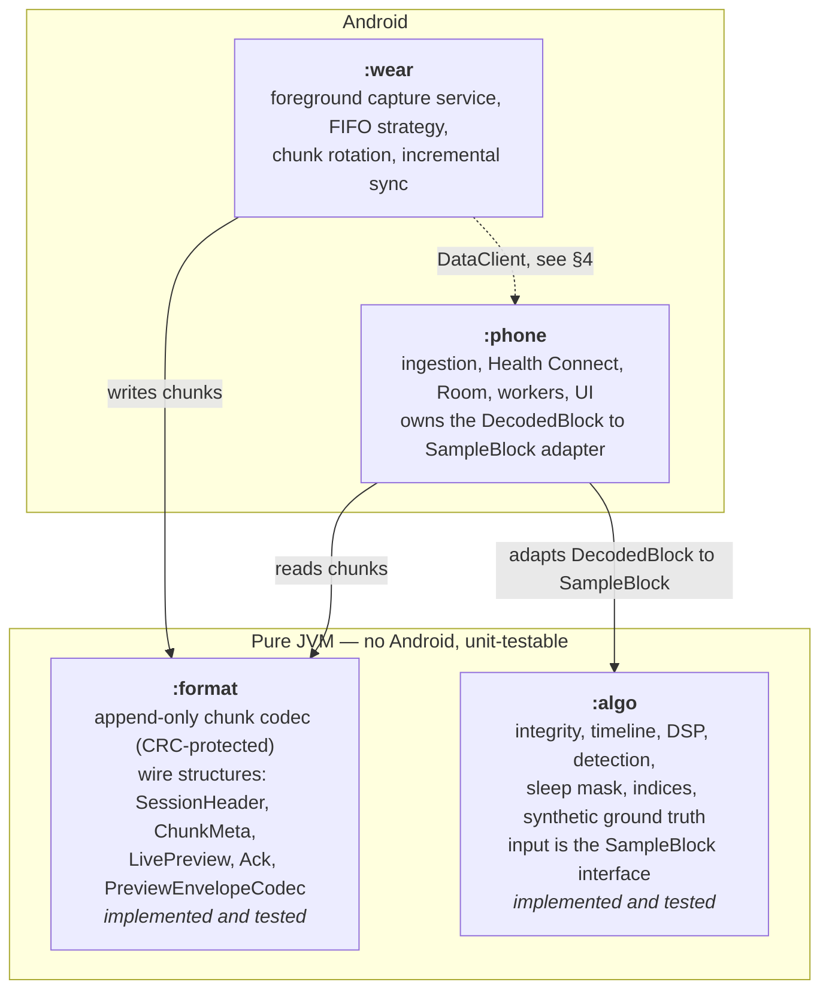
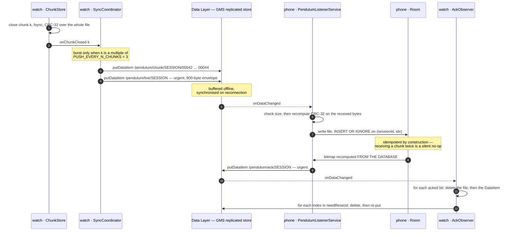

# Architecture — from the sensor to a stored night

> **Pendulum** measures periodic limb movements in sleep from a smartwatch worn at the ankle, and
> tracks the *rhythm* between them rather than their number. It measures; it does not
> interpret — a real measurement to take to a physician, not a diagnosis and not a medical device — see
> [what this is, and what it is not](../README.md#what-this-is-and-what-it-is-not).

How Pendulum is put together: which code lives where and why, how eight hours of 50 Hz accelerometry
are captured on a watch without the operating system killing the service or the battery running
out, how those samples are written to a file that survives being killed mid-write, and how they
reach the phone without either losing a night or spending the battery that was meant to record it.

This document describes decisions and their reasoning. Where a figure is an engineering estimate
rather than a measurement, that is stated in the same sentence. The `wear` and `phone` modules described
here are now implemented and build; they run on emulators, but **no night has ever been recorded with
them**, so every runtime figure below remains an estimate. The byte layout in §3 is read from the code,
not from the design notes.

Two companions, both in French and both carrying what this file compresses.
[`fr/ARCHI-CAPTURE.md`](fr/ARCHI-CAPTURE.md) holds the energy arithmetic worked out in
milliampere-hours for each of the three transport options, the exact payload schema of every
`DataItem`, and sixteen numbered Wear OS traps sorted into *verified on a primary source*,
*documented elsewhere* and *folklore*. [`fr/BANC-ESSAI.md`](fr/BANC-ESSAI.md) is what happened when
this design met real devices — including the two proposed fixes that measurement then rejected, and
the one manifest line that silently killed every delivery.

---

## 1. Module map



There is deliberately **no edge from `algo` to `format`**.

Two rules give this structure whatever value it has.

**Anything testable on a JVM leaves the Android modules.** The chunk codec, the wire encodings, the
FIFO strategy decision, the gap monitor, the wake detector, the preflight checks and the entire
signal-processing chain are ordinary Kotlin functions over ordinary data. They are exercised in
`./gradlew :format:test :algo:test` in seconds, against synthetic signals with injected ground
truth. What remains in `wear` and `phone` is the part that genuinely needs a device: service
lifecycle, sensor registration, the Data Layer, Room, WorkManager, and the interface.

**`algo` depends on nothing at all — not even on `format`.** Its input is the minimal interface
`SampleBlock` (`tFirstNs`, `tLastNs`, `flags`, `x`, `y`, `z`). The adapter from
`com.pendulum.format.DecodedBlock` to `SampleBlock` lives in `phone`, not in `algo`. This is not
fastidiousness: it is what lets the synthetic generator feed the chain directly, so that a
detection result can be compared against a movement list that is known by construction rather than
inferred. A dependency on `format` would tie the algorithm's test harness to a binary file format
that has nothing to do with signal processing.

---

## 2. Capture on the watch

Target: a Wear OS 5 watch (developed against a Pixel Watch 3, 41 mm, ~306 mAh) worn **at the
ankle**, accelerometer at 50 Hz for about eight hours, with an Android phone at the bedside.

### 2.1 Why the foreground service is of type `health`

The recording runs in a foreground service declared `android:foregroundServiceType="health"`,
qualified by `HIGH_SAMPLING_RATE_SENSORS` in the manifest. There is no always-on activity.

The type is not a manifest detail. It is the decision that determines whether the application works
at all.

- **`dataSync` is eliminated mechanically.** On Android 15 the foreground-service timeout — six
  hours per twenty-four — applies to `dataSync` and `mediaProcessing`. An eight-hour night crosses
  it at the six-hour mark: `Service.onTimeout(int, int)` is called, a few seconds are granted for
  `stopSelf()`, and a missed `stopSelf()` produces a fatal `RemoteServiceException`. **`health` has
  no documented timeout.** (Verified against the Android 15 behaviour-changes page.)
- **`dataSync` cannot be started from `BOOT_COMPLETED`** by an application targeting Android 15 or
  later. The prohibition covers `dataSync`, `camera`, `mediaPlayback`, `phoneCall`,
  `mediaProjection` and `microphone`. `health` is not on that list, which is what makes the
  after-reboot recovery of §2.7 legal at all. (Verified.)
- **The service is qualified by `HIGH_SAMPLING_RATE_SENSORS`, not by `BODY_SENSORS`.** A `health`
  foreground service must be backed either by one of `BODY_SENSORS` / `READ_HEART_RATE` /
  `READ_SKIN_TEMPERATURE` / `READ_OXYGEN_SATURATION` / `ACTIVITY_RECOGNITION`, **or** by declaring
  `HIGH_SAMPLING_RATE_SENSORS`. The first route is a trap here: `BODY_SENSORS` and the `READ_*`
  sensor permissions are while-in-use, so the service cannot be created **from the background**
  without `BODY_SENSORS_BACKGROUND` (API 33–35) or `READ_HEALTH_DATA_IN_BACKGROUND` (API 36+) —
  and the background is exactly where the reboot-recovery path starts. `HIGH_SAMPLING_RATE_SENSORS`
  is a normal permission: no runtime prompt, no while-in-use restriction. **Corollary: do not
  declare `BODY_SENSORS`.** Declaring a permission you do not need buys the restriction for
  nothing. (Verified against the foreground-service-types page.)
- **An always-on activity is rejected.** It leaves the display in ambient mode — one refresh per
  minute at best — lights the wrist, here the ankle, under the bedding all night, is killed by the
  system at the first memory pressure, and costs the screen on top of the sensor. It buys nothing:
  a `health` foreground service is *more* protected than an activity.

Fallback if a particular device refuses the start anyway: add `ACTIVITY_RECOGNITION` and request it
at runtime. This is a ten-minute go/no-go test — one `startForeground()` call, one line of logcat.

### 2.2 The FIFO strategy, decided at runtime

The hardware FIFO contract is normative at the HAL level, and it decides almost everything:

> A **non-wake-up** sensor in suspend must continue to generate events into a hardware FIFO, but
> "if the FIFO is too small to store all events, the older events are lost; the oldest data is
> dropped to accommodate the latest data".
> A **wake-up** sensor in suspend "must wake up the SoC" to deliver events — before exceeding the
> maximum reporting latency **or filling the FIFO**.

So: if a wake-up variant of `TYPE_ACCELEROMETER` exists, it is the only defensible choice, and the
question of a wake lock arises only in its absence. With a wake-up sensor, loss by FIFO overflow is
forbidden by the contract; with a non-wake-up sensor it is explicitly permitted.

**Budget on `fifoReservedEventCount`, never on `fifoMaxEventCount`.** `fifoMaxEventCount` is the
sensor's total capacity, **shared between all clients** — Health Services, the vendor's fitness
app, the system. Sizing the latency budget on it is a bet that nobody else is listening, and that
bet is lost on a Pixel Watch. `fifoReservedEventCount` is the only portion guaranteed to this
application.

```kotlin
val sensor   = getDefaultSensor(TYPE_ACCELEROMETER, /* wakeUpSensor = */ true)
            ?: getDefaultSensor(TYPE_ACCELEROMETER)
val reserved = sensor.fifoReservedEventCount   // the guaranteed share — budget on this
val shared   = sensor.fifoMaxEventCount        // information, not a budget

mode = when {
    sensor.isWakeUpSensor && reserved >= 500 ->
        // ~10 s of guaranteed buffer; the HAL undertakes to wake the SoC before overflow.
        BATCHED_WAKEUP(latencyUs = (0.5 * reserved / 50).s.clamp(10.s, 60.s))

    sensor.isWakeUpSensor ->
        // Wake-up but a thin FIFO: the HAL will wake very often. Keep batching for what it is
        // worth, without a wake lock — the wake-up contract is sufficient.
        BATCHED_WAKEUP(latencyUs = 10.s)

    reserved >= 3000 ->
        // Non-wake-up but 60 s of guaranteed buffer: an acceptable bet, to be validated in P1.
        BATCHED_WAKELOCK(latencyUs = 20.s) + PARTIAL_WAKE_LOCK

    else ->
        // Non-wake-up with a short FIFO: loss in suspend is documented. Wake lock mandatory.
        CONTINUOUS_WAKELOCK(latencyUs = 0) + PARTIAL_WAKE_LOCK
}
```

The 500-event threshold (10 s at 50 Hz) is **an engineering choice, not a sourced value**. The real
datum is `reserved` on the specific watch, read at runtime and written into the chunk header — into
the `fifoMaxEventCount` field, which should carry **`reserved`, not `max`**, or into a second field
taken from the six reserved bytes of the 80-byte header.

`SensorStrategy` is a pure function `(isWakeUp, fifoReserved, fifoMax, rateHz) → AcquisitionMode`
with no Android dependency, so all four branches are covered by JVM tests.

**The wake lock costs roughly 200 mAh over eight hours, about 65 % of the battery.** It is the only
line item that can make the project fail. Read §4.2 with that number in mind.

### 2.3 Gap detection, and the rule that must not be got wrong

`GapMonitor` decides whether the acquisition is actually delivering what was asked for, and
escalates if it is not. Getting its input signal right matters more than any threshold in it.

> **A gap is measured on `SensorEvent.timestamp` deltas. Never on arrival time.**

In batched mode, samples arrive in bursts: thirty seconds of silence followed by 1 500 events
delivered at once is not a gap, it is the design working. A rule based on delivery time — the
`elapsedRealtimeNanos` between two `onSensorChanged` calls — therefore fires *permanently* in the
nominal case. And because the escalation ladder responds to gaps by taking a `PARTIAL_WAKE_LOCK`,
such a rule does not merely log a false positive: it silently converts every night into a
wake-lock night, spends 65 % of the battery, and invalidates the very battery measurement the
first test phase exists to obtain. The failure looks like "batching does not work on this device"
when what does not work is the monitor.

Two admissible signals, both computed from sensor timestamps:

- **Within a batch** — `Δt` between consecutive samples of the same `SensorEvent` exceeding three
  times the nominal period.
- **Across a window** — a sample-count deficit over a sliding 60 s window of sensor timestamps
  (`received < 0.95 × expected`). This catches a gap that falls between two batches without ever
  looking at when the batches arrived.

The escalation is **monotone** — never stepped back down within a session, or it oscillates:

| Step | Trigger | Action | Trace |
|---|---|---|---|
| 1 | 3 gaps > 3 s within 10 min | take `PARTIAL_WAKE_LOCK` | `MODE_DEGRADED` in `modeFlags` |
| 2 | 3 more gaps > 3 s in the next 10 min | `maxReportLatency = 0` (continuous) | new chunk, `modeFlags` updated |
| 3 | the same again after 10 min | re-register at **25 Hz** | new chunk, `nominalRateHz = 25` |

A step change **forces a chunk rotation**: `modeFlags` and `nominalRateHz` live in the file header
and are never rewritten, because the format is append-only. Every block that follows a gap carries
`FLAG_GAP_BEFORE`.

25 Hz remains ample. Candidate limb movements last 0.5 to 10 s and the RMS envelope is computed over
0.15 s; Nyquist is not the limiting factor, onset time resolution is, and 40 ms suffices.

Independently of the gap monitor, `SensorPipeline` **measures the real `fs` continuously** over 60 s
windows and raises a flag when it departs from nominal by more than 5 %. The requested rate is not
the delivered rate — 50 Hz is commonly delivered as 50.3 or 52.6 Hz — and another application
starting an exercise session mid-night could change it. A wrong `fs` shifts every filter and every
movement duration in the chain.

### 2.4 Manifest

```xml
<manifest xmlns:android="http://schemas.android.com/apk/res/android">

    <uses-feature android:name="android.hardware.type.watch" />

    <!-- High sampling rate: this ALSO qualifies the health foreground service,
         with no runtime prompt and no while-in-use restriction. -->
    <uses-permission android:name="android.permission.HIGH_SAMPLING_RATE_SENSORS" />

    <uses-permission android:name="android.permission.FOREGROUND_SERVICE" />
    <uses-permission android:name="android.permission.FOREGROUND_SERVICE_HEALTH" />
    <uses-permission android:name="android.permission.WAKE_LOCK" />
    <uses-permission android:name="android.permission.RECEIVE_BOOT_COMPLETED" />
    <uses-permission android:name="android.permission.POST_NOTIFICATIONS" />

    <!-- Fallback only, if starting the health FGS is refused on a given device.
         <uses-permission android:name="android.permission.ACTIVITY_RECOGNITION" /> -->

    <!-- Do NOT declare BODY_SENSORS: it is while-in-use, it would break recovery after
         reboot, and no body sensor is read. -->

    <application android:allowBackup="false">

        <service
            android:name=".record.RecordingService"
            android:exported="false"
            android:foregroundServiceType="health"
            android:stopWithTask="false" />

        <service
            android:name=".transfer.AckObserver"
            android:exported="true"
            android:permission="com.google.android.gms.permission.BIND_WEARABLE_LISTENER">
            <intent-filter>
                <action android:name="com.google.android.gms.wearable.DATA_CHANGED" />
                <data android:scheme="wear" android:host="*"
                      android:pathPrefix="/pendulum/ack" />
            </intent-filter>
            <intent-filter>
                <action android:name="com.google.android.gms.wearable.MESSAGE_RECEIVED" />
                <data android:scheme="wear" android:host="*"
                      android:pathPrefix="/pendulum/sweep-request" />
            </intent-filter>
        </service>

        <receiver android:name=".record.BootReceiver" android:exported="true">
            <intent-filter>
                <action android:name="android.intent.action.BOOT_COMPLETED" />
                <action android:name="android.intent.action.MY_PACKAGE_REPLACED" />
            </intent-filter>
        </receiver>

    </application>
</manifest>
```

### 2.5 Service lifecycle

```
IDLE
 │  ACTION_START (button) │ ACTION_RESUME (BootReceiver)
 ▼
PREFLIGHT ─── blocking ──▶ IDLE + error screen
 │  ok / warnings accepted
 ▼
STARTING
 │  startForeground(id, notif, FOREGROUND_SERVICE_TYPE_HEALTH)   ← BEFORE everything else
 │  SensorStrategy.decide(sensor) → mode
 │  SessionStore.begin(uuid, …) → active_session.json (fsync)
 │  ChunkPublisher.putSession(state = OPEN, urgent)
 │  registerListener(pipeline, sensor, 20 000 µs, latencyUs)
 │  if (mode.needsWakeLock) acquire(PARTIAL_WAKE_LOCK, "pendulum:rec")   ← no timeout
 ▼
RECORDING ◀────────────────────────────────────────────┐
 │  onSensorChanged  → SensorPipeline → blocks of ≤ 512 → ChunkWriter
 │  10 s tick        → fd.sync()
 │  rotation at 300 s / 92 160 B → ChunkStore.close() + SyncCoordinator.onChunkClosed()
 │  60 s tick        → BatteryLogger, WakeDetector, disk quota
 │  15 min tick      → SyncCoordinator.push()  (burst + /pendulum/live)
 │  GapMonitor step 1/2/3 ───────── auto-degradation ───┘
 │
 │  stop (user | one of the conditions in §2.6 | defensive onTimeout())
 ▼
FINALIZING
 │  unregisterListener; last block written; ChunkStore.close(); fsync
 │  final sidecar.json; ChunkPublisher.putSession(CLOSED, totalChunks, stopReason, urgent)
 │  SyncCoordinator.push(force = true)   ← every remaining chunk, urgent
 │  releaseWakeLock; SessionStore.clearActive()
 │  WorkManager.enqueueUniqueWork("pendulum-transfer", TransferWorker)
 ▼
stopForeground(STOP_FOREGROUND_REMOVE); stopSelf()  →  IDLE
```

Non-negotiable details:

- `onStartCommand` returns **`START_STICKY`**; `onTaskRemoved` does **nothing** — the service
  survives the task being swiped away, hence `stopWithTask="false"`.
- **`startForeground()` is the first useful instruction of `onStartCommand`**, before any I/O. Five
  seconds of delay and the system raises `ForegroundServiceDidNotStartInTimeException`.
- **`onTimeout(startId, fgsType)` is implemented** even though `health` is not subject to it. If a
  future release did subject it, the default behaviour would be a crash six hours into every night.
  The implementation closes cleanly along the full `FINALIZING` path, calls `stopSelf()`, and
  schedules an `AlarmManager.setExactAndAllowWhileIdle` at +30 s to start a fresh session with a new
  UUID, marked `RESTARTED_AFTER_TIMEOUT`. Cost if unnecessary: zero. Cost if necessary and absent:
  half of every night.
- The wake lock is acquired **without a timeout**. This is a sideloaded personal application, so
  there is no store constraint, and a timeout that expires at 4 a.m. is a silent bug.
- The notification uses an `IMPORTANCE_LOW` channel: no sound, no vibration, `setOngoing(true)`,
  `setSilent(true)`.

The watch interface is one screen with no navigation, no animation, and no graph. The criterion is
testable: **between going to bed and waking, the UI layer must cause no recomposition at all** —
the display is off, `collectAsStateWithLifecycle` is stopped, and the service emits into a void.
Every moving pixel is an SoC wake-up.

### 2.6 Automatic stop conditions

Six conditions; the first to occur wins. Each writes a `stopReason` into the sidecar and into
`/pendulum/session`, using the `StopReason` enum in `format`.

| # | Condition | Detail | `stopReason` |
|---|---|---|---|
| 1 | **Charging detected** | `BatteryManager.isCharging` sustained for ≥ 60 s (60 s to immunise against a false positive from a magnetic charger) | `CHARGING` |
| 2 | **Battery ≤ 5 %** | clean close plus a final `setUrgent()` burst **before** the system kills anything | `LOW_BATTERY` |
| 3 | **Maximum duration** | `startWallMs + 10 h` | `MAX_DURATION` |
| 4 | **Cut-off time** | local time ≥ `stopAtLocalTime` (default **10:00**) | `TIME_LIMIT` |
| 5 | **Waking detected** | more than 80 % of 30 s epochs above the locomotion threshold over a sliding 10 min window | `WAKE_DETECTED` |
| 6 | **Disk** | free space below 50 MB | `DISK_FULL` |

Condition 2 is the highest-yield item in this document. It converts "the watch died at 3 a.m." into
"the watch closed cleanly at 3 a.m. and sent everything", for the price of a thirty-line
`BatteryLogger`.

**Off-body detection must never stop the recording.** Off-body detection relies on the PPG and
capacitive sensing at the wrist; at the ankle its behaviour is undocumented and most likely reads
"not worn" permanently. Stopping on off-body would cut every night short in its first minute.
`TYPE_LOW_LATENCY_OFFBODY_DETECT` is **logged** — into the sidecar, and as `FLAG_OFF_BODY` on the
affected blocks — and **never acted upon**. The real "watch removed" detector is condition 5, which
measures locomotion: the event actually of interest ("the person got up"), not an unvalidated proxy
for it.

### 2.7 Recovery after reboot or crash

`active_session.json` is written atomically (`tmp` + `rename`) and holds
`{uuid, startWallMs, plannedStopWallMs, lastChunkIndex, modeFlags, nominalRateHz}`.

`BootReceiver` listens for `BOOT_COMPLETED` and `ACTION_MY_PACKAGE_REPLACED`. **Resume only if:**

```
marker present
&& now < startWallMs + 14 h
&& now < plannedStopWallMs
&& local time < stopAtLocalTime
&& !isCharging
```

Otherwise: do **not** resume, but **finalise** — move `/pendulum/session` to `CLOSED` with
`stopReason = CRASH` and let `TransferWorker` push whatever is left. Testing only the 14-hour
window restarts a recording at 8 a.m. on the charger after a night-time reboot, and pollutes the
night exactly as the recording is supposed to avoid.

The first chunk after a resume carries `FLAG_GAP_BEFORE` on its first block and a `chunkIndex` that
**continues the numbering** read from the marker. It is never reset: the phone's `(sessionId, idx)`
uniqueness constraint depends on it.

**A blind spot to measure: credential encryption.** If the watch has a lock code, `BOOT_COMPLETED`
is only broadcast after unlock, and credential-encrypted storage is unreachable before that. A
watch that reboots at 3 a.m. **while worn** stays locked until morning, so no resume happens.
`directBootAware` is deliberately not used — it would force the chunks into device-encrypted
storage, which is more exposed and more complex, for an uncertain gain. How long a locked watch
actually takes to resume is a measurement to make. If the answer is "not before morning", then the
clean shutdown on low battery (condition 2) becomes the principal protection against losing a
night.

---

## 3. The chunk format

Implemented in `format`, byte layout below read from `ChunkFormat.kt`. Little-endian throughout.

### 3.1 The three design constraints

**Append-only. Nothing is ever rewritten, and no header is patched on close.** A session killed by
an out-of-memory kill, a reboot, or a flat battery must leave behind a file that reads. That rules
out any design where a length or a count is written at the start and filled in at the end — which is
most of the obvious designs.

**Self-delimiting blocks, each protected by a CRC.** A single eight-hour file with no internal
delimiters is an unacceptable single point of failure: one corrupt byte and the night is gone.
Here a corrupt block is skipped and the reader resynchronises by hunting for the next `BLK!` magic.
Resynchronising by seeking rather than by skipping a computed length is deliberate — the field that
may be corrupt is `count`, so the payload length derived from it cannot be trusted to step over.

**The CRC covers the block header as well as the payload.** The six bytes of a sample are locally
redundant: at 50 Hz, a corrupted acceleration value sits between two intact neighbours, is bounded
by physics, and is caught downstream by the impossible-jerk integrity check. `count`, `tFirstNs`
and `tLastNs` are unique and unreconstructable. A corrupted `count` makes the reader consume the
wrong payload length and desynchronise; a corrupted timestamp **silently shifts the whole night's
time base**, which is undetectable by inspection and fatal when the movements are later aligned
against a hypnogram. The `crc` field is written last, so it can be computed in a single pass over
the first 24 bytes of the block header and then over the payload, with the seed chained.

There is a fourth constraint, less obvious and equally load-bearing.

**No per-sample timestamp — and therefore, a block must never straddle two FIFO flushes.** The
hardware FIFO samples uniformly, so `(tFirstNs, tLastNs)` per block plus linear interpolation is
enough, and dropping the per-sample timestamp saves 8 bytes per sample — about 11 MB per night.
That saving is only legitimate while interpolation is valid, which stops being true the moment a
block spans two flushes: the block then contains a gap that linear interpolation spreads evenly
across **every** sample in it, dating all of them wrongly. Only the producer knows where the flush
boundary is, so this is enforced as a `require` in `ChunkWriter.writeBlock` rather than as a flag:
the implicit rate `(tLast − tFirst) / (count − 1)` must stay within
`TIMEBASE_TOLERANCE = 0.20` of the nominal period. The reader re-checks the same condition and
marks the block `suspectTimebase` instead of rejecting it — such a block is still usable for
anything that does not date an event.

### 3.2 File header — 80 bytes

```
off  size  field                    type
  0     8  FILE_MAGIC "PENDCHNK"    ascii
  8     2  formatVersion            u16
 10     2  headerSize               u16   total header length (80 in v1)
 12     2  nominalRateHz            u16
 14     2  fifoMaxEventCount        u16   ← write fifoReservedEventCount here (§2.2)
 16    16  sessionUuid              bytes
 32     8  startWallMs              i64
 40     8  startElapsedRealtimeNs   i64
 48     8  firstEventTimestampNs    i64
 56     4  sensorResolution         f32
 60     4  sensorMaxRange           f32
 64     4  chunkIndex               i32
 68     2  modeFlags                u16
 70     2  tzOffsetMin              i16   local UTC offset at open, in minutes
 72     6  reserved, zero
 78     2  headerCrc                u16 = crc16(header[0, headerSize − 2))
```

**Three clocks, on purpose.** `startWallMs`, `startElapsedRealtimeNs` and `firstEventTimestampNs`
are all recorded because `SensorEvent.timestamp` is not guaranteed equal to
`elapsedRealtimeNanos` — some vendors exclude suspend time — and without the three-way comparison
that drift is invisible, shifting the fusion with the hypnogram by minutes.

**Format evolution rule.** The CRC *always* occupies the last two bytes of the header, and
`headerSize` gives the length. An older reader can therefore read a file written by a newer writer
that only *appended* fields: it reads what it knows at fixed offsets, verifies the CRC at
`headerSize − 2`, and ignores the rest. `formatVersion` is incremented only for an *incompatible*
change — block layout, quantisation, or the meaning of an existing field.

**Time zone.** An IANA identifier (`Europe/Paris`, up to 32 bytes) does not fit in the header
without inflating it, and storing it per block would be absurd. The header carries only what a
binary re-read needs — the UTC offset in minutes, i16, covering −18:00 to +18:00 — and the full IANA
identifier lives in the JSON sidecar and in `SessionHeader.zoneId`, neither of which is
size-constrained. The consequence must be enforced elsewhere: **no duration is ever computed as a
difference of wall-clock times**; the offset exists only to display a local time.

### 3.3 Block header — 32 bytes

```
off  size  field
  0     4  BLOCK_MAGIC "BLK!"
  4     2  count       u16   number of samples, 1..512
  6     8  tFirstNs    i64
 14     8  tLastNs     i64
 22     2  flags       u16
 24     2  crc         u16 = crc16(header[0, 24) then payload)
 26     6  reserved, zero
```

The payload is `count × 6` bytes: three axes, i16 each, quantised at **1 LSB = 1/2048 g**. An i16
therefore covers −16 g to +15.9995 g, well beyond anything an ankle produces, at a resolution of
0.00049 g that stays far below the noise floor of a MEMS accelerometer.

Block flags: `FLAG_FIFO_BOUNDARY`, `FLAG_GAP_BEFORE`, `FLAG_OFF_BODY`, `FLAG_SATURATED`,
`FLAG_NON_FINITE`. The last two are set by the writer and matter more than they look. A sample
clipped at ±32767 LSB would otherwise be undetectable on re-read, and the clipping distractor in
the verification phase would pass for real movement. A NaN or infinite sample is replaced by zero,
which is indistinguishable from free fall — `FLAG_NON_FINITE` is the only trace that the
substitution happened. Both are also counted, per sample rather than per axis, since a sample is
unusable as soon as one of its axes was clipped or substituted.

The CRC is **CRC-16/CCITT-FALSE** (polynomial 0x1021, init 0xFFFF, no reflection, no final xor),
chosen for a table-free implementation at negligible cost. Detecting that a block is corrupt
matters more than the strength of the code. A separate **CRC-32 over the whole chunk file** travels
in the transfer metadata (§4) and is what covers the transport.

### 3.4 End-of-file marker — 32 bytes

```
off  size  field
  0     8  FILE_FOOTER_MAGIC "ENDPendulum!"
  8     4  blockCount        u32
 12     8  sampleCount       i64
 20     8  lastTimestampNs   i64
 28     2  reserved, zero
 30     2  crc               u16 = crc16(footer[0, 30))
```

Without this marker nothing distinguishes a complete chunk from one still being written, and the
phone can acknowledge — and therefore cause the deletion of — a partial file. The redundant counters
are a bonus: they quantify what was lost when a re-read finds fewer blocks than the footer declares.

### 3.5 What the reader gives back

`ChunkReader.forEachBlock` is streaming: each decoded block is handed to a callback and forgotten.
The materialised `read()` variant exists for tests and short files; on a whole night it would hold
around 17 MB of live arrays for an algorithm that is itself streaming.

Reading only throws if the *file header* is invalid. Everything else is salvaged, and the scan
result distinguishes the cases that matter:

- `complete` — the end-of-file marker was read and its CRC verified. **A chunk that is not
  `complete` must never be acknowledged.**
- `truncatedTail` — the file ends in the middle of a block. This is the **benign** case of a brutal
  kill, and costs at most one block: 512 samples, 10.2 s.
- `desynchronised` — an unreadable region was found somewhere other than at the tail. This is
  corruption mid-file and is a different problem.
- `damagedRanges` — each lost region located both in the file (`fileOffset`, `byteLength`) and in
  time (`afterTimestampNs`, `beforeTimestampNs`). That pairing is what turns "3 blocks lost" into
  "30 s missing at 03:12".

---

## 4. Transfer to the phone

### 4.1 The nominal loop



### 4.2 Why `DataClient`, and the numbers behind it

| API | Semantics | Verdict |
|---|---|---|
| `MessageClient` | Fire-and-forget. Fails if the node is unreachable; **no queue, no retry**. | Control plane only — and even there a `DataItem` is preferable. Never for data you cannot lose. |
| `DataClient` | **Replicated, persistent store.** Payload ≤ 100 KB. **Buffered offline, synchronised on reconnection** (documented). Deduplicated: re-putting an identical item triggers nothing. Delivered to a `WearableListenerService` that GMS starts, even if the application has never been opened. | **Nominal path.** The only API whose semantics match "lose nothing". |
| `ChannelClient` | Byte stream, low overhead, **no persistence**: the channel dies with the connection and both ends must be alive at the same time. | Bulk catch-up only, when both sides are known to be online. |

The decisive point: **with `DataClient`, a chunk pushed at 2 a.m. is already replicated; the watch
dying at 3 a.m. no longer concerns it.** With `ChannelClient`, any interrupted transfer must be
redone, and if the source has disappeared there is nothing left to redo with.

Reaching that required one change: **the chunk drops from 30 minutes to 5 minutes.** At five
minutes a chunk weighs about 91 KB, which fits inside the 100 KB payload limit of a `DataItem` — so
no `Asset`, no `Channel`, no handshake on the nominal path.

```
rate  = 50 Hz × 6 B + 32 B block header per 10.24 s = 300 + 3.1 = 303.1 B/s
5 min → 90 930 B + 80 B file header                 = 91 010 B
```

Rotation rule: close the current chunk as soon as `elapsed ≥ 300 s` **or**
`bytesWritten ≥ 92 160` (90 KiB). Both conditions are needed. The duration bounds the loss if the
watch dies; the byte ceiling is the hard guard, and it holds even if the real `fs` drifts to 52.6 Hz
or a degraded mode changes the rate. The remaining margin below 100 KB, after roughly 200 bytes of
`DataMap` overhead, is 7.4 %. If a device refuses the payload anyway, the escape hatch is
`Asset.createFromFd()` on the same `DataItem` — the same protocol, one line of code. It should not
be implemented pre-emptively.

**The energy numbers.** Reference night: 8 h, 8.73 MB, 96 chunks of 91 KB.

| Option | Cost over the night | Maximum loss if the watch dies |
|---|---|---|
| Single batch on waking | ~0 % (it happens on the charger) | **up to 8 h** |
| **Incremental, 3 chunks every 15 min — chosen** | **1 – 3.6 %** (3.0 – 11.0 mAh) | **≤ 20 min** |
| Incremental, 1 chunk every 5 min | 1.7 – 5.9 % (5.1 – 18 mAh) | ≤ 10 min |
| Continuous 1 Hz envelope streaming | 52 – 100 % | 8 h of raw data anyway |

Worked, for the chosen option: `275 KB / 50 KB/s + 3 s = 8.5 s` per burst, `40 mA × 8.5 s =
0.094 mAh`, `32 × 0.094 = 3.0 mAh`, i.e. 0.98 % of 306 mAh. Worst case (20 KB/s, 70 mA, 4 s of
fixed overhead): 11.0 mAh, 3.6 %.

Note that going from 15 minutes to 5 minutes multiplies the cost by **1.7, not by 3**: the fixed
wake-up overhead dominates the transmission time. The choice between them is therefore not an
energy trade-off — the 2 mAh gap is smaller than the error bars — but a prudence trade-off against
a battery budget that has not yet been measured. `PUSH_EVERY_N_CHUNKS` is exposed as a developer
setting so it can be moved to 1 after the first measurement campaign.

Continuous streaming is the genuinely ruinous option, and not because of the bytes: 115 KB over a
night is nothing. It is ruinous because of the **service rate of the link**. One message per second
forbids the Bluetooth link from dropping back to sniff mode and the application processor from
suspending: 20 mA × 8 h = 160 mAh, 52 % of the battery, up to 100 % once the AP never suspends. A
30 s heartbeat variant costs about 16 mAh (5.2 %) and is bearable — but it still does not carry the
raw signal, so it answers no need. Non-zero cost for zero benefit.

**The comparison that actually decides.** A partial wake lock held for eight hours costs about
200 mAh, roughly 65 % of the battery. The entire streaming-versus-batch argument is therefore about
**20 to 60 times less energy** than the real consumer. Refusing 3 % of the battery and accepting the
potential loss of an entire night is a bad exchange, and above all it is optimising the wrong line
item.

### 4.3 The free by-product: a movement graph at no radio cost

Each burst also rewrites a single `DataItem` at `/pendulum/live/<session>` carrying, alongside the
counters, the **RMS envelope decimated to 1 Hz over the last 15 minutes, quantised to a logarithmic
u8**: **900 bytes**, about +0.3 % of the burst volume and **zero additional radio wake-up**. It is
literally the "near-real-time movement graph", and it costs nothing because it travels inside a
wake-up that is already being paid for.

The quantisation is logarithmic because the useful signal spans four decades, from the MEMS noise
floor (~1e-3 m/s²) to an ankle jerk (~40 m/s²). Linear 8-bit quantisation would give a step of
0.16 m/s² — two levels for everything that happens during sleep — so the preview would be flat all
night and then saturate on getting up. In log space the error is *relative* and constant, about 2 %
of a half-step, which is the right property for a trace intended for the eye. Level 0 is reserved to
mean "below the floor"; it is a state, not a value.

**This preview is never used for scoring.** Every published figure is recomputed on the raw chunks,
on the phone. Display and proof-of-life only. It is also, deliberately, the last thing to be
implemented: it is the only feature in this document whose absence loses no data.

### 4.4 The protocol

The wire structures live in `format` — pure JVM, no Android — for three reasons: both ends of the
protocol share the same encoding code, encode/decode symmetry is testable without a device, and
`phone` can read a `DataItem` without pulling in `wear`. The encoding is a version byte followed by
fixed-size little-endian fields, with strings and arrays length-prefixed as u16. That is more
verbose than a `DataMap`, and deliberately so: a `DataMap` is a dictionary whose read fails silently
when a key is renamed, whereas here a layout change is rejected at the first byte.

| Path | Direction | Payload |
|---|---|---|
| `/pendulum/session/<hex>` | watch → phone, urgent | `SessionHeader`: start, zone, rate, mode flags, planned stop, `state ∈ {OPEN, CLOSED, STALE, TRUNCATED}`, and on close `endWallMs`, `totalChunks`, `stopReason` |
| `/pendulum/chunk/<hex>/<idx:05d>` | watch → phone | `ChunkMeta` (idx, size, crc32, sampleCount, tFirstNs, tLastNs, flagsOr) plus the exact bytes of the chunk file |
| `/pendulum/live/<hex>` | watch → phone, urgent | `LivePreview`: counters, battery, gaps, `syncBacklogged`, 900-byte envelope. **Replaced** each burst, never accumulated |
| `/pendulum/ack/<hex>` | phone → watch, urgent | `Ack`: `ackedUpTo`, `bitmapBase`, `ackedBitmap`, `needResend` |
| `/pendulum/sweep/<hex>` | watch → phone (channel) | bulk catch-up stream, specified but not yet implemented in `format` |

The chunk index is zero-padded to five digits because lexicographic path order must coincide with
chunk order; otherwise a sorted listing hands over chunk 10 before chunk 2.

`setUrgent()` is applied to the **last item of a burst only**, on the assumption — medium
confidence, undocumented — that the flush it provokes also carries the pending non-urgent items. If
measurement shows otherwise, mark them all urgent: the energy impact is nil, since they leave in the
same wake-up. Without `setUrgent()` the system may delay synchronisation by **up to 30 minutes**, so
any design that assumes prompt delivery without it has a 30-minute bug in it.

**The acknowledgement is a `DataItem`, not a message.** This is the structural choice. An ack sent
by `MessageClient` while the watch is out of range is simply lost, and the watch would keep its
files forever. An ack as a `DataItem` is **convergent state**: the watch reads it when it can, and
reading it ten times gives the same result as reading it once. Idempotence for free, with no
counters.

Three invariants hold the whole thing together:

1. **The phone recomputes the CRC-32 on the received bytes before inserting anything.** The
   per-block CRC-16 covers the content; only this covers the transport. An index whose CRC-32 does
   not match goes into `needResend`.
2. **`INSERT OR IGNORE` on `UNIQUE(sessionId, idx)`.** Receiving the same chunk twice is a silent
   no-op, so every retry path is safe.
3. **The file is never deleted before its ack bit, and neither is the `DataItem`.** The watch's disk
   is the source of truth until the phone's database has become it. On the phone side, the ack
   bitmap is recomputed **from the database**, never from an in-memory counter.

A resend requires deleting the `DataItem` before re-putting it: an identical `putDataItem` is
deduplicated by the Data Layer and would trigger nothing at all.

### 4.5 Quota, saturation, and the phone being off all night

**In-flight ceiling: `MAX_INFLIGHT_ITEMS = 24`** — two hours of night, about 2.2 MB in the data
store. The `DataItem` store quota is not documented anywhere, and discovering it through a crash at
4 a.m. is not an acceptable way to find out. Beyond 24 unacknowledged items the watch:

- stops publishing new `DataItem`s;
- **keeps recording to disk with no degradation whatsoever** — the disk is the source of truth;
- raises `syncBacklogged` in `/pendulum/live` and in the interface;
- switches to **sweep mode** (`ChannelClient`, no ceiling) on the first ack received or at the next
  `TransferWorker` run.

**Watch disk quota**: `CHUNK_DIR_CAP = 200 MB`, roughly 22 nights. On session open, fully
acknowledged sessions are purged oldest-first while occupancy exceeds 150 MB. If occupancy still
exceeds 190 MB after the purge — meaning old *unacknowledged* data is sitting there — the preflight
**blocks the start** with an explicit message. Refusing to start a night is better than silently
overwriting one. During recording, if free space falls below 50 MB, the session stops cleanly with
`stopReason = DISK_FULL`: a short intact night beats a long one truncated mid-block.

**Bulk catch-up** runs over `ChannelClient` when `unackedCount > 24`, at session close, on the
"Sync now" button, or from `TransferWorker` (constraints: on charger **or** battery above 30 %; no
network constraint). The watch opens `/pendulum/sweep/<hex>` and writes a framed stream:

```
repeated : [u32 idx][u32 len][len bytes][u32 crc32]
end      : [u32 0xFFFFFFFF]
```

The phone reads, verifies, persists chunk by chunk, and updates the ack at end of stream or every
16 frames. If the channel dies mid-way, complete and verified frames are kept, the partial frame is
discarded, and recovery is trivial: the watch re-reads the ack and resends only what is missing.
There is no byte-level resume and none is needed — the unit of resume is a 91 KB chunk, which costs
about two seconds to resend.

**The phone off all night** is therefore not a special case. Items accumulate to 24, the watch goes
into backlog, and the night is recorded in full on disk. On power-up GMS reconnects, the 24 items
synchronise, the ack arrives, and `TransferWorker` starts a sweep that drains the remaining 72 in
about three minutes. **Nothing is lost.** The only cost is that the "loss bounded to 20 minutes"
guarantee degrades to "loss bounded to what the disk holds" — which is exactly the behaviour of the
batch option, so never worse.

### 4.6 When the watch dies at 3 a.m.

| Cause | Left on the watch's disk | Left on the phone |
|---|---|---|
| Battery empty (detected, ≤ 5 %) | everything, current chunk closed cleanly | **everything** (clean stop → final urgent burst) |
| System kill / OOM | everything but the last partial block | everything but ≤ 3 chunks (≤ 20 min) |
| Reboot | everything but the last partial block | same |
| Abrupt power loss | everything but the last cached block | same |

`/pendulum/session/<hex>` has stayed `OPEN`. On the phone, a watchdog worker runs every 30 minutes while
any session is `OPEN` and applies:

- `now − lastChunkArrivalMs > 45 min` → `state = STALE` (the watch has gone quiet; it may come
  back).
- `now > startWallMs + 14 h` **or** local time past 12:00 → `state = TRUNCATED`,
  `endWallMs = tFirstNs` of the last chunk received, **and the analysis runs on what is there.**
- If chunks arrive afterwards (watch recharged, rebooted): reconcile and rescore. The chain is
  idempotent; the analysis of a truncated night is never an irreversible final state.

**Probable cause is reported, never guessed.** The sidecar and `/pendulum/live` carry `batteryPct` every
minute. Last reading ≤ 8 % → "battery". A later reboot marker → "restart". Otherwise → "unknown
interruption". Displaying "unknown" is information; guessing is a bug.

And the reminder that puts it in proportion: a single night means nothing, and the interface
refuses to draw a trend below three nights. A truncated night is not a catastrophe — it is a night
that counts for less.

### 4.7 The night that arrives intact and then disappears

Everything above is about losing samples. This one loses a night that was never damaged, and it is
worth its own section because every check upstream of it passes. *Found 12 August 2026; the
correction below was being applied as this was written.*

A night with **no analysable sleep** — the watch ran, the chunks arrived, the CRCs matched, but the
sleep mask leaves zero analysable minutes — divides by zero. The index is defined as movements over
hours of analysable sleep, and `safeRate` returns `NaN` rather than a wrong number when the
denominator is zero, which is the right decision at that layer. The same happens to the fundamental
period when the deconvolution refuses to fit, and `NaN` there is deliberate: it is how the estimator
says *I will not answer*, and it is documented as such.

The trouble is what `NaN` becomes two layers down. `plmi` is a non-null `Double` on the Room entity,
so the generated column is `REAL NOT NULL`; SQLite binds a `NaN` as `NULL`; the insert therefore
violates its own constraint. The insert sits inside the transaction that writes the windows, the
events and the results together, so the abort rolls back all three, `analyzedAtMs` is never set, and
the worker catches the exception and asks to be retried — which fails again, identically, for as long
as it is retried.

**What the user sees is nothing at all.** The night is recorded, transferred in full, acknowledged,
and deleted from the watch, exactly as designed. It is simply absent from the trend and from the
night list afterwards, because the `comparable_night` view joins the results table and there is no
result row. No error is raised, no flag is set, and the one state that would have carried the
information — a night marked ineligible with its reason — is precisely the state that could not be
written.

This is the shape of failure this project is most exposed to, and it is worth naming: not a wrong
number, but a silence produced by a guard rail firing in a place that could not report it.

**The correction, stated so that it is not confused with the defect.** A refusal must survive
storage. The columns that can legitimately hold *no answer* — the index in each of its variants, the
fundamental period, the miss rate — become nullable, and the write path maps a non-finite value to
`NULL` at the boundary rather than letting it arrive there by accident. The idiom already existed one
field away in the same function, where the calibration gain is written as
`gainCalG.takeIf { it.isFinite() }`; what was missing was applying it to the fields that decide
whether a night exists at all. A night that cannot be scored is then stored, displayed, and counted
as excluded **with its reason shown** — which is what [`01-overview.md`](01-overview.md) §4 requires
of every excluded night, and what this defect silently bypassed.

Two things follow that are not the fix and should not wait for it. A worker that fails identically on
every attempt should not retry indefinitely; a permanent failure and a transient one deserve different
answers. And the assumption that a `NaN` index can be *read back* from the database — which some
display code makes — cannot be true while the row is never written, so any test that exercises it is
exercising an object built in memory and never a real row.

---

## 5. Confidence

**The milliampere figures are engineering estimates, not measurements.** They rest on assumed
constants — 50 KB/s of useful Data Layer throughput (folklore, plausible range 20–100), 40 mA of
incremental current during a transfer (range 25–70), 3 s of fixed per-burst overhead (range 1.5–5),
25 mA for a partial wake lock (range 15–40). Confidence in the absolute values is **low**.

Confidence in the **ratios between the options is medium-high**, and that is what carries the
decision: all three options share the same unknown constants, which largely cancel in the ratio. The
conclusion "the radio question is 20 to 60 times smaller than the wake-lock question" survives any
plausible setting of those constants. The conclusion "the incremental sync costs 3.0 mAh" does not.

The single measurement that settles it: record one night with **no transfer at all**, then one night
with the 15-minute sync, and compare the remaining battery percentages. If the gap exceeds five
points, the model is wrong and the batch option should be reinstated.

Everything else worth doubting, in order of consequence:

- `fifoReservedEventCount` on the actual watch. Read it at runtime before any other decision. If it
  is 0 and `isWakeUpSensor` is false, a permanent wake lock is mandatory and the project's battery
  budget is probably dead. **That**, not the radio, is the real go/no-go.
- That `HIGH_SAMPLING_RATE_SENSORS` really does qualify a `health` foreground service on this
  device. The documentation allows it; an implementation may diverge. One `startForeground()` that
  raises `SecurityException` is worth more than any amount of reasoning.
- That a `putDataItem` with 91 KB of payload actually passes, and how long it takes end to end.
- The effect of Wear OS bedtime mode and battery saver on a `health` foreground service. Nobody has
  documented it, and it is the real usage configuration — so test **with** bedtime mode enabled,
  never without.
- How long a locked watch actually takes to resume after a night-time reboot (§2.7).
- Whether an urgent item at the end of a burst really flushes the non-urgent items queued before it.
- The claim that `ExerciseClient` overrides the requested sampling rate to 100 Hz is **reported and
  unverified**. The rule that follows from it — never start an `ExerciseClient`, never depend on
  Health Services for the accelerometer — is kept because it costs nothing. But the protection that
  actually matters is the continuous measurement of real `fs`, which holds whether the folklore is
  true or not.
