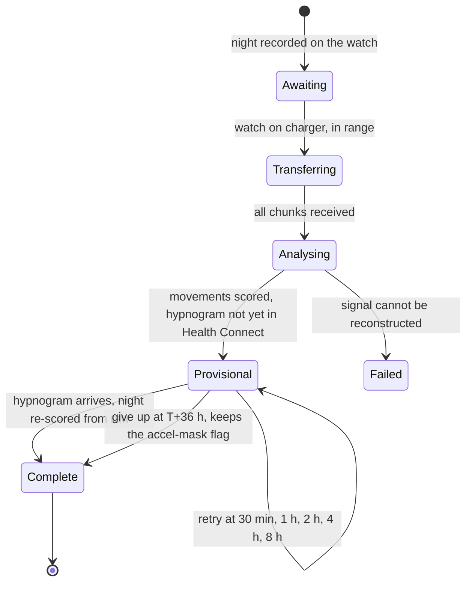

# The interface, and why it is shaped the way it is

> **Pendulum** measures periodic limb movements in sleep from a smartwatch worn at the ankle, and
> tracks the *rhythm* between them rather than their number. It is a screening aid: a real
> measurement to take to a physician, not a diagnosis and not a medical device — see
> [what this is, and what it is not](../README.md#what-this-is-and-what-it-is-not).

The design problem in Pendulum is not decorative. It is this: **display an uncertain measurement without
letting it read as a diagnosis.**

The dominant source of uncertainty is not the sensor. It is night-to-night variability. In confirmed
RLS patients the 15/h threshold is exceeded on only about **34 %** of individual nights, and
night-to-night variation of the hourly count is **43.2 % ± 37.1** (Skeba et al. 2016). A single night
carries no information about the person; it carries information about that night. An interface that
shows one large number and adds a caution underneath has already lost, because the number is read and
the caution is not.

So the rule is stronger than a warning: **the interface refuses to conclude.** Below three eligible
nights nothing is aggregated, nothing is drawn, and nothing can be exported — not as advice, but as
code that has no branch producing the value.

This document is derived from [`fr/UX.md`](fr/UX.md), with one substantive change recorded in
[`fr/SPEC-v2.md`](fr/SPEC-v2.md) §5: the quantity tracked over time is no longer the hourly count.
See §4.5. Everything else in the display logic transfers unchanged.

---

## 1. Principles, as verifiable constraints

Seven principles. Each is written so that a screen review can answer yes or no by looking at the
mock-up or the code, without a discussion of taste. The right-hand column is the check, and it is the
reason each principle is worth stating at all.

| # | Constraint | How it is checked |
|---|---|---|
| **P1** | No aggregation below three eligible nights. No median, no category, no verdict, no curve, no export. | Force the database to 0, 1, 2 nights: no aggregate figure appears, no plot line is drawn, export is disabled with its reason displayed. |
| **P2** | Every aggregate figure carries its uncertainty **in the same line of text**. Canonical form: `22/h · 95 % CI 14–31 · 6 nights`. No asterisk, no footnote, no tooltip. | Grep the composables: no instance of `MetricHeadline` without non-null `interval` and `nightCount`. |
| **P3** | A variation indistinguishable from noise is **named as such before it is quantified**. The words *improvement*, *worsening*, *working*, *effective* exist nowhere in the string resources. | Instrumented test on a null-effect data set: the string "inconclusive" precedes the value in composition order. A unit test runs on the strings file itself. |
| **P4** | At most three pieces of information above the fold on waking: where last night stands, the aggregate if it exists, one action. No decision, no form. | Screenshot at 411×891 dp: count interactive elements visible without scrolling — at most 3, of which at most 1 action button. |
| **P5** | No truncated scale, no mean hiding an extremum. Result-plot Y axes start at 0. Night envelopes are decimated **min/max per pixel column**, never averaged. Clipped points are marked explicitly. | Unit test on the decimator: an isolated single-sample peak survives a decimation factor of 4096. |
| **P6** | Colour is never the sole carrier of information. Red and green never encode a clinical result — only technical state (transfer succeeded / failed). | Convert every screenshot to greyscale: all information must remain legible. |
| **P7** | The per-night figure is available but never foregrounded. It appears at body size, in secondary colour, in the night detail and the list, always with "single-night value — not interpretable on its own". | The `metricXL` style has exactly **one** use site in the whole composable tree. |

P7 deserves a note. The intended user is technical, and hiding a value from him would be both
patronising and counter-productive: he needs the per-night number to check that the measurement
worked. The constraint is on **prominence**, not on availability. The per-night figure never appears
as a title, in a notification, in a widget, or in the summary block of the export.

---

## 2. The screens

Root navigation is three destinations, with **Trend as the start destination**.

| Tab | Route | Contents |
|---|---|---|
| Trend | `trend` | The aggregate, its interval, the trend plot, the report button |
| Nights | `nights` | Reverse-chronological list, grouped by month, with eligibility state |
| Settings | `settings` | Counting rule, sleep source, parameter profile, devices, data, about |

The questionnaire, the night detail and the export are stacked destinations without the navigation
bar.

### 2.1 First run

Five steps, not skippable, in a non-swipeable pager — progression by button only, so that the warning
cannot be flicked past. No "Skip".

1. **What Pendulum cannot do.** The four permanent limits, in full: it cannot diagnose restless legs
   syndrome; it does not measure respiration, so respiratory-related movements cannot be excluded and
   the figure is over-stated in the presence of apnoea; it observes one leg, which biases the count
   downward and does *not* cancel the previous bias; and the AASM recommends against actigraphy as a
   replacement for EMG. The continue button stays disabled until the text has been scrolled to the
   bottom.
2. **What Pendulum needs.** The ankle watch, a source of sleep sessions in Health Connect, and three
   nights minimum — with the reason, in figures, rather than as an instruction.
3. **Pairing.** Node name, watch app version, battery, free space, and a verification line read at
   run time: `accelerometer: 50 Hz requested · FIFO 1024 events · wake-up sensor: yes`. That line is
   a check, not decoration.
4. **Sleep source.** Health Connect permission, then the list of sources actually found over the last
   seven days, with how many nights each covers and whether it provides stages or only a duration.
5. **Notifications and measurement conditions.** One notification per night, at waking, when the
   analysis is ready — no others. Then the conditions to keep identical from night to night (same
   strap at the same hole, same leg, same position above the malleolus, same mattress), and a field
   recording the strap hole, which is replayed every evening.

### 2.2 The bedtime ritual

Two hands: the watch starts the recording, the phone holds the record of the evening.

The **Tonight** card appears at the head of the Trend screen **between 20:00 and 04:00 only**, and
disappears entirely outside that window (P4: nothing useless on waking). It shows watch battery and
free space, the strap marker and which leg, and whether the sleep source is active — then says to
press START on the watch.

```
TONIGHT
Watch        98 %  ·  1.2 GB free          ok
Strap        4th hole, right leg
Sleep        Samsung Health, active        ok

Press START on the watch.
```

Below 85 % battery the line turns amber with `98 % recommended — a night costs 40 to 70 %`. It does
not block: it is advice, not a gate. The one thing that *is* a gate is the evening record — the watch
refuses to start until the context has been sealed on the phone (see
[`01-overview.md`](01-overview.md) §4).

During recording the card shows elapsed time, sample count, measured rate, watch battery and gap
count, refreshed every 60 s and only while the phone screen is on and the app is in the foreground.
No phone-side service, no persistent notification.

### 2.3 Waking: five states

There is one notification per night, sent **after** the analysis and never before, and it carries no
figure: `Pendulum — night of 12 March analysed. 6 nights available.`

The head of the Trend screen carries a status strip that takes exactly one of five states, with at
most one available action.



| State | What it shows | Action |
|---|---|---|
| **1 — Awaiting transfer** | Night recorded on the watch, megabytes outstanding, that transfer starts when the watch is on its dock and in Bluetooth range, and an estimate in minutes | `Transfer now` |
| **2 — Transferring** | Bytes received of bytes total, chunk *n* of *m*, and that the app may be closed. Transfer resumes where it stopped; the percentage never goes backwards | none |
| **3 — Analysing** | One of exactly three stage labels: *assembling the signal*, *detecting movements*, *crossing with sleep*. No technical log here — that lives in Settings › Log | none |
| **4 — Provisional** | The movements are scored; the wrist device's sleep stages have not yet reached Health Connect. States that this synchronisation often happens several hours after waking, that Pendulum is meanwhile using its own immobility mask, and that the figure will be recomputed automatically. Shows last attempt and next attempt | `Retry now` |
| **5 — Failed** | One card: what happened, in one sentence; what to do, in one sentence; the repair action; the stable error code | repair action + `Technical detail` |

**State 4 is the normal case on waking, and the text has to say so.** The manufacturer's own
documentation describes watch-to-phone transfer as governed by the watch's battery policy, with no
guaranteed delay. If the interface presents a missing hypnogram as an anomaly, the user believes the
app is broken every morning. The night appears in the list and in the trend flagged `accel mask` — a
flag, not an error — and after re-scoring a snackbar states that the night was recomputed with the
hypnogram.

A failed night is **never** silently dropped. It appears in the list, struck through, with its
reason, and the eligible-night counter always accounts for the difference:
`7 nights recorded · 5 eligible · 2 excluded (see Nights)`.

### 2.4 Night list and night detail

A list row carries the date, the times and total sleep with its source, the per-night figure at body
size in secondary colour, and a state pill: `eligible`, `provisional` (amber, hypnogram missing) or
`excluded` (tertiary, figure struck through) with a short reason. Quality flags appear as compact
chips below the row — at most three visible, then `+2`: `accel mask`, `gap 47 s`, `off-body 12 %`,
`battery 8 %`, `posture ×14`.

The night detail has five sections: header and the single-night value fused into one block with its
warning; the night chart and hypnogram sharing one X axis and one cursor; the event breakdown, each
line of which filters the chart above it; the quality checklist, each check with its measured value,
its threshold and its state; and an advanced panel with the parameters.

The advanced panel is where the anti-self-deception rule bites. Recomputing is offered, but a
parameter change is **global**: it bumps the parameter hash and triggers a re-score of every night
from raw, and the trend refuses to mix two hashes. A permanent banner appears on the Trend screen
**and in the export** as soon as a non-default profile is active:
`Custom parameters active (profile "threshold 6×"). These values are not comparable to reference values.`

### 2.5 Export

Two formats: a one-to-two-page PDF meant to be printed and read in consultation, and a CSV bundle of
three files. Excluded nights are included **by default, listed with their reason**, because hiding
the failed nights from a physician is misleading.

The PDF content and order are fixed: a header banner stating that this is a personal accelerometric
measurement and not a medical examination; the period and the recorded/eligible night counts; the
result with its interval, its night count, the counting rule and the mask source; the trend plot; the
per-night table; one night chart with its hypnogram for the median night; the method in six lines;
the four limits reproduced verbatim from the first-run screen; and the questionnaire outcome if
included. Sharing goes through a file-provider intent. There is no network path, and the app declares
no `INTERNET` permission at all — an absent permission is a verifiable guarantee, unlike a promise.

If export is impossible the button stays visible but disabled, with the reason written on the button
itself (`Export unavailable — 3 nights minimum`). Never an enabled button that fails.

---

## 3. The trend screen

This is the screen designed first and the start destination. Everything else in the product is a
detail beside it.

### 3.1 Below three eligible nights: refusal

No plot. No median. No category. One full-width card.

```
                     2 nights of 3
               ●        ●        ○

  Pendulum does not compute a result before three nights.

  On a single night the number of movements varies enormously from
  one night to the next, including in people whose disorder is
  confirmed: the threshold of 15 movements per hour is exceeded on
  only about one night in three. A result shown now would mislead
  you, in one direction or the other.

  Record one more night.

  Recorded nights
   11 March   7 h 42 of sleep   quality acceptable    >
   12 March   6 h 58 of sleep   quality acceptable    >
```

Three filled-or-empty dots, never a progress bar: a bar suggests a score that rises. Export is
disabled with its reason on the button. The link to a night's detail stays active — the technical
user can inspect his signal, and the **detail** is where a per-night figure lives, not the trend.

The reason is given in figures rather than as an instruction, deliberately. The user is technical,
and a quantified reason is more persuasive than a rule.

### 3.2 Three to four nights, and five or more

From three to four nights, aggregation is permitted, **no category is displayed whatever the
interval**, and a banner states that the result is provisional and that the interval will stay wide
until more nights exist. From five nights the screen is complete: the headline figure with its
interval and night count, the position sentence, the trend plot, the comparison entry point, the
active rules and their consequences, the night counter, the questionnaire state, and the report
button.

The period selector offers 7 / 14 / 30 nights, everything, and a custom range. Changing the period
recomputes the median and the interval, and **the eligible-night count is always redisplayed beside
the figure** — that is the guard against the illusion of precision produced by a long period
containing few nights.

Switching between AASM v3 and WASM 2016 recomputes the whole screen immediately, and the gap between
the two is large. Making it visible in one gesture is the point. A snackbar states that the two rule
sets are not comparable with each other.

### 3.3 Comparing two periods

Two date-range selectors, with a preset for before/after a treatment change that asks only for a
pivot date. Below five eligible nights in either period, the comparison is refused with the reason
stated in figures.

Otherwise the output has a fixed order, and the order is the point (P3):

```
Inconclusive variation
Period A  31 /h   (95 % CI 19 – 44)   6 nights   1–15 February
Period B  22 /h   (95 % CI 14 – 31)   6 nights   1–15 March
Difference  -9 /h  (95 % CI -24 to +5)

The interval of the difference contains zero: with these data, a real change
cannot be distinguished from ordinary night-to-night fluctuation. Your own
nights vary by ±12/h around their median.

To settle it, about 11 nights per period would be needed.
```

1. the distinguishability verdict;
2. the two estimates with their intervals;
3. the difference with its interval;
4. the user's own night-to-night dispersion, as the yardstick for the noise;
5. the number of nights that would be needed.

The night count is obtained by simulation from the observed dispersion and presented as an order of
magnitude. Above 30 nights per period it is not shown at all: `with variability this large, an effect
of this size is not measurable by this method` is more honest than displaying "about 84 nights".

When the interval of the difference excludes zero, the first line becomes `Difference larger than
your night-to-night variability` — never "improvement". And the app still does not claim a cause:

> This difference exceeds the usual variability between your nights. Pendulum cannot say what caused it:
> a change of treatment, of sleep, of alcohol, of iron, of bedding or of watch position would produce
> the same effect on screen.

---

## 4. Representing the number

### 4.1 The options that were compared

| Option | What it is | Advantage | Verdict |
|---|---|---|---|
| **A — the bare figure** | `24/h`, large, per night and in trend | Instantly legible, no explanation needed | **Rejected as the headline.** It asserts a precision that does not exist, invites daily checking — exactly the behaviour night-to-night variability makes absurd — and crosses a symbolic threshold at 15 on one evening in three with nothing having changed. On this measurement the bare figure is a lie by omission. |
| **B — figure plus interval per night** | `24/h (18–31)` for one night | Looks rigorous | **Rejected.** The interval would be fabricated. There is no defensible model of the uncertainty *within* a night — no ground truth, and no legitimate resampling, since the events are periodic by definition and therefore not independent. An invented interval is worse than none: it moves the false confidence one notch without removing it. |
| **C — confidence band over multiple nights** | Per-night points, the period median, and a bootstrap interval on that median across nights | The displayed uncertainty is **measured on the user's own data**, and it captures the dominant error term. It narrows as more nights are recorded | **Chosen.** |
| **D — category alone** | `High` / `Intermediate` / `Low` | No false precision, very low cognitive load | **Rejected as primary, permitted as secondary above five nights.** A physician needs the number; the 15/h boundary is precisely the least stable point, so a bare category there is as arbitrary as a bare figure; and a category carries a whiff of diagnosis that a figure does not. |

The argument for C is that the uncertainty shown must be **estimated, not decorative**. It is the only
one of the four whose displayed number is computed from observed data. It also has the right
pedagogical property: it shrinks as more nights are collected, which teaches — without lecturing —
that the output is a statistic and not an instrument reading.

### 4.2 The fixed display hierarchy

| Level | Content | Style | Where |
|---|---|---|---|
| 1 | Period median | `metricXL` | Trend, at the head |
| 2 | `95 % CI: a – b · n nights` | body, secondary | same card, next line |
| 3 | Position sentence | body, boxed | same card |
| 4 | Per-night points plus band | plot | §5.2 |
| 5 | A single night's value | body, secondary | night detail, list, CSV |

### 4.3 The computation, to be implemented exactly so

```
estimator   = median of the eligible nights' values over the period
CI          = 95 % percentile bootstrap, 2000 resamples with replacement over nights
              (fixed seed derived from the set of session ids -> same screen, same interval)
dispersion  = MAD of the per-night values × 1.4826  (shown as "your nights vary by ±X")
rounding    = median and bounds to the integer; never a decimal on a per-hour index
```

The fixed seed is an interface requirement, not a statistical one. An interval that moves on every
recomposition destroys trust in the whole screen.

### 4.4 Below three nights, and the five position sentences

Below three eligible nights: no median is computed, stored or exported; the trend plot is not
rendered **at all**, not even empty with axes, because an empty axis invites the eye to imagine a
curve; no category and no position sentence; export disabled with its reason; and the per-night
detail remains fully accessible, figure included, so that the measurement can still be checked.

Above three nights the position sentence is produced by a pure function
`positionStatement(median, ciLow, ciHigh, n)`. There are exactly five outcomes and no other wording
exists anywhere in the app.

| Condition | Text |
|---|---|
| `n < 3` | *(no sentence — the refusal screen)* |
| `n ∈ [3,4]` | `Provisional result over n nights. No category is offered before five nights.` |
| `ciHigh < 15` | `Below the 15/h threshold used in clinical practice, including at the top of the interval.` |
| `ciLow > 15` | `Above the 15/h threshold used in clinical practice, including at the bottom of the interval. To be discussed with a sleep physician.` |
| `ciLow ≤ 15 ≤ ciHigh` | `The interval spans the 15/h threshold: with these nights, Pendulum cannot say which side you are on. Recording more nights will narrow the interval.` |

Every sentence ends without an exclamation mark, without an emoji, and **without a semantic
background colour**. The box is neutral in all five cases. Colouring it red when `ciLow > 15` would
turn a measurement into a verdict.

### 4.5 What changed with the metric, and what is still open

[`fr/SPEC-v2.md`](fr/SPEC-v2.md) §5 changed the tracked quantity after `UX.md` was written. The
display logic above is unaffected; the plotted quantity is not.

| Use | Quantity | Why |
|---|---|---|
| Night-after-night tracking — the trend plot, the main screen | **Fundamental period in seconds**, and the periodicity index | Twelve times more stable night to night, needs no denominator, and carries no threshold borrowed from a laboratory instrument |
| The report for a physician — the export | Hourly count, with its denominator stated, its error bars and the estimated miss rate | That is what a sleep physician reads |
| The result screen | `Fundamental rhythm: 21 seconds · high periodicity`, with the count in second rank | A stable figure in front, a familiar figure behind |

One rule follows from this and is worth stating: the periodicity index is never displayed bare as
`0.58`. It is presented **as a rhythm in seconds** — an interval is intuitive, a dimensionless index
is not.

Two things remain unsettled, and are recorded rather than glossed over. First, the five position
sentences above attach to the hourly count and its 15/h threshold; the equivalent sentence for the
fundamental rhythm does not exist yet, and it cannot simply be transposed, since the published
periodicity threshold (≈ 0.5, Ferri et al. 2016) is on a different scale with different evidence
behind it. Second, the trend plot's Y-axis conventions in §5.2 were specified for a per-hour count
starting at zero; a rhythm in seconds has no meaningful zero, and the "axis starts at 0" rule will
have to be restated for it rather than mechanically applied.

---

## 5. Data visualisation

Rules common to all three plots:

- **Drawing is a pure function, not a composable**: `fun DrawScope.drawNightChart(spec, tokens, x)`.
  The composables are thin wrappers. The same function is called from a Compose `Canvas` on screen
  and from a PDF page canvas on export — one rendering path, one place for a divergence to occur.
- **Screen is dark, export is light.** A dark PDF is unreadable printed. Chart tokens are therefore
  parameters, never hard-coded constants.
- Minimum stroke width 1.5 dp on screen, 0.6 pt on export. Axis type 11 sp / 8 pt. All numeric values
  in tabular figures.
- Every plot exposes a `Values` button opening a sheet with the same content as a table. This is
  simultaneously the accessible alternative for screen readers and the "I want the exact number"
  path. The canvas carries a one-sentence content description.

### 5.1 The night chart

Six layers, back to front: **non-sleep bands** (they say visually "nothing is counted here");
**signal gaps** as hatched rectangles with their duration written above when over 5 s; the **noise
floor** as a fine dotted line; the **adaptive onset threshold** as a dashed line; the **RMS envelope**
as a solid stroke; and **event markers** on a dedicated 14 dp band below the signal area, never
overlaid on the curve — counted movements as solid ticks, posture-excluded ones as fine crosses,
wake-time movements as hollow ticks, and series as a continuous horizontal bar beneath.

**X axis: local wall-clock time**, start and end pinned to the recorded local time with its UTC
offset. A night containing a clock change shows a `+1 h` or `−1 h` mark on the axis rather than lying
about the duration.

**Y axis: amplitude relative to the noise floor**, dimensionless, `×1, ×2, ×4, ×8, ×16, ×32` on a
log₂ scale. Useful amplitudes span 1.5× to 30×; on a linear axis the small events are invisible,
whereas on a log axis they stay legible **and the ×8 threshold becomes a straight horizontal line**,
which makes the detector's logic immediately readable. The axis title is written out in words. A
linear toggle exists in the plot options, and in linear mode the axis starts at 0.

A value beyond ×32 is **not clipped**: the axis extends to the next power of two and the peak is
annotated (`peak ×61 at 03:12`). Never silent clipping — that is P5 applied to the Y axis rather than
to the decimator.

**Decimation.** Eight hours at 50 Hz is 1.44 M samples for about 1100 pixel columns. A min/max
pyramid is built once, off the main thread; at draw time the level giving roughly one pair per column
is selected and one vertical `min→max` segment is drawn per column. **Never an average**: a 40 ms peak
must survive the whole night being displayed, and that is asserted by a unit test.

### 5.2 The trend chart

The most important plot in the product. It has to read in two seconds and survive a physician's
inspection.

**X axis is calendar, not ordinal.** Nights sit at their real date. A week without measurement leaves
a visible hole; that is information, not a defect.

**Y axis starts at 0**, hard-coded and not configurable — for the count it is a product invariant,
not an option. The maximum is `max(20, ceil(1.15 × highest value / 5) × 5)`.

Layers: the 15/h reference line, dashed and labelled, with its provenance in a caption outside the
plot area; the **95 % CI band** of the median as a translucent horizontal rectangle spanning the
period; the **median line**; and the **per-night points** — filled disc for an eligible night, filled
disc with an amber ring for a night carried by the accelerometric mask alone, hollow circle for an
excluded night, drawn at its value but excluded from every computation. Showing the excluded nights
is deliberate: hiding the failed nights would distort the reading of the whole.

**The points are not joined by a line.** A polyline between nights suggests a continuous trajectory
and a causality that do not exist. If a monotone trend is genuinely there, the positions of the points
will show it. This decision has to be commented in the code, or a future contributor will "fix" what
looks like an oversight. A trend line proper is refused below ten comparable nights.

In comparison mode, two median-and-band pairs sit side by side, separated by a vertical line at the
pivot date and labelled A and B. The difference is written **in text below the plot**, never drawn as
an arrow: an arrow pointing down reads as "things are better".

### 5.3 The hypnogram

Placed directly below the night chart, same width, same X transform, 96 dp tall, in three lanes:

| Lane | Height | Contents |
|---|---|---|
| Accelerometric mask | 12 dp | Two states, mobile / immobile |
| Health Connect hypnogram | 72 dp | Five levels: wake, REM, N1, N2, N3, top to bottom |
| Disagreement | 6 dp | Segments where the two masks diverge, amber hatching |

Discrete Y in the conventional sleep-laboratory order, wake at the top and deep sleep at the bottom,
drawn as a staircase. **REM is the only stage given a distinct visual treatment**, since few periodic
movements are expected there, and it is distinguished by a diagonal hatch rather than by colour alone.

With no hypnogram, the middle lane is **not drawn empty**: it is replaced by a muted band of the same
height carrying the centred text `Hypnogram unavailable — accelerometric immobility mask used`, and
the disagreement lane disappears. A statistics line below reports the sleep totals, the source, and
the agreement between the two masks as a kappa.

### 5.4 Colour, contrast, accessibility

Dark is the default and is forced on first launch, with a `System / Dark / Light` setting available.
The reason is the use context: this app is consulted at night and at waking, often in the dark.

Four chart hues at most, all separable under deuteranopia and protanopia, and **no red-green pair**:

| Role | Dark | Light | Used for |
|---|---|---|---|
| Primary data | `#6FB2FF` | `#1E63C8` | envelope, points, median |
| Quality / attention | `#E0A33E` | `#8A5D0B` | flags, disagreement, degraded mask |
| Second signal | `#8E7BEF` | `#4F3FB8` | REM, second rule overlaid |
| Structural neutral | `#7C8695` | `#666F7D` | noise floor, axes, excluded nights |

All are at or above 4.4:1 against the plot background, beyond the 3:1 required for graphical elements.
Redundancy is mandatory: solid / dashed / dotted for the three lines of the night chart; filled /
ringed / hollow for the three night states; vertical position for sleep stages; hatching for REM and
for gaps. The acceptance test is to convert each screenshot to greyscale and confirm nothing is lost.
Axis labels follow the system font scale up to 1.3; beyond that the tick density is halved rather
than letting labels overlap.

---

## 6. The visual system, in brief

The register is **sober and clinical**: a measuring instrument, not a fitness app. No score, no badge,
no streak of consecutive days, no congratulation, no illustration, no emoji. The only goal the app
encourages is recording enough nights, and it is represented by factual dots, not by a gauge.

- **Palette.** Dark surfaces from `#0E1116` upward, one accent, one attention amber, one second
  signal, plus `error` and `success`. **Strict semantic rule: `error` and `success` never describe a
  health result.** A high index is not red. A low index is not green. Those two colours serve
  technical states only — transfer, permission, pairing.
- **Typography.** Roboto Flex, tabular figures everywhere a value can change. Nine styles, of which
  `metricXL` (44 sp, weight 300) has exactly one use site in the app. Explanatory paragraphs are
  bounded to about 60 characters per line; the explanation blocks are long and must stay readable.
- **Spacing and shape.** A 4/8/12/16/24/32/48 dp scale and nothing else. Card radius 14 dp, no pill
  buttons — the pill shape reads "consumer". **No shadows**: a card is a surface plus a 1 dp border,
  in both themes, which is what makes a screenshot and a PDF look like each other.
- **No content-entry animation.** Navigation transitions are a 150 ms fade, no slide. No counting-up
  numbers, no plot that draws itself progressively: a plot read at 07:00 that animates is a plot that
  cannot be read, and a curve that "rises" tells a story. The only animated indicators permitted are
  the transfer and analysis progress bars.

Material 3 is used as a token carrier and a component library, with a short list of deliberate
exclusions:

| Excluded | Reason |
|---|---|
| Dynamic colour / Material You | Chart colours must be identical across devices and between screen and PDF. A screenshot shown to a physician cannot depend on a wallpaper. |
| Floating action button | There is no creation action on the phone. Recording starts on the watch. |
| Stacked tonal elevation | Illegible in dark, does not survive printing. Replaced by a 1 dp border. |
| Badges and notification counters | Nothing here demands urgent attention. |
| A four- or five-item navigation bar | Three destinations are enough; more dilutes the hierarchy. |
| Filled icon set | Outlined only, visually lighter. |

---

## 7. The watch: one static screen

A single screen. No navigation, no swipe, no list, no complication, on a pure black background —
on OLED, black does not light the pixel, which is battery life rather than style.

**Stopped state**: a full-width START button, then battery, free space, and the wear marker (leg and
strap hole). Below 60 % battery the line turns amber and states that it is insufficient for a full
night — but the button stays enabled. The user decides.

**Recording state**: elapsed time in large tabular figures, then sample count, measured rate and gap
count, battery, FIFO mode, and the worn indicator. Stopping requires a confirmation: an accidental
press at three in the morning costs the whole night.

The screen refreshes **every 30 s exactly, and only while the display is on**. No recomposition in
ambient mode. No result of any kind is ever displayed on the watch.

Watch-side error strings are short, because the screen is small and the user is lying down, and every
one is actionable:

| Situation | Text |
|---|---|
| Not enough space | `Not enough space. 60 MB left, 300 MB needed. Sync from the phone.` |
| Sensor unavailable | `Sensor unreachable. Restart the watch.` |
| Permission refused | `Physical activity permission required. Settings › Apps › Pendulum.` |
| Repeated gaps | `Signal interrupted 3 times. Switching to continuous mode — the battery will drain faster.` |
| Service killed and restarted | `Recording resumed after a 2 min interruption.` |
| Resumed after reboot | `The watch restarted. Recording resumed, a gap is marked.` |
| Automatic stop | `Recording stopped: watch on the charger at 07:04.` |

### Why there is no animation

Three reasons, in order of weight.

1. **Energy.** Every recomposition wakes the SoC. Over an eight-hour night, even a discreet 60 fps
   animation costs more than the 50 Hz acquisition itself. The battery target does not survive an
   animated interface.
2. **Contamination of the measurement.** An interface that invites you to look at the screen invites
   you to move your leg. The screen is at your ankle: looking at it means bending over, which
   produces an artefact. The screen has to be boring on purpose.
3. **No benefit.** There is nothing to watch in real time. The displayed figures are correctness
   checks, read at most twice a night.

Corollaries: no visibility animations, no animated state, no indeterminate spinner, and no haptics
beyond a short pulse on start and on stop — useful precisely because the screen at the ankle may not
be visible.

---

## 8. Error states

Every message has the same shape: **a neutral title** (what happened), **one sentence of cause**,
**one sentence of action**, and an action button where an action exists. Never "Oops", never "An
error occurred", never a bare code. Each error carries a stable identifier, shown in tertiary caption
under the message and present in the technical log — the user is technical, and the code is useful to
him.

| Code | Situation | What the message must convey |
|---|---|---|
| `E-NIGHT-01` | No sleep data after 36 h | The accelerometric mask was used; the result is kept and counts, flagged `accel mask`; sleep time is estimated, not measured |
| `E-NIGHT-02` | Night too short | Under four hours of sleep the index explodes on a handful of clustered movements; the night stays inspectable but out of the trend; nothing to do |
| `E-NIGHT-03` | Watch discharged mid-night | How much was recorded, whether it still clears the four-hour minimum, and that movements concentrate in the second half of the night so the figure is probably under-stated |
| `E-NIGHT-04` | Gaps in the signal | Total and largest gap, the coverage percentage against its threshold, and the option to force continuous mode at a battery cost |
| `E-NIGHT-05` | Watch left on the table | Off-body fraction, flat signal, a noise floor ten times below the user's other nights; excluded, with an explicit `keep as a control` option — that night is exactly the negative control the validation protocol calls for |
| `E-NIGHT-06` | Loose strap / saturated signal | Noise floor four times the usual and the movement count several times higher: a loose strap produces exactly this signature. The adaptive threshold adapts to noise, not to a change of mechanics |
| `E-NIGHT-07` | Incomplete transfer | Which files are missing, that they are still on the watch and are deleted only after confirmed receipt, and how to resume |
| `E-NIGHT-08` | Clock offset between devices | Movements are still counted; the per-stage breakdown is suppressed for that night |
| `E-PAIR-01` | Watch not found | What to check, and a retry |
| `E-HC-01` | No sleep source | The app can continue on the accelerometric mask, with lower precision, and every affected night is marked |
| `E-HC-02` | Permission revoked | Analysed nights are kept; new ones use the accel mask |
| `E-HC-03` | Two conflicting sources | Both durations, why they cannot be combined, and which one was used |
| `E-ANA-01` | Analysis failed | How many files failed their integrity check; the raw data are kept; re-run, or export the log |
| `E-STO-01` | Not enough storage | How much a night needs during analysis, and a purge action with the space it would free |
| `E-EXP-01` | Export impossible | How many eligible nights the period contains, and that a report built on fewer than three would mislead the physician reading it |

**The transversal rule**: no message uses the word *error* when nothing is broken. A night without a
hypnogram, a short night, an unworn watch are **situations**, not failures. They display in amber, not
in red. Red is reserved for what is genuinely broken: transfer, permissions, file integrity, storage.

---

## 9. What remains to be decided

- **The PDF format assumes a physician will accept a non-standard document.** To be checked with one
  before investing in fine typesetting.
- **The min/max pyramid costs about 11 MB of heap per open night.** If profiling shows memory
  pressure, quantise it; do not optimise before measuring.
- **The number of nights needed, shown in the comparison**, comes from a simulation based on an
  observed dispersion which is itself estimated from few nights. It is an order of magnitude, the text
  says so, and it should be checked that it is never read as a promise.
- **The position sentence and the axis convention for the fundamental rhythm** do not exist yet
  (§4.5). Until they do, the trend screen's headline logic is specified for a quantity the project
  has decided not to headline.
