# The screens

> **Pendulum** measures periodic limb movements in sleep from a smartwatch worn at the ankle, and
> tracks the *rhythm* between them rather than their number. It measures; it does not
> interpret — a real measurement to take to a physician, not a diagnosis and not a medical device — see
> [what this is, and what it is not](../README.md#what-this-is-and-what-it-is-not).

**These are real screenshots.** They were captured with `adb exec-out screencap` from the application
running on emulators: an Android 14 phone profile, and a small round Wear OS 5 target for the watch. The interface is in English; the working documents under `docs/fr/` are not, and that is
deliberate — they are the record of how the decisions were made, not user-facing text.

> **A caution about the French strings quoted further down this file.** Several passages below quote
> the interface in French — `Réessayer maintenant`, `masque accéléro`, `Hypnogramme indisponible`,
> *pour le médecin*, and others. **None of these is on screen.** They are quotations from the French
> working documents that were written before the interface was translated, and they were never
> updated when it was. Where a sentence below is presented as the words the user reads, take the
> string from `ui/text/Textes.kt`, which is the only authority on what the application says — and
> which a test guards against a list of forbidden word stems.

Every number visible on them was produced by the application's own preview
dataset flowing through the real Compose code, and every chart was drawn by the same `DrawScope`
extensions the production build uses.

What they are *not*: a recorded night. No accelerometer data has ever been captured at an ankle by this
software, so the plotted signal is the synthetic preview data, and the indices are the values that
dataset produces. The screens are real; the night is not.

Hand-authored SVG mock-ups of the same screens are kept in [`images/`](images/) for the three cases the
emulator run did not reach — the first-run warning, the evening card, and the trend below three nights.
They are drawings, not captures, and they are labelled as such where they appear.

## What the real screenshots caught that the mock-ups could not

Three defects were invisible until the application actually rendered, and all three are the kind a
drawing cannot expose because the person drawing it lays the text out by hand:

- **Axis labels overlapped into an unreadable block on all three charts.** `axisTextSize` was stored
  pre-multiplied by screen density and then consumed as `.sp`, which applies density a second time: a
  requested 11 sp was drawn at 83 px on a 2.75-density screen. Fixed in `ChartTokens`.
- **Text was clipped by the curve of the round watch face.** A fixed 16 dp padding is fine on the
  square previews the toolkit renders and wrong on a circle. The margin now derives from the screen
  shape; it took two attempts, because the inscribed-square inset is only correct for static content
  and this column scrolls. See `RecordScreen`.
- **The watch and phone declared different application identifiers.** The Wearable Data Layer only
  exchanges between applications sharing an identifier, so the two halves would never have seen each
  other — and the failure mode is silence, not an error.

## The captures

> **The six captures below date from 1 August 2026 and are out of date as a set.** They show a
> title bar the application does not draw — it came from the framework's default theme and the bug
> was fixed on 3 August — and a *Trend / Nights / Settings* navigation bar that has since become
> *Home / Trend / Settings*. They also predate the switch from preview data to the real database,
> so they show nights that a fresh installation does not have. They are kept until replaced, and
> should be read as an archive of that date, not as the current interface. The section below them
> holds captures taken on real hardware on 4 August.

| Screen | What it shows |
|---|---|
| 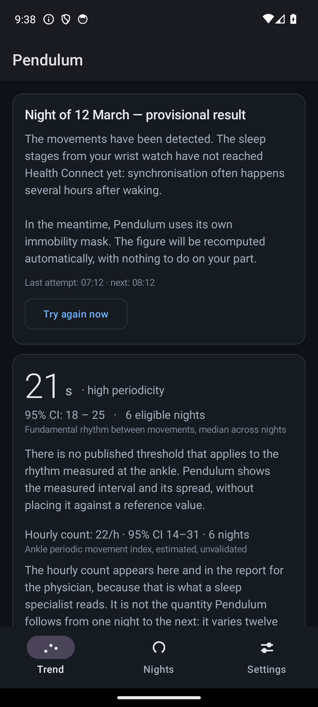 | **Waking, provisional state.** The normal case, not an error: the hypnogram arrives hours after waking because the vendor's sync follows its own battery policy. The card says so and states that the figure will be recomputed with nothing to do. |
| 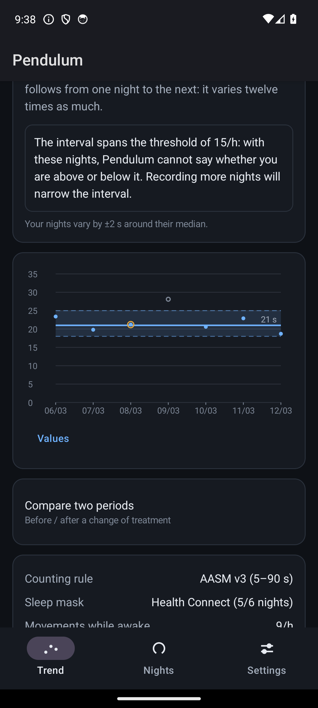 | **Trend, upper half.** The fundamental rhythm in seconds leads, with its interval and the number of eligible nights on the same line. The hourly count sits below, labelled *estimated, not validated*. The boxed sentence is the one the specification demanded: the interval spans the 15/h threshold, so the application says it cannot tell which side you are on. |
| 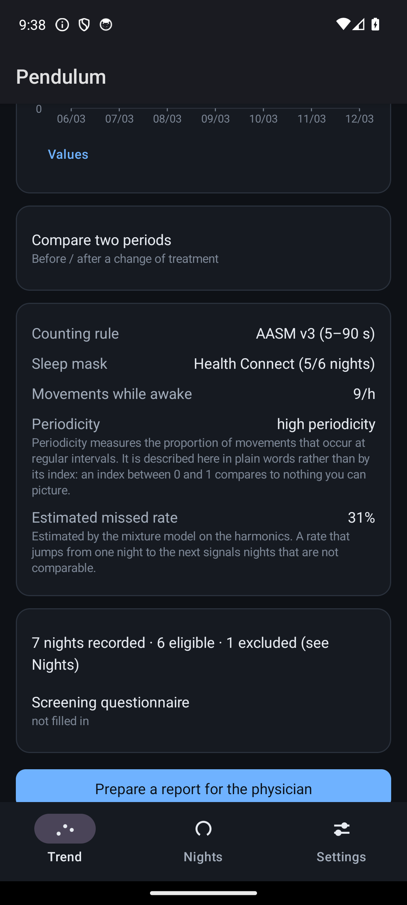 | **Trend, the chart.** Points are not joined — a line between nightly values would assert a continuity the measurement does not have. The dashed band is the minimum detectable change. One night is a hollow circle: excluded, with its reason. The Y axis starts at zero. |
| 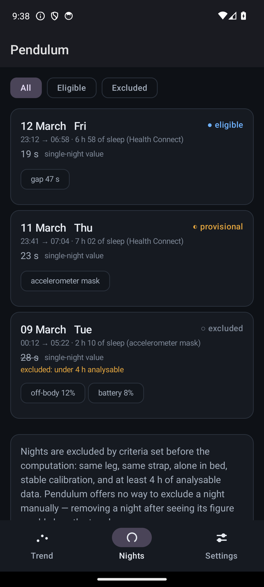 | **The nights.** Each night carries its state and its quality flags. The excluded night keeps its value visible but struck through, with the criterion that excluded it. The card at the bottom explains why there is no button to exclude a night by hand: a night removed after seeing its figure would manufacture the trend. |
| 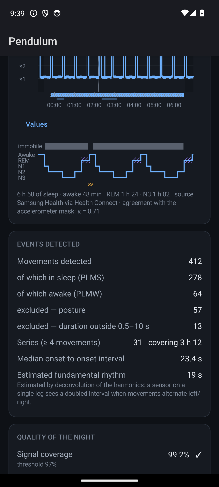 | **One night.** The envelope on a log₂ axis, the adaptive threshold at ×8, detected events, series bands, and the hypnogram aligned underneath on the same time axis. Below, the counts — including the ones that undermine the headline figure, such as movements discarded for posture. |
| 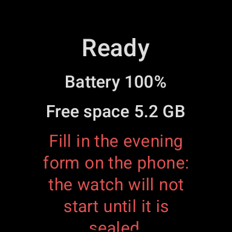 | **The watch, blocked.** One static screen, no animation. Recording refuses to start until the evening record is sealed on the phone — the guard rail that stops a night being recorded without its context. |

## On real hardware, 4 August 2026

Taken on a Pixel 10 Pro Fold and a Pixel Watch 3 during the screen-by-screen review recorded in
[`fr/BANC-ESSAI.md`](fr/BANC-ESSAI.md) §14. These are the current interface. **The database is
empty**, as it is on a fresh installation — which is why no screen here shows a night, a trend
chart or a night detail: those five screens have no door on a new install, and the project
deliberately refuses to inject fake nights in order to photograph them.

| Screen | What it shows |
|---|---|
|  | **The first-run notice, before scrolling.** The gate of the whole product. It cannot be swiped past and the button below cannot be reached without reading through. |
|  | **The same notice, button disabled — and saying why.** The rule of the house: never a grey button without its reason next to it. Here the reason is that the four confirmations are not all ticked. |
|  | **Four confirmations ticked, button live.** The counter is written on the way *out* of the step, not on the way in, so a half-read notice is not recorded as read. |
| 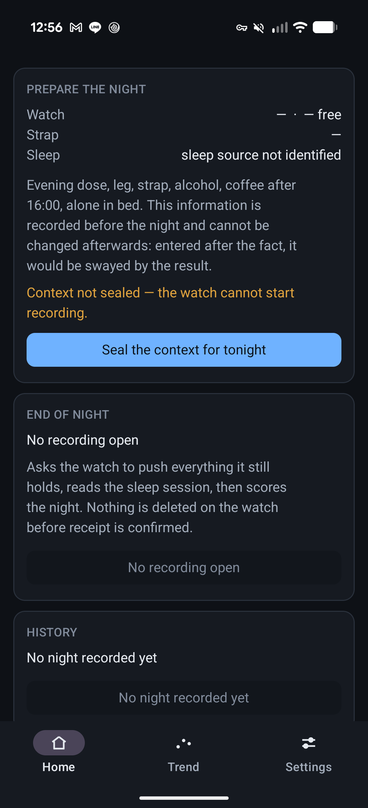 | **Home, on an empty database.** Three cards whose order never changes, and two disabled buttons each carrying its own reason. A card with nothing to say is disabled, never removed — a target that moves between 23:00 and 05:00 is worse than a card that admits it has nothing. |
|  | **The evening record, before sealing.** The only door of the product: the watch will not start until this is sealed, and once sealed it cannot be edited. |
|  | **Assistant, pairing step.** The sensor check that tells you whether the watch is reachable at all, before the first night rather than after it. |
| 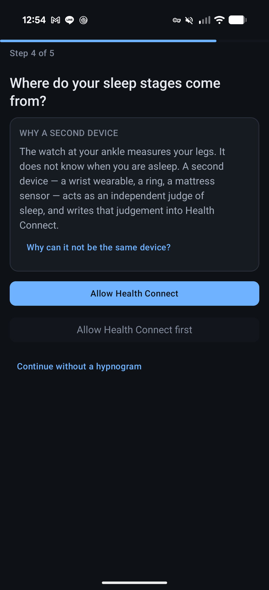 | **Assistant, sleep source.** The second device is not optional: one sensor cannot honestly measure both the movements and the sleep they happen in. |
| 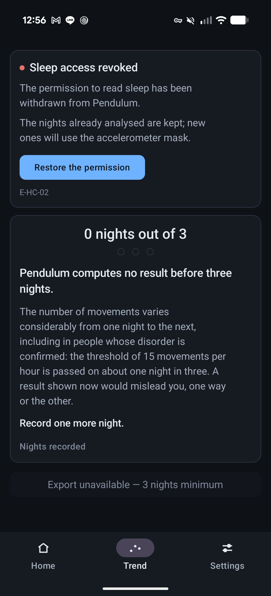 | **Trend, refused under three nights.** Not a warning over a figure — there is no figure. The refusal is carried by the type, not by the display: no branch of code produces an aggregate below three nights. |
| 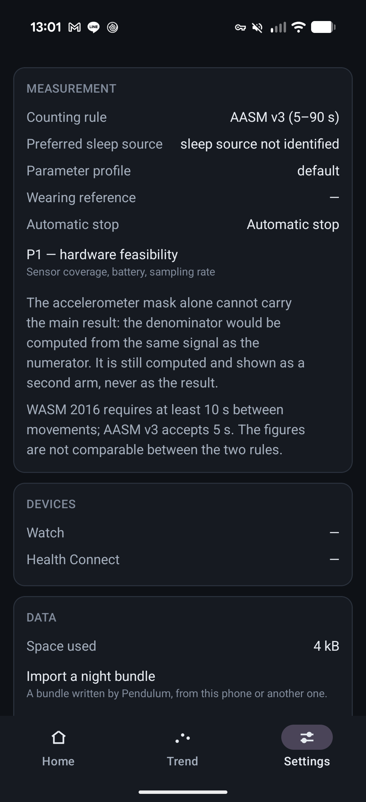 | **Settings.** Where the counting rule and the parameter profile live, both shown as values rather than as controls, because neither is adjustable yet. |
| 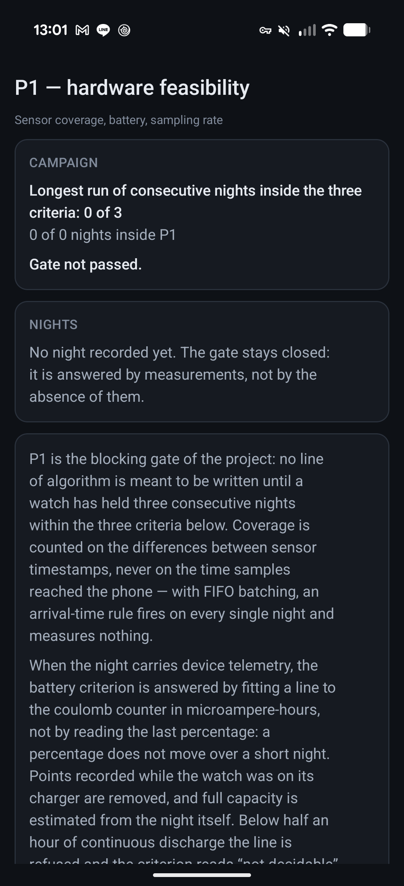 | **The P1 report.** The only blocking milestone of the project, instrumented and not yet passed. Each night gets a verdict on three criteria, and *undetermined* is a verdict like the others. |
| 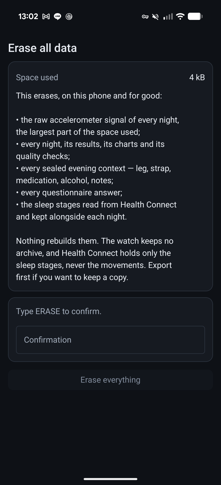 | **Erase everything.** Local data, local erasure, and a confirmation that has to be typed. |
|  | **The watch, blocked on an unsealed context.** Amber and not red: this is a step the user has not taken yet, not a fault of the device. |

## What is faithful, and what is not

| Faithful | Source |
|---|---|
| French strings | [`fr/UX.md`](fr/UX.md), verbatim wherever it wrote them |
| Dark palette, exact hex | [`fr/UX.md`](fr/UX.md) §5.1 |
| Spacing scale, 14 dp card radius, 1 dp borders, no shadows | [`fr/UX.md`](fr/UX.md) §5.3 |
| Layer order, marker shapes, axis conventions of the plots | [`fr/UX.md`](fr/UX.md) §4 |

Not faithful, and deliberately so: the typeface. The specification calls for Roboto Flex with tabular
figures; these files use a system font stack so that they render the same in a browser, in a Markdown
preview and on GitHub, none of which will fetch a font. Line lengths are therefore approximate and body
text is one to two points smaller than the 15 sp the specification asks for, which is what let four full
paragraphs fit on the warning screen at a legible size.

Three strings on these screens are **not** in the specification and were written for the mock-up. They
are marked in the sections below: the evening-record form, the sentence explaining why the result is
hidden on waking, and the two captions under the trend plot. Each corresponds to a decision recorded in
[`01-overview.md`](01-overview.md) §4 that never reached [`fr/UX.md`](fr/UX.md), which was written
before it.

---

## First run — the four limits

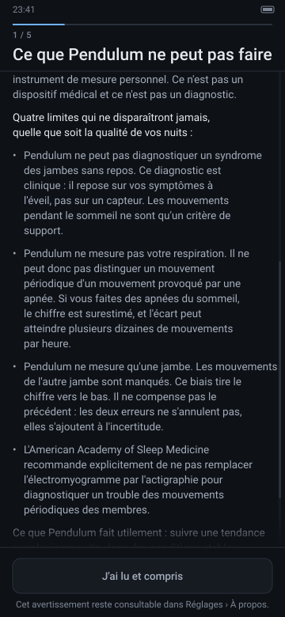

Step 1 of 5, in a pager that does not swipe. Progression is by button only, and the button is disabled
until the text has been scrolled to the bottom — which is why the mock-up shows it mid-scroll, greyed,
with the paragraph above it cut by the top edge and one more paragraph waiting under the fade.

The mechanism matters more than the words. A warning you can dismiss with a thumb-flick has been
dismissed by everyone within a week; a warning that costs a scroll and a deliberate tap has at least been
scrolled past deliberately. The same four limits are reproduced verbatim in the exported PDF, so a
physician reading the report sees exactly what the user agreed to at install time.

The limits are stated as permanent — *quatre limites qui ne disparaîtront jamais* — rather than as
caveats, because three of them are properties of the sensor and its position, not defects to be fixed in
a later version. No amount of signal processing gives an ankle accelerometer a respiratory channel.

## The bedtime ritual — "Ce soir", and the seal

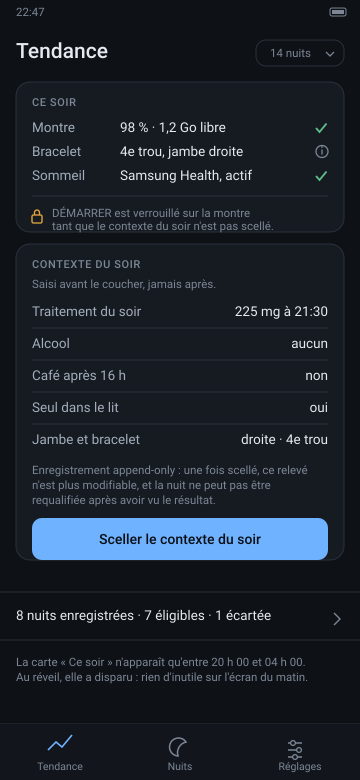

Two hands: the watch starts the recording, the phone holds the record of the evening. The top card is the
one the specification draws — watch battery and free space, the strap marker and which leg, whether the
sleep source is active — and the specification had it exist only between 20:00 and 04:00, absent rather
than greyed outside that window, so that nothing useless is on the screen at 07:00.

*The mock-up predates the code on this point.* The application no longer shows and hides that card:
Home carries three fixed cards whose order and position never change, and a card with nothing to do is
disabled with its reason rather than removed. A card that appears and disappears shifts everything below
it twice a day, and a hard-coded time window is wrong for shift work and for anyone who changes time
zone. The state comes from a persisted state machine; the clock only breaks ties. See
[`06-interface.md`](06-interface.md) §2.2.

The battery line is advice: below 85 % it turns amber and says `98 % recommandé — une nuit consomme
40 à 70 %`, and it blocks nothing. The thing that does block is the second card. **The watch refuses to
start until the evening record is sealed**, append-only, not editable afterwards — the first guard rail
in [`01-overview.md`](01-overview.md) §4. Its purpose is narrow and worth stating: it prevents the
context from being adjusted after the result is known. Someone who sees a bad night and then remembers
they had a drink is not being dishonest; they are being human, and the only place that can be made
structurally difficult is in the code, before the number exists.

*The fields of this card are written for the mock-up.* `01-overview.md` names them — dose, context, which
leg, which strap, alone in the bed — but `fr/UX.md` predates the decision and never wrote the screen.

## Waking — the provisional state

This is the screen the user sees most mornings, and it is the one most likely to be mis-designed. The
movements have been scored; the wrist device's sleep stages have not reached Health Connect yet, and may
not for hours — the manufacturer's own documentation describes watch-to-phone transfer as governed by
the watch's battery policy, with no guaranteed delay.

So the design constraint is: **this must not look like a failure.** Nothing on it is red. The title is
neutral and factual, there is no error code, and the flag is an amber `masque accéléro` chip, which is a
flag and not a diagnosis of the app's health. The body text says outright that this synchronisation
often happens several hours after waking and that the figure will be recomputed automatically with
nothing to do. `Réessayer maintenant` exists for the impatient; the retry ladder — 30 min, 1 h, 2 h, 4 h,
8 h, give up at T+36 h — runs whether it is pressed or not. If the interface presented a missing
hypnogram as an anomaly, the user would conclude the app was broken every single morning, and would stop
believing the one flag that does mean something.

The second card is the guard rail that hides the aggregate at waking. Revealing it is a deliberate tap
and is written to the technical log, and the log goes into the export. *That sentence is written for the
mock-up*; the guard rail is specified, its wording is not.

## The trend — the screen everything else is a detail beside

Read it from the top, because the order is the argument.

**The verdict comes before the number.** The first line says the variation is indistinguishable from
night-to-night variability; the figure follows. Reverse those two and the number is read and the caution
is not. The words *amélioration*, *aggravation*, *efficace* exist nowhere in the string resources, and a
unit test asserts that on the resource file itself.

**The number is a rhythm in seconds, not an hourly count.** Night-to-night variability of the mean log
inter-movement interval is 3.6 % against 43.2 % for the hourly count (Skeba et al. 2016) — twelve times
more stable, and it needs no denominator. The hourly count stays, one line down, in tertiary type,
labelled *pour le médecin*, because that is the language sleep physicians read.

**The uncertainty is measured, not decorative.** The CI band is a percentile bootstrap over the user's
own nights with a fixed seed, so the interval does not move between recompositions. The wider band is the
minimum detectable change: below it, a difference is not a difference. Both bands are labelled in text
and bordered with different dash patterns, so neither depends on its fill colour to be identified.

**The points are not joined.** A polyline between nights asserts a continuous trajectory and a causality
that do not exist; if a monotone trend is really there, the positions of the points will show it. The
excluded night is drawn at its value as a hollow circle with its reason beside it, and counted in
nothing — hiding the failed nights would distort the reading of the whole. The X axis is calendar, not
ordinal, so the three days without a recording leave visible holes. Those holes are information.

Two departures from [`06-interface.md`](06-interface.md) are visible here and both are open questions
rather than oversights, recorded in §4.5 of that document:

- **The Y axis starts at zero.** This paragraph used to claim the opposite, and described a
  convention that was considered for a rhythm in seconds and never built. The code settles it:
  `TendanceChartSpec.yMin` is `0f`, hard-coded, and `yMax` is
  `max(20, ceil(1.15 × highest value / 5) × 5)` — see `ui/chart/Specs.kt`. The README and
  `06-interface.md` P5 both said so; only this file disagreed.
- **There is no 15/h reference line**, because there is nothing to draw. The 15/h threshold belongs to
  the hourly count and does not transfer to a rhythm, and the published periodicity threshold (≈ 0.5,
  Ferri et al. 2016) is on a different scale. Drawing a line here would be inventing a threshold.

For the same reason the headline sentence is the minimum-detectable-change statement rather than one of
the five position sentences of §4.4: those five attach to the 15/h boundary, and the equivalent sentence
for the fundamental rhythm has not been written yet. *The two captions under the plot are mock-up copy.*

## The trend — refusal

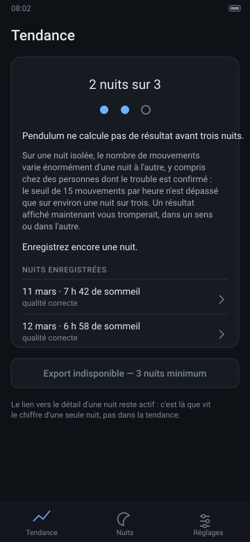

This screen matters as much as the previous one, and it is the one that would be cut first by anyone
optimising for a demo.

Below three eligible nights, Pendulum does not compute a median, does not store one, does not export one,
and **does not draw the plot at all** — not even empty with axes, because an empty axis invites the eye
to imagine a curve. This is not a warning shown next to a disabled feature; there is no code path that
produces the value. The distinction is the whole point: a warning is advice you can decline.

Three details are load-bearing:

- **Dots, not a progress bar.** A bar suggests a score that is rising and rewards the user for filling
  it. Two filled discs and one empty one state a fact about how many nights exist.
- **The reason is given in figures.** *Le seuil de 15 mouvements par heure n'est dépassé que sur environ
  une nuit sur trois* — even in people whose disorder is confirmed. The intended user is technical, and a
  quantified reason persuades where an instruction irritates.
- **The export button stays visible and disabled, with its reason written on the button itself.** Never
  an enabled button that fails, and never a silently missing one.

The link into each night's detail stays live. The refusal is about aggregating, not about looking: the
per-night figure exists, it is simply in the one place where it cannot be mistaken for a result.

## One night, in detail

The header fuses the single-night value with its warning into one block, so the figure cannot be
screenshotted without the sentence that qualifies it. It is body-sized and in secondary colour: available
to the technical user who needs it to check that the measurement worked, never a headline.

The chart is six layers. **Y is amplitude divided by the night's own noise floor, on a log₂ scale**, which
is what makes the ×8 onset threshold a straight horizontal line and the detector's logic readable at a
glance; useful amplitudes span 1.5× to 30×, and on a linear axis the small events disappear. The envelope
is decimated **min/max per pixel column** and never averaged — a 40 ms peak has to survive eight hours
being drawn in 300 pixels, and a unit test asserts it. That is why the envelope looks like a picket fence
rather than a smooth curve: each vertical stroke is one column's minimum-to-maximum, which is what an
accelerometer envelope with a noise floor and short bursts actually looks like at this scale.

Event markers sit on their own 14 dp band under the signal area, never overlaid on the curve: solid ticks
for counted movements, hollow ticks for movements in wakefulness, fine crosses for posture exclusions, and
a continuous bar underneath for each series of four or more. The signal gap is drawn at its true width —
3.4 s on a 7 h 46 axis is about one pixel — and annotated, rather than widened to look impressive.

The hypnogram sits directly below, same width, same X transform, three lanes: the accelerometric mask,
the Health Connect stages in laboratory order with wake at the top, and a lane of amber hatching where
the two disagree. REM is the only stage with a distinct treatment, hatched rather than merely coloured,
because few periodic movements are expected there. Where no hypnogram exists that middle lane is not
drawn empty; it is replaced by a muted band carrying `Hypnogramme indisponible — masque d'immobilité
accéléro utilisé`.

The quality block lists each check with its measured value, its threshold and its state. A single failed
check makes the night ineligible, and the reason is then shown at the top in amber — not red, because a
short night or an unworn watch is a situation, not a fault.

## The watch

One screen. No navigation, no swipe, no list, no complication, and **no result of any kind, ever**. Pure
black, because on OLED black does not light the pixel, and that is battery life rather than style.

Everything on it is a correctness check, read at most twice a night: elapsed time in large tabular
figures, sample count, measured rate against the 50 Hz requested, gap counter, bytes written and space
left, battery, and the FIFO batching mode actually in force. Stopping asks for a confirmation, because an
accidental press at three in the morning costs the whole night.

The screen refreshes every 30 s exactly, and only while the display is on. There is no animation anywhere,
for three reasons in order of weight: every recomposition wakes the SoC and over eight hours a discreet
60 fps animation costs more than the 50 Hz acquisition itself; an interface that invites you to look at
your ankle invites you to bend over and move the leg being measured, which contaminates the measurement;
and there is nothing to watch in real time anyway. The screen is boring on purpose.

---

## Checking these against the principles

The seven principles of [`06-interface.md`](06-interface.md) §1 were written to be answerable yes or no
by looking at a screen. Five of them can be checked on these files as they stand.

| # | Constraint | Where to check it |
|---|---|---|
| **P1** | No aggregation below three eligible nights | `trend-refused.svg` — no plot, no median, no category, export disabled with its reason |
| **P2** | Every aggregate figure carries its uncertainty in the same line | `trend.svg` — `IC 95 % : 19 – 23 s · 7 nuits éligibles`, and the hourly count carries its own |
| **P4** | At most three pieces of information above the fold on waking, at most one action | `waking-provisional.svg` — status, hidden aggregate, one button |
| **P5** | No truncated scale, no mean hiding an extremum | `night-detail.svg` — min/max decimation; and the trend's zero-anchor exception, argued above rather than assumed |
| **P6** | Colour is never the sole carrier | Desaturate any of these files: night states stay distinguishable as filled / ringed / hollow, chart lines as solid / dashed / dotted, REM and disagreement by hatching, sleep stages by vertical position |
| **P7** | The per-night figure is available but never foregrounded | `night-detail.svg` — body size, secondary colour, fused with its warning; absent from `trend.svg` entirely |

P3 — a variation indistinguishable from noise is named as such before it is quantified — is visible in
`trend.svg`, where the statement precedes the figure, but its real test is a unit test on the strings
file, not a picture.

The one thing a mock-up cannot check is the thing most likely to go wrong: whether these screens survive
a font scale of 1.3, a night with no data, a period containing four nights, and a physician who wants the
number. That check needs the real thing.
