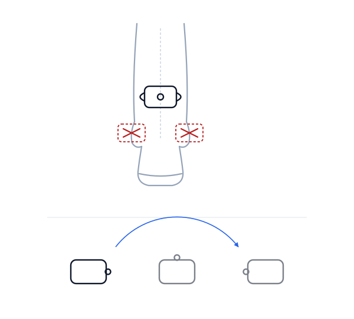

# Installing and releasing

> **Pendulum** measures periodic limb movements in sleep from a smartwatch worn at the ankle, and
> tracks the *rhythm* between them rather than their number. It measures; it does not
> interpret — a real measurement to take to a physician, not a diagnosis and not a medical device — see
> [what this is, and what it is not](../README.md#what-this-is-and-what-it-is-not).

Two audiences, in order: someone who wants to install a release, and whoever cuts the next one.

---

## 1. Installing a release

### What is in a release

| File | What to do with it |
|---|---|
| `pendulum-phone-<version>.apk` | Install on an Android phone, API 30 or later |
| `pendulum-watch-<version>.apk` | Install on a Wear OS watch, API 33 or later |
| `pendulum-phone-<version>.aab` | Not installable. This is the format the Play Store consumes |
| `pendulum-watch-<version>.aab` | Same |
| `SHA256SUMS.txt` | Covers all four |

Both applications share the application id `com.pendulum` and are signed with the same key. That is
not incidental: **the Wearable Data Layer only exchanges data between applications that share an id
and a signature.** Installing the phone build from a release and the watch build from a local debug
build produces two applications that will never see each other, and the failure mode is silence.
Take both halves from the same release.

### Verifying what you downloaded

Worth doing. This is a health-adjacent application that reads your sleep data, and it is distributed
by sideloading rather than through a store's review process.

```bash
sha256sum -c SHA256SUMS.txt
```

You can also check that a release was signed with the project's key rather than someone else's:

```bash
apksigner verify --print-certs pendulum-phone-<version>.apk
```

The certificate should read `CN=Pendulum` with SHA-256 digest
`74ab5e3d315ed4eda4eef4344d4b3e5bbbaeffdf7ea0c78cf417cf98cb4bfd9b`. Both applications carry the same
one — they have to, or they could not exchange data.

Note that `keytool -printcert -jarfile` returns nothing on these files. That is not a problem with
the signature: the APKs are signed with scheme v2/v3 only, which `keytool` does not read. Use
`apksigner`.

### Installing

```bash
# Phone, over USB
adb install pendulum-phone-<version>.apk

# Watch, over Wi-Fi debugging — the watch must be paired and in developer mode
adb connect <watch-ip>:5555
adb -s <watch-ip>:5555 install pendulum-watch-<version>.apk
```

If an install fails with `INSTALL_FAILED_UPDATE_INCOMPATIBLE`, a build signed with a different key is
already present — typically a debug build. Uninstall it first (`adb uninstall com.pendulum`), which
also deletes its data.

### What you need beyond the two applications

A **second, independent** source of sleep timing that writes to Health Connect. Pendulum does not
estimate your sleep period from the ankle sensor, because the movements it counts and the sleep it
would infer come from the same signal, and a metric whose numerator and denominator are
anti-correlated amplifies its own effect. [`05-devices.md`](05-devices.md) compares eleven sources
and gives a ranked recommendation.

### First run

1. On the phone: read the warning through — it does not scroll past until it has been read — then
   grant Health Connect access to sleep sessions.
2. Pair the watch. Both applications must be installed and the watch reachable.
3. In the evening, fill in the evening record on the phone and seal it. **The watch will refuse to
   start recording until this is done**, by design: a night recorded without its context cannot be
   compared to any other night.
4. Wear the watch at the ankle, strap snug, same leg every night.
5. In the morning, put the watch on its charger. Transfer happens on its own.

**Where exactly to put it**, because a few centimetres change what the sensor can see:



On the **front of the shin, just above the ankle bones** — not on a bone. The rotation of the case in
its own plane does not matter; the position along the leg does. A sensor sitting directly over the
joint axis has an effective radius near zero, so a pure ankle movement barely translates it at all
and produces almost no signal. [`02-science.md`](02-science.md) §4 gives the arithmetic: the same
movement reads 184 mg at a 22 cm radius and about 34 mg at 2 cm, falling to nothing when the housing
rests on the tibia.

The instruction that matters more than the exact spot is **the same spot every night**, on the same
leg, with the strap at the same hole. Between-night comparability rests on it: the application
estimates a mechanical gain from body turns during the night, which is a subdued correction, not a
strong one, and a strap moved by one hole moves the index by more than most things it is meant to
measure.

Nothing aggregate appears before **three eligible nights**. That is not a loading state and there is
no way to override it: in confirmed patients the clinical threshold is exceeded on only about a third
of individual nights, so a single night carries no information about a trend.

---

## 2. Cutting a release

### One-time setup

Generate a signing key and keep it somewhere you will not lose it. **If it is lost, no future
release can update an installed build** — Android identifies an application by its signature, and
there is no recovery path.

```bash
keytool -genkeypair -v \
  -keystore release.keystore -alias pendulum \
  -keyalg RSA -keysize 4096 -validity 10000 \
  -storetype PKCS12
```

Then add four repository secrets, under **Settings → Secrets and variables → Actions**:

| Secret | Value |
|---|---|
| `PENDULUM_KEYSTORE_BASE64` | `base64 -w0 release.keystore` (macOS: `base64 -i release.keystore`) |
| `PENDULUM_KEYSTORE_PASSWORD` | The store password |
| `PENDULUM_KEY_ALIAS` | `pendulum`, unless you chose otherwise |
| `PENDULUM_KEY_PASSWORD` | The key password, if different from the store password |

The keystore is never committed. It is written to the runner's working directory, used, and deleted
in an `always()` step so that a failed build does not leave it behind.

### Releasing

```bash
# Bump versionCode and versionName in phone/build.gradle.kts and wear/build.gradle.kts,
# keeping the two modules in step.
git commit -am "Release 0.2.0"
git tag v0.2.0
git push origin main --tags
```

The tag triggers [`release.yml`](../.github/workflows/release.yml), which runs the unit tests,
refuses to publish if any test fails or if Gradle produced no report at all, builds the four signed
artifacts, computes their hashes, and attaches everything to a GitHub release.

### Why the release job refuses to fall back to debug signing

If the secrets are missing, the job fails rather than producing an unsigned or debug-signed
artifact. A debug-signed APK published as a release installs and runs perfectly — and then can never
be upgraded, because the real release key will not match. Failing loudly at build time is much
cheaper than discovering this after people have installed it.

### No test is allowed to fail

The project tolerated one failure by name for a long time, T6, and this section used to say so —
"T6, and only T6" — long after the workflows had stopped doing it. That exception no longer exists:
T6 passes since its denominator was redefined, and the under-count it excluded became a published,
monitored quantity of its own, T22. The history is in [`07-validation.md`](07-validation.md) §4.1.
The stale paragraph was not harmless: a contributor who saw T6 red after touching the detector and
read here that this was the documented state would have stopped looking for the regression, and
someone cutting a release would have expected the tag to publish over it. It does not.

Both workflows now go through [`tools/ci/verifier-tests.py`](../tools/ci/verifier-tests.py), which
fails on any red test — and also when Gradle produced **no** report at all, the case of a
compilation error, which reading the XML reports alone would let through as a silent success. Do
not reintroduce a named exception under another form.
