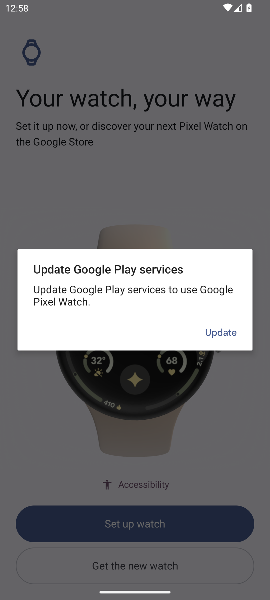
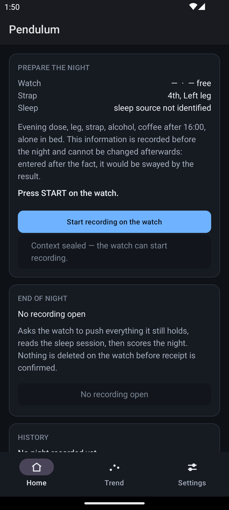
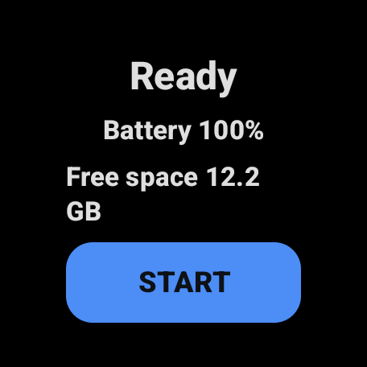

# Pendulum — Banc d'essai sur émulateurs : ce qui marche et ce qui ne marche pas

**Reconnaissance de la phase 0 du banc instrumenté.** Machine : `jona-mac`, Apple Silicon 8 cœurs,
16 Gio de RAM, macOS 26.3, SDK dans `~/Library/Android/sdk`, `emulator` 36.4.9.0, `adb` 1.0.41.
Mesures du 3 août 2026, toutes reproduites depuis WSL par `ssh jona@100.74.103.69`.

**Méthode.** Chaque affirmation de ce document vient d'une commande lancée sur cette machine, dont
la sortie est citée. Quand une question n'a pas été tranchée, elle est listée en §7 avec la
commande qui la trancherait. Rien ici ne vient de la documentation d'Android.

---

## 1. Le verdict

> **Complété le 3 août 2026 par le §11.5, sur les deux appareils réels.** **L'invariant central du
> protocole est vérifié dans la direction qui protège les données** : les deux chunks d'une nuit
> d'essai étaient dans le magasin du téléphone, et la montre ne les a pas effacés — la suppression
> est commandée par l'accusé, pas par la réception. La suppression *après* accusé, elle, n'a pas pu
> être mesurée, et pour une raison qui dépasse le banc : **l'ingestion est morte sur matériel
> réel.** Les deux services d'écoute exigent
> `com.google.android.gms.permission.BIND_WEARABLE_LISTENER`, **une permission qu'aucun paquet ne
> définit** — Android refuse à Play Services de se lier, dans les deux sens, et le seul témoin est
> une ligne du journal système. Ce qui interroge le magasin marche ; tout ce qui dépend d'une
> livraison est mort. La session a par ailleurs corrigé, avec le test qui manquait, une migration
> qui empêchait **toute mise à jour** de l'application déjà installée (commit `6fe2a34`). Lire le
> §11.5.

> **Révisé une seconde fois le 3 août 2026 par le §11, mesuré sur les deux appareils réels de
> l'utilisateur.** Le Data Layer **transporte** : un `DataItem` publié par le téléphone traverse,
> la montre le lit, et le bloqueur « contexte non scellé » disparaît. Ce que le §7.1 mesure est un
> défaut de l'émulateur — l'absence d'adresse Bluetooth, qu'il nomme lui-même — et non un défaut
> du produit. **La voie de repli du §8 ne s'impose plus et la phase 3 retrouve son objet.**
> En revanche le faux vert de `PHONE_UNREACHABLE` est confirmé sur matériel réel, et la correction
> que le §7.1 propose ne le corrige pas non plus. Lire le §11.

> **Révisé le 3 août 2026 par la mesure du §7.1, qui invalide une partie de ce qui suit.**
> L'appairage est **entièrement headless**, sans compte Google et sans geste humain : il s'obtient
> par `am start …/.EmulatorActivity`, et il survit au snapshot. Mais **il ne transporte rien** —
> aucun DataItem ne traverse, aucune capacité n'est joignable. Et la vérification prescrite
> ci-dessous, l'absence de « Phone unreachable » sur l'écran de préflight, est un **faux vert** :
> elle reste verte avec l'émulateur téléphone éteint. Lire le §7.1 avant d'agir sur ce qui suit :
> le §1, le §2 et le §9 portent trois erreurs qu'il corrige, dont le **sens du pont 5601**.

**L'appairage entièrement headless n'a pas été obtenu, et il ne le sera pas : il manque un geste
humain, exactement un, et il est reconductible par snapshot.**

Le transfert de port `adb forward tcp:5601 tcp:5601` s'établit sans erreur et ne produit **aucun**
lien applicatif : l'application Pendulum installée sur les deux émulateurs affiche, côté montre,
« Phone unreachable ». C'est `NodeClient.connectedNodes` qui répond vide, c'est-à-dire exactement
la lecture dont dépend `Preflight`.

La cause n'est pas un réglage manqué. Elle tient en trois mesures :

1. **L'application compagnon Wear OS du téléphone (`com.google.android.wearable.app`) n'est
   préinstallée sur aucune des images téléphone essayées** — ni `android-34/google_apis`
   (223 paquets), ni `android-34/google_apis_playstore` (221 paquets). Sans elle, rien ne se
   connecte au port 5601.
2. **Le Play Store de l'émulateur fonctionne, mais demande un compte.** Lancé sur l'image
   `google_apis_playstore`, il rend `text="Sign in"`, et `dumpsys account` rend `Accounts: 0`.
   L'installation du compagnon exige donc une connexion Google, qui est un geste interactif et ne
   s'automatise pas honnêtement.
3. La méthode de vérification prescrite par le plan — `dumpsys activity provider
   com.google.android.gms.wearable.provider.WearableNodeProvider` — **n'existe pas** sur ces
   images : `No providers match`. Il faut valider autrement, et le §2 dit comment.

**Le chemin qui reste, et il est praticable.** L'image `android-34;google_apis_playstore;arm64-v8a`
démarre normalement — accélérée, `sys.boot_completed` en 75 s (§3) — et porte un Play Store
fonctionnel. La séquence est donc : se connecter **une fois** à un compte Google, installer
l'application Wear OS, appairer, puis **sauvegarder un snapshot** ; toutes les exécutions
suivantes repartent de cet état en 5 secondes. Une manipulation manuelle unique, capturée, est un
compromis acceptable ; une manipulation à chaque exécution ne l'aurait pas été.

**Ce qui n'est pas prouvé et qui décide de tout :** que l'appairage, une fois obtenu, **survive au
snapshot**. Les permissions et les applications installées survivent (§5) ; l'état du Data Layer
n'a pas pu être testé, faute d'avoir jamais été atteint. Si l'appairage ne survivait pas, il
faudrait basculer sur la voie de repli du §8. C'est la première chose que l'agent suivant doit
mesurer, et §7.1 donne la séquence.

**En revanche, trois choses marchent, et bien mieux que le plan ne l'espérait :**

| | |
|---|---|
| **Les snapshots** | Sauvegarde en **2 s**, rechargement à `boot_completed` en **5 s**, coût **945 Mo**. L'application installée et les permissions accordées survivent. C'est la bonne architecture, indépendamment du reste. |
| **Health Connect** | Présent **et vivant** sur `android-34/google_apis` : le service système répond, l'interface de réglages s'ouvre. |
| **`pm grant` sur les permissions de santé** | **Marche**, contrairement à ce que le plan annonçait. `android.permission.health.READ_SLEEP` s'accorde en ligne de commande, sans écran de consentement. |

---

## 2. Question 1 — l'appairage de deux émulateurs

### Ce qui a été lancé

Les deux émulateurs ont été créés propres, avec `avdmanager`, et démarrés en headless. Le
téléphone est ici sur `google_apis` et non `google_apis_playstore` : au moment de cette mesure,
l'image Play Store en API 34 n'était pas encore téléchargée. Le résultat vaut pour les deux, la
liste des paquets étant la même sur le point qui compte — l'absence du compagnon.

```bash
SDK=~/Library/Android/sdk
$SDK/cmdline-tools/latest/bin/avdmanager create avd -n banc_phone34 \
  -k "system-images;android-34;google_apis;arm64-v8a" -d pixel_7 --force
$SDK/cmdline-tools/latest/bin/avdmanager create avd -n banc_wear \
  -k "system-images;android-36;android-wear-signed;arm64-v8a" -d wearos_small_round --force

$SDK/emulator/emulator -avd banc_phone34 -no-window -no-audio -no-boot-anim -port 5574 &
$SDK/emulator/emulator -avd banc_wear    -no-window -no-audio -no-boot-anim -port 5576 &
```

Puis les deux APK, puis le pont, puis la lecture.

### Ce que ça a rendu

**Inventaire des paquets du téléphone** (223 paquets au total, `pm list packages`) :

```
package:com.google.android.healthconnect.controller
package:com.google.android.health.connect.backuprestore
package:com.android.vending
package:com.google.android.gms
```

`grep -i wearable` sur cette liste ne rend **rien**. L'application compagnon n'est pas là.

**Inventaire de la montre** (111 paquets) : la pile Wear OS est complète, dont
`com.google.android.wearable.app`, `com.google.android.gms`, `com.android.vending`. Attention au
faux ami : sur la montre, `com.google.android.wearable.app` est
`/system/priv-app/ClockworkWcs/ClockworkWcs.apk`, le service compagnon **côté montre**. Ce n'est
pas l'application téléphone, malgré le nom de paquet identique.

**Le fournisseur de nœuds prescrit n'existe pas**, sur aucun des deux appareils :

```
$ adb -s emulator-5574 shell dumpsys activity provider \
    com.google.android.gms.wearable.provider.WearableNodeProvider
No providers match: com.google.android.gms.wearable.provider.WearableNodeProvider
```

**Le pont s'établit sans erreur :**

```
$ adb -s emulator-5576 forward tcp:5601 tcp:5601
5601
$ adb -s emulator-5576 forward --list
emulator-5576 tcp:5601 tcp:5601
```

**Les deux APK s'installent :** `Success` des deux côtés, `package:com.pendulum` visible sur
`emulator-5574` et `emulator-5576`.

**Et la montre répond ceci**, lu sur son écran de préflight après avoir fait défiler la liste :

```
text="Ready"
text="Battery 100%"
text="Free space 5.2 GB"
text="Fill in the evening form on the phone: the watch will not start until it is sealed."
text="Phone unreachable — recording carries on, sync will happen later."
```

### Ce qu'on en conclut

Le pont de port lie les démons ADB et rien d'autre. Le second avis mentionné par le plan avait
raison : ce transfert **ne réalise pas** l'appairage applicatif. La pièce manquante est
l'application compagnon côté téléphone, et elle n'est pas dans l'image.

**La bonne méthode de validation, puisque le `dumpsys` prescrit n'existe pas :** lire l'écran de
préflight de la montre. C'est `Preflight.phoneReachable()` qui appelle
`NodeClient.connectedNodes` avec un délai de 10 s, et l'avertissement `PHONE_UNREACHABLE` apparaît
si et seulement si la liste est vide. C'est donc la lecture exacte dont dépend le produit, et elle
se lit en ligne de commande :

```bash
# ATTENTION — voir §7.1 : ce test ne prouve PAS ce que ce paragraphe croit.
adb -s <montre> shell input keyevent KEYCODE_WAKEUP
adb -s <montre> shell am start -n com.pendulum/.wear.ui.MainActivity
sleep 15
python3 tools/banc/uictl.py <montre> find "Phone unreachable"
```

**Correction du §7.1.** Cette lecture ne mesure pas la joignabilité. `connectedNodes` rend une
liste non vide dès que la montre porte `device_paired=1`, y compris **émulateur téléphone tué**.
Elle sépare « jamais appairé » (ce qui est le cas mesuré ci-dessus, et à ce titre le constat reste
juste) de « appairé au moins une fois », et rien d'autre. Le test qui mesure vraiment une liaison
est `CapabilityClient.getCapability(…, FILTER_REACHABLE)`, ou mieux, un DataItem qui traverse.

**Correction du §7.1, deuxième :** `adb -s <montre> forward tcp:5601 tcp:5601` est **dans le
mauvais sens**. C'est le téléphone qui écoute sur 5601 et la montre qui compose `10.0.2.2:5601`.
Le transfert se pose sur le téléphone.

---

## 3. Le résultat qui déclasse tous les autres : l'accélération matérielle

Ce point n'était dans aucune des quatre questions, et il commande pourtant l'ensemble.

### La mesure

Le plan désignait `FarklePhonePortrait`, sur `android-36.1/google_apis_playstore`. Cet émulateur
**n'atteint jamais `sys.boot_completed`**. Deux tentatives, l'une depuis un snapshot, l'autre à
froid, plus de vingt minutes chacune, à 180 % de processeur en permanence. Son journal porte :

```
WARNING | hvf is not enabled on this aarch64 host.
```

Un échantillonnage du processus tranche sans ambiguïté :

```bash
sample $(pgrep -f FarklePhonePortrait) 3 -file /tmp/s.txt
grep -ciE "hv_vcpu_run|hvf" /tmp/s.txt   # -> 1
grep -ciE "cpu_tb_exec|tcg_" /tmp/s.txt  # -> 87
```

Les fils d'exécution sont des `qemu_tcg_cpu_thread_fn` : le processeur invité est **interprété en
logiciel**. Ce n'est pas une machine lente, c'est une machine sans hyperviseur.

### Ce n'est ni la machine, ni l'AVD

- `sysctl kern.hv_support` → `1`.
- Le binaire QEMU porte bien `com.apple.security.hypervisor` dans ses droits (`codesign -d
  --entitlements -`).
- `emulator -accel-check` → `accel: 0`, `Hypervisor.Framework OS X Version 26.3`.
- En mode verbeux, la sélection est explicite : `CPU Acceleration: working`, puis
  `handleCpuAcceleration: feature check for hvf`. Sur les images qui marchent, l'étape suivante
  passe `-enable-hvf` à QEMU. Sur celle-ci, elle émet l'avertissement et ne le passe pas.
- Un AVD **fraîchement créé** sur la même image se comporte pareil. Ce n'est donc pas un AVD abîmé.
- `-feature HVF` en ligne de commande **ne l'emporte pas** : `grep -c enable-hvf` reste à 0.

### Le tableau des images, mesuré une par une

| Image | `-enable-hvf` | `sys.boot_completed` |
|---|---|---|
| `android-34/google_apis/arm64-v8a` | oui (2 occurrences) | **55 s** |
| `android-34/google_apis_playstore/arm64-v8a` | oui (2 occurrences) | **75 s** |
| `android-36/android-wear-signed/arm64-v8a` | oui (2 occurrences) | **60 s** |
| `android-34/android-wear/arm64-v8a` | oui (2 occurrences) | **45 s** |
| `android-36.1/google_apis_playstore/arm64-v8a` | **non (0)** | **jamais**, deux essais de 20 min |

**Le tag `google_apis_playstore` n'est pas en cause, et l'API 36 non plus** : la même famille
d'image en API 34 est accélérée, et l'image montre en API 36 l'est aussi. Ce qui est en cause est
la **révision 36.1** elle-même. C'est une mesure, pas une déduction : quatre images sur cinq
passent `-enable-hvf`, la cinquième non, et elle est la seule en 36.1.

### La conséquence, et elle est lourde

**Le téléphone du banc doit être en API 34.** Cela règle l'accélération et le Play Store, et cela
coûte deux permissions. Sur `android-34` :

```
$ adb shell pm grant com.pendulum android.permission.health.READ_SLEEP
        android.permission.health.READ_SLEEP: granted=true

$ adb shell pm grant com.pendulum android.permission.health.READ_HEALTH_DATA_IN_BACKGROUND
java.lang.IllegalArgumentException: Unknown permission: android.permission.health.READ_HEALTH_DATA_IN_BACKGROUND

$ adb shell pm grant com.pendulum android.permission.health.READ_HEALTH_DATA_HISTORY
java.lang.IllegalArgumentException: Unknown permission: android.permission.health.READ_HEALTH_DATA_HISTORY
```

Ces deux permissions n'existent pas avant l'API 35. Or `SleepReader.Availability` distingue
précisément le cas `BACKGROUND_READ_UNAVAILABLE`, et la KDoc de `SleepReader` dit pourquoi :
« `SleepFetchWorker` tourne par construction application fermée, et sans elle la lecture échoue
hors premier plan ». **Un banc en API 34 ne peut donc pas exercer le chemin nominal de
`SleepFetchWorker`** — il exercera la branche dégradée. Il faut le dire dans les scénarios plutôt
que de le découvrir dans un échec.

---

## 4. Question 2 — Health Connect sur l'image téléphone

### Présent

```
$ adb -s emulator-5574 shell pm list packages | grep -i health
package:com.google.android.health.connect.backuprestore
package:com.google.android.healthconnect.controller
```

### Et vivant, ce qui n'est pas la même chose

```
$ adb -s emulator-5574 shell service list | grep -i health
132  healthconnect: [android.health.connect.aidl.IHealthConnectService]

$ adb -s emulator-5574 shell am start -a android.health.connect.action.HEALTH_HOME_SETTINGS
Starting: Intent { act=android.health.connect.action.HEALTH_HOME_SETTINGS }
```

L'écran obtenu, lu par `uictl.py … dump` :

```
text="Get Started with Health Connect"
text="Share data with your apps"
text="Manage your settings and privacy"
text="Get started"
```

Le service AIDL répond et l'interface se rend. C'est ce que `HealthConnectClient.getSdkStatus`
interroge.

### Le mur attendu n'est pas là

Le plan annonçait que `pm grant` ne fonctionnerait pas pour les permissions de santé, gérées par un
module Mainline avec son propre écran de consentement. **Sur cette image, c'est faux :**

```bash
adb -s <telephone> shell pm grant com.pendulum android.permission.health.READ_SLEEP
# puis, pour verifier — et il faut verifier, la commande est silencieuse en cas de succes :
adb -s <telephone> shell dumpsys package com.pendulum | grep "health.READ_SLEEP: granted"
#         android.permission.health.READ_SLEEP: granted=true, flags=[ USER_SENSITIVE_… ]
```

Aucun écran de consentement, aucun UiAutomator, aucun snapshot nécessaire pour ce point.

`appops` en revanche ne connaît pas ces opérations :

```
$ adb shell appops set com.pendulum android:read_sleep allow
Error: Unknown operation string: android:read_sleep
```

Ce n'est pas un problème : `pm grant` suffit, et `appops` n'apporte rien de plus.

**Ce qui reste à vérifier** : que `SleepReader` rende bien `READY` et non
`BACKGROUND_READ_UNAVAILABLE` — sur cette image en API 34, on attend justement le second, puisque
`READ_HEALTH_DATA_IN_BACKGROUND` n'existe pas (§3). La permission accordée est réelle au niveau du
gestionnaire de paquets ; qu'elle satisfasse aussi le module Health Connect lors d'une vraie
lecture n'a pas été exercé, faute d'un écrivain de sommeil — c'est l'agent C de la phase 1.

---

## 5. Question 3 — les snapshots

C'est le résultat le plus favorable de la reconnaissance.

### Sauvegarde

```bash
adb -s emulator-5574 emu avd snapshot save banc_pret   # OK, 2 s
adb -s emulator-5576 emu avd snapshot save banc_pret   # OK, 2 s
```

### Coût

```
945M  ~/.android/avd/banc_phone34.avd/snapshots/banc_pret     (AVD a 1536 Mo de RAM)
900M  ~/.android/avd/banc_wear.avd/snapshots/banc_pret        (AVD a 512 Mo, releve a 2048 par l'emulateur)
```

Environ **1,85 Go pour la paire**. C'est nettement moins que la taille de la RAM invitée cumulée,
et c'est tenable même sur un disque serré — à condition de n'en garder qu'un par AVD.

### Rechargement

```bash
emulator -avd banc_phone34 -no-window -no-audio -no-snapshot-save -snapshot banc_pret -port 5574
```

```
INFO | Successfully loaded snapshot 'banc_pret' using 956 ms
RELOAD_SECONDS=5
```

**5 secondes entre le lancement et `sys.boot_completed`**, contre 55 s à froid. Et l'état survit :

```
$ adb -s emulator-5574 shell pm list packages com.pendulum
package:com.pendulum
$ adb -s emulator-5574 shell dumpsys package com.pendulum | grep "health.READ_SLEEP: granted"
        android.permission.health.READ_SLEEP: granted=true
```

### Ce qui n'a pas pu être vérifié

**Qu'un snapshot préserve l'appairage du Data Layer**, puisqu'aucun appairage n'a jamais été
obtenu. La question reste entière et ne pourra être tranchée qu'après le §7.

Un piège mérite d'être noté : un snapshot enregistre l'état **tel qu'il est**, y compris mauvais.
En tuant l'émulateur bloqué en émulation logicielle, l'émulateur a sauvegardé de lui-même son
`default_boot` figé, et le rechargement suivant est reparti du même blocage — quinze minutes
perdues à chercher une cause qui était dans le snapshot. Toujours supprimer un `default_boot`
suspect avant de conclure quoi que ce soit :

```bash
rm -rf ~/.android/avd/<nom>.avd/snapshots/default_boot
```

---

## 6. Question 4 — le coût en ressources

### Les deux émulateurs ensemble

Mesuré au repos, les deux démarrés, applications installées :

```
banc_phone34  cpu=6.2%  rss=3404 Mo
banc_wear     cpu=4.1%  rss=1084 Mo
                        somme = 4914 Mo
```

**Environ 4,5 Go de mémoire résidente pour la paire**, et un coût processeur négligeable au repos.
Sur 16 Gio, les deux émulateurs ne sont pas le problème.

### Ce qui est le problème

**L'état de la machine avant de commencer.** Au premier contact :

```
Load Avg: 15.64, 7.19, 5.33
PhysMem: 15G used (1867M wired, 6176M compressor), 93M unused
vm.swapusage: total = 23552.00M  used = 22579.69M  free = 972.31M
```

93 Mo de RAM libre et 972 Mo d'espace d'échange restant. **Cinq émulateurs traînaient depuis des
sessions précédentes**, dont un depuis deux jours à 173 % de processeur. En arrêter trois a rendu
4,3 Go immédiatement. C'est la première étape de tout démarrage du banc, et elle doit être dans le
script :

```bash
# a lancer avant toute chose
adb devices | grep emulator | cut -f1 | while read s; do adb -s "$s" emu kill; done
```

Le reste de la mémoire est pris par Android Studio (857 Mo), la machine virtuelle de Docker
(542 Mo), Chrome, Dropbox et Claude. **Le banc ne cohabite pas avec une session de développement
ouverte** ; c'est à dire dans le mode d'emploi.

### Les temps

| | |
|---|---|
| Démarrage à froid, téléphone API 34 | 55 s |
| Démarrage à froid, montre API 36 | 60 s |
| Rechargement depuis snapshot | **5 s** |
| Sauvegarde d'un snapshot | 2 s |
| Compilation des deux APK (`--no-daemon`, cache chaud) | 19 s |

### Le disque

| Moment | Libre |
|---|---|
| Avant de commencer | **22,5 Go** |
| Après création de `banc_phone34` et `banc_wear` | 18,2 Go |
| Après les deux snapshots | 15,9 Go |
| Après téléchargement de l'image API 34 Play Store | 12,3 Go |
| Après un troisième AVD et l'arrêt des émulateurs | **8,9 Go** |
| Après ménage (un AVD supprimé, `default_boot` effacés) | **14,5 Go** |

**Le plancher de 12 Go a été franchi**, et il l'a été d'un coup : arrêter deux émulateurs a coûté
3,4 Go, parce que chacun **sauvegarde son `default_boot` en se fermant**. Un émulateur qui s'arrête
consomme du disque au lieu d'en rendre. C'est la mesure la plus contre-intuitive de la session, et
c'est celle qui met un banc en panne un soir de scénario long.

Deux règles qui en découlent, à mettre dans les scripts :

- **toujours arrêter avec `-no-snapshot-save`** à moins de vouloir explicitement le snapshot ;
- **ne garder qu'un snapshot nommé par AVD**, et effacer les `default_boot` à chaque passage :
  ils coûtent presque 1 Go pièce et ne servent à rien quand on charge un snapshot nommé.

Après ménage, un AVD téléphone et un AVD montre avec leur snapshot occupent 1,7 Go et 1,8 Go. C'est
le régime de croisière du banc.

À noter aussi : 23,5 Go du disque sont occupés par les fichiers d'échange de macOS, gonflés par la
saturation mémoire. Ils ne se résorbent que lentement. Une machine qui a swappé rend son disque
plus tard, pas tout de suite.

---

## 7. Ce qui reste inconnu, et comment le trancher

### 7.1 L'appairage survit-il au snapshot — mesuré, et la réponse n'est pas celle qu'on attendait

**Mesures du 3 août 2026, mêmes machine et méthode. Question tranchée.**

**Le verdict.** L'appairage **s'obtient sans compte Google et survit au snapshot** — mais il ne
sert à rien : la configuration d'appairage s'installe des deux côtés, la chaîne TCP s'établit de
bout en bout, et **aucun octet applicatif ne traverse**. Ni DataItem, ni message. Et l'indicateur
que le §2 désignait comme « le seul test qui prouve quelque chose » — l'absence de « Phone
unreachable » sur l'écran de préflight — s'avère être un **faux vert** : il reste vert avec
l'émulateur téléphone éteint.

Ce qui suit décrit les cinq murs franchis, celui qui ne l'est pas, et les trois erreurs du présent
document que cette session corrige.

#### Le contournement du Play Store : l'APK extrait d'un vrai téléphone

Le §1 concluait qu'il fallait un compte Google pour installer le compagnon. Faux, si on ne passe
pas par le magasin. L'APK a été extrait du Pixel 10 Pro Fold de l'utilisateur et déposé sur le
Mac. Ce n'est **pas** le paquet que ce document visait :

| | |
|---|---|
| Paquet | `com.google.android.apps.wear.companion` (moderne) — et non `com.google.android.wearable.app` |
| Version | `4.5.0.927073594`, `minSdk=29`, `targetSdk=35`, 62 Mo |
| Splits | aucun, donc `install` simple et pas `install-multiple` |

```bash
$ADB -s emulator-5578 install -r -g ~/builds/pendulum-banc/wear-companion.apk
Performing Streamed Install
Success
```

Il s'installe et il se lance. Aucun `INSTALL_FAILED_*`, aucun plantage.

#### Mur 1 — les Play Services, qui se lèvent tout seuls

Au premier lancement, une boîte modale bloque tout, `com.google.android.apps.wear.companion` étant
au-dessus d'un écran d'accueil qu'on ne peut pas atteindre :

```
text="Update Google Play services"
text="Update Google Play services to use Google Pixel Watch."
text="Update"     id=android:id/button1
```



C'est la boîte standard de `GoogleApiAvailability` (`SERVICE_VERSION_UPDATE_REQUIRED`). Elle n'est
pas contournable : `KEYCODE_BACK` ne la ferme pas, il **termine l'activité** — le gestionnaire
d'annulation appelle `finish()`, et on se retrouve sur le lanceur.

L'image `android-34;google_apis_playstore` livre GMS **23.18.18** (2023), trop ancien. Mais :

```
# a l'installation                     puis, cinq minutes plus tard, sans rien demander
versionName=23.18.18 (190400-535401451)   versionName=26.28.33 (190400-955982596)
```

**Le Play Store de l'image met GMS à jour tout seul, sans compte connecté.** Il suffit de laisser
l'émulateur en ligne quelques minutes après le premier démarrage. Au relancement, la boîte a
disparu. C'est un mur qui se lève de lui-même, à condition de savoir l'attendre — et il ne se
lèvera pas sur une machine sans réseau.

#### Mur 2 — l'appairage Bluetooth ne trouve rien

L'écran d'accueil obtenu (« Your watch, your way ») mène à `Set up watch`, qui ouvre l'association
`CompanionDeviceManager` (« Choose a watch to be managed by Google Pixel Watch »), puis échoue :


Les deux émulateurs ont pourtant bien du Bluetooth émulé, et **partagé** : un unique `netsimd` sert
les deux processus (`Activated packet streamer for bluetooth emulation` dans les deux journaux),
et chacun porte une adresse distincte (`BB:BB:BB:00:00:0C` côté téléphone, `…:00:0B` côté montre).
La découverte ne rend rien quand même. Le lien « I don't see my watch » ouvre un article d'aide
dans Chrome : impasse.

Ce chemin-là est bien celui qui, comme le pressentait la consigne, ne demande pas de compte — mais
il ne fonctionne pas.

#### Le passage : `EmulatorActivity`, exportée

Le compagnon porte une activité dédiée aux émulateurs. Elle se trouve en fouillant l'APK, pas en
lisant l'interface :

```bash
strings -a classes*.dex | grep -i emulator
# → com.google.android.apps.wear.companion.EmulatorActivity
# → [EmulatorConnectionStep] Found connected emulator configuration:
# → CDM association not supported for watch emulator
```

Le manifeste dit lequel des deux noms est utilisable : la classe réelle est `exported=false`,
mais un **alias d'activité** l'expose.

```
E: activity     …core.application.EmulatorActivity   exported=false
E: activity-alias  com.google.android.apps.wear.companion.EmulatorActivity   exported=true
   targetActivity=…core.application.EmulatorActivity
```

```bash
# la commande qui ouvre le chemin emulateur — c'est l'alias, sans le chemin de paquet interne
$ADB -s <telephone> shell am start -n com.google.android.apps.wear.companion/.EmulatorActivity
```

Elle enchaîne directement sur les conditions d'utilisation Wear de GMS, et le journal tranche la
question du compte :

```
wearable.TOS: [TOS] shouldShowBackupConsent(watchPeerId=null, accountName=<NULL>, …): false
```

`accountName=<NULL>` : **aucun compte Google n'est demandé ni utilisé.** L'acceptation se pilote
par identifiant, en deux taps — le bouton s'appelle d'abord « More » (il faut faire défiler) puis
« I agree », mais il porte le même identifiant tout du long :

```bash
for i in 1 2 3; do python3 tools/banc/uictl.py <telephone> tap terms_of_service_accept_button; sleep 3; done
```

#### L'erreur qui coûtait tout : le pont 5601 était dans le mauvais sens

Le §2 et le §9 de ce document prescrivent `adb -s <montre> forward tcp:5601 tcp:5601`. **C'est
l'inverse de ce qu'il faut**, et c'est la cause du premier échec :

```
WearSetup: [EmulatorConnectionStep] Connected emulator configuration not found, retrying in 3000
… dix-huit fois …
WearSetup: [EmulatorConnectionStep] Failed to find connected emulator configuration
WearCompanion: [EmulatorActivity] [EMULATOR_PAIRING:FAILURE] NOT FOUND
```

La mesure qui redresse le sens, faite en lisant les tables de sockets des deux invités
(`15E1` = 5601, `0A` = LISTEN, `01` = ESTABLISHED) :

```
# cote telephone
0000000000000000FFFF00000100007F:15E1 …:0000 0A     <- le TELEPHONE ECOUTE
# cote montre
…0F02000A:C912 …0202000A:15E1 01                     <- la MONTRE COMPOSE 10.0.2.2:5601
```

C'est donc le téléphone qui écoute, et la montre qui appelle `10.0.2.2:5601`, c'est-à-dire la
boucle locale de l'hôte vue depuis son bac à sable réseau. Le transfert doit pointer **vers le
téléphone** :

```bash
$ADB -s <telephone> forward tcp:5601 tcp:5601    # correct
$ADB -s <montre>   forward tcp:5601 tcp:5601    # ce que disait le §2 — inopérant
```

Avec le bon sens, la chaîne complète s'observe sur l'hôte :

```
adb        127.0.0.1:5601 (LISTEN)
adb        127.0.0.1:5601->127.0.0.1:61096 (ESTABLISHED)
qemu-syst  127.0.0.1:61096->127.0.0.1:5601 (ESTABLISHED)     <- le processus de banc_wear
```

et l'appairage aboutit du côté de GMS :

```
WearSetup: [EmulatorConnectionStep] ConnectionConfiguration created
WearSetup: [EmulatorConnectionStep] Found connected emulator configuration: ConnectionConfiguration[
  Name=banc_wear, Address={invalid address}, Type=2, Role=2, Enabled=true, IsConnected=true,
  PeerNodeId=74dec63b, NodeId=74dec63b, DataItemSyncEnabled=true, maxSupportedRemoteAndroidSdkVersion=35 ]
```

Il reste un défaut, et il ne se répare pas : le compagnon ne parvient jamais à enregistrer la
montre dans **son propre** registre.

```
WearSetup: [EmulatorConnectionStep] No paired watch with emulator id null. Found only []
WearCompanion: [AloNotification][ActiveWatchFaceStartupListener] Paired watches size=0
```

`emulator id null` : le compagnon cherche une clé que la configuration ne porte pas — cohérent avec
`Address={invalid address}`, un émulateur n'ayant pas d'adresse Bluetooth. Relancer
`EmulatorActivity` sur un banc entièrement en marche reproduit la séquence à l'identique.

#### Ce que la montre en retient, et qui survit à tout

Malgré ce dernier défaut, la montre s'enregistre comme appairée, et **cet état est persistant** :

```bash
$ADB -s <montre> shell settings get secure device_paired          # → 1
$ADB -s <montre> shell settings list global | grep -i wear_companion
# wear_companion_app_name=Google Pixel Watch
# paired_device_os_type=1
```

Et l'écran de préflight de Pendulum cesse d'afficher l'avertissement :

```
text="Ready"        text="Battery 100%"      text="Free space 5.2 GB"
text="Fill in the evening form on the phone: the watch will not start until it is sealed."
```


C'est la lecture que le §2 désignait comme décisive. **Elle survit au snapshot** — sauvegarde des
deux côtés, arrêt des deux, rechargement en 4 s, et l'avertissement reste absent, sans avoir eu à
retoucher l'interface :

```
Successfully loaded snapshot 'banc_pret' using 1605 ms      (telephone)
Successfully loaded snapshot 'banc_pret' using 1269 ms      (montre)
RELOAD_SECONDS=4
python3 tools/banc/uictl.py emulator-5576 find "Phone unreachable"   → UICTL_FAIL aucun element
```

À la lettre, la question posée par ce paragraphe est donc répondue par l'affirmative. Sauf que
la lecture ne vaut rien.

#### Le faux vert : `connectedNodes` ne mesure pas la liaison

Trois falsifications, de plus en plus brutales, toutes menées après le rechargement :

| Ce qu'on casse | Ce que `Preflight` rend |
|---|---|
| `adb forward --remove-all` sur le téléphone | toujours joignable |
| `am force-stop com.google.android.gms` sur le téléphone | toujours joignable |
| **`emu kill` sur l'émulateur téléphone**, puis 2 min 30 d'attente | **toujours joignable** |
| montre redémarrée à froid, téléphone toujours mort | **toujours joignable** |

`Preflight.phoneReachable()` appelle `NodeClient.connectedNodes` avec un délai de 10 s et teste
`isNotEmpty()`. Sur Wear OS, cette liste est **non vide dès que la montre porte `device_paired=1`**,
indépendamment de toute liaison vivante. Elle distingue « une montre a déjà été appairée » de
« aucun appairage n'a jamais eu lieu » — ce que le §2 a effectivement mesuré, l'émulateur n'ayant
alors jamais été appairé — mais elle **ne distingue pas** un téléphone joignable d'un téléphone
éteint.

Conséquence directe pour le produit, et elle dépasse le banc : `PHONE_UNREACHABLE` n'apparaîtra
jamais tant qu'une montre a été appairée une fois, quel que soit l'état réel du téléphone.
L'avertissement n'est pas bloquant (`Preflight` le dit explicitement), donc rien ne casse — mais il
ne prévient de rien non plus. **Ce n'est pas un défaut d'émulateur, c'est un défaut de mesure**,
et il vaut sur matériel réel.

#### La mesure qui ne triche pas : un DataItem qui traverse

Il fallait donc un test qui exige un octet réel. Pendulum en fournit un, et c'est même le meilleur
possible : le téléphone pose `/pendulum/context/<clé de nuit>` quand le formulaire du soir est
scellé, la montre lit sa présence par `DataClient.getDataItems`, et refuse de démarrer sans lui.
Aucune configuration ne peut simuler ça.

L'assistant du téléphone a été mené jusqu'au bout — voir plus bas, §7.4 est résolu — le contexte
a été scellé, et le téléphone le confirme :

```
text="Context sealed — the watch can start recording."
```

Aucun avertissement `PendulumContext: contexte scelle en base mais non publie vers la montre`
dans le journal : `putDataItem` a rendu la main sans exception dans son délai de 20 s.

**La montre ne l'a jamais vu.** Testé quatre fois, dont une sur un cycle complet et propre —
sauvegarde des deux snapshots, arrêt des deux émulateurs, redémarrage, transfert posé avant la fin
du démarrage, 90 s d'attente, chaîne TCP vérifiée établie des deux côtés :

```
montre : socket vers 10.0.2.2:5601 = 1     hote : sockets ESTABLISHED = 2
text="Fill in the evening form on the phone: the watch will not start until it is sealed."
```

Le téléphone, symétriquement, ne reçoit rien de la montre. Son écran d'accueil affiche
`Watch — · — free` : les capacités de la montre, demandées par
`CapabilityClient.getCapability(…, FILTER_REACHABLE)`, ne rendent rien. Le journal GMS du
téléphone le dit dans son propre vocabulaire :

```
WearableService: Event[…: onConnectedCapabilityChanged, event=ConnectedCapabilityNotification<pendulum_watch_app, []>]
```



Noter l'écart de diagnostic entre les deux API, qui est tout le sujet : `connectedNodes` rend la
montre `banc_wear` par son nom, `getCapability(FILTER_REACHABLE)` rend une liste vide. La première
lit une configuration, la seconde teste une portée. **Seule la seconde dit la vérité.**

#### Verdict, et ce qu'il change

| Question | Réponse mesurée |
|---|---|
| Le compagnon s'installe-t-il sur l'image API 34 | **oui**, `Success`, sans split |
| Exige-t-il un compte Google | **non**, par `EmulatorActivity` (`accountName=<NULL>`) |
| Exige-t-il des Play Services plus récents | **oui**, et l'image les met à jour seule en ~5 min |
| L'appairage s'enregistre-t-il | **oui**, `ConnectionConfiguration` + `device_paired=1` |
| Survit-il au snapshot | **oui**, rechargement en 4 s, rien à refaire |
| Le Data Layer transporte-t-il quoi que ce soit | **non** — aucun DataItem, aucune capacité joignable |

L'appairage est donc **acquis et reconductible, et inutile**. La phase 3 « dégradés du transfert »
n'a pas d'objet : on ne peut pas éprouver la machine à états d'un transfert qui ne transfère rien.
**La voie de repli du §8 s'applique**, et pour la raison qu'elle prévoyait, à un détail près — ce
n'est pas l'appairage qui manque, c'est la charge utile.

> **Portée de ce verdict, fixée par le §11 :** il vaut pour l'émulateur et pour lui seul. Sur deux
> appareils réellement appairés, le même item traverse (§11.2). La cause est bien celle que ce
> paragraphe nomme — `Address={invalid address}` — et elle disparaît avec l'émulateur. La phase 3
> doit s'écrire sur matériel réel.

Ce qui est gagné au passage, et qui n'est pas rien : le téléphone du banc est désormais entièrement
pilotable par script jusqu'au scellement du contexte, ce qui débloque tous les scénarios de §8 qui
partent d'un contexte scellé.

#### La séquence exacte, si quelqu'un veut la refaire

```bash
SDK=~/Library/Android/sdk; export ADB=$SDK/platform-tools/adb; cd ~/builds/pendulum-banc

# 1. les deux emulateurs, JAMAIS sans -no-snapshot-save
$SDK/emulator/emulator -avd banc_phone34ps -no-window -no-audio -no-boot-anim -no-snapshot-save -port 5578 &
$SDK/emulator/emulator -avd banc_wear -no-window -no-audio -no-boot-anim -no-snapshot-save -snapshot banc_pret -port 5576 &

# 2. le compagnon, puis CINQ MINUTES de reseau pour que GMS passe de 23.18.18 a 26.28.33
$ADB -s emulator-5578 install -r -g ~/builds/pendulum-banc/wear-companion.apk
$ADB -s emulator-5578 shell dumpsys package com.google.android.gms | grep versionName | head -1

# 3. le pont — VERS LE TELEPHONE
$ADB -s emulator-5578 forward tcp:5601 tcp:5601

# 4. l'ecran doit rester allume, sinon `input tap` s'execute sans rien faire (§7.4)
$ADB -s emulator-5578 shell input keyevent KEYCODE_WAKEUP
$ADB -s emulator-5578 shell svc power stayon true
$ADB -s emulator-5578 shell settings put system screen_off_timeout 2147483647

# 5. le chemin emulateur, et l'acceptation des conditions
$ADB -s emulator-5578 shell am start -n com.google.android.apps.wear.companion/.EmulatorActivity
for i in 1 2 3; do python3 tools/banc/uictl.py emulator-5578 tap terms_of_service_accept_button; sleep 3; done

# 6. constater — et lire les marqueurs, pas $?
bash tools/banc/appairage.sh emulator-5578 emulator-5576
# APPAIRAGE_CHAINE montre=1 telephone=2 hote_etabli=2
# APPAIRAGE_CONFIG 1
# APPAIRAGE_DATALAYER_MUET  <- l'etat mesure ci-dessus
```

**Un piège à ne pas retraverser :** un AVD créé par ce `avdmanager` porte `PlayStore.enabled=no`
malgré l'image, parce que les `cmdline-tools` installés ne savent pas lire le format de métadonnées
courant :

```
Warning: This version only understands SDK XML versions up to 3 but an SDK XML file of version 4
was encountered.
Warning: package.xml parsing problem. unexpected element (uri:"", local:"abis").
```

Le même défaut laisse `target=android-0` dans le `config.ini` — et c'est ce qu'on croit d'abord
être la cause du §3, à tort. Corriger à la main dans `~/.android/avd/<nom>.avd/config.ini` :

```bash
sed -i '' 's/^PlayStore.enabled=no/PlayStore.enabled=yes/' ~/.android/avd/banc_phone34ps.avd/config.ini
```

#### Le coût, mesuré

| Moment | Libre |
|---|---|
| Avant de commencer, aucun émulateur en marche | **13,8 Go** |
| Les deux émulateurs démarrés, compagnon installé | 11,9 Go |
| Après ménage (`default_boot` de `farkle_atv`, 1,6 Go) | 13,5 Go |
| Après les deux snapshots `banc_pret` | 12,4 Go |
| **À la fin, tout arrêté, `default_boot` effacés** | **11,1 Go** |

Le plancher de 10 Go n'a pas été approché. `-no-snapshot-save` tient sa promesse : les quatre
arrêts d'émulateur de la session n'ont écrit aucun `default_boot` et n'ont rien coûté. Les deux
snapshots pèsent 1085 Mo (téléphone) et 1047 Mo (montre).

Rechargement mesuré **quatre fois : 4 s** à chaque fois, contre 5 s au §5 — l'ordre de grandeur du
§5 est confirmé sur un état bien plus chargé.

### 7.2 Peut-on récupérer les deux permissions perdues

`android-35` ou `android-36` en `google_apis` (aucune n'est installée) apporterait
`READ_HEALTH_DATA_IN_BACKGROUND` et `READ_HEALTH_DATA_HISTORY`. Rien ne dit qu'elles soient
accélérées : seule la révision 36.1 a été prise en défaut, mais elle est aussi la seule au-dessus
de l'API 34 à avoir été essayée côté téléphone. Le test est celui du §3, en une minute — mais il
coûte environ 2 Go de disque, et le disque est le point de tension (§6).

### 7.3 Ce que `SleepReader` rend réellement

Le service Health Connect répond et la permission est accordée, mais aucune lecture n'a été faite —
il n'y a rien à lire tant que l'écrivain de sommeil de la phase 1 n'existe pas. On **attend**
`BACKGROUND_READ_UNAVAILABLE` en API 34 ; ce n'est pas mesuré.

**Partiellement tranché au §7.1.** L'étape 4 de l'assistant du téléphone, atteinte pour la première
fois, affiche `Background reading unavailable` et `Allow Health Connect first`. C'est bien la
branche dégradée annoncée au §3, et elle est confirmée par l'application elle-même, pas déduite.
Reste non mesuré ce que rend `SleepReader` sur une vraie lecture.

### 7.4 Le pilotage de l'assistant du téléphone — **résolu au §7.1**

**La cause était bien celle que ce paragraphe soupçonnait : l'écran endormi.** Les quatre cases se
cochent, une par une, dès que le téléphone est maintenu réveillé exactement comme la montre :

```bash
$ADB -s <telephone> shell input keyevent KEYCODE_WAKEUP
$ADB -s <telephone> shell svc power stayon true
$ADB -s <telephone> shell settings put system screen_off_timeout 2147483647
# puis, apres avoir fait defiler jusqu'en bas — les cases ne sont pas dans l'arbre avant
python3 tools/banc/uictl.py <telephone> cocher 4      # → UICTL_OK, puis « 4 of 4 confirmed »
```

Deux détails qui coûtent une heure si on ne les a pas :

- `input tap` fonctionne, `input motionevent DOWN/UP` **ne fonctionne pas** sur ces cases Compose ;
- les bornes se décalent à chaque case cochée, donc un lot de taps calculé sur un seul dump tape à
  côté dès la deuxième. D'où la commande `cocher` de `uictl.py`, qui redumpe entre chaque.

L'assistant complet — cinq étapes, formulaire du soir, scellement — est désormais scriptable de
bout en bout, et le blocage `CONTEXT_NOT_SEALED` de la montre se lève côté téléphone. Il ne se lève
pas côté montre, mais pour une autre raison, et c'est tout le §7.1.

`uictl.py` lit l'arbre d'interface et tape correctement — l'écran de réglages de Health Connect a
été ouvert et lu, la boîte de dialogue de notification de la montre a été traitée. Mais **les
quatre cases à cocher de l'étape 1 de l'assistant du téléphone n'ont pas pu être cochées** :
`uiautomator` les voit (`android.widget.CheckBox`, `clickable=true`, centres en `(148,1148)`,
`(148,1318)`, `(148,1546)`, `(148,1774)`), `input tap` s'exécute sans erreur, et le compteur reste
à `0 of 4 confirmed`. La piste non explorée est l'état de veille de l'écran : la montre n'a répondu
aux gestes qu'après `input keyevent KEYCODE_WAKEUP` et `settings put system screen_off_timeout
2147483647`. Il faut essayer la même chose sur le téléphone avant d'en conclure quoi que ce soit.

Tant que ce point n'est pas réglé, le contexte du soir ne peut pas être scellé par script, et donc
le blocage `CONTEXT_NOT_SEALED` de la montre ne peut pas être levé.

---

## 8. La voie de repli, si l'appairage ne vient pas

Elle consiste à **tester les deux moitiés séparément** et à injecter les chunks côté téléphone par
`NightExporter.importBundle`. Ce chemin existe déjà et n'est pas un contournement improvisé :
`BundleRoundTripTest` le parcourt en aller-retour et vérifie que « une nuit reconstruite depuis un
bundle donne exactement le même résultat », champ par champ, sur le trajet complet génération →
fichiers de chunks → analyse → mise en bundle → relecture → réécriture → seconde analyse.

**Ce qu'elle garde**, et c'est la majeure partie de la valeur annoncée du banc :

- l'exactitude algorithmique de bout en bout, puisque le résultat obtenu doit égaler celui du test
  JVM sur le même signal ;
- la tenue mémoire du téléphone sur 1,44 M d'échantillons, jamais éprouvée ;
- les garde-fous d'affichage dans l'application assemblée, côté téléphone ;
- tout ce qui touche au dénominateur : Health Connect, `E-HC-01` à `E-HC-03`, l'abandon à T+36 h,
  la nuit de changement d'heure — ces scénarios ne traversent pas le Data Layer.

**Ce qu'elle perd, et il faut le nommer précisément :**

- **Toute la machine à états du transfert.** L'invariant « aucun fichier effacé avant son bit
  d'accusé » redevient raisonné et non vérifié. Le lien coupé en pleine nuit, le plafond d'items
  en vol, le chunk corrompu et sa réémission, l'ordre supprimer-puis-reposer imposé par le Data
  Layer : **rien de l'agent E de la phase 3** n'est exerçable.
- **La jointure entre les deux moitiés** — c'est-à-dire exactement la classe de défaut que le banc
  existe pour attraper. Le contexte du soir clé par une session qui n'existe pas encore avait
  précisément cette forme : chaque moitié correcte, la jointure impossible. Injecter un bundle
  fabriqué court-circuite la jointure au lieu de l'éprouver.
- **`Preflight` et `AppairageMontre` dans leur cas nominal.** Ils ne seront exercés que dans leur
  branche « rien en face », qui est la seule que l'émulateur sait produire.

Autrement dit : la voie de repli conserve l'**exactitude** et abandonne l'**orchestration
distribuée**. Comme l'orchestration distribuée est la moitié de ce que le plan promettait, il faut
le réécrire dans `docs/07-validation.md` plutôt que de laisser croire que le banc valide la chaîne.

---

## 9. Les commandes qui marchent, réutilisables telles quelles

### Préparer la machine

```bash
# 1. faire le vide — sans quoi rien d'autre n'a de sens (voir §6)
ADB=~/Library/Android/sdk/platform-tools/adb
$ADB devices | grep emulator | cut -f1 | while read s; do $ADB -s "$s" emu kill; done

# 2. verifier qu'il reste de la place ET de la memoire
df -Pk ~ | tail -1
top -l 1 -n 0 | grep -E "PhysMem|Load Avg"
```

### Construire les APK

```bash
rsync -az --delete --exclude '.git/' --exclude '.gradle/' --exclude '.kotlin/' \
  --exclude 'build/' --exclude '**/build/' --exclude 'local.properties' --exclude 'docs-site/' \
  /mnt/e/dev/plss/ jona@100.74.103.69:builds/pendulum-banc/

# local.properties est exclu du rsync : il faut le recreer, une fois, sur le Mac
ssh jona@100.74.103.69 'echo "sdk.dir=/Users/jona/Library/Android/sdk" > ~/builds/pendulum-banc/local.properties'

# et surtout PAS de flock : la commande n'existe pas sur macOS (`flock: command not found`)
ssh jona@100.74.103.69 'bash -lc "cd ~/builds/pendulum-banc && ./gradlew --no-daemon :phone:assembleDebug :wear:assembleDebug"'
```

### Démarrer la paire

```bash
SDK=~/Library/Android/sdk
# TOUJOURS verifier qu'aucune instance ne tourne deja sur le meme AVD : deux processus sur les
# memes images corrompent l'invite, et le symptome est illisible — « Can't find service: package »
# sur un appareil pourtant marque `device`.
pgrep -f banc_phone34ps | wc -l   # doit valoir 0

# -no-snapshot-save est obligatoire : sans lui, l'arret ecrit un default_boot de ~1 Go (§6)
$SDK/emulator/emulator -avd banc_phone34ps -no-window -no-audio -no-snapshot-save \
  -snapshot banc_pret -port 5578 &
$SDK/emulator/emulator -avd banc_wear -no-window -no-audio -no-snapshot-save \
  -snapshot banc_pret -port 5576 &

# attendre, en lisant le marqueur et jamais `$?` — ssh via Tailscale ne propage pas les codes
until [ "$($SDK/platform-tools/adb -s emulator-5578 shell getprop sys.boot_completed | tr -d '\r')" = 1 ]; do sleep 2; done
```

### Installer et autoriser

```bash
B=~/builds/pendulum-banc
$ADB -s emulator-5578 install -r -t $B/phone/build/outputs/apk/debug/phone-debug.apk
$ADB -s emulator-5576 install -r -t $B/wear/build/outputs/apk/debug/wear-debug.apk

$ADB -s emulator-5578 shell pm grant com.pendulum android.permission.health.READ_SLEEP
$ADB -s emulator-5578 shell pm grant com.pendulum android.permission.POST_NOTIFICATIONS
$ADB -s emulator-5576 shell pm grant com.pendulum android.permission.POST_NOTIFICATIONS
# verifier, car pm grant est silencieux en cas de succes comme en cas de non-effet
$ADB -s emulator-5578 shell dumpsys package com.pendulum | grep "health.READ_SLEEP: granted"
```

### Poser le pont 5601 — vers le téléphone, jamais vers la montre

```bash
$ADB -s emulator-5576 forward --remove-all          # au cas ou le mauvais sens traine
$ADB -s emulator-5578 forward tcp:5601 tcp:5601     # le TELEPHONE ecoute, la montre compose
$ADB forward --list
```

Le transfert ne survit pas à l'arrêt de l'émulateur : il est à reposer à chaque démarrage. Voir
§7.1 pour la mesure qui établit le sens.

### Réveiller la montre — sans quoi tout dump est illisible

L'émulateur de montre bascule en mode ambiant et l'interface se retrouve derrière un cadran ; les
captures d'écran montrent l'application floutée sous l'heure, et `uiautomator` ne rend que
`text="12:27"`.

```bash
$ADB -s emulator-5576 shell input keyevent KEYCODE_WAKEUP
$ADB -s emulator-5576 shell svc power stayon true
$ADB -s emulator-5576 shell settings put system screen_off_timeout 2147483647
```

**Le téléphone a besoin des trois mêmes lignes**, et c'était toute la cause du §7.4 : écran
endormi, `input tap` s'exécute sans erreur et ne coche rien.

### Lire un écran

`tools/banc/uictl.py` fait le dump, cherche par texte, identifiant ou description, et tape au
centre de l'élément. Il émet `UICTL_OK` ou `UICTL_FAIL` sur la sortie standard, à lire par
l'appelant distant.

```bash
export ADB=~/Library/Android/sdk/platform-tools/adb
U="python3 tools/banc/uictl.py emulator-5576"
$U dump                       # arbre complet
$U find "Phone unreachable"   # cherche et rend les bornes
$U clic                       # ce qui est reellement actionnable — a utiliser quand tap echoue
$U tap  "Allow"               # tape au centre
$U wait "Ready" 60            # attend l'apparition
$U shot /tmp/ecran.png        # capture
$U cocher 4                   # coche les 4 premieres cases non cochees, en redumpant entre chaque
```

Deux leçons apprises en tapant à côté, et encodées dans le script :

- il faut préférer une **égalité exacte** de texte, sinon `tap "Allow"` attrape le titre
  « Allow Pendulum to send you notifications? », qui contient le mot et occupe la moitié de
  l'écran ;
- dans Compose, **l'étiquette d'une case à cocher est un nœud distinct et non cliquable** : taper
  sur le texte ne coche rien et ne produit aucune erreur. D'où la commande `clic`.

### Sauvegarder et recharger un état

```bash
$ADB -s emulator-5578 emu avd snapshot save banc_pret     # 2 s, ~945 Mo
emulator -avd banc_phone34ps -no-window -no-audio -no-snapshot-save -snapshot banc_pret -port 5578
# 5 s jusqu'a boot_completed, application et permissions intactes

# et le menage, a faire a chaque fin de session : un default_boot coute ~1 Go et ne sert a rien
rm -rf ~/.android/avd/banc_phone34ps.avd/snapshots/default_boot
rm -rf ~/.android/avd/banc_wear.avd/snapshots/default_boot
```

---

## 10. Ce que la mesure impose comme architecture

1. **Le banc part de snapshots, toujours.** 5 s contre 55 s, et l'état accordé une fois est
   reconductible. Ce n'était que la sortie de secours du plan ; c'est en fait la seule chose qui
   ait dépassé les attentes.
2. **Le téléphone est `banc_phone34ps`**, sur `android-34;google_apis_playstore;arm64-v8a`, avec
   la perte assumée des deux permissions `READ_HEALTH_DATA_IN_BACKGROUND` et
   `READ_HEALTH_DATA_HISTORY`, qui n'existent pas en API 34. La montre est `banc_wear`, sur
   `android-36;android-wear-signed;arm64-v8a`. **Ne pas utiliser `FarklePhonePortrait`** : son
   image 36.1 ne démarre pas.
3. **Le banc commence par faire le vide**, et refuse de démarrer sous 12 Go de disque libre ou
   au-dessus de 1 Go de swap consommé. Le dépôt savait déjà qu'un build s'enlise sans message
   sous 8 Go ; cette session ajoute qu'un émulateur, lui, démarre sans jamais finir — et qu'un
   émulateur qui s'arrête coûte 1 Go de disque de plus.
4. **La vérification d'appairage se fait sur l'écran de préflight de la montre**, pas sur le
   `dumpsys` du plan, qui n'existe pas. — **Corrigé au §7.1** : cet écran est un faux vert. La
   seule vérification honnête est un DataItem qui traverse, et il ne traverse pas. — **Confirmé et
   précisé au §11.3** : le faux vert vaut aussi sur matériel réel, et `FILTER_REACHABLE` ne le
   corrige pas. Le seul discriminant mesuré est `Node.isNearby`.
5. **Aucune ligne de la phase 3 « dégradés du transfert » ne doit être écrite** avant que le §7.1
   soit tranché. Si l'appairage ne survit pas au snapshot, cet agent n'a pas d'objet. —
   **Tranché au §7.1, et la phase 3 n'a pas d'objet** : l'appairage survit, mais le Data Layer ne
   transporte rien. Voie de repli du §8. — **Renversé au §11.2** : sur matériel réel le Data Layer
   transporte, la phase 3 retrouve son objet, et c'est sur les deux appareils qu'elle doit
   s'écrire, pas sur l'émulateur.
6. **Le pont se pose sur le téléphone**, `adb -s <telephone> forward tcp:5601 tcp:5601`. Le §2 et
   le §9 disent l'inverse ; ils ont tort (§7.1).

Les phases 1 et 2 du plan, elles, ne dépendent d'aucune de ces inconnues : la source de capteur, la
compression du temps et l'écrivain de sommeil peuvent être écrits tout de suite.

---

## 11. Sur matériel réel

**Mesures du 3 août 2026.** Deux appareils du quotidien de l'utilisateur, réellement appairés en
Bluetooth : Pixel Watch 3 (`sol`, `47201JEAYW08AF`, API 37, USB) et Pixel 10 Pro Fold (`rango`,
`5C171FDCG00089`, API 37, WiFi). ADB par le Mac, `ssh jona@100.74.103.69`.

### Le verdict

**Le Data Layer transporte.** L'item publié par le téléphone arrive sur la montre, la montre le
lit, le bloqueur disparaît et START s'allume. Le §7.1 mesurait un défaut de l'émulateur — l'absence
d'adresse Bluetooth, qu'il nommait lui-même — et non un défaut du produit. **La voie de repli du
§8 ne s'impose plus, et la phase 3 « dégradés du transfert » retrouve son objet.**

Deux corrections en sens inverse, et elles comptent autant que le verdict :

1. **Le faux vert de `PHONE_UNREACHABLE` est confirmé sur matériel réel, et il est pire que ce que
   le §7.1 annonçait :** la correction que ce dernier propose — `CapabilityClient` avec
   `FILTER_REACHABLE` — **ne le corrige pas non plus**. Les deux lectures restent non vides
   Bluetooth du téléphone coupé, alors que plus rien ne traverse. Le seul champ qui dit la vérité
   est `Node.isNearby`.
2. **Tout le pilotage par taps du §7.4 est inapplicable ici.** Le téléphone de l'utilisateur est
   verrouillé par un code, ce qu'un émulateur n'est jamais. Ce banc passe par `am instrument`.

### 11.1 Installer — et le mur qui n'était pas prévu

Les deux APK sortent d'une seule invocation, donc du même keystore de debug. La vérification est
faite et non supposée : les empreintes sont identiques, ce qui est la condition du Data Layer.

```
$ apksigner verify --print-certs phone-debug.apk | grep "SHA-256 digest"
Signer #1 certificate SHA-256 digest: fa969b08ab4cbe182f57114f4edb6abc8d3c79a870f9dc7312a1c823f9e4fc74
$ apksigner verify --print-certs wear-debug.apk  | grep "SHA-256 digest"
Signer #1 certificate SHA-256 digest: fa969b08ab4cbe182f57114f4edb6abc8d3c79a870f9dc7312a1c823f9e4fc74
```

`BUILD SUCCESSFUL in 18s`, 79 tâches ; 35 Mo pour le téléphone, 23 Mo pour la montre. **Une version
de `com.pendulum` était déjà installée sur les deux appareils** — `versionCode=1`, `versionName
0.1.0`, `DEBUGGABLE`, posée le 1er août. `install -r -t` rend `Success` des deux côtés : **aucun
`INSTALL_FAILED_UPDATE_INCOMPATIBLE`**, donc même signature, donc rien à désinstaller.

**Le mur : le téléphone est verrouillé par un code.** C'est un appareil du quotidien, et c'est la
différence structurelle avec un émulateur, plus profonde que le Bluetooth.

```
$ adb -s <telephone> shell dumpsys trust
 User "Jona" (id=0, …) (current): trustState=UNTRUSTED, trustManaged=1, deviceLocked=1,
   isActiveUnlockRunning=0, strongAuthRequired=0x0
 User "BizGo! MDM" (id=10, …) (profile with unified challenge): deviceLocked=1

$ adb -s <telephone> shell locksettings get-disabled     -> false
$ adb -s <telephone> shell wm dismiss-keyguard           -> isKeyguardShowing=true, inchangé
$ adb -s <telephone> shell am start -n com.pendulum/.phone.ui.MainActivity
Starting: Intent { cmp=com.pendulum/.phone.ui.MainActivity }
$ adb -s <telephone> shell pidof com.pendulum            -> (vide : le processus n'est pas né)
```

`uiautomator dump` ne rend alors **aucun nœud portant du texte** : l'arbre est celui du verrou.
Toute la méthode du §7.4 — réveiller l'écran, `svc power stayon true`, taper au centre des bornes —
suppose un appareil sans code. Elle ne s'applique pas.

Deux pièges annexes, tous deux propres au matériel :

- **Le Fold corrompt `screencap`.** Il porte deux affichages matériels, et `exec-out screencap -p`
  préfixe le flux de `[Warning] Multiple displays…`. Le PNG rapatrié est illisible, sans qu'aucune
  commande n'ait échoué.
- **Le profil de travail fait échouer `pm list packages`** à moitié :
  `SecurityException: Shell does not have permission to access user 10`, suivi malgré tout de la
  liste de l'utilisateur 0. Lire la sortie, pas le code de retour.

Et côté montre, le contournement évident est fermé — `RecordingService` est `exported="false"`, et
le shell n'a pas le droit de l'atteindre :

```
$ adb -s <montre> shell am start-foreground-service -n com.pendulum/.wear.record.RecordingService \
    -a com.pendulum.wear.action.START
Error: Requires permission not exported from uid 10027
```

**Le passage : `am instrument`.** Le runner démarre **dans** le processus `com.pendulum`, avec son
UID, donc avec l'identité que GMS contrôle — et le verrou ne le concerne pas. Les sondes appellent
le code du produit (`Preflight.check`, le même `PutDataRequest` que `EveningContextSealer.publier`)
plutôt que de le simuler. Elles sont dans `tools/banc/BancDataLayer-{phone,wear}.kt` et se
déploient par `tools/banc/datalayer.sh`.

Un détail volontaire, à ne pas prendre pour un oubli : la sonde publie l'item **sans** écrire la
ligne `night_context`. Cette ligne est scellée par déclencheur SQLite, donc irréversible, et le
banc n'a pas à laisser une soirée fabriquée dans la base d'un appareil du quotidien. Ce qui est
mesuré ici est le transport, pas le formulaire.

### 11.2 Le test décisif — celui que l'émulateur a échoué quatre fois

**État de départ**, montre réveillée, application relancée :

```
text="Ready"   text="Battery 100%"   text="Free space 12.2 GB"
text="Fill in the evening form on the phone: the watch will not start until it is sealed."
```


En faisant défiler : `text="Open on phone"`, `text="START"`. **Nulle part `Phone unreachable`** —
la montre a été appairée, donc `connectedNodes` est non vide, exactement comme le §7.1 le décrit.

**Ce que le téléphone voit de la montre**, et c'est déjà la première rupture avec l'émulateur :

```
BANC_CONNECTED_NODES n=1 Pixel Watch 3/70c85ec6/nearby=true
BANC_CAP_REACHABLE   n=1 Pixel Watch 3/nearby=true
BANC_CAP_ALL         n=1 Pixel Watch 3/nearby=true
```

Sur l'émulateur, `getCapability(FILTER_REACHABLE)` rendait une liste **vide**
(`ConnectedCapabilityNotification<pendulum_watch_app, []>`, §7.1). Ici la capacité déclarée par
l'APK montre est joignable depuis le téléphone : quelque chose a donc déjà traversé.

**La publication**, par la sonde, dans le processus du téléphone :

```
BANC_CONTEXTE_PUBLIE cle=2026-08-03 uri=wear://65b7e3d/pendulum/context/2026-08-03
BANC_ITEMS n=1
BANC_ITEM  wear://65b7e3d/pendulum/context/2026-08-03 13o
```

**Et ce que la montre en fait**, après `force-stop` et relance pour interdire tout cache :

```
text="Ready"   text="Battery 100%"   text="Free space 12.2 GB"   text="START"
```



La sonde côté montre le dit sans passer par l'écran :

```
BANC_PREFLIGHT cle=2026-08-03 demarrable=true
BANC_PREFLIGHT_BLOQUEURS
BANC_PREFLIGHT_AVERTISSEMENTS
BANC_PREFLIGHT_CONTEXTE true
BANC_ITEMS n=1
BANC_ITEM  wear://65b7e3d/pendulum/context/2026-08-03 13o
BANC_CONNECTED_NODES n=1 Pixel 10 Pro Fold/65b7e3d/nearby=true
BANC_CAP_REACHABLE   n=1 Pixel 10 Pro Fold/nearby=true
```

**La preuve tient dans l'autorité de l'URI.** L'item que la montre lit dans son propre magasin est
`wear://65b7e3d/…`, et `65b7e3d` est l'identifiant de nœud du **téléphone** — la montre est
`70c85ec6`. Ce n'est pas un item local qu'elle se serait posé à elle-même : c'est un item répliqué
depuis l'autre appareil. Treize octets, un horodatage, et toute la question du §7.1 tranchée dans
l'autre sens.

**Ce qu'on en conclut.** Le Data Layer transporte sur matériel réel, dans les deux sens de lecture
qu'on a pu observer : la capacité annoncée par la montre est vue du téléphone, l'item publié par le
téléphone est lu par la montre. Le §7.1 avait correctement diagnostiqué sa propre cause —
`Address={invalid address}`, un émulateur n'ayant pas d'adresse Bluetooth — et sa conclusion ne
sort pas de l'émulateur.

### 11.3 Le faux vert de `PHONE_UNREACHABLE` — confirmé, et sa correction annoncée ne suffit pas

Le moyen le moins intrusif de couper la liaison est le Bluetooth du téléphone, laissé sur son
écran et pris par `adb` :

```bash
adb -s <telephone> shell settings get global bluetooth_on     # 1
adb -s <telephone> shell cmd bluetooth_manager disable         # enable/disable: Success
adb -s <telephone> shell settings get global bluetooth_on     # 0,  dumpsys: State: OFF
```

**Cinquante secondes plus tard, vu de la montre :**

```
BANC_CONNECTED_NODES n=1 Pixel 10 Pro Fold/65b7e3d/nearby=false
BANC_CAP_REACHABLE   n=1 Pixel 10 Pro Fold/nearby=false
BANC_PREFLIGHT demarrable=true
BANC_PREFLIGHT_AVERTISSEMENTS            <- toujours vide : pas de PHONE_UNREACHABLE
```

**Et la liaison est bien morte**, ce qu'il fallait établir séparément plutôt que de le supposer :
le téléphone supprime l'item du contexte, et la montre ne le voit pas partir.

```
# cote telephone, Bluetooth coupe
BANC_CONTEXTE_RETIRE cle=2026-08-03 supprimes=1
# cote montre, 45 s plus tard
BANC_ITEMS n=1
BANC_ITEM  wear://65b7e3d/pendulum/context/2026-08-03 13o     <- l'item efface est toujours la
BANC_PREFLIGHT_CONTEXTE true
```

Les deux appareils étaient pourtant sur le même réseau WiFi — téléphone `192.168.86.207` sur
`wlan0`, montre `192.168.86.138` — et cela n'a rien rattrapé dans cette fenêtre. Le Bluetooth
coupé, le Data Layer ne transporte plus, et il est le seul chemin observé.

**Le tableau qui résume, et qui déplace la conclusion du §7.1 :**

| Lecture | Bluetooth actif | Bluetooth coupé | Dit la vérité |
|---|---|---|---|
| `NodeClient.connectedNodes` non vide | oui | **oui** | non |
| `getCapability(…, FILTER_REACHABLE)` non vide | oui | **oui** | **non** |
| `Node.isNearby` | `true` | `false` | **oui** |
| Un `DataItem` traverse | oui | non | — |

Le §7.1 écrit : « Le test qui mesure vraiment une liaison est
`CapabilityClient.getCapability(…, FILTER_REACHABLE)` ». **Sur matériel réel, c'est faux.** Cette
API filtre les nœuds qui annoncent la capacité, pas ceux qu'on peut atteindre à cet instant ; elle
rend le téléphone avec `isNearby=false` au lieu de ne rien rendre. Appliquer la correction proposée
aurait déplacé le défaut sans le réparer, et l'aurait rendu plus difficile à retrouver puisque le
nom de la constante affirme le contraire.

#### La correction proposée — non appliquée

`Preflight.phoneReachable()` teste `nodes.isNotEmpty()`. La mesure ci-dessus désigne le champ qui
discrimine, et il est déjà dans l'objet qu'on a en main :

```kotlin
// wear/src/main/kotlin/com/pendulum/wear/record/Preflight.kt
private fun phoneReachable(ctx: Context): Boolean = try {
    val nodes = Tasks.await(Wearable.getNodeClient(ctx).connectedNodes, 10, TimeUnit.SECONDS)
    nodes.any { it.isNearby }        // au lieu de nodes.isNotEmpty()
} catch (e: Exception) { false }
```

**Ce que ça coûte : rien de mesurable.** Pas d'API supplémentaire, pas d'appel réseau de plus, même
délai de 10 s, même branche d'échec. `Node.isNearby` est déjà rempli par la réponse qu'on attend
déjà.

**Ce que ça coûte quand même, et il faut le dire :** `isNearby` signifie « joignable par un
transport de proximité », et non « joignable ». Une montre LTE dont le téléphone n'est atteignable
que par le relais Google verrait l'avertissement s'afficher alors que la synchronisation finirait
par se faire. Ce n'est pas grave — l'avertissement n'est pas bloquant, il dit exactement
« recording carries on, sync will happen later », ce qui reste vrai — mais c'est un faux rouge
échangé contre un faux vert, et **il n'est pas mesuré** : aucune configuration purement relais n'a
pu être produite ici. Confiance moyenne sur ce point, haute sur le reste.

L'alternative honnête serait un aller-retour réel — `MessageClient.sendMessage` vers un chemin de
ping, avec un répondeur côté téléphone. Elle mesurerait la liaison au lieu de la déduire, mais elle
coûte un réveil du téléphone, un délai à régler, et du code des deux côtés, pour un avertissement
non bloquant. Le rapport n'est pas favorable ; à retenir seulement si `isNearby` se révélait faux.

### 11.4 Health Connect en API 37

Le mur du §3 — deux permissions inconnues du gestionnaire de paquets — n'existe plus.

```
$ adb -s <telephone> shell pm grant com.pendulum android.permission.health.READ_SLEEP
$ adb -s <telephone> shell pm grant com.pendulum android.permission.health.READ_HEALTH_DATA_IN_BACKGROUND
$ adb -s <telephone> shell pm grant com.pendulum android.permission.health.READ_HEALTH_DATA_HISTORY
# les trois silencieuses, donc les trois acceptees ; verification :
        android.permission.health.READ_SLEEP: granted=true
        android.permission.health.READ_HEALTH_DATA_IN_BACKGROUND: granted=true
        android.permission.health.READ_HEALTH_DATA_HISTORY: granted=true
```

En API 34 les deux dernières rendaient `IllegalArgumentException: Unknown permission`. **Le chemin
nominal de `SleepFetchWorker` est donc exerçable sur ces appareils**, et la branche dégradée
`BACKGROUND_READ_UNAVAILABLE` que le banc émulateur était condamné à parcourir n'est plus la seule
disponible.

Le fournisseur est présent et vivant :

```
package:com.google.android.apps.healthdata
package:com.google.android.healthconnect.controller     versionName=17 versionCode=37
216  healthconnect: [android.health.connect.aidl.IHealthConnectService]
```

**Ce qui n'est pas mesuré :** ce que rend `SleepReader.availability()`. La sonde qui l'interroge
(`BancDataLayer#sante`) a été écrite après la dernière compilation que la machine de compilation
ait pu produire — voir §11.6. Les trois permissions sont accordées et
`HealthConnectFeatures.FEATURE_READ_HEALTH_DATA_IN_BACKGROUND` est la seule inconnue restante entre
cet état et `READY`. On l'attend, on ne l'affirme pas.

`:sleepwriter` n'a pas été installé.

### 11.5 Le transfert réel — l'invariant tient, et l'ingestion est morte

> **Mesuré le 3 août 2026, après la correction de migration du commit `6fe2a34`.** Sans elle, le
> téléphone n'ouvrait pas sa base et rien de ce qui suit n'était atteignable ; le §11.5.1 le
> raconte. La mesure porte donc sur un produit corrigé d'un défaut, et c'est une information, pas
> une gêne.

**Le verdict, en deux moitiés.**

**L'invariant tient**, et il a été éprouvé sur le cas le plus fort qu'on puisse construire : les
deux chunks de la nuit d'essai étaient **physiquement dans le magasin du téléphone**, lisibles par
le téléphone lui-même, et la montre **ne les a pas effacés**. Elle les a gardés 39 s sous
échantillonnage à 250 ms, puis un quart d'heure de plus, puis à travers deux réémissions. Ce n'est
pas la réception qui autorise la suppression, c'est l'accusé — et il n'y en a pas eu.

**L'autre moitié — la suppression *après* l'accusé — ne peut pas être mesurée sur ce matériel**, et
la raison est un défaut du produit : le téléphone n'ingère rien. Les deux services d'écoute du Data
Layer, `PendulumListenerService` côté téléphone et `AckObserver` côté montre, se protègent par
`android:permission="com.google.android.gms.permission.BIND_WEARABLE_LISTENER"` — **une permission
qu'aucun paquet ne définit** sur ces deux appareils. Android refuse donc à Play Services le droit
de se lier, à chaque livraison, et le seul témoin est une ligne `W` dans le journal système que
l'application ne voit jamais. **Aucun chunk ne sera jamais ingéré, et aucun accusé jamais
appliqué**, tant que cette ligne de manifeste est là. Le §11.5.6 le chiffre, le §11.5.7 propose la
correction, qui n'est pas appliquée.

#### 11.5.1 Le préalable : la base du téléphone ne s'ouvrait plus

La première tentative n'a pas atteint le transfert. `MIGRATION_2_3` recréait la vue
`comparable_night` avec `CREATE VIEW … AS ${ComparableNightSql.SQL}`, et cette constante commence
par un saut de ligne et douze espaces là où Room normalise le texte qu'il attend. Les deux chaînes
font 3 041 et 3 054 caractères et divergent au caractère 34, de ces treize-là exactement.
`fallbackToDestructiveMigration` étant volontairement absent, l'exception remontait et la base
restait fermée : **aucun appareil venant de v1 ou v2 ne pouvait être mis à jour**, seule une
installation neuve fonctionnait, et rien dans le dépôt ne pouvait le voir — il n'y avait aucun test
de migration, et `phone/schemas/` ne porte pas `1.json`.

`MigrationTest` couvre désormais v1 → v3 et v2 → v3, en posant les deux bases en SQL brut plutôt
que par `MigrationTestHelper`, qui aurait eu besoin du schéma jamais exporté. Les deux tests
échouent sans le `trim()` — vérifié, avec l'exception exacte de production — et rendent `OK (2
tests)` avec. La base réelle du téléphone est passée en v3 à la première ouverture qui a suivi :
`user_version 3`, identité `083f84b1b64d678022c610c10ec623da`, celle de `3.json`.

#### 11.5.2 L'échelle, vérifiée dans les deux APK installés

Une seule invocation pour les deux modules, comme la compression du temps l'exige :

```bash
./gradlew --no-daemon -Ppendulum.temps.diviseur=250 \
  :wear:assembleDebug :wear:assembleDebugAndroidTest \
  :phone:assembleDebug :phone:assembleDebugAndroidTest
# BUILD SUCCESSFUL in 18s — 138 tâches
```

Même empreinte de signature des deux côtés qu'au §11.1,
`fa969b08ab4cbe182f57114f4edb6abc8d3c79a870f9dc7312a1c823f9e4fc74`. Et la vérification qui manquait :
`EchelleTemps` est un objet **par module**, alimenté par une propriété Gradle, et rien dans le code
ne peut constater que les deux moitiés ont reçu la même valeur. Les sondes `BancDataLayer#echelle`,
une de chaque côté, lisent la valeur compilée dans l'application installée :

```
# montre
BANC_ECHELLE diviseur=250 rotationChunkMs=1200 tickServiceMs=40 antiRebondChargeMs=240
             dureeMaxSessionMs=144000 delaiMinAvantHeureButoirMs=14400
# telephone
BANC_ECHELLE diviseur=250 abandonLectureMs=518400 ageMaxNuitMs=201600 silenceAvantStaleMs=10800
```

#### 11.5.3 Ce que la compression du temps fait à un capteur réel : rien ne sort

C'est le résultat que personne n'avait anticipé, et il condamne la conduite naïve du banc.

Premier essai, montre déclarée débranchée, enregistrement lancé depuis l'écran :

```
1785748943.421 PendulumRecord: capteur=Accelerometer (wake-up) wakeUp=true reserved=3000 max=3000 mode=WAKEUP 30 s
1785748958.057 PendulumRecord: arret automatique : TIME_LIMIT
```

14,636 s, puis fermeture propre — et **zéro chunk**. 431 échantillons de la sonde, tous à `n=0`,
sur les deux disques. Deux durées entrent en collision, et aucune des deux n'est un défaut :

| | valeur réelle | à l'échelle 250 |
|---|---|---|
| Latence de salve du FIFO (`maxReportLatencyUs`, mode `WAKEUP 30 s`) | 30 s | **30 s — non comprimée** |
| Délai avant que l'heure butoir locale puisse arrêter | 1 h | **14,4 s** |

La latence de salve est du **temps capteur** et du matériel : `Durees` ne la comprime pas, et sa
KDoc dit pourquoi. L'heure butoir, elle, est une **heure locale** — 10 h du matin reste 10 h — mais
le délai minimal qui la garde, lui, se comprime. Passé 10 h, tout enregistrement de banc s'arrête
donc **avant que le capteur n'ait livré son premier octet**.

La cohérence que `CoherenceEchelleTest` protège — comprimer le temps mural exactement autant que le
rejeu comprime le temps capteur — **ne vaut que pour `SourceSynthetique`**. Avec le vrai
accéléromètre il n'y a aucun rejeu : le temps capteur avance à 1×, le temps mural à 250×, et le
facteur 250 n'a plus rien à égaliser. **Sur matériel réel, le diviseur ne comprime pas le banc, il
le désaccorde.**

Le contournement, pour cette session : repousser l'heure butoir par le réglage utilisateur qui
existe déjà, `stop_at_minutes`, porté à 1439 puis rendu à son absence. Un piège au passage —
`SharedPreferences.apply()` est asynchrone et `am instrument` tue le processus dès la fin du test :
le réglage semblait posé et ne l'était pas, et l'enregistrement suivant s'arrêtait encore à
14,4 s. La sonde écrit en `commit()`.

#### 11.5.4 La nuit mesurée

Écran de préflight : `Ready`, `Battery 100%`, `Free space 12.2 GB`, `START` — aucun bloqueur,
aucun avertissement, contexte du soir scellé (`BANC_PREFLIGHT demarrable=true`).

```
1785749489030  tap START
1785749492.586 capteur=Accelerometer (wake-up) reserved=3000 mode=WAKEUP 30 s
1785749551.722 fermeture de session, raison USER
```

**59,1 s d'enregistrement, arrêté par le geste du produit** — appui long sur STOP puis
« Confirm stopping the night ». L'écran d'enregistrement, lu juste avant l'arrêt :
`1,025 samples`, `Gaps: 0`, `Mode WAKEUP 30 s`, `0,0 MB written`. Mille vingt-cinq échantillons
d'accéléromètre réel, une montre posée sur son socle.

**Deux chunks, et pas davantage** — ce n'est pas un réglage, c'est la conséquence du §11.5.3 : la
salve du FIFO arrive d'un bloc à 30 s, tous ses blocs s'écrivent dans la même milliseconde murale,
donc la borne de rotation de 1 200 ms ne se déclenche qu'une fois. La sonde les voit naître :

```
1785749523063  MONTRE n=1 00000:80        <- l'entete seule, le fichier existe des la 1re ms
1785749523323  MONTRE n=1 00000:6326      <- la salve ecrite
1785749552159  MONTRE n=2 00000:6358 00001:2974   <- 00000 clos (+32 o de marqueur de fin)
1785749552416  MONTRE n=2 00000:6358 00001:3006   <- 00001 clos par la finalisation
```

Et la salve finale les publie tous les deux, enveloppe comprise (métadonnées + fichier) :

```
BANC_ITEM wear://70c85ec6/pendulum/chunk/090aea3009d44cbda4583bef015ca9b0/00000 6435o
BANC_ITEM wear://70c85ec6/pendulum/chunk/090aea3009d44cbda4583bef015ca9b0/00001 3083o
BANC_ITEM wear://70c85ec6/pendulum/session/090aea3009d44cbda4583bef015ca9b0    89o
```

#### 11.5.5 L'invariant, mesuré

**Les items ont traversé.** La liste ci-dessus est lue **par le téléphone**, dans son propre
magasin. L'autorité est `wear://70c85ec6`, l'identifiant de nœud de la **montre** — le téléphone
est `65b7e3d`. Ce ne sont pas des items que le téléphone se serait posés : ce sont les octets de la
montre, répliqués, 9 518 o en tout.

**Et le téléphone n'en a rien fait :**

```
BANC_DB_SESSIONS n=0
BANC_DB_CHUNKS   n=0
$ adb -s <telephone> shell run-as com.pendulum ls -lR files/chunks
ls: files/chunks: No such file or directory
```

**Donc la montre a tout gardé.** C'est l'invariant, et il est vérifié là où il compte :

| Moment | Sur le disque de la montre |
|---|---|
| Fin de l'enregistrement, salve finale publiée | `00000:6358 00001:3006` |
| Pendant 39 s, 155 échantillons à 250 ms | inchangé, octet pour octet |
| 15 min plus tard | inchangé |
| Après deux réémissions complètes | inchangé |

Le chunk était **chez le téléphone** et la montre l'a gardé quand même. C'est exactement ce que la
KDoc de `DataLayerTransfer` affirme — « le disque de la montre reste la source de vérité jusqu'à ce
que la base du téléphone le devienne » — et ce n'est plus raisonné. Un accusé trop optimiste
ferait perdre ces octets ; aucun accusé ne les perd. La panne côté téléphone coûte le téléphone,
elle ne coûte pas la nuit.

Ce qui n'est **pas** mesuré, et il faut le dire aussi net : la suppression *après* l'accusé. Aucun
accusé n'a pu être publié.

#### 11.5.6 Le mur : une permission que personne ne définit

Play Services a bien essayé, deux fois, et le journal du téléphone le dit mot pour mot :

```
W ActivityManager: Permission Denial: Accessing service com.pendulum/.phone.ingest.PendulumListenerService
    from pid=23433, uid=10155 requires com.google.android.gms.permission.BIND_WEARABLE_LISTENER
W WearableService: java.lang.SecurityException: Not allowed to bind to service
    Intent { act=com.google.android.gms.wearable.DATA_CHANGED dat=wear://70c85ec6/... }
    [Event[dataChanged, DataWearableServiceEvent(/pendulum/chunk/090aea30…/00000)],
     Event[dataChanged, DataWearableServiceEvent(/pendulum/chunk/090aea30…/00001)]]
```

L'uid 10155 est Play Services, version 26.28.33. Les deux événements portent les bons chemins : la
livraison était prête, la liaison a été refusée.

**Et la permission n'existe pas** — vérifié sur les deux appareils :

```
$ adb shell dumpsys package permission com.google.android.gms.permission.BIND_WEARABLE_LISTENER
(rien)
```

Aucun paquet ne la déclare. Une permission non définie ne peut être détenue par personne, donc
`android:permission` sur ce service interdit **toute** liaison, y compris celle qu'il était censé
autoriser. C'est une ligne écrite d'après une documentation que les versions récentes de Play
Services ont cessé d'honorer, et son mode de défaillance est le silence.

**Ce que ça explique, et qui semblait incohérent jusque-là.** Tout ce qui **interroge** le magasin
marche : le contexte du soir du §11.2 traverse et se lit, parce que `Preflight` appelle
`DataClient.getDataItems`. Tout ce qui dépend d'une **livraison** est mort : l'ingestion des
chunks, la publication de l'accusé, l'application de l'accusé, `/pendulum/start-request`,
`/pendulum/sweep-request`. La ligne est sur les deux services, donc le défaut est **symétrique** :
même si le téléphone publiait un accusé, `AckObserver` ne le recevrait pas.

**Ce qui a été éliminé comme cause**, et il fallait le faire plutôt que de le supposer : le seau de
veille. `com.pendulum` était en `RESTRICTED` (45) sur le téléphone — l'application n'y a jamais été
ouverte par personne — ce qui bride les démarrages de service en arrière-plan. Il a été porté à
`ACTIVE` (10), la réémission relancée, et **le refus est identique**. Le seau a été rendu à 45.

#### 11.5.7 La correction proposée — non appliquée

Retirer l'attribut, sur les deux manifestes :

```xml
<!-- phone/src/main/AndroidManifest.xml, wear/src/main/AndroidManifest.xml -->
<service android:name=".…ListenerService" android:exported="true">
    <intent-filter> … </intent-filter>
</service>
```

**Ce que ça coûte, et il ne faut pas l'escamoter :** le service devient liable par n'importe quelle
application locale. La protection qui reste est celle du Data Layer lui-même — il ne transporte
qu'entre applications de même `applicationId` **et de même signature** —, et le fait que
`onDataChanged` ne lit que des chemins `/pendulum/`, vérifie un CRC-32 avant d'insérer et n'insère
qu'en `INSERT OR IGNORE`. Une application hostile pourrait néanmoins appeler `onDataChanged` avec
un `DataEventBuffer` fabriqué. Confiance haute sur le diagnostic, **moyenne sur cette correction** :
elle est celle des exemples officiels actuels, mais l'arbitrage sécurité mérite d'être fait
explicitement plutôt que par retrait d'une ligne.

**Le test qui l'aurait attrapé**, et qui manque tout autant que manquait celui des migrations : un
test instrumenté qui lit son propre manifeste et vérifie que toute permission déclarée sur un
composant **existe sur l'appareil**.

```kotlin
// androidTest : une permission qu'on exige et que personne ne definit interdit tout, en silence.
val info = pm.getServiceInfo(ComponentName(ctx, PendulumListenerService::class.java), 0)
info.permission?.let { runCatching { pm.getPermissionInfo(it, 0) }.getOrNull() ?: fail(it) }
```

Six lignes, et il vaut pour tous les composants exportés du produit, aujourd'hui et plus tard.
C'est la même leçon que `MigrationTest` : ce qui casse ici ne casse pas dans la JVM, il casse à
l'exécution sur un appareil, dans une vérification faite par la plateforme.

#### 11.5.8 Refaire la mesure

```bash
bash tools/banc/datalayer.sh run wear <montre> heureButoir -e minutes 1439
bash tools/banc/transfert.sh preparer  <montre>              # dumpsys battery unplug + status 3
bash tools/banc/transfert.sh mesurer   <montre> <telephone> 40 /tmp/banc/t1
bash tools/banc/transfert.sh restaurer <montre>
bash tools/banc/datalayer.sh run wear <montre> heureButoir -e minutes defaut
bash tools/banc/datalayer.sh run wear <montre> purgerBanc -e session <hex>
```

`mesurer` enchaîne toute la séquence chronométrée sans revenir à l'appelant — la fenêtre est plus
courte qu'un aller-retour ssh — et `sonde_transfert.py` échantillonne les deux disques en
parallèle, un fil par appareil, en encadrant chaque lecture de deux horodatages pris sur l'hôte.
L'arrêt passe par le geste du produit et retombe, s'il échoue, sur une redéclaration en charge :
`StopConditions` ferme alors la nuit proprement avec `StopReason.CHARGING`. **On ne sort jamais de
`mesurer` avec un enregistrement en cours** — c'est le seul risque réel pour l'appareil de
quelqu'un.

Trois pièges y sont encodés, tous découverts en s'y cognant : la montre sur son socle se déclare en
charge et `StopConditions` la coupe en 240 ms ; l'écran retombe en mode ambiant en une dizaine de
secondes et `input tap` s'y exécute sans erreur et sans effet, donc on réveille avant **chaque**
geste ; et `presse STOP` attrape « Long press to stop », qui contient le mot et n'est pas le
bouton, d'où l'égalité stricte `=STOP` de `uictl.py`.

### 11.6 Les limites des deux sessions, à ne pas confondre avec des résultats

**L'invariant n'est mesuré que dans un sens.** « Rien n'est effacé avant l'accusé » est vérifié, et
solidement (§11.5.5). « Tout ce qui est acquitté est effacé » ne l'est pas, et ne le sera pas avant
que le §11.5.7 soit tranché. Ne pas lire le premier comme valant pour le second : le second est
justement celui où un `count++` de trop ferait perdre des octets, et il reste raisonné.

**Le chemin de l'accusé n'a jamais été exercé**, dans aucune des deux sessions. `AckBuilder.build`,
`DataLayerTransfer.applyAck`, la réémission sur CRC-32 faux, le plafond de 24 items en vol : rien
de tout cela n'a tourné sur matériel réel. Ce que le §11.5.4 montre s'arrête à la publication.

**Le diviseur de temps n'a pas fait ce qu'on attendait de lui.** Le §11.5.3 mesure qu'avec le vrai
capteur il désaccorde le banc au lieu de le comprimer, et qu'il a fallu écarter l'heure butoir pour
obtenir le moindre échantillon. Les chiffres de rotation de chunk annoncés à l'échelle 250 — un
chunk toutes les 1 200 ms — **n'ont pas été observés** : la salve du FIFO arrive d'un bloc et n'en
ferme qu'un. Ce que le banc a exercé est la rotation par la finalisation, pas par la durée.

**Le contrôle du §11.3 est incomplet.** Il manque la mesure symétrique : le Bluetooth rétabli,
au bout de combien de temps la suppression rejoint-elle la montre ? Le Bluetooth **a** été
rétabli — `bluetooth_on=1`, `State: ON` — et le téléphone ne porte plus l'item (`BANC_ITEMS n=0`),
mais la lecture correspondante côté montre a été perdue avec la machine de compilation. Ce que le
§11.3 établit reste vrai dans son sens utile — les deux API rendent un nœud alors que rien ne
traverse — et il ne faut pas lui faire dire que la reprise a été chronométrée.

**La machine de compilation est un point de défaillance unique.** Le Mac porte le SDK, la
compilation et le seul lien vers la montre. Sa disparition a coûté les §11.4 (partiellement) et
§11.5 (entièrement). Le téléphone, lui, est resté joignable par l'ADB de Windows
(`192.168.86.207:37675`, découvert par `adb mdns services`), ce qui a permis de rétablir le
Bluetooth et de terminer §11.4 : **une seconde voie vers les appareils vaut d'être maintenue**, et
la montre devrait porter le débogage sans fil avant la prochaine session.

### 11.7 L'état laissé sur les appareils

**Relevé à la fin de la seconde session**, et vérifié plutôt que supposé — chaque ligne vient d'une
lecture faite après coup, pas de la mémoire de ce qui a été tapé.

| | |
|---|---|
| **Pixel Watch 3** | `com.pendulum` réinstallé, même keystore de debug, **et laissé sur une compilation ordinaire** : l'APK à `-Ppendulum.temps.diviseur=250` a servi au banc puis a été remplacé, vérifié par la sonde elle-même — `BANC_ECHELLE diviseur=1 rotationChunkMs=300000`. **`com.pendulum.test` installé**, déjà présent avant. `screen_off_timeout` **non modifié**, relu à **600000** ; `svc power stayon` jamais touché. `dumpsys battery` truqué pendant la mesure (`unplug` + `set status 3`) puis **rendu par `reset`**, relu `AC powered: true, status: 5, level: 100`, soit l'état réel du socle. Le réglage `stop_at_minutes`, porté à 1439 pour écarter l'heure butoir, a été **rendu à son absence** : relu `existe=false`, la clé n'existait pas avant et n'existe plus. **Un enregistrement de 59,1 s a été fait, arrêté par le geste du produit** (`raison USER`) et vérifié arrêté : aucun `RecordingService` dans `dumpsys activity services`. **Aucun chunk ne reste** : les deux fichiers de la nuit d'essai et leur sidecar ont été purgés par `purgerBanc` (`fichiers=3 dossier_efface=true`), `files/chunks` est vide. |
| **Pixel 10 Pro Fold** | `com.pendulum` réinstallé, même keystore, **compilation ordinaire** (`diviseur=1`). **`com.pendulum.test` installé**, déjà présent avant. **La base a changé de version, et c'est voulu** : elle était en v1 et illisible par l'application installée ; la correction de migration du commit `6fe2a34` l'a fait passer en **v3** à la première ouverture, `user_version 3`, identité `083f84b1b64d678022c610c10ec623da`. Elle reste **vide** — `night_session` et `chunk` à zéro — et aucun fichier n'a été supprimé ni déplacé. Le seau de veille, porté à `ACTIVE` pour éliminer une hypothèse, est **rendu à `RESTRICTED` (45)**. Permissions Health Connect et Bluetooth non touchés. `files/chunks` n'existe pas : le téléphone n'a jamais rien ingéré (§11.5.6). |
| **Data Layer** | **Vide, vérifié des deux côtés : `BANC_ITEMS n=0`.** Le contexte du soir du 3 août a été publié pour la mesure puis retiré (`supprimes=1`) ; les deux items de chunk et les trois items de session de la nuit d'essai ont été supprimés par `purgerBanc`. La montre ne peut donc pas démarrer une nuit du 3 août. |
| **TV** (`192.168.86.129:5555`) | jamais touchée, dans aucune des deux sessions. Elle apparaît `unauthorized` dans `adb devices` et a été ignorée. |
| **Mac** (`192.168.86.161`) | `~/builds/pendulum-banc` remis à jour par `rsync`, avec `local.properties`, les quatre APK et le patch `BANC-DATALAYER` posé par `datalayer.sh deploy` dans `wear/build.gradle.kts` et `phone/build.gradle.kts` — **à ne pas commiter**, il ne vit que dans cette copie. Une copie de la base v1 du téléphone est dans `/tmp/banc/pendulum.db`. Aucun émulateur démarré. |

**Sur l'accès aux machines.** Le Mac se joint par `ssh jona@192.168.86.161`, pas par Tailscale : son
profil bascule sans prévenir et un délai d'attente Tailscale ne distingue pas « machine éteinte » de
« mauvais tailnet ». Et **`adb shell` consomme l'entrée standard** : dans un script passé à
`ssh 'bash -ls'` par document en ligne, la première commande `adb shell` avale tout le reste du
script, qui ne s'exécute jamais et ne produit aucune erreur. Chaque appel doit porter `</dev/null`.
C'est un quart d'heure perdu à croire à une machine qui raccroche.

---

## 12. L'état laissé sur le Mac

> **Mis à jour le 3 août 2026 après le §7.1.** Les deux snapshots `banc_pret` ont été réécrits sur
> l'état appairé, et c'est l'état recommandé — il évite d'avoir à refaire l'installation du
> compagnon, l'attente de la mise à jour de GMS et l'acceptation des conditions.
>
> | | |
> |---|---|
> | `banc_phone34ps` / `banc_pret` | **1085 Mo.** GMS 26.28.33, compagnon installé et appairé (`ConnectionConfiguration Name=banc_wear`), Pendulum installé, `READ_SLEEP` et `POST_NOTIFICATIONS` accordées, **assistant des cinq étapes terminé**, contexte du soir scellé pour la nuit du 3 août, Chrome désactivé (son premier lancement volait le premier plan). |
> | `banc_wear` / `banc_pret` | **1047 Mo.** `device_paired=1`, Pendulum installé, `POST_NOTIFICATIONS` accordée. |
> | Émulateurs en marche | **aucun.** |
> | Disque libre | **11,1 Go.** |
> | Ménage fait sur d'autres projets | `default_boot` de `farkle_atv` (1,6 Go) supprimé pour tenir sous le plancher. Les AVD sont intacts, ils repartiront à froid. |
>
> Repartir d'un banc appairé, en 5 secondes :
>
> ```bash
> SDK=~/Library/Android/sdk; export ADB=$SDK/platform-tools/adb
> $SDK/emulator/emulator -avd banc_phone34ps -no-window -no-audio -no-boot-anim \
>   -no-snapshot-save -snapshot banc_pret -port 5578 &
> $SDK/emulator/emulator -avd banc_wear -no-window -no-audio -no-boot-anim \
>   -no-snapshot-save -snapshot banc_pret -port 5576 &
> until [ "$($ADB -s emulator-5578 shell getprop sys.boot_completed | tr -d '\r')" = 1 ]; do sleep 1; done
> $ADB -s emulator-5578 forward tcp:5601 tcp:5601      # VERS LE TELEPHONE (§7.1)
> ```

| | |
|---|---|
| `banc_phone34ps` | AVD téléphone, `android-34;google_apis_playstore;arm64-v8a`, `PlayStore.enabled=yes` corrigé à la main. Prêt à démarrer, pas encore de snapshot, pas de compte Google. |
| `banc_wear` | AVD montre, `android-36;android-wear-signed;arm64-v8a`. Snapshot `banc_pret` (886 Mo) avec Pendulum installé et `POST_NOTIFICATIONS` accordée. |
| `banc_phone34` | **supprimé** après la session pour rendre du disque ; c'est celui des mesures du §2 et du §4, sur `android-34;google_apis`. Se recrée en une commande (§2). |
| `~/builds/pendulum-banc` | copie du dépôt avec `local.properties` renseigné, les deux APK debug construits, et `tools/banc/`. |
| `system-images/android-34/google_apis_playstore` | téléchargée pendant cette session, ~2 Go. |
| Émulateurs en marche | aucun. |

Trois émulateurs d'autres projets ont été arrêtés en début de session (`pend_wear`,
`FarkleShot34`, `MdmTest`), et deux autres en cours de route (`farkle_wear_small_round`,
`takotv_atv`), parce que la machine n'avait plus que 93 Mo de RAM libre. Leurs AVD sont intacts ;
seuls les processus ont été arrêtés proprement par `adb emu kill`.
