# Pendulum — Test bench on emulators: what works and what does not

**Phase 0 reconnaissance of the instrumented bench.** Machine: `jona-mac`, Apple Silicon 8 cores,
16 GiB of RAM, macOS 26.3, SDK in `~/Library/Android/sdk`, `emulator` 36.4.9.0, `adb` 1.0.41.
Measurements of 3 August 2026, all reproduced from WSL through `ssh jona@100.74.103.69`.

**Method.** Every statement in this document comes from a command run on that machine, whose
output is quoted. When a question has not been settled, it is listed in §7 with the command that
would settle it. Nothing here comes from Android's documentation.

> **How to read this file.** It is a **dated log**, not a status report. It is appended to at the
> end, it is not corrected in the middle, and its value rests precisely on the fact that the
> diagnoses which turned out to be wrong can be seen in it — §11.3 proposes a fix that §12.2
> measures and rejects. A line dated 3 August stays true as of 3 August; it says nothing about
> today's code. When what came after showed something else, it is written in a **later** section
> that refers back to the original one, never by rewriting it.
>
> **The three entries to read first**, because they carry what the bench has established most
> solidly: **§12** (the Data Layer delivery repaired for a measured reason, the transfer invariant
> verified in both directions, the first real standby run) and above all its **§12.6**, which says what
> the session does **not** prove; **§14**, the screen-by-screen review of the two devices, of which
> §14.9 re-reads every finding against today's code; and **§9**, the commands reusable as they
> stand.
>
> Nothing condenses this document — it has no shorter counterpart among the numbered files, so what
> is not here is nowhere. The map of the rest of the documentation is in
> [`../README.md`](../README.md). What it measures overlaps with
> [`CAPTURE-ARCHITECTURE.md`](CAPTURE-ARCHITECTURE.md) (capture and transfer),
> [`SLEEP-SOURCES.md`](SLEEP-SOURCES.md) (Health Connect) and
> [`../08-screens.md`](../08-screens.md) (the screenshots).

---

## 1. The verdict

> **Completed on 3 August 2026 by §12, third session on the two real devices.**
> **The chain holds end to end.** The manifest line that killed every delivery is removed,
> and for a measured reason rather than a guessed one: Play Services does **not** request
> `BIND_WEARABLE_LISTENER` — 384 permissions declared, not that one — so defining it oneself,
> as `signature` or as `signatureOrSystem` alike, changes nothing. What protects the two services
> instead is not a supposition: the client library itself filters the calling UID on the eleven
> methods of its interface, and refuses everything that is not GMS before it reaches
> `onDataChanged`. An instrumented test, red first, now checks that every permission
> required by a component exists on the device.
>
> **The central invariant of the protocol is verified in both directions**, on a real night of
> 32 min 03 s: seven chunks emitted, ingested, checked with CRC-32, acknowledged, then erased from
> the watch — and not before. **The first real standby run** held 32 minutes in forced deep Doze, screen
> off, without the service being killed once, without a wake lock, without degradation, with
> 98.27 % sample coverage whose shortfall is a 33 s edge cost. This is not
> P1, and §12.6 says exactly what is missing — starting with the battery, which a watch left
> on its dock does not allow one to measure.
>
> **Two fixes proposed by §11 are set aside by measurement.** `nodes.any { it.isNearby }`
> is a **false red**: with Bluetooth switched off and the two devices on the same WiFi, `isNearby`
> goes to `false` and the Data Layer carries on transporting. What §11.3 read as a dead transport
> was a wait window that was too short. And the P1 measurement screen, on its first real
> use, reports as "outside P1" a night that is simply not analysed yet. Read §12.

> **Completed on 3 August 2026 by §11.5, on the two real devices.** **The central invariant of the
> protocol is verified in the direction that protects the data**: the two chunks of a test night
> were in the phone's store, and the watch did not erase them — deletion is commanded by the
> acknowledgement, not by the reception. Deletion *after* acknowledgement, on the other hand, could
> not be measured, and for a reason that goes beyond the bench: **ingestion is dead on real
> hardware.** The two listener services require
> `com.google.android.gms.permission.BIND_WEARABLE_LISTENER`, **a permission that no package
> defines** — Android refuses to let Play Services bind, in both directions, and the only witness is
> one line of the system log. Whatever queries the store works; everything that depends on a
> delivery is dead. The session also fixed, with the test that was missing, a migration
> that prevented **any update** of the already installed application (commit `6fe2a34`). Read
> §11.5.

> **Revised a second time on 3 August 2026 by §11, measured on the user's two real
> devices.** The Data Layer **carries**: a `DataItem` published by the phone crosses over,
> the watch reads it, and the "context not sealed" blocker disappears. What §7.1 measures is a
> defect of the emulator — the absence of a Bluetooth address, which it names itself — and not a
> defect of the product. **The fallback path of §8 is no longer forced on us and phase 3 has a
> purpose again.** On the other hand the false green of `PHONE_UNREACHABLE` is confirmed on real
> hardware, and the fix that §7.1 proposes does not fix it either. Read §11.

> **Revised on 3 August 2026 by the measurement in §7.1, which invalidates part of what follows.**
> Pairing is **entirely headless**, with no Google account and no human gesture: it is obtained
> through `am start …/.EmulatorActivity`, and it survives the snapshot. But **it carries nothing** —
> no DataItem crosses over, no capability is reachable. And the check prescribed
> below, the absence of "Phone unreachable" on the preflight screen, is a **false green**:
> it stays green with the phone emulator switched off. Read §7.1 before acting on what follows:
> §1, §2 and §9 carry three errors that it corrects, among them the **direction of the 5601 bridge**.

**Entirely headless pairing was not obtained, and it will not be: one human gesture is missing,
exactly one, and it can be carried over by snapshot.**

The port forward `adb forward tcp:5601 tcp:5601` is established without error and produces **no**
application-level link: the Pendulum application installed on both emulators shows, on the watch
side, "Phone unreachable". It is `NodeClient.connectedNodes` that answers empty, that is to say
exactly the reading `Preflight` depends on.

The cause is not a missed setting. It comes down to three measurements:

1. **The phone's Wear OS companion application (`com.google.android.wearable.app`) is
   preinstalled on none of the phone images tried** — neither `android-34/google_apis`
   (223 packages), nor `android-34/google_apis_playstore` (221 packages). Without it, nothing
   connects to port 5601.
2. **The emulator's Play Store works, but asks for an account.** Launched on the
   `google_apis_playstore` image, it returns `text="Sign in"`, and `dumpsys account` returns
   `Accounts: 0`. Installing the companion therefore requires a Google sign-in, which is an
   interactive gesture and cannot honestly be automated.
3. The verification method prescribed by the plan — `dumpsys activity provider
   com.google.android.gms.wearable.provider.WearableNodeProvider` — **does not exist** on these
   images: `No providers match`. It has to be validated another way, and §2 says how.

**The path that remains, and it is practicable.** The `android-34;google_apis_playstore;arm64-v8a`
image boots normally — accelerated, `sys.boot_completed` in 75 s (§3) — and carries a working
Play Store. The sequence is therefore: sign in **once** to a Google account, install
the Wear OS application, pair, then **save a snapshot**; every following run
starts again from that state in 5 seconds. A single manual manipulation, captured, is an
acceptable compromise; a manipulation at every run would not have been.

**What is not proven and decides everything:** that pairing, once obtained, **survives the
snapshot**. Permissions and installed applications survive (§5); the state of the Data Layer
could not be tested, never having been reached. If pairing did not survive, we would have to
switch to the fallback path of §8. That is the first thing the next agent must
measure, and §7.1 gives the sequence.

**On the other hand, three things work, and far better than the plan hoped:**

| | |
|---|---|
| **Snapshots** | Save in **2 s**, reload to `boot_completed` in **5 s**, cost **945 MB**. The installed application and the granted permissions survive. This is the right architecture, independently of the rest. |
| **Health Connect** | Present **and alive** on `android-34/google_apis`: the system service answers, the settings interface opens. |
| **`pm grant` on the health permissions** | **Works**, contrary to what the plan announced. `android.permission.health.READ_SLEEP` is granted from the command line, with no consent screen. |

---

## 2. Question 1 — pairing two emulators

### What was run

Both emulators were created clean, with `avdmanager`, and started headless. The
phone is here on `google_apis` and not `google_apis_playstore`: at the time of this measurement,
the API 34 Play Store image had not been downloaded yet. The result holds for both, the
package list being the same on the point that matters — the absence of the companion.

```bash
SDK=~/Library/Android/sdk
$SDK/cmdline-tools/latest/bin/avdmanager create avd -n banc_phone34 \
  -k "system-images;android-34;google_apis;arm64-v8a" -d pixel_7 --force
$SDK/cmdline-tools/latest/bin/avdmanager create avd -n banc_wear \
  -k "system-images;android-36;android-wear-signed;arm64-v8a" -d wearos_small_round --force

$SDK/emulator/emulator -avd banc_phone34 -no-window -no-audio -no-boot-anim -port 5574 &
$SDK/emulator/emulator -avd banc_wear    -no-window -no-audio -no-boot-anim -port 5576 &
```

Then the two APKs, then the bridge, then the reading.

### What it returned

**Inventory of the phone's packages** (223 packages in total, `pm list packages`):

```
package:com.google.android.healthconnect.controller
package:com.google.android.health.connect.backuprestore
package:com.android.vending
package:com.google.android.gms
```

`grep -i wearable` on that list returns **nothing**. The companion application is not there.

**Inventory of the watch** (111 packages): the Wear OS stack is complete, including
`com.google.android.wearable.app`, `com.google.android.gms`, `com.android.vending`. Beware the
false friend: on the watch, `com.google.android.wearable.app` is
`/system/priv-app/ClockworkWcs/ClockworkWcs.apk`, the companion service **on the watch side**. It is
not the phone application, despite the identical package name.

**The prescribed node provider does not exist**, on either of the two devices:

```
$ adb -s emulator-5574 shell dumpsys activity provider \
    com.google.android.gms.wearable.provider.WearableNodeProvider
No providers match: com.google.android.gms.wearable.provider.WearableNodeProvider
```

**The bridge is established without error:**

```
$ adb -s emulator-5576 forward tcp:5601 tcp:5601
5601
$ adb -s emulator-5576 forward --list
emulator-5576 tcp:5601 tcp:5601
```

**Both APKs install:** `Success` on both sides, `package:com.pendulum` visible on
`emulator-5574` and `emulator-5576`.

**And the watch answers this**, read on its preflight screen after scrolling the list:

```
text="Ready"
text="Battery 100%"
text="Free space 5.2 GB"
text="Fill in the evening form on the phone: the watch will not start until it is sealed."
text="Phone unreachable — recording carries on, sync will happen later."
```

### What follows from it

The port bridge links the ADB daemons and nothing else. The second opinion mentioned by the plan
was right: this forward **does not achieve** application-level pairing. The missing piece is
the companion application on the phone side, and it is not in the image.

**The right validation method, since the prescribed `dumpsys` does not exist:** read the watch's
preflight screen. It is `Preflight.phoneReachable()` that calls
`NodeClient.connectedNodes` with a 10 s timeout, and the `PHONE_UNREACHABLE` warning appears
if and only if the list is empty. It is therefore the exact reading the product depends on, and it
can be read from the command line:

```bash
# WARNING — see §7.1: this test does NOT prove what this paragraph believes.
adb -s <watch> shell input keyevent KEYCODE_WAKEUP
adb -s <watch> shell am start -n com.pendulum/.wear.ui.MainActivity
sleep 15
python3 tools/banc/uictl.py <watch> find "Phone unreachable"
```

**Correction from §7.1.** This reading does not measure reachability. `connectedNodes` returns a
non-empty list as soon as the watch carries `device_paired=1`, including with the **phone emulator
killed**. It separates "never paired" (which is the case measured above, and to that extent the
finding still stands) from "paired at least once", and nothing else. The test that really measures
a link is `CapabilityClient.getCapability(…, FILTER_REACHABLE)`, or better, a DataItem that crosses.

**Second correction from §7.1:** `adb -s <watch> forward tcp:5601 tcp:5601` is **the wrong
way round**. It is the phone that listens on 5601 and the watch that dials `10.0.2.2:5601`.
The forward goes on the phone.

---

## 3. The result that outranks all the others: hardware acceleration

This point was in none of the four questions, and yet it governs the whole thing.

### The measurement

The plan designated `FarklePhonePortrait`, on `android-36.1/google_apis_playstore`. That emulator
**never reaches `sys.boot_completed`**. Two attempts, one from a snapshot, the other from
cold, more than twenty minutes each, at 180 % processor continuously. Its log carries:

```
WARNING | hvf is not enabled on this aarch64 host.
```

Sampling the process settles it without ambiguity:

```bash
sample $(pgrep -f FarklePhonePortrait) 3 -file /tmp/s.txt
grep -ciE "hv_vcpu_run|hvf" /tmp/s.txt   # -> 1
grep -ciE "cpu_tb_exec|tcg_" /tmp/s.txt  # -> 87
```

The execution threads are `qemu_tcg_cpu_thread_fn`: the guest processor is **interpreted in
software**. This is not a slow machine, it is a machine without a hypervisor.

### It is neither the machine nor the AVD

- `sysctl kern.hv_support` → `1`.
- The QEMU binary does carry `com.apple.security.hypervisor` in its entitlements (`codesign -d
  --entitlements -`).
- `emulator -accel-check` → `accel: 0`, `Hypervisor.Framework OS X Version 26.3`.
- In verbose mode, the selection is explicit: `CPU Acceleration: working`, then
  `handleCpuAcceleration: feature check for hvf`. On the images that work, the next step
  passes `-enable-hvf` to QEMU. On this one, it emits the warning and does not pass it.
- An AVD **freshly created** on the same image behaves the same way. So this is not a damaged AVD.
- `-feature HVF` on the command line **does not win**: `grep -c enable-hvf` stays at 0.

### The table of images, measured one by one

| Image | `-enable-hvf` | `sys.boot_completed` |
|---|---|---|
| `android-34/google_apis/arm64-v8a` | yes (2 occurrences) | **55 s** |
| `android-34/google_apis_playstore/arm64-v8a` | yes (2 occurrences) | **75 s** |
| `android-36/android-wear-signed/arm64-v8a` | yes (2 occurrences) | **60 s** |
| `android-34/android-wear/arm64-v8a` | yes (2 occurrences) | **45 s** |
| `android-36.1/google_apis_playstore/arm64-v8a` | **no (0)** | **never**, two 20 min attempts |

**The `google_apis_playstore` tag is not at fault, and neither is API 36**: the same image
family in API 34 is accelerated, and the API 36 watch image is too. What is at fault is
**revision 36.1** itself. This is a measurement, not a deduction: four images out of five
pass `-enable-hvf`, the fifth does not, and it is the only one in 36.1.

### The consequence, and it is heavy

**The bench's phone must be on API 34.** That settles acceleration and the Play Store, and it
costs two permissions. On `android-34`:

```
$ adb shell pm grant com.pendulum android.permission.health.READ_SLEEP
        android.permission.health.READ_SLEEP: granted=true

$ adb shell pm grant com.pendulum android.permission.health.READ_HEALTH_DATA_IN_BACKGROUND
java.lang.IllegalArgumentException: Unknown permission: android.permission.health.READ_HEALTH_DATA_IN_BACKGROUND

$ adb shell pm grant com.pendulum android.permission.health.READ_HEALTH_DATA_HISTORY
java.lang.IllegalArgumentException: Unknown permission: android.permission.health.READ_HEALTH_DATA_HISTORY
```

These two permissions do not exist before API 35. And `SleepReader.Availability` distinguishes
precisely the `BACKGROUND_READ_UNAVAILABLE` case, and the KDoc of `SleepReader` says why:
"`SleepFetchWorker` runs by construction with the application closed, and without it the read fails
outside the foreground". **A bench on API 34 therefore cannot exercise the nominal path of
`SleepFetchWorker`** — it will exercise the degraded branch. That has to be said in the scenarios
rather than discovered in a failure.

---

## 4. Question 2 — Health Connect on the phone image

### Present

```
$ adb -s emulator-5574 shell pm list packages | grep -i health
package:com.google.android.health.connect.backuprestore
package:com.google.android.healthconnect.controller
```

### And alive, which is not the same thing

```
$ adb -s emulator-5574 shell service list | grep -i health
132  healthconnect: [android.health.connect.aidl.IHealthConnectService]

$ adb -s emulator-5574 shell am start -a android.health.connect.action.HEALTH_HOME_SETTINGS
Starting: Intent { act=android.health.connect.action.HEALTH_HOME_SETTINGS }
```

The screen obtained, read by `uictl.py … dump`:

```
text="Get Started with Health Connect"
text="Share data with your apps"
text="Manage your settings and privacy"
text="Get started"
```

The AIDL service answers and the interface renders. That is what `HealthConnectClient.getSdkStatus`
queries.

### The expected wall is not there

The plan announced that `pm grant` would not work for the health permissions, managed by a
Mainline module with its own consent screen. **On this image, that is false:**

```bash
adb -s <phone> shell pm grant com.pendulum android.permission.health.READ_SLEEP
# then, to check — and it must be checked, the command is silent on success:
adb -s <phone> shell dumpsys package com.pendulum | grep "health.READ_SLEEP: granted"
#         android.permission.health.READ_SLEEP: granted=true, flags=[ USER_SENSITIVE_… ]
```

No consent screen, no UiAutomator, no snapshot needed for this point.

`appops` on the other hand does not know these operations:

```
$ adb shell appops set com.pendulum android:read_sleep allow
Error: Unknown operation string: android:read_sleep
```

This is not a problem: `pm grant` is enough, and `appops` brings nothing more.

**What remains to be checked**: that `SleepReader` does return `READY` and not
`BACKGROUND_READ_UNAVAILABLE` — on this API 34 image, the second is precisely what is expected,
since `READ_HEALTH_DATA_IN_BACKGROUND` does not exist (§3). The granted permission is real at the
package manager level; whether it also satisfies the Health Connect module during a real
read has not been exercised, for want of a sleep writer — that is agent C of phase 1.

---

## 5. Question 3 — snapshots

This is the most favourable result of the reconnaissance.

### Save

```bash
adb -s emulator-5574 emu avd snapshot save banc_pret   # OK, 2 s
adb -s emulator-5576 emu avd snapshot save banc_pret   # OK, 2 s
```

### Cost

```
945M  ~/.android/avd/banc_phone34.avd/snapshots/banc_pret     (AVD has 1536 MB of RAM)
900M  ~/.android/avd/banc_wear.avd/snapshots/banc_pret        (AVD has 512 MB, raised to 2048 by the emulator)
```

About **1.85 GB for the pair**. That is clearly less than the combined guest RAM,
and it is bearable even on a tight disk — provided only one is kept per AVD.

### Reload

```bash
emulator -avd banc_phone34 -no-window -no-audio -no-snapshot-save -snapshot banc_pret -port 5574
```

```
INFO | Successfully loaded snapshot 'banc_pret' using 956 ms
RELOAD_SECONDS=5
```

**5 seconds between launch and `sys.boot_completed`**, against 55 s from cold. And the state
survives:

```
$ adb -s emulator-5574 shell pm list packages com.pendulum
package:com.pendulum
$ adb -s emulator-5574 shell dumpsys package com.pendulum | grep "health.READ_SLEEP: granted"
        android.permission.health.READ_SLEEP: granted=true
```

### What could not be verified

**That a snapshot preserves the Data Layer pairing**, since no pairing was ever
obtained. The question remains open and can only be settled after §7.

One trap is worth noting: a snapshot records the state **as it is**, including a bad one.
When the emulator stuck in software emulation was killed, the emulator saved its frozen
`default_boot` by itself, and the next reload started again from the same stall — fifteen minutes
lost looking for a cause that was in the snapshot. Always delete a suspect `default_boot`
before concluding anything:

```bash
rm -rf ~/.android/avd/<name>.avd/snapshots/default_boot
```

---

## 6. Question 4 — the resource cost

### The two emulators together

Measured at rest, both started, applications installed:

```
banc_phone34  cpu=6.2%  rss=3404 MB
banc_wear     cpu=4.1%  rss=1084 MB
                        sum = 4914 MB
```

**About 4.5 GB of resident memory for the pair**, and a negligible processor cost at rest.
On 16 GiB, the two emulators are not the problem.

### What is the problem

**The state of the machine before starting.** On first contact:

```
Load Avg: 15.64, 7.19, 5.33
PhysMem: 15G used (1867M wired, 6176M compressor), 93M unused
vm.swapusage: total = 23552.00M  used = 22579.69M  free = 972.31M
```

93 MB of free RAM and 972 MB of swap space left. **Five emulators had been lying around from
previous sessions**, one of them for two days at 173 % processor. Stopping three of them returned
4.3 GB immediately. This is the first step of any bench start-up, and it must be in the
script:

```bash
# run before anything else
adb devices | grep emulator | cut -f1 | while read s; do adb -s "$s" emu kill; done
```

The rest of the memory is taken by Android Studio (857 MB), Docker's virtual machine
(542 MB), Chrome, Dropbox and Claude. **The bench does not share the machine with an open
development session**; that has to go into the instructions for use.

### The times

| | |
|---|---|
| Cold start, API 34 phone | 55 s |
| Cold start, API 36 watch | 60 s |
| Reload from snapshot | **5 s** |
| Saving a snapshot | 2 s |
| Building both APKs (`--no-daemon`, warm cache) | 19 s |

### The disk

| Moment | Free |
|---|---|
| Before starting | **22.5 GB** |
| After creating `banc_phone34` and `banc_wear` | 18.2 GB |
| After the two snapshots | 15.9 GB |
| After downloading the API 34 Play Store image | 12.3 GB |
| After a third AVD and stopping the emulators | **8.9 GB** |
| After cleanup (one AVD deleted, `default_boot` erased) | **14.5 GB** |

**The 12 GB floor was crossed**, and it was crossed all at once: stopping two emulators cost
3.4 GB, because each one **saves its `default_boot` as it closes**. An emulator that stops
consumes disk instead of returning it. This is the most counter-intuitive measurement of the
session, and it is the one that breaks a bench on the evening of a long scenario.

Two rules that follow from it, to be put into the scripts:

- **always stop with `-no-snapshot-save`** unless the snapshot is explicitly wanted;
- **keep only one named snapshot per AVD**, and erase the `default_boot` on every pass:
  they cost almost 1 GB apiece and are of no use when a named snapshot is being loaded.

After cleanup, a phone AVD and a watch AVD with their snapshot occupy 1.7 GB and 1.8 GB. That is
the bench's cruising regime.

Also worth noting: 23.5 GB of the disk are occupied by macOS swap files, inflated by the
memory saturation. They only shrink slowly. A machine that has swapped returns its disk
later, not straight away.

---

## 7. What is still unknown, and how to settle it

### 7.1 Does pairing survive the snapshot — measured, and the answer is not the one expected

**Measurements of 3 August 2026, same machine and same method. Question settled.**

**The verdict.** Pairing **is obtained without a Google account and survives the snapshot** — but it
is of no use: the pairing configuration installs on both sides, the TCP chain is established end
to end, and **not one application byte crosses over**. Neither DataItem, nor message. And the
indicator that §2 designated as "the only test that proves anything" — the absence of "Phone
unreachable" on the preflight screen — turns out to be a **false green**: it stays green with
the phone emulator switched off.

What follows describes the five walls cleared, the one that is not, and the three errors in the
present document that this session corrects.

#### The Play Store workaround: the APK extracted from a real phone

§1 concluded that a Google account was needed to install the companion. False, if one does not go
through the store. The APK was extracted from the user's Pixel 10 Pro Fold and dropped onto the
Mac. It is **not** the package this document was aiming at:

| | |
|---|---|
| Package | `com.google.android.apps.wear.companion` (modern) — and not `com.google.android.wearable.app` |
| Version | `4.5.0.927073594`, `minSdk=29`, `targetSdk=35`, 62 MB |
| Splits | none, so a plain `install` and not `install-multiple` |

```bash
$ADB -s emulator-5578 install -r -g ~/builds/pendulum-banc/wear-companion.apk
Performing Streamed Install
Success
```

It installs and it launches. No `INSTALL_FAILED_*`, no crash.

#### Wall 1 — Play Services, which lifts on its own

On first launch, a modal dialog blocks everything, `com.google.android.apps.wear.companion` sitting
above a home screen that cannot be reached:

```
text="Update Google Play services"
text="Update Google Play services to use Google Pixel Watch."
text="Update"     id=android:id/button1
```


It is the standard `GoogleApiAvailability` dialog (`SERVICE_VERSION_UPDATE_REQUIRED`). It cannot
be worked around: `KEYCODE_BACK` does not close it, it **ends the activity** — the cancel
handler calls `finish()`, and one ends up on the launcher.

The `android-34;google_apis_playstore` image ships GMS **23.18.18** (2023), too old. But:

```
# at install time                      then, five minutes later, without asking for anything
versionName=23.18.18 (190400-535401451)   versionName=26.28.33 (190400-955982596)
```

**The image's Play Store updates GMS by itself, with no account signed in.** It is enough to leave
the emulator online for a few minutes after the first boot. On relaunch, the dialog is
gone. It is a wall that lifts by itself, provided one knows to wait for it — and it will not
lift on a machine with no network.

#### Wall 2 — Bluetooth pairing finds nothing

The home screen obtained ("Your watch, your way") leads to `Set up watch`, which opens the
`CompanionDeviceManager` association ("Choose a watch to be managed by Google Pixel Watch"), then
fails:

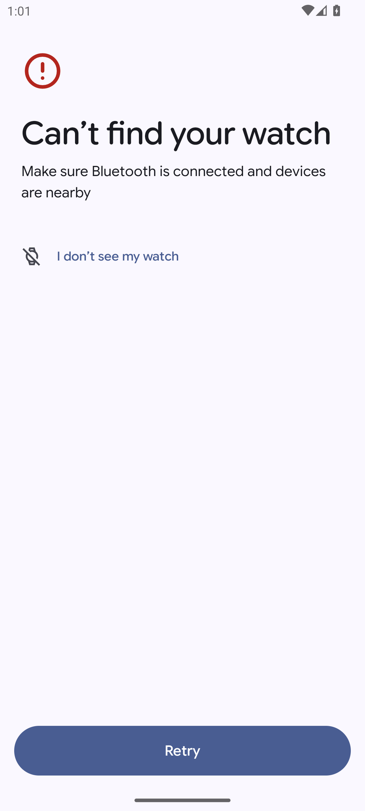

The two emulators do have emulated Bluetooth, and **shared**: a single `netsimd` serves
both processes (`Activated packet streamer for bluetooth emulation` in both logs),
and each carries a distinct address (`BB:BB:BB:00:00:0C` on the phone side, `…:00:0B` on the watch
side). Discovery returns nothing all the same. The "I don't see my watch" link opens a help article
in Chrome: dead end.

That path is indeed the one which, as the instruction sensed, asks for no account — but
it does not work.

#### The way through: `EmulatorActivity`, exported

The companion carries an activity dedicated to emulators. It is found by digging through the APK,
not by reading the interface:

```bash
strings -a classes*.dex | grep -i emulator
# → com.google.android.apps.wear.companion.EmulatorActivity
# → [EmulatorConnectionStep] Found connected emulator configuration:
# → CDM association not supported for watch emulator
```

The manifest says which of the two names is usable: the real class is `exported=false`,
but an **activity alias** exposes it.

```
E: activity     …core.application.EmulatorActivity   exported=false
E: activity-alias  com.google.android.apps.wear.companion.EmulatorActivity   exported=true
   targetActivity=…core.application.EmulatorActivity
```

```bash
# the command that opens the emulator path — it is the alias, without the internal package path
$ADB -s <phone> shell am start -n com.google.android.apps.wear.companion/.EmulatorActivity
```

It goes straight on to the GMS Wear terms of service, and the log settles the
account question:

```
wearable.TOS: [TOS] shouldShowBackupConsent(watchPeerId=null, accountName=<NULL>, …): false
```

`accountName=<NULL>`: **no Google account is asked for or used.** Acceptance is driven
by identifier, in two taps — the button is first called "More" (one has to scroll) then
"I agree", but it carries the same identifier throughout:

```bash
for i in 1 2 3; do python3 tools/banc/uictl.py <phone> tap terms_of_service_accept_button; sleep 3; done
```

#### The error that cost everything: the 5601 bridge was the wrong way round

§2 and §9 of this document prescribe `adb -s <watch> forward tcp:5601 tcp:5601`. **That is
the opposite of what is needed**, and it is the cause of the first failure:

```
WearSetup: [EmulatorConnectionStep] Connected emulator configuration not found, retrying in 3000
… eighteen times …
WearSetup: [EmulatorConnectionStep] Failed to find connected emulator configuration
WearCompanion: [EmulatorActivity] [EMULATOR_PAIRING:FAILURE] NOT FOUND
```

The measurement that puts the direction right, made by reading the socket tables of both guests
(`15E1` = 5601, `0A` = LISTEN, `01` = ESTABLISHED):

```
# phone side
0000000000000000FFFF00000100007F:15E1 …:0000 0A     <- the PHONE LISTENS
# watch side
…0F02000A:C912 …0202000A:15E1 01                     <- the WATCH DIALS 10.0.2.2:5601
```

So it is the phone that listens, and the watch that calls `10.0.2.2:5601`, that is to say the
host's loopback as seen from its network sandbox. The forward must point **at the
phone**:

```bash
$ADB -s <phone> forward tcp:5601 tcp:5601    # correct
$ADB -s <watch>   forward tcp:5601 tcp:5601    # what §2 said — ineffective
```

With the right direction, the complete chain can be observed on the host:

```
adb        127.0.0.1:5601 (LISTEN)
adb        127.0.0.1:5601->127.0.0.1:61096 (ESTABLISHED)
qemu-syst  127.0.0.1:61096->127.0.0.1:5601 (ESTABLISHED)     <- the banc_wear process
```

and pairing succeeds on the GMS side:

```
WearSetup: [EmulatorConnectionStep] ConnectionConfiguration created
WearSetup: [EmulatorConnectionStep] Found connected emulator configuration: ConnectionConfiguration[
  Name=banc_wear, Address={invalid address}, Type=2, Role=2, Enabled=true, IsConnected=true,
  PeerNodeId=74dec63b, NodeId=74dec63b, DataItemSyncEnabled=true, maxSupportedRemoteAndroidSdkVersion=35 ]
```

One defect remains, and it does not get repaired: the companion never manages to register the
watch in **its own** registry.

```
WearSetup: [EmulatorConnectionStep] No paired watch with emulator id null. Found only []
WearCompanion: [AloNotification][ActiveWatchFaceStartupListener] Paired watches size=0
```

`emulator id null`: the companion is looking for a key that the configuration does not carry —
consistent with `Address={invalid address}`, an emulator having no Bluetooth address. Relaunching
`EmulatorActivity` on a fully running bench reproduces the sequence identically.

#### What the watch keeps from it, and which survives everything

Despite that last defect, the watch registers itself as paired, and **that state is persistent**:

```bash
$ADB -s <watch> shell settings get secure device_paired          # → 1
$ADB -s <watch> shell settings list global | grep -i wear_companion
# wear_companion_app_name=Google Pixel Watch
# paired_device_os_type=1
```

And Pendulum's preflight screen stops showing the warning:

```
text="Ready"        text="Battery 100%"      text="Free space 5.2 GB"
text="Fill in the evening form on the phone: the watch will not start until it is sealed."
```

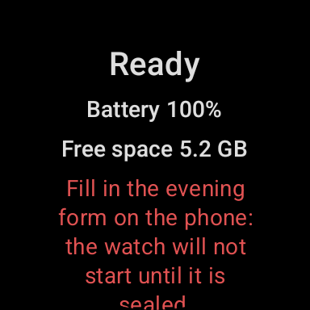

That is the reading §2 designated as decisive. **It survives the snapshot** — save on
both sides, both stopped, reload in 4 s, and the warning stays absent, without having had to
touch the interface again:

```
Successfully loaded snapshot 'banc_pret' using 1605 ms      (phone)
Successfully loaded snapshot 'banc_pret' using 1269 ms      (watch)
RELOAD_SECONDS=4
python3 tools/banc/uictl.py emulator-5576 find "Phone unreachable"   → UICTL_FAIL aucun element
```

To the letter, the question asked by this paragraph is therefore answered in the affirmative.
Except that the reading is worth nothing.

#### The false green: `connectedNodes` does not measure the link

Three falsifications, more and more brutal, all carried out after the reload:

| What is broken | What `Preflight` returns |
|---|---|
| `adb forward --remove-all` on the phone | still reachable |
| `am force-stop com.google.android.gms` on the phone | still reachable |
| **`emu kill` on the phone emulator**, then 2 min 30 of waiting | **still reachable** |
| watch restarted from cold, phone still dead | **still reachable** |

`Preflight.phoneReachable()` calls `NodeClient.connectedNodes` with a 10 s timeout and tests
`isNotEmpty()`. On Wear OS, that list is **non-empty as soon as the watch carries
`device_paired=1`**, independently of any live link. It distinguishes "a watch has already been
paired" from "no pairing has ever taken place" — which is what §2 actually measured, the emulator
having never been paired at that point — but it **does not distinguish** a reachable phone from a
phone that is switched off.

Direct consequence for the product, and it goes beyond the bench: `PHONE_UNREACHABLE` will never
appear once a watch has been paired one time, whatever the real state of the phone.
The warning is not blocking (`Preflight` says so explicitly), so nothing breaks — but it
does not warn of anything either. **This is not an emulator defect, it is a measurement defect**,
and it holds on real hardware.

#### The measurement that does not cheat: a DataItem that crosses over

So a test that demands a real byte was needed. Pendulum provides one, and it is even the best
possible one: the phone puts `/pendulum/context/<night key>` when the evening form is
sealed, the watch reads its presence through `DataClient.getDataItems`, and refuses to start
without it. No configuration can simulate that.

The phone onboarding was carried through to the end — see below, §7.4 is resolved — the context
was sealed, and the phone confirms it:

```
text="Context sealed — the watch can start recording."
```

No `PendulumContext: contexte scelle en base mais non publie vers la montre` warning
in the log: `putDataItem` returned without an exception within its 20 s timeout.

**The watch never saw it.** Tested four times, one of them over a complete and clean cycle —
both snapshots saved, both emulators stopped, restart, forward placed before the end of
the boot, 90 s of waiting, TCP chain verified as established on both sides:

```
watch : socket to 10.0.2.2:5601 = 1     host : ESTABLISHED sockets = 2
text="Fill in the evening form on the phone: the watch will not start until it is sealed."
```

The phone, symmetrically, receives nothing from the watch. Its home screen shows
`Watch — · — free`: the watch's capabilities, requested through
`CapabilityClient.getCapability(…, FILTER_REACHABLE)`, return nothing. The phone's GMS log
says it in its own vocabulary:

```
WearableService: Event[…: onConnectedCapabilityChanged, event=ConnectedCapabilityNotification<pendulum_watch_app, []>]
```


Note the diagnostic gap between the two APIs, which is the whole point: `connectedNodes` returns
the watch `banc_wear` by its name, `getCapability(FILTER_REACHABLE)` returns an empty list. The
first reads a configuration, the second tests reachability. **Only the second tells the truth.**

#### Verdict, and what it changes

| Question | Measured answer |
|---|---|
| Does the companion install on the API 34 image | **yes**, `Success`, no split |
| Does it require a Google account | **no**, through `EmulatorActivity` (`accountName=<NULL>`) |
| Does it require newer Play Services | **yes**, and the image updates them on its own in ~5 min |
| Does the pairing get registered | **yes**, `ConnectionConfiguration` + `device_paired=1` |
| Does it survive the snapshot | **yes**, reload in 4 s, nothing to redo |
| Does the Data Layer carry anything at all | **no** — no DataItem, no reachable capability |

Pairing is therefore **acquired and repeatable, and useless**. Phase 3 "transfer degradations"
has no object: one cannot exercise the state machine of a transfer that transfers nothing.
**The fallback path of §8 applies**, and for the reason it foresaw, with one detail off — it
is not the pairing that is missing, it is the payload.

> **Scope of this verdict, fixed by §11:** it holds for the emulator and for it alone. On two
> genuinely paired devices, the same item crosses over (§11.2). The cause is indeed the one this
> paragraph names — `Address={invalid address}` — and it disappears along with the emulator. Phase 3
> must be written on real hardware.

What is gained along the way, and it is not nothing: the bench's phone is now entirely
scriptable up to the sealing of the context, which unblocks all the §8 scenarios that
start from a sealed context.

#### The exact sequence, if anyone wants to redo it

```bash
SDK=~/Library/Android/sdk; export ADB=$SDK/platform-tools/adb; cd ~/builds/pendulum-banc

# 1. the two emulators, NEVER without -no-snapshot-save
$SDK/emulator/emulator -avd banc_phone34ps -no-window -no-audio -no-boot-anim -no-snapshot-save -port 5578 &
$SDK/emulator/emulator -avd banc_wear -no-window -no-audio -no-boot-anim -no-snapshot-save -snapshot banc_pret -port 5576 &

# 2. the companion, then FIVE MINUTES of network so GMS goes from 23.18.18 to 26.28.33
$ADB -s emulator-5578 install -r -g ~/builds/pendulum-banc/wear-companion.apk
$ADB -s emulator-5578 shell dumpsys package com.google.android.gms | grep versionName | head -1

# 3. the bridge — TOWARDS THE PHONE
$ADB -s emulator-5578 forward tcp:5601 tcp:5601

# 4. the screen must stay on, otherwise `input tap` runs without doing anything (§7.4)
$ADB -s emulator-5578 shell input keyevent KEYCODE_WAKEUP
$ADB -s emulator-5578 shell svc power stayon true
$ADB -s emulator-5578 shell settings put system screen_off_timeout 2147483647

# 5. the emulator path, and accepting the terms
$ADB -s emulator-5578 shell am start -n com.google.android.apps.wear.companion/.EmulatorActivity
for i in 1 2 3; do python3 tools/banc/uictl.py emulator-5578 tap terms_of_service_accept_button; sleep 3; done

# 6. observe — and read the markers, not $?
bash tools/banc/appairage.sh emulator-5578 emulator-5576
# APPAIRAGE_CHAINE montre=1 telephone=2 hote_etabli=2
# APPAIRAGE_CONFIG 1
# APPAIRAGE_DATALAYER_MUET  <- the state measured above
```

**A trap not to cross twice:** an AVD created by this `avdmanager` carries `PlayStore.enabled=no`
despite the image, because the installed `cmdline-tools` cannot read the current metadata
format:

```
Warning: This version only understands SDK XML versions up to 3 but an SDK XML file of version 4
was encountered.
Warning: package.xml parsing problem. unexpected element (uri:"", local:"abis").
```

The same defect leaves `target=android-0` in the `config.ini` — and that is what one first believes
to be the cause of §3, wrongly. Fix it by hand in `~/.android/avd/<name>.avd/config.ini`:

```bash
sed -i '' 's/^PlayStore.enabled=no/PlayStore.enabled=yes/' ~/.android/avd/banc_phone34ps.avd/config.ini
```

#### The cost, measured

| Moment | Free |
|---|---|
| Before starting, no emulator running | **13.8 GB** |
| Both emulators started, companion installed | 11.9 GB |
| After cleanup (`default_boot` of `farkle_atv`, 1.6 GB) | 13.5 GB |
| After the two `banc_pret` snapshots | 12.4 GB |
| **At the end, everything stopped, `default_boot` erased** | **11.1 GB** |

The 10 GB floor was not approached. `-no-snapshot-save` keeps its promise: the four
emulator stops of the session wrote no `default_boot` and cost nothing. The two
snapshots weigh 1085 MB (phone) and 1047 MB (watch).

Reload measured **four times: 4 s** each time, against 5 s in §5 — the order of magnitude of
§5 is confirmed on a far heavier state.

### 7.2 Can the two lost permissions be recovered

`android-35` or `android-36` in `google_apis` (neither is installed) would bring
`READ_HEALTH_DATA_IN_BACKGROUND` and `READ_HEALTH_DATA_HISTORY`. Nothing says they are
accelerated: only revision 36.1 was caught out, but it is also the only one above
API 34 to have been tried on the phone side. The test is the one in §3, in one minute — but it
costs about 2 GB of disk, and the disk is the point of tension (§6).

### 7.3 What `SleepReader` actually returns — settled on 12 August 2026

**The Health Connect read works.** It had never been exercised: the service answered, the
permission was granted, and nobody had ever done a real read. It is done, on a
real device, and the `hc_snapshot` table is being fed — so the complete path holds end to
end: `SleepReader.read` queries Health Connect over the night's window, cross-checks with
`aggregate(SLEEP_DURATION_TOTAL)`, `SleepSourceSelector` picks **one** source and one only, and the
result is written to an append-only log, protected by the SQLite trigger `hc_snapshot_no_update`.

**What that establishes, and nothing more.** The denominator has a live source, and
`AnalysisRunner.loadHypnogram` has something to read. It is the first link that was missing between
the capture and a publishable index.

**What it does not establish**, and it must be said as plainly as §12.6 does for the standby run:

- nothing about the **real latency** after waking, which is the real risk of this chain and which
  the procedure in [`SLEEP-SOURCES.md`](SLEEP-SOURCES.md) §5, step 1, is made to measure over
  three nights;
- nothing about the presence of **stages** rather than a plain duration, which is item no. 1 on the
  list of unverified points in the same document and which only a `readRecords` with its
  `distinctTypes` settles;
- nothing about **deduplication** between two sources, since only one was writing;
- nothing about `BACKGROUND_READ_UNAVAILABLE`, which is still expected on API 34 and not measured.

> **Methodological reservation, to be lifted.** This document holds from its first page that every
> statement comes from a command whose output is quoted. **This paragraph does not have its output
> yet.** It reports a read done on a real device on 12 August 2026; until the `hc_snapshot` row —
> package selected, number of stages, `distinctTypes`, coverage — is copied here, it counts as a
> finding and not as a measurement. The query that settles it fits on one line:
> `run-as com.pendulum sqlite3 databases/pendulum.db "select selectedPackage, stageCount, aggregateTstMin, outcome from hc_snapshot order by rowid desc limit 5;"`

#### The starting state, kept because it dated the ignorance

The Health Connect service answers and the permission is granted, but no read has been done —
there is nothing to read as long as phase 1's sleep writer does not exist.
`BACKGROUND_READ_UNAVAILABLE` is **expected** on API 34; that is not measured.

**Partially settled in §7.1.** Step 4 of the phone onboarding, reached for the first
time, shows `Background reading unavailable` and `Allow Health Connect first`. That is indeed the
degraded branch announced in §3, and it is confirmed by the application itself, not deduced.
What `SleepReader` returns on a real read remains unmeasured. *(Lifted on 12 August; see the top of
this paragraph.)*

### 7.4 Driving the phone onboarding — **resolved in §7.1**

**The cause was indeed the one this paragraph suspected: the sleeping screen.** The four boxes get
ticked, one by one, as soon as the phone is kept awake exactly like the watch:

```bash
$ADB -s <phone> shell input keyevent KEYCODE_WAKEUP
$ADB -s <phone> shell svc power stayon true
$ADB -s <phone> shell settings put system screen_off_timeout 2147483647
# then, after scrolling to the bottom — the boxes are not in the tree before that
python3 tools/banc/uictl.py <phone> cocher 4      # → UICTL_OK, then "4 of 4 confirmed"
```

Two details that cost an hour if one does not have them:

- `input tap` works, `input motionevent DOWN/UP` **does not work** on these Compose checkboxes;
- the bounds shift with every box ticked, so a batch of taps computed from a single dump taps
  beside the mark from the second one on. Hence the `cocher` command of `uictl.py`, which re-dumps
  between each.

The complete onboarding — five steps, evening form, sealing — is now scriptable from
end to end, and the watch's `CONTEXT_NOT_SEALED` block lifts on the phone side. It does not lift
on the watch side, but for another reason, and that is the whole of §7.1.

`uictl.py` reads the interface tree and taps correctly — the Health Connect settings screen was
opened and read, the watch's notification dialog was handled. But **the
four checkboxes of step 1 of the phone onboarding could not be ticked**:
`uiautomator` sees them (`android.widget.CheckBox`, `clickable=true`, centres at `(148,1148)`,
`(148,1318)`, `(148,1546)`, `(148,1774)`), `input tap` runs without error, and the counter stays
at `0 of 4 confirmed`. The unexplored lead is the sleep state of the screen: the watch only
responded to gestures after `input keyevent KEYCODE_WAKEUP` and `settings put system
screen_off_timeout 2147483647`. The same thing has to be tried on the phone before concluding
anything.

As long as this point is not settled, the evening context cannot be sealed by script, and
therefore the watch's `CONTEXT_NOT_SEALED` block cannot be lifted.

---

## 8. The fallback path, if pairing does not come

It consists in **testing the two halves separately** and injecting the chunks on the phone side
through `NightExporter.importBundle`. This path already exists and is not an improvised workaround:
`BundleRoundTripTest` walks it there and back and checks that "a night rebuilt from a
bundle gives exactly the same result", field by field, over the complete route generation →
chunk files → analysis → bundling → re-reading → rewriting → second analysis.

**What it keeps**, and it is the greater part of the bench's announced value:

- end-to-end algorithmic correctness, since the result obtained must equal that of the JVM
  test on the same signal;
- the phone's memory behaviour over 1.44 M samples, never put to the test;
- the display guard rails in the assembled application, on the phone side;
- everything that concerns the denominator: Health Connect, `E-HC-01` to `E-HC-03`, the
  abandonment at T+36 h, the clock-change night — these scenarios do not cross the Data Layer.

**What it loses, and it has to be named precisely:**

- **The whole transfer state machine.** The invariant "no file erased before its acknowledgement
  bit" goes back to being reasoned and not verified. The link cut in the middle of the night, the
  ceiling on items in flight, the corrupted chunk and its re-emission, the delete-then-put-again
  order imposed by the Data Layer: **nothing from agent E of phase 3** can be exercised.
- **The join between the two halves** — that is to say exactly the class of defect the bench
  exists to catch. The evening context keyed by a session that does not exist yet had
  precisely that shape: each half correct, the join impossible. Injecting a fabricated bundle
  short-circuits the join instead of putting it to the test.
- **`Preflight` and `AppairageMontre` in their nominal case.** They will only be exercised in their
  "nothing on the other side" branch, which is the only one the emulator can produce.

In other words: the fallback path keeps **correctness** and gives up **distributed
orchestration**. As distributed orchestration is half of what the plan promised, it has to be
rewritten in `docs/07-validation.md` rather than leaving people believing the bench validates the chain.

---

## 9. The commands that work, reusable as they stand

### Preparing the machine

```bash
# 1. clear the decks — without which nothing else makes sense (see §6)
ADB=~/Library/Android/sdk/platform-tools/adb
$ADB devices | grep emulator | cut -f1 | while read s; do $ADB -s "$s" emu kill; done

# 2. check that there is space AND memory left
df -Pk ~ | tail -1
top -l 1 -n 0 | grep -E "PhysMem|Load Avg"
```

### Building the APKs

```bash
rsync -az --delete --exclude '.git/' --exclude '.gradle/' --exclude '.kotlin/' \
  --exclude 'build/' --exclude '**/build/' --exclude 'local.properties' --exclude 'docs-site/' \
  /mnt/e/dev/plss/ jona@100.74.103.69:builds/pendulum-banc/

# local.properties is excluded from the rsync: it has to be recreated, once, on the Mac
ssh jona@100.74.103.69 'echo "sdk.dir=/Users/jona/Library/Android/sdk" > ~/builds/pendulum-banc/local.properties'

# and above all NO flock: the command does not exist on macOS (`flock: command not found`)
ssh jona@100.74.103.69 'bash -lc "cd ~/builds/pendulum-banc && ./gradlew --no-daemon :phone:assembleDebug :wear:assembleDebug"'
```

### Starting the pair

```bash
SDK=~/Library/Android/sdk
# ALWAYS check that no instance is already running on the same AVD: two processes on the
# same images corrupt the guest, and the symptom is unreadable — "Can't find service: package"
# on a device that is nevertheless marked `device`.
pgrep -f banc_phone34ps | wc -l   # must be 0

# -no-snapshot-save is mandatory: without it, stopping writes a ~1 GB default_boot (§6)
$SDK/emulator/emulator -avd banc_phone34ps -no-window -no-audio -no-snapshot-save \
  -snapshot banc_pret -port 5578 &
$SDK/emulator/emulator -avd banc_wear -no-window -no-audio -no-snapshot-save \
  -snapshot banc_pret -port 5576 &

# wait, by reading the marker and never `$?` — ssh over Tailscale does not propagate the codes
until [ "$($SDK/platform-tools/adb -s emulator-5578 shell getprop sys.boot_completed | tr -d '\r')" = 1 ]; do sleep 2; done
```

### Installing and granting

```bash
B=~/builds/pendulum-banc
$ADB -s emulator-5578 install -r -t $B/phone/build/outputs/apk/debug/phone-debug.apk
$ADB -s emulator-5576 install -r -t $B/wear/build/outputs/apk/debug/wear-debug.apk

$ADB -s emulator-5578 shell pm grant com.pendulum android.permission.health.READ_SLEEP
$ADB -s emulator-5578 shell pm grant com.pendulum android.permission.POST_NOTIFICATIONS
$ADB -s emulator-5576 shell pm grant com.pendulum android.permission.POST_NOTIFICATIONS
# check, because pm grant is silent both on success and when it has no effect
$ADB -s emulator-5578 shell dumpsys package com.pendulum | grep "health.READ_SLEEP: granted"
```

### Placing the 5601 bridge — towards the phone, never towards the watch

```bash
$ADB -s emulator-5576 forward --remove-all          # in case the wrong direction is lying around
$ADB -s emulator-5578 forward tcp:5601 tcp:5601     # the PHONE listens, the watch dials
$ADB forward --list
```

The forward does not survive the emulator being stopped: it has to be placed again at every start.
See §7.1 for the measurement that establishes the direction.

### Waking the watch — without which every dump is unreadable

The watch emulator switches to ambient mode and the interface ends up behind a watch face; the
screenshots show the application blurred under the time, and `uiautomator` returns only
`text="12:27"`.

```bash
$ADB -s emulator-5576 shell input keyevent KEYCODE_WAKEUP
$ADB -s emulator-5576 shell svc power stayon true
$ADB -s emulator-5576 shell settings put system screen_off_timeout 2147483647
```

**The phone needs the same three lines**, and that was the whole cause of §7.4: screen
asleep, `input tap` runs without error and ticks nothing.

### Reading a screen

`tools/banc/uictl.py` does the dump, searches by text, identifier or description, and taps at the
centre of the element. It emits `UICTL_OK` or `UICTL_FAIL` on standard output, to be read by
the remote caller.

```bash
export ADB=~/Library/Android/sdk/platform-tools/adb
U="python3 tools/banc/uictl.py emulator-5576"
$U dump                       # complete tree
$U find "Phone unreachable"   # searches and returns the bounds
$U clic                       # what is really actionable — to be used when tap fails
$U tap  "Allow"               # taps at the centre
$U wait "Ready" 60            # waits for it to appear
$U shot /tmp/screen.png        # screenshot
$U cocher 4                   # ticks the first 4 unticked boxes, re-dumping between each
```

Two lessons learned by tapping beside the mark, and encoded in the script:

- an **exact equality** of text is to be preferred, otherwise `tap "Allow"` catches the title
  "Allow Pendulum to send you notifications?", which contains the word and takes up half of
  the screen;
- in Compose, **the label of a checkbox is a distinct and non-clickable node**: tapping
  on the text ticks nothing and produces no error. Hence the `clic` command.

### Saving and reloading a state

```bash
$ADB -s emulator-5578 emu avd snapshot save banc_pret     # 2 s, ~945 MB
emulator -avd banc_phone34ps -no-window -no-audio -no-snapshot-save -snapshot banc_pret -port 5578
# 5 s to boot_completed, application and permissions intact

# and the cleanup, to be done at the end of every session: a default_boot costs ~1 GB and is useless
rm -rf ~/.android/avd/banc_phone34ps.avd/snapshots/default_boot
rm -rf ~/.android/avd/banc_wear.avd/snapshots/default_boot
```

---

## 10. What the measurements impose as architecture

1. **The bench starts from snapshots, always.** 5 s against 55 s, and a state granted once can be
   carried over. It was only the plan's emergency exit; it is in fact the only thing that
   exceeded expectations.
2. **The phone is `banc_phone34ps`**, on `android-34;google_apis_playstore;arm64-v8a`, with
   the accepted loss of the two permissions `READ_HEALTH_DATA_IN_BACKGROUND` and
   `READ_HEALTH_DATA_HISTORY`, which do not exist on API 34. The watch is `banc_wear`, on
   `android-36;android-wear-signed;arm64-v8a`. **Do not use `FarklePhonePortrait`**: its
   36.1 image does not boot.
3. **The bench starts by clearing the decks**, and refuses to start below 12 GB of free disk or
   above 1 GB of swap consumed. The repository already knew that a build bogs down without a
   message below 8 GB; this session adds that an emulator, for its part, starts without ever
   finishing — and that an emulator that stops costs 1 GB more disk.
4. **The pairing check is done on the watch's preflight screen**, not on the plan's
   `dumpsys`, which does not exist. — **Corrected in §7.1**: that screen is a false green. The
   only honest check is a DataItem that crosses over, and it does not cross. — **Confirmed and
   made precise in §11.3**: the false green holds on real hardware too, and `FILTER_REACHABLE` does
   not correct it. The only measured discriminant is `Node.isNearby`.
5. **Not a line of phase 3 "transfer degradations" is to be written** before §7.1
   is settled. If pairing does not survive the snapshot, that agent has no object. —
   **Settled in §7.1, and phase 3 has no object**: pairing survives, but the Data Layer
   carries nothing. Fallback path of §8. — **Overturned in §11.2**: on real hardware the Data Layer
   carries, phase 3 has an object again, and it is on the two devices that it must be
   written, not on the emulator.
6. **The bridge is placed on the phone**, `adb -s <phone> forward tcp:5601 tcp:5601`. §2 and
   §9 say the opposite; they are wrong (§7.1).

Phases 1 and 2 of the plan, for their part, depend on none of these unknowns: the sensor source,
time compression and the sleep writer can be written straight away.

---

## 11. On real hardware

**Measurements of 3 August 2026.** Two of the user's everyday devices, actually paired over
Bluetooth: Pixel Watch 3 (`sol`, `47201JEAYW08AF`, API 37, USB) and Pixel 10 Pro Fold (`rango`,
`5C171FDCG00089`, API 37, WiFi). ADB through the Mac, `ssh jona@100.74.103.69`.

### The verdict

**The Data Layer carries.** The item published by the phone arrives on the watch, the watch reads
it, the blocker disappears and START lights up. §7.1 was measuring an emulator defect — the missing
Bluetooth address, which it named itself — and not a product defect. **The fallback route of §8 is
no longer forced on us, and phase 3 "transfer degradations" recovers its object.**

Two corrections in the opposite direction, and they count as much as the verdict:

1. **The false green of `PHONE_UNREACHABLE` is confirmed on real hardware, and it is worse than
   §7.1 announced:** the correction the latter proposes — `CapabilityClient` with
   `FILTER_REACHABLE` — **does not fix it either**. Both readings stay non-empty with the phone's
   Bluetooth off, while nothing crosses any more. The only field that tells the truth is
   `Node.isNearby`.
2. **All the tap-driven operation of §7.4 is inapplicable here.** The user's phone is locked by a
   passcode, which an emulator never is. This bench goes through `am instrument`.

### 11.1 Installing — and the wall that was not foreseen

Both APKs come out of a single invocation, hence from the same debug keystore. The check is made
and not assumed: the fingerprints are identical, which is the Data Layer's condition.

```
$ apksigner verify --print-certs phone-debug.apk | grep "SHA-256 digest"
Signer #1 certificate SHA-256 digest: fa969b08ab4cbe182f57114f4edb6abc8d3c79a870f9dc7312a1c823f9e4fc74
$ apksigner verify --print-certs wear-debug.apk  | grep "SHA-256 digest"
Signer #1 certificate SHA-256 digest: fa969b08ab4cbe182f57114f4edb6abc8d3c79a870f9dc7312a1c823f9e4fc74
```

`BUILD SUCCESSFUL in 18s`, 79 tasks; 35 MB for the phone, 23 MB for the watch. **A version of
`com.pendulum` was already installed on both devices** — `versionCode=1`, `versionName 0.1.0`,
`DEBUGGABLE`, put there on 1 August. `install -r -t` returns `Success` on both sides: **no
`INSTALL_FAILED_UPDATE_INCOMPATIBLE`**, hence the same signature, hence nothing to uninstall.

**The wall: the phone is locked by a passcode.** It is an everyday device, and that is the
structural difference with an emulator, deeper than Bluetooth.

```
$ adb -s <phone> shell dumpsys trust
 User "Jona" (id=0, …) (current): trustState=UNTRUSTED, trustManaged=1, deviceLocked=1,
   isActiveUnlockRunning=0, strongAuthRequired=0x0
 User "BizGo! MDM" (id=10, …) (profile with unified challenge): deviceLocked=1

$ adb -s <phone> shell locksettings get-disabled     -> false
$ adb -s <phone> shell wm dismiss-keyguard           -> isKeyguardShowing=true, unchanged
$ adb -s <phone> shell am start -n com.pendulum/.phone.ui.MainActivity
Starting: Intent { cmp=com.pendulum/.phone.ui.MainActivity }
$ adb -s <phone> shell pidof com.pendulum            -> (empty: the process was not born)
```

`uiautomator dump` then returns **no node carrying any text**: the tree is the lock screen's. The
whole method of §7.4 — wake the screen, `svc power stayon true`, tap at the centre of the bounds —
assumes a device without a passcode. It does not apply.

Two side traps, both specific to real hardware:

- **The Fold corrupts `screencap`.** It carries two hardware displays, and `exec-out screencap -p`
  prefixes the stream with `[Warning] Multiple displays…`. The PNG brought back is unreadable,
  without any command having failed.
- **The work profile makes `pm list packages` fail** halfway:
  `SecurityException: Shell does not have permission to access user 10`, followed nevertheless by
  user 0's list. Read the output, not the return code.

And on the watch side, the obvious workaround is closed — `RecordingService` is `exported="false"`,
and the shell has no right to reach it:

```
$ adb -s <watch> shell am start-foreground-service -n com.pendulum/.wear.record.RecordingService \
    -a com.pendulum.wear.action.START
Error: Requires permission not exported from uid 10027
```

**The way through: `am instrument`.** The runner starts **inside** the `com.pendulum` process, with
its UID, hence with the identity GMS checks — and the lock does not concern it. The probes call the
product's code (`Preflight.check`, the same `PutDataRequest` as `EveningContextSealer.publier`)
rather than simulating it. They are in `tools/banc/BancDataLayer-{phone,wear}.kt` and are deployed
by `tools/banc/datalayer.sh`.

One deliberate detail, not to be taken for an oversight: the probe publishes the item **without**
writing the `night_context` row. That row is sealed by an SQLite trigger, hence irreversible, and
the bench has no business leaving a fabricated evening in the database of an everyday device. What
is measured here is the transport, not the form.

### 11.2 The decisive test — the one the emulator failed four times

**Starting state**, watch woken, application restarted:

```
text="Ready"   text="Battery 100%"   text="Free space 12.2 GB"
text="Fill in the evening form on the phone: the watch will not start until it is sealed."
```

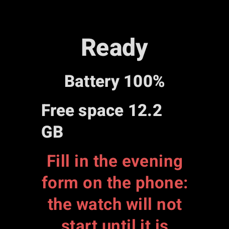

Scrolling down: `text="Open on phone"`, `text="START"`. **Nowhere `Phone unreachable`** — the watch
has been paired, so `connectedNodes` is non-empty, exactly as §7.1 describes.

**What the phone sees of the watch**, and this is already the first break with the emulator:

```
BANC_CONNECTED_NODES n=1 Pixel Watch 3/70c85ec6/nearby=true
BANC_CAP_REACHABLE   n=1 Pixel Watch 3/nearby=true
BANC_CAP_ALL         n=1 Pixel Watch 3/nearby=true
```

On the emulator, `getCapability(FILTER_REACHABLE)` returned an **empty** list
(`ConnectedCapabilityNotification<pendulum_watch_app, []>`, §7.1). Here the capability declared by
the watch APK is reachable from the phone: something has therefore already crossed.

**The publication**, by the probe, inside the phone's process:

```
BANC_CONTEXTE_PUBLIE cle=2026-08-03 uri=wear://65b7e3d/pendulum/context/2026-08-03
BANC_ITEMS n=1
BANC_ITEM  wear://65b7e3d/pendulum/context/2026-08-03 13o
```

**And what the watch makes of it**, after `force-stop` and a restart to rule out any cache:

```
text="Ready"   text="Battery 100%"   text="Free space 12.2 GB"   text="START"
```


The watch-side probe says it without going through the screen:

```
BANC_PREFLIGHT cle=2026-08-03 demarrable=true
BANC_PREFLIGHT_BLOQUEURS
BANC_PREFLIGHT_AVERTISSEMENTS
BANC_PREFLIGHT_CONTEXTE true
BANC_ITEMS n=1
BANC_ITEM  wear://65b7e3d/pendulum/context/2026-08-03 13o
BANC_CONNECTED_NODES n=1 Pixel 10 Pro Fold/65b7e3d/nearby=true
BANC_CAP_REACHABLE   n=1 Pixel 10 Pro Fold/nearby=true
```

**The proof is in the URI authority.** The item the watch reads in its own store is
`wear://65b7e3d/…`, and `65b7e3d` is the **phone's** node id — the watch is `70c85ec6`. This is not
a local item it would have laid down for itself: it is an item replicated from the other device.
Thirteen bytes, a timestamp, and the whole question of §7.1 settled the other way.

**What follows from it.** The Data Layer carries on real hardware, in both reading directions we
were able to observe: the capability announced by the watch is seen from the phone, the item
published by the phone is read by the watch. §7.1 had correctly diagnosed its own cause —
`Address={invalid address}`, an emulator having no Bluetooth address — and its conclusion does not
reach beyond the emulator.

### 11.3 The false green of `PHONE_UNREACHABLE` — confirmed, and its announced correction is not enough

The least intrusive way to cut the link is the phone's Bluetooth, left on its own screen and taken
over by `adb`:

```bash
adb -s <phone> shell settings get global bluetooth_on     # 1
adb -s <phone> shell cmd bluetooth_manager disable         # enable/disable: Success
adb -s <phone> shell settings get global bluetooth_on     # 0,  dumpsys: State: OFF
```

**Fifty seconds later, seen from the watch:**

```
BANC_CONNECTED_NODES n=1 Pixel 10 Pro Fold/65b7e3d/nearby=false
BANC_CAP_REACHABLE   n=1 Pixel 10 Pro Fold/nearby=false
BANC_PREFLIGHT demarrable=true
BANC_PREFLIGHT_AVERTISSEMENTS            <- still empty: no PHONE_UNREACHABLE
```

**And the link really is dead**, which had to be established separately rather than assumed: the
phone deletes the context item, and the watch does not see it go.

```
# phone side, Bluetooth off
BANC_CONTEXTE_RETIRE cle=2026-08-03 supprimes=1
# watch side, 45 s later
BANC_ITEMS n=1
BANC_ITEM  wear://65b7e3d/pendulum/context/2026-08-03 13o     <- the deleted item is still there
BANC_PREFLIGHT_CONTEXTE true
```

Both devices were nevertheless on the same WiFi network — phone `192.168.86.207` on `wlan0`, watch
`192.168.86.138` — and that caught nothing up within this window. With Bluetooth off, the Data
Layer no longer carries, and it is the only path observed.

**The table that sums it up, and that moves §7.1's conclusion:**

| Reading | Bluetooth on | Bluetooth off | Tells the truth |
|---|---|---|---|
| `NodeClient.connectedNodes` non-empty | yes | **yes** | no |
| `getCapability(…, FILTER_REACHABLE)` non-empty | yes | **yes** | **no** |
| `Node.isNearby` | `true` | `false` | **yes** |
| A `DataItem` crosses | yes | no | — |

§7.1 writes: "The test that really measures a link is
`CapabilityClient.getCapability(…, FILTER_REACHABLE)`". **On real hardware, this is false.** That
API filters the nodes that announce the capability, not those one can reach at that instant; it
returns the phone with `isNearby=false` instead of returning nothing. Applying the proposed
correction would have moved the defect without repairing it, and would have made it harder to find
again since the constant's name asserts the opposite.

#### The proposed correction — not applied

`Preflight.phoneReachable()` tests `nodes.isNotEmpty()`. The measurement above points to the field
that discriminates, and it is already in the object we have in hand:

```kotlin
// wear/src/main/kotlin/com/pendulum/wear/record/Preflight.kt
private fun phoneReachable(ctx: Context): Boolean = try {
    val nodes = Tasks.await(Wearable.getNodeClient(ctx).connectedNodes, 10, TimeUnit.SECONDS)
    nodes.any { it.isNearby }        // instead of nodes.isNotEmpty()
} catch (e: Exception) { false }
```

**What it costs: nothing measurable.** No extra API, no extra network call, the same 10 s timeout,
the same failure branch. `Node.isNearby` is already filled in by the response we are already
waiting for.

**What it costs anyway, and this must be said:** `isNearby` means "reachable over a proximity
transport", not "reachable". An LTE watch whose phone is only reachable through the Google relay
would see the warning displayed while synchronisation would eventually happen. That is not serious
— the warning is not blocking, it says exactly "recording carries on, sync will happen later",
which remains true — but it is a false red traded for a false green, and **it is not measured**: no
purely relayed configuration could be produced here. Medium confidence on this point, high on the
rest.

The honest alternative would be a real round trip — `MessageClient.sendMessage` to a ping path,
with a responder on the phone side. It would measure the link instead of inferring it, but it costs
a phone wake-up, a timeout to tune, and code on both sides, for a non-blocking warning. The
trade-off is not favourable; to be kept only if `isNearby` turned out to be false.

### 11.4 Health Connect on API 37

The wall of §3 — two permissions unknown to the package manager — no longer exists.

```
$ adb -s <phone> shell pm grant com.pendulum android.permission.health.READ_SLEEP
$ adb -s <phone> shell pm grant com.pendulum android.permission.health.READ_HEALTH_DATA_IN_BACKGROUND
$ adb -s <phone> shell pm grant com.pendulum android.permission.health.READ_HEALTH_DATA_HISTORY
# all three silent, hence all three accepted; check:
        android.permission.health.READ_SLEEP: granted=true
        android.permission.health.READ_HEALTH_DATA_IN_BACKGROUND: granted=true
        android.permission.health.READ_HEALTH_DATA_HISTORY: granted=true
```

On API 34 the last two returned `IllegalArgumentException: Unknown permission`. **The nominal path
of `SleepFetchWorker` is therefore exercisable on these devices**, and the degraded
`BACKGROUND_READ_UNAVAILABLE` branch that the emulator bench was condemned to walk is no longer the
only one available.

The provider is present and alive:

```
package:com.google.android.apps.healthdata
package:com.google.android.healthconnect.controller     versionName=17 versionCode=37
216  healthconnect: [android.health.connect.aidl.IHealthConnectService]
```

**What is not measured:** what `SleepReader.availability()` returns. The probe that queries it
(`BancDataLayer#sante`) was written after the last build the build machine was able to produce —
see §11.6. The three permissions are granted and
`HealthConnectFeatures.FEATURE_READ_HEALTH_DATA_IN_BACKGROUND` is the only unknown left between
this state and `READY`. We expect it, we do not assert it.

`:sleepwriter` was not installed.

### 11.5 The real transfer — the invariant holds, and ingestion is dead

> **Measured on 3 August 2026, after the migration fix of commit `6fe2a34`.** Without it, the phone
> would not open its database and nothing that follows was reachable; §11.5.1 tells that story. The
> measurement therefore bears on a product already fixed of one defect, and that is information,
> not a nuisance.

**The verdict, in two halves.**

**The invariant holds**, and it was tried on the strongest case one can build: both chunks of the
test night were **physically in the phone's store**, readable by the phone itself, and the watch
**did not erase them**. It kept them for 39 s under 250 ms sampling, then a further quarter of an
hour, then across two re-sends. It is not reception that authorises deletion, it is the
acknowledgement — and there was none.

**The other half — deletion *after* the acknowledgement — cannot be measured on this hardware**,
and the reason is a product defect: the phone ingests nothing. Both Data Layer listener services,
`PendulumListenerService` on the phone side and `AckObserver` on the watch side, protect themselves
with `android:permission="com.google.android.gms.permission.BIND_WEARABLE_LISTENER"` — **a
permission that no package defines** on these two devices. Android therefore refuses Play Services
the right to bind, at every delivery, and the only witness is a `W` line in the system log that the
application never sees. **No chunk will ever be ingested, and no acknowledgement ever applied**, as
long as that manifest line is there. §11.5.6 puts figures on it, §11.5.7 proposes the correction,
which is not applied.

#### 11.5.1 The prerequisite: the phone's database would no longer open

The first attempt did not reach the transfer. `MIGRATION_2_3` recreated the `comparable_night` view
with `CREATE VIEW … AS ${ComparableNightSql.SQL}`, and that constant starts with a line break and
twelve spaces where Room normalises the text it expects. The two strings are 3 041 and 3 054
characters long and diverge at character 34, by exactly those thirteen.
`fallbackToDestructiveMigration` being deliberately absent, the exception propagated and the
database stayed closed: **no device coming from v1 or v2 could be updated**, only a fresh install
worked, and nothing in the repository could see it — there was no migration test, and
`phone/schemas/` does not carry `1.json`.

`MigrationTest` now covers v1 → v3 and v2 → v3, laying down both databases in raw SQL rather than
through `MigrationTestHelper`, which would have needed the schema that was never exported. Both
tests fail without the `trim()` — checked, with the exact production exception — and return `OK (2
tests)` with it. The phone's real database moved to v3 at the first opening that followed:
`user_version 3`, identity `083f84b1b64d678022c610c10ec623da`, that of `3.json`.

#### 11.5.2 The scale, checked in both installed APKs

A single invocation for both modules, as time compression requires:

```bash
./gradlew --no-daemon -Ppendulum.temps.diviseur=250 \
  :wear:assembleDebug :wear:assembleDebugAndroidTest \
  :phone:assembleDebug :phone:assembleDebugAndroidTest
# BUILD SUCCESSFUL in 18s — 138 tasks
```

The same signature fingerprint on both sides as in §11.1,
`fa969b08ab4cbe182f57114f4edb6abc8d3c79a870f9dc7312a1c823f9e4fc74`. And the check that was missing:
`EchelleTemps` is a **per-module** object, fed by a Gradle property, and nothing in the code can
establish that both halves received the same value. The `BancDataLayer#echelle` probes, one on each
side, read the value compiled into the installed application:

```
# watch
BANC_ECHELLE diviseur=250 rotationChunkMs=1200 tickServiceMs=40 antiRebondChargeMs=240
             dureeMaxSessionMs=144000 delaiMinAvantHeureButoirMs=14400
# phone
BANC_ECHELLE diviseur=250 abandonLectureMs=518400 ageMaxNuitMs=201600 silenceAvantStaleMs=10800
```

#### 11.5.3 What time compression does to a real sensor: nothing comes out

This is the result nobody had anticipated, and it condemns the naive way of running the bench.

First attempt, watch declared unplugged, recording started from the screen:

```
1785748943.421 PendulumRecord: capteur=Accelerometer (wake-up) wakeUp=true reserved=3000 max=3000 mode=WAKEUP 30 s
1785748958.057 PendulumRecord: arret automatique : TIME_LIMIT
```

14.636 s, then a clean close — and **zero chunks**. 431 probe samples, all at `n=0`, on both disks.
Two durations collide, and neither of them is a defect:

| | real value | at scale 250 |
|---|---|---|
| FIFO burst latency (`maxReportLatencyUs`, `WAKEUP 30 s` mode) | 30 s | **30 s — not compressed** |
| Delay before the local cut-off time may stop | 1 h | **14.4 s** |

Burst latency is **sensor time** and hardware: `Durees` does not compress it, and its KDoc says why.
The cut-off time, for its part, is a **local time** — 10 in the morning stays 10 — but the minimum
delay that guards it does get compressed. Past 10, every bench recording therefore stops **before
the sensor has delivered its first byte**.

The coherence that `CoherenceEchelleTest` protects — compressing wall time exactly as much as
replay compresses sensor time — **only holds for `SourceSynthetique`**. With the real accelerometer
there is no replay: sensor time advances at 1×, wall time at 250×, and the factor of 250 has
nothing left to equalise. **On real hardware, the divisor does not compress the bench, it detunes
it.**

The workaround, for this session: push the cut-off time back through the user setting that already
exists, `stop_at_minutes`, raised to 1439 then returned to its absence. A trap along the way —
`SharedPreferences.apply()` is asynchronous and `am instrument` kills the process as soon as the
test ends: the setting appeared to be set and was not, and the next recording still stopped at
14.4 s. The probe writes with `commit()`.

#### 11.5.4 The measured night

Preflight screen: `Ready`, `Battery 100%`, `Free space 12.2 GB`, `START` — no blocker, no warning,
evening context sealed (`BANC_PREFLIGHT demarrable=true`).

```
1785749489030  tap START
1785749492.586 capteur=Accelerometer (wake-up) reserved=3000 mode=WAKEUP 30 s
1785749551.722 fermeture de session, raison USER
```

**59.1 s of recording, stopped by the product's own gesture** — long press on STOP then
"Confirm stopping the night". The recording screen, read just before the stop:
`1,025 samples`, `Gaps: 0`, `Mode WAKEUP 30 s`, `0.0 MB written`. One thousand and twenty-five real
accelerometer samples, a watch sitting on its dock.

**Two chunks, and no more** — this is not a setting, it is the consequence of §11.5.3: the FIFO
burst arrives in one block at 30 s, all its blocks are written within the same wall millisecond, so
the 1 200 ms rotation bound fires only once. The probe watches them come into being:

```
1785749523063  MONTRE n=1 00000:80        <- the header alone, the file exists from the 1st ms
1785749523323  MONTRE n=1 00000:6326      <- the burst written
1785749552159  MONTRE n=2 00000:6358 00001:2974   <- 00000 closed (+32 B of end marker)
1785749552416  MONTRE n=2 00000:6358 00001:3006   <- 00001 closed by finalisation
```

And the final burst publishes both of them, envelope included (metadata + file):

```
BANC_ITEM wear://70c85ec6/pendulum/chunk/090aea3009d44cbda4583bef015ca9b0/00000 6435o
BANC_ITEM wear://70c85ec6/pendulum/chunk/090aea3009d44cbda4583bef015ca9b0/00001 3083o
BANC_ITEM wear://70c85ec6/pendulum/session/090aea3009d44cbda4583bef015ca9b0    89o
```

#### 11.5.5 The invariant, measured

**The items crossed.** The list above is read **by the phone**, in its own store. The authority is
`wear://70c85ec6`, the **watch's** node id — the phone is `65b7e3d`. These are not items the phone
would have laid down for itself: they are the watch's bytes, replicated, 9 518 B in all.

**And the phone did nothing with them:**

```
BANC_DB_SESSIONS n=0
BANC_DB_CHUNKS   n=0
$ adb -s <phone> shell run-as com.pendulum ls -lR files/chunks
ls: files/chunks: No such file or directory
```

**So the watch kept everything.** That is the invariant, and it is verified where it counts:

| Moment | On the watch's disk |
|---|---|
| End of recording, final burst published | `00000:6358 00001:3006` |
| For 39 s, 155 samples at 250 ms | unchanged, byte for byte |
| 15 min later | unchanged |
| After two full re-sends | unchanged |

The chunk was **at the phone's** and the watch kept it all the same. That is exactly what
`DataLayerTransfer`'s KDoc asserts — "the watch's disk stays the source of truth until the phone's
database becomes it" — and it is no longer merely reasoned. An over-optimistic acknowledgement
would lose those bytes; the absence of any acknowledgement loses none. The failure on the phone
side costs the phone, it does not cost the night.

What is **not** measured, and this must be said just as plainly: deletion *after* the
acknowledgement. No acknowledgement could be published.

#### 11.5.6 The wall: a permission nobody defines

Play Services did try, twice, and the phone's log says so word for word:

```
W ActivityManager: Permission Denial: Accessing service com.pendulum/.phone.ingest.PendulumListenerService
    from pid=23433, uid=10155 requires com.google.android.gms.permission.BIND_WEARABLE_LISTENER
W WearableService: java.lang.SecurityException: Not allowed to bind to service
    Intent { act=com.google.android.gms.wearable.DATA_CHANGED dat=wear://70c85ec6/... }
    [Event[dataChanged, DataWearableServiceEvent(/pendulum/chunk/090aea30…/00000)],
     Event[dataChanged, DataWearableServiceEvent(/pendulum/chunk/090aea30…/00001)]]
```

Uid 10155 is Play Services, version 26.28.33. Both events carry the right paths: the delivery was
ready, the binding was refused.

**And the permission does not exist** — checked on both devices:

```
$ adb shell dumpsys package permission com.google.android.gms.permission.BIND_WEARABLE_LISTENER
(nothing)
```

No package declares it. An undefined permission can be held by nobody, so `android:permission` on
that service forbids **every** binding, including the one it was meant to authorise. It is a line
written from documentation that recent versions of Play Services have stopped honouring, and its
failure mode is silence.

**What this explains, and which had looked incoherent until now.** Everything that **queries** the
store works: the evening context of §11.2 crosses and is read, because `Preflight` calls
`DataClient.getDataItems`. Everything that depends on a **delivery** is dead: chunk ingestion,
publication of the acknowledgement, application of the acknowledgement, `/pendulum/start-request`,
`/pendulum/sweep-request`. The line is on both services, so the defect is **symmetric**: even if
the phone did publish an acknowledgement, `AckObserver` would not receive it.

**What was eliminated as a cause**, and it had to be done rather than assumed: the standby bucket.
`com.pendulum` was in `RESTRICTED` (45) on the phone — the application has never been opened there
by anyone — which throttles background service starts. It was raised to `ACTIVE` (10), the re-send
relaunched, and **the refusal is identical**. The bucket was returned to 45.

#### 11.5.7 The proposed correction — not applied

Remove the attribute, in both manifests:

```xml
<!-- phone/src/main/AndroidManifest.xml, wear/src/main/AndroidManifest.xml -->
<service android:name=".…ListenerService" android:exported="true">
    <intent-filter> … </intent-filter>
</service>
```

**What it costs, and it must not be glossed over:** the service becomes bindable by any local
application. The protection that remains is the Data Layer's own — it only carries between
applications with the same `applicationId` **and the same signature** — plus the fact that
`onDataChanged` only reads `/pendulum/` paths, checks a CRC-32 before inserting and only inserts
with `INSERT OR IGNORE`. A hostile application could nevertheless call `onDataChanged` with a
fabricated `DataEventBuffer`. High confidence on the diagnosis, **medium on this correction**: it
is the one in the current official examples, but the security trade-off deserves to be made
explicitly rather than by removing a line.

**The test that would have caught it**, and which is missing just as much as the migration one was:
an instrumented test that reads its own manifest and checks that every permission declared on a
component **exists on the device**.

```kotlin
// androidTest: a permission we require and that nobody defines forbids everything, silently.
val info = pm.getServiceInfo(ComponentName(ctx, PendulumListenerService::class.java), 0)
info.permission?.let { runCatching { pm.getPermissionInfo(it, 0) }.getOrNull() ?: fail(it) }
```

Six lines, and it holds for every exported component of the product, today and later. It is the
same lesson as `MigrationTest`: what breaks here does not break in the JVM, it breaks at runtime on
a device, in a check made by the platform.

#### 11.5.8 Redoing the measurement

```bash
bash tools/banc/datalayer.sh run wear <watch> heureButoir -e minutes 1439
bash tools/banc/transfert.sh preparer  <watch>              # dumpsys battery unplug + status 3
bash tools/banc/transfert.sh mesurer   <watch> <phone> 40 /tmp/banc/t1
bash tools/banc/transfert.sh restaurer <watch>
bash tools/banc/datalayer.sh run wear <watch> heureButoir -e minutes defaut
bash tools/banc/datalayer.sh run wear <watch> purgerBanc -e session <hex>
```

`mesurer` chains the whole timed sequence without returning to the caller — the window is shorter
than an ssh round trip — and `sonde_transfert.py` samples both disks in parallel, one thread per
device, bracketing each read with two timestamps taken on the host. The stop goes through the
product's own gesture and falls back, if that fails, on redeclaring the device as charging:
`StopConditions` then closes the night cleanly with `StopReason.CHARGING`. **One never leaves
`mesurer` with a recording still running** — that is the only real risk to somebody's device.

Three traps are encoded in it, all found by walking into them: the watch on its dock declares
itself charging and `StopConditions` cuts it off in 240 ms; the screen falls back to ambient mode
within ten seconds or so and `input tap` runs there without error and without effect, so we wake it
before **every** gesture; and `presse STOP` catches "Long press to stop", which contains the word
and is not the button, hence the strict equality `=STOP` in `uictl.py`.

### 11.6 The limits of the two sessions, not to be confused with results

**The invariant is only measured in one direction.** "Nothing is erased before the acknowledgement"
is verified, and solidly (§11.5.5). "Everything acknowledged is erased" is not, and will not be
before §11.5.7 is settled. Do not read the first as holding for the second: the second is precisely
the one where one `count++` too many would lose bytes, and it remains reasoned.

**The acknowledgement path has never been exercised**, in either session. `AckBuilder.build`,
`DataLayerTransfer.applyAck`, the re-send on a wrong CRC-32, the ceiling of 24 items in flight:
none of that has run on real hardware. What §11.5.4 shows stops at the publication.

**The time divisor did not do what was expected of it.** §11.5.3 measures that with the real sensor
it detunes the bench instead of compressing it, and that the cut-off time had to be pushed aside to
obtain a single sample. The chunk rotation figures announced at scale 250 — one chunk every
1 200 ms — **were not observed**: the FIFO burst arrives in one block and closes only one. What the
bench exercised is rotation by finalisation, not by duration.

**The check in §11.3 is incomplete.** The symmetric measurement is missing: with Bluetooth
restored, after how long does the deletion reach the watch? Bluetooth **was** restored —
`bluetooth_on=1`, `State: ON` — and the phone no longer carries the item (`BANC_ITEMS n=0`), but
the corresponding watch-side reading was lost along with the build machine. What §11.3 establishes
remains true in its useful sense — both APIs return a node while nothing crosses — and it must not
be made to say that the recovery was timed.

**The build machine is a single point of failure.** The Mac carries the SDK, the build and the only
link to the watch. Its disappearance cost §11.4 (partly) and §11.5 (entirely). The phone, for its
part, remained reachable through Windows' ADB (`192.168.86.207:37675`, discovered with
`adb mdns services`), which made it possible to restore Bluetooth and finish §11.4: **a second
route to the devices is worth maintaining**, and the watch should carry wireless debugging before
the next session.

### 11.7 The state left on the devices

**Recorded at the end of the second session**, and checked rather than assumed — every line comes
from a reading made afterwards, not from the memory of what was typed.

| | |
|---|---|
| **Pixel Watch 3** | `com.pendulum` reinstalled, same debug keystore, **and left on an ordinary build**: the `-Ppendulum.temps.diviseur=250` APK served the bench then was replaced, checked by the probe itself — `BANC_ECHELLE diviseur=1 rotationChunkMs=300000`. **`com.pendulum.test` installed**, already present before. `screen_off_timeout` **not modified**, read back at **600000**; `svc power stayon` never touched. `dumpsys battery` faked during the measurement (`unplug` + `set status 3`) then **restored by `reset`**, read back `AC powered: true, status: 5, level: 100`, that is the dock's real state. The `stop_at_minutes` setting, raised to 1439 to push the cut-off time aside, was **returned to its absence**: read back `existe=false`, the key did not exist before and no longer exists. **A 59.1 s recording was made, stopped by the product's own gesture** (`raison USER`) and verified stopped: no `RecordingService` in `dumpsys activity services`. **No chunk remains**: the two files of the test night and their sidecar were purged by `purgerBanc` (`fichiers=3 dossier_efface=true`), `files/chunks` is empty. |
| **Pixel 10 Pro Fold** | `com.pendulum` reinstalled, same keystore, **ordinary build** (`diviseur=1`). **`com.pendulum.test` installed**, already present before. **The database changed version, and that is intended**: it was in v1 and unreadable by the installed application; the migration fix of commit `6fe2a34` moved it to **v3** at the first opening, `user_version 3`, identity `083f84b1b64d678022c610c10ec623da`. It remains **empty** — `night_session` and `chunk` at zero — and no file was deleted or moved. The standby bucket, raised to `ACTIVE` to eliminate a hypothesis, is **returned to `RESTRICTED` (45)**. Health Connect and Bluetooth permissions untouched. `files/chunks` does not exist: the phone has never ingested anything (§11.5.6). |
| **Data Layer** | **Empty, checked on both sides: `BANC_ITEMS n=0`.** The evening context of 3 August was published for the measurement then withdrawn (`supprimes=1`); the two chunk items and the three session items of the test night were deleted by `purgerBanc`. The watch therefore cannot start a night of 3 August. |
| **TV** (`192.168.86.129:5555`) | never touched, in either session. It shows up `unauthorized` in `adb devices` and was ignored. |
| **Mac** (`192.168.86.161`) | `~/builds/pendulum-banc` brought up to date by `rsync`, with `local.properties`, the four APKs and the `BANC-DATALAYER` patch laid down by `datalayer.sh deploy` in `wear/build.gradle.kts` and `phone/build.gradle.kts` — **not to be committed**, it lives only in that copy. A copy of the phone's v1 database is in `/tmp/banc/pendulum.db`. No emulator started. |

**On access to the machines.** The Mac is reached with `ssh jona@192.168.86.161`, not through
Tailscale: its profile switches without warning and a Tailscale timeout does not tell "machine off"
from "wrong tailnet". And **`adb shell` consumes standard input**: in a script passed to
`ssh 'bash -ls'` as a heredoc, the first `adb shell` command swallows the whole rest of the script,
which never runs and produces no error. Every call must carry `</dev/null`. That is a quarter of an
hour lost believing in a machine that hangs up.

---

## 12. Delivery restored, a correction discarded, and the first real standby run

**Measurements of 3 August 2026, third session on the two real devices.** Pixel Watch 3
(`47201JEAYW08AF`, USB) and Pixel 10 Pro Fold (`5C171FDCG00089`, WiFi), API 37, through
`ssh jona@192.168.86.161`.

### The verdict

**Delivery is restored, and the correction adopted is not the one §11.5.7 half-proposed: it is the
only one the measurement permits.** Defining `BIND_WEARABLE_LISTENER` ourselves — as `signature`
then as `signatureOrSystem` — changes **nothing**, and for a reason nobody had checked: Play
Services does not **request** that permission. Out of 384 declared permissions, not that one. An
install-time permission is granted only to the packages that declare it, so no `protectionLevel`
repairs anything at all. Removing the attribute is the only option that works, and it is safer than
it appeared: the client library carries **its own** UID filter, on the eleven methods of its AIDL
interface, and it refuses every caller that is not GMS before `onDataChanged` is reached. Measured,
not inferred.

**The correction of §11.3 is false, and it is the measurement that says so.**
`nodes.any { it.isNearby }` produces a false red: with Bluetooth off and both devices on the same
WiFi, `isNearby` goes to `false` on both sides **and the Data Layer keeps carrying** — a published
item arrives in less than 45 s, a deletion in less than 60 s. What §11.3 read as a dead transport
was a waiting window that was too short. The correction is not applied; the false green remains,
and it is now pinned by a test that says what it is.

**The time divisor can no longer detune itself silently**: a compressed build on the real sensor
refuses to start, with a legible blocker on the bedtime screen.

**Real standby was measured for the first time** — 30 minutes, screen off, deep Doze forced,
battery declared unplugged. What it proves and what it does not prove is in §12.4, and the second
of those is the more important of the two.

---

### 12.1 `BIND_WEARABLE_LISTENER` — three options tried, only one works

The measuring probe amounts to one delivery in each direction, and it fabricates no state: the
watch lays down an item under `/pendulum/chunk/…`, the phone an item under `/pendulum/ack/…`, both
with a deliberately unreadable payload. Decoding fails, the `catch` logs, **nothing is written** —
no file, no database row, no acknowledgement. What one reads next is either the system's refusal,
or the trace of the service having run. Twenty-five seconds per variant.

#### The starting state, reproduced in both directions

```
# phone, after an item is published by the watch
W ActivityManager: Permission Denial: Accessing service com.pendulum/.phone.ingest.PendulumListenerService
    from pid=23433, uid=10155 requires com.google.android.gms.permission.BIND_WEARABLE_LISTENER
W WearableService: java.lang.SecurityException: Not allowed to bind to service

# watch, after an item is published by the phone
W ActivityManager: Permission Denial: Accessing service com.pendulum/.wear.transfer.AckObserver
    from pid=11351, uid=10098 requires com.google.android.gms.permission.BIND_WEARABLE_LISTENER
```

The defect is **symmetric**, which §11.5.6 inferred from the presence of the line in both manifests
and which is now observed on both sides.

#### (b) Defining the permission ourselves, `protectionLevel="signature"`

```xml
<permission android:name="com.google.android.gms.permission.BIND_WEARABLE_LISTENER"
            android:protectionLevel="signature" />
```

It then **exists**, which was not a given — Android accepts that an application define a permission
in another's namespace:

```
$ adb shell dumpsys package permission com.google.android.gms.permission.BIND_WEARABLE_LISTENER
  Permission [com.google.android.gms.permission.BIND_WEARABLE_LISTENER]:
    sourcePackage=com.pendulum
    uid=10437 gids=[] type=0 prot=signature
```

**And the refusal is identical, to the character, in both directions.** GMS does not hold it.

#### (b') Same definition, `protectionLevel="signatureOrSystem"`

The tooling compiles it into `prot=signature|privileged`, its modern form. GMS is indeed a
privileged system application. **The refusal is identical, in both directions.**

#### Why neither of them could work

The probe reads what the package manager knows about Play Services, from the application's process:

```
BANC_PERM_GMS demandees=384 demande_la_cible=false
```

**Play Services does not declare `<uses-permission>` on that permission.** An install-time
permission — whatever its `protectionLevel` — is granted only to the packages that request it.
`signature` fails because GMS does not have our signature *and* does not request it;
`signature|privileged` fails because GMS does not request it, the "privileged" part never getting
the chance to apply. There is no `protectionLevel` that repairs this, and there was therefore
nothing to try beyond those two.

This is the measurement §11.5.6 was missing: it established that the permission is **defined** by
nobody, which is enough to explain the refusal, but left open the idea that one could define it.
One can. It serves no purpose.

#### (a) Removing `android:permission` — and the measurement of what it costs

Both services bind and run:

```
# phone
W PendulumIngest: item ignore : /pendulum/chunk/ba0c…/00000
    at com.pendulum.phone.ingest.PendulumListenerService.onChunk(PendulumListenerService.kt:181)
    at com.pendulum.phone.ingest.PendulumListenerService.onDataChanged(PendulumListenerService.kt:85)
    at com.google.android.gms.wearable.zzw.run(com.google.android.gms:play-services-wearable@@19.0.0:2)

# watch
E PendulumAck: accuse illisible sur /pendulum/ack/ba0c…
    at com.pendulum.format.wire.Ack$Companion.decode(WireMessages.kt:288)
    at com.pendulum.wear.transfer.AckObserver.onDataChanged(AckObserver.kt:34)
```

**The attack surface, measured and not estimated.** The question asked was: can a forged `Intent`
reach `onDataChanged`? The answer has two parts, and the second reverses the trade-off.

*Binding: yes, anyone can.* `WearableListenerService.onBind` is `final` and does not check its
caller — it returns its binder to whoever presents one of seven actions, among them
`com.google.android.gms.wearable.BIND_LISTENER`. Probe run on the phone:

```
BANC_LIAISON bindService=true binder_rendu=true
```

*Getting delivery: no.* The binder returned is a library class exposing **eleven** AIDL methods, and
all eleven go through the same private check point — eleven calls for eleven methods, counted in
the bytecode of `play-services-wearable 19.0.0`. That point reads `Binder.getCallingUid()`, compares
it with Play Services' UID (`UidVerifier.isGooglePlayServicesUid`, plus the UID of the Chinese
companion `com.google.android.wearable.app.cn`), and **drops the event** otherwise. Checked by
calling it from a process that is not GMS:

```
BANC_LIAISON_METHODE zze                       <- the method that carries onDataChanged
E WearableLS: Caller is not GooglePlayServices; caller UID: 10437
BANC_LIAISON_APPEL uid=10437 exception=aucune  <- no exception: the event is thrown away
```

UID 10437 is that of `com.pendulum` on the phone; GMS's is 10155. `onDataChanged` was not reached.
And an `Intent` alone can do nothing: `WearableListenerService` does not override `onStartCommand`,
so a forged `startService` reaches no product code. The only path is binding, and binding is
filtered by the library.

**What remains as surface, and it must be named:** a local application can make Pendulum's *process
start* by binding to it. It obtains no data and injects none. The cost is a process start.

To that is added what §11.5.7 already listed, and which remains true: the Data Layer only carries
between applications with the same `applicationId` **and** the same signature, `onDataChanged` only
reads `/pendulum/` paths, checks a CRC-32 per payload and only inserts with `INSERT OR IGNORE`, and
the application does not declare the `INTERNET` permission.

**High confidence.** The security trade-off §11.5.7 asked to be made explicitly is made, and it does
not rest on "that is what the official examples do": it rests on the library's UID filter, read in
its bytecode and exercised on the device.

#### The guard rail

`PermissionsDesComposantsTest`, in both modules. It enumerates the services, receivers, activities
and providers of the **assembled** application and checks that every required permission exists on
the device. Red first, verified: the offending line put back in the phone's manifest alone, rebuilt,
reinstalled,

```
java.lang.AssertionError: Permissions exigees par un composant et absentes de l'appareil — la
liaison est alors refusee en silence :
service com.pendulum.phone.ingest.PendulumListenerService exige
com.google.android.gms.permission.BIND_WEARABLE_LISTENER, qu'aucun paquet ne definit sur cet appareil
FAILURES!!!
```

and green with the correction, `OK (1 test)`, **on both real devices**. The four other permissions
declared by components of the product all exist:

```
BANC_PERM_COMPOSANT androidx.work.impl.background.systemjob.SystemJobService
    exige=android.permission.BIND_JOB_SERVICE definie_sur_l_appareil=true
BANC_PERM_COMPOSANT androidx.work.impl.diagnostics.DiagnosticsReceiver
    exige=android.permission.DUMP definie_sur_l_appareil=true
BANC_PERM_COMPOSANT androidx.profileinstaller.ProfileInstallReceiver
    exige=android.permission.DUMP definie_sur_l_appareil=true
BANC_PERM_COMPOSANT com.pendulum.phone.ViewPermissionUsageActivity
    exige=android.permission.START_VIEW_PERMISSION_USAGE definie_sur_l_appareil=true
```

The `:phone` test runs **on every push**, in the CI's `instrumented-tests` job which already runs
`:phone:connectedDebugAndroidTest` on an API 34 emulator. The `:wear` one has no emulator in CI —
the watch image would refuse the phone APK and the reverse — and is launched by hand with
`./gradlew :wear:connectedDebugAndroidTest`. It is an accepted gap: the offending line was in both
manifests, the guard rail must exist on both sides even if only one is automated.

Along the way, the `:wear` module now has a **version-controlled** `androidTest` source set. It had
none: `datalayer.sh` fabricated one on the fly, modifying `wear/build.gradle.kts` with a patch
carrying the note "not to be committed" — that is, an instruction only an attentive human applies,
and which the repository did in fact carry for a whole session (§11.7). The patch no longer exists;
the four `androidTestImplementation` dependencies it laid down are declared, where they cost
nothing.

---

### 12.2 `PHONE_UNREACHABLE` — the proposed correction is false, measured

§11.3 proposed `nodes.any { it.isNearby }` with an explicit reservation: false red possible in an
LTE or relay configuration, not measured. **The reservation is lifted, and it carries the correction
away with it.**

#### The case produced

The phone's Bluetooth switched off with `cmd bluetooth_manager disable`, both devices on the same
WiFi network — phone `192.168.86.207/24`, watch `192.168.86.138/24` — the state of the radios read
back at each step and not assumed.

| Instant | Radios | `connectedNodes` | `FILTER_REACHABLE` | `isNearby` | The watch's store |
|---|---|---|---|---|---|
| T0 | everything on | 1 node | 1 node | **true** | empty, checked on both sides |
| T0+60 s | phone BT off | 1 node | 1 node | **false** | — |
| publication by the phone | phone BT off | — | — | **false** | — |
| T+45 s | phone BT off | 1 node | 1 node | **false** | **`wear://65b7e3d/pendulum/context/2026-08-03` 13 B** |
| T+135 s | phone BT off | 1 node | 1 node | **false** | the item is still there |
| Bluetooth restored | everything on | 1 node | 1 node | **true** | the item is there |

The URI authority is `65b7e3d`, the **phone's** node id. It really is an item replicated from the
other device, published while `isNearby` was `false` on both sides.

The symmetric check was done on the second pass, watch Bluetooth off and phone Bluetooth back on,
both still on WiFi: a **deletion** issued by the phone reaches the watch in less than 60 s,
`BANC_ITEMS n=0`, with `isNearby=false`.

#### What this corrects in §11.3

§11.3 concluded "the link really is dead" from the observation that a deletion had not reached the
watch within 45 s. **That is a window that is too short, not a dead link.** The Data Layer switches
over to WiFi, and `isNearby` — which means "reachable over a proximity transport" — no longer
describes that transport. Applying `nodes.any { it.isNearby }` would display "Phone unreachable"
while synchronisation is happening. That is exactly the false red §11.3 feared without being able
to produce it.

#### The third candidate, and why it does not settle it either

`MessageClient.sendMessage` is the only Data Layer API that **fails** when the node is not
reachable, where `putDataItem` buffers and hands back control. Measured on a path that no filter on
the phone declares — hence without side effects:

```
all on                 BANC_J_MSG 65b7e3d ok=true ms=12
phone BT off           BANC_J_MSG 65b7e3d ok=true ms=11
watch BT off           BANC_J_MSG 65b7e3d ok=true ms=11
all restored           BANC_J_MSG 65b7e3d ok=true ms=8
```

Eight to thirteen milliseconds: this is not a round trip, it is a local acceptance. And above all,
**no genuinely unreachable state could be produced** — cutting the phone's WiFi would cut the `adb`
link used to measure, and `svc wifi disable` on the watch did not take effect (`wifi_on` read back
at 1). Nothing says `sendMessage` would fail when it needed to. One does not replace one predicate
by another on a hunch.

#### What is applied

**Nothing functional, and that is the result.** `Preflight.phoneReachable` keeps `isNotEmpty()`.
What changes is testability and honesty: the predicate is extracted from its GMS call, and
`PreflightJoignabiliteTest` pins the four cases, including the two that lie, with the measurement
alongside. The day somebody applies `isNearby`, a test fails and tells them why.

**The false green that remains.** On the emulator, with the phone emulator killed, `connectedNodes`
still returns a node (§7.1): `PHONE_UNREACHABLE` never appears. **On real hardware, that false green
has never been reproduced** — every state produced this session was a state where the phone was in
fact reachable, and where `isNotEmpty()` therefore told the truth. What is missing to settle it is a
phone genuinely switched off, or a watch out of range of its WiFi: both require a human gesture,
neither can be automated from WSL.

---

### 12.3 The time divisor can no longer detune itself silently

§11.5.3 measures that a build at `-Ppendulum.temps.diviseur=250` launched on the real sensor stops
after 14.636 s with zero chunks, without signalling anything. The cause is a collision of two
durations, neither of which is a defect: the FIFO burst latency is 30 s of sensor time, hardware and
not compressible, while the cut-off time's guard delay drops from 1 h to 14.4 s. The recording dies
before the first byte.

**The guard rail refuses to start** rather than neutralising the divisor at runtime. Neutralising
would amount to running a build that is not the one you think you are launching, and
`Durees.ACTIVES` is a catalogue built once and for all from a compiled value: there is no honest
place to correct it. Refusing says what to do.

The predicate is `diviseur != 1 && !sourceSynthetique`, and it is placed in `RecordingService`
**after** `FabriqueSource.creer` — it is that function which transcribes the intent's extras into
the preference, so the source is only known from there on. The refusal is recorded like that of the
foreground service: a preference that the next preflight turns into a legible blocker. A recording
that stops by itself after fourteen seconds tells nobody anything; a blocker on the bedtime screen
says `Bench build: wall time is divided by 250, but the real sensor is not.`

`FabriqueSource.sourceSynthetiqueActive` exists in both source sets, like the rest of the family:
the release variant returns `false` without reading anything, and compiles the condition there into
a dead branch — `EchelleTemps.DIVISEUR` is 1 there by construction, so the guard rail exists only
where it can be of use.

Two tests, both JVM, both in CI jobs that already run:

- `GardeEchelleTest` covers the four combinations and checks that the refusal does not depend on the
  divisor's value — a guard rail that knew only 250 would let 600 through;
- `CoherenceEchelleTest` gains an **inverted** assertion that writes the reason in figures: at
  replay scale, the compressed guard delay is 14 400 ms and the FIFO burst 30 000 ms, so the first
  is shorter than the second. The day it fails, it is not the test that needs adjusting, it is that
  the guard rail's reason for existing has changed.

---

### 12.4 Real standby, measured for the first time

**32 minutes, screen off, deep Doze forced, watch on its dock.** This is the product's reason for
existing, and nothing had ever verified it: the `SourceCapteur` seam explicitly says that a bench on
a synthetic source "brings P1 no closer by a single step", and `01-overview.md` §3 justifies the
choice of a `health` foreground service — rather than `dataSync`, capped at six hours per
twenty-four — precisely on that standby.

#### What was put in place, and what could not be

| | |
|---|---|
| Screen | **off**, `input keyevent KEYCODE_SLEEP`, read back `mWakefulness=Dozing` at the six five-minute steps. Never woken during the measurement. |
| Doze | **forced**, `dumpsys deviceidle force-idle` → `Now forced in to deep idle mode`, read back `deep=IDLE` and `light=OVERRIDE` at the six steps. |
| Battery | `dumpsys battery unplug` + `set status 3`, read back `AC powered: false, status: 3`. **But the device stayed physically on its dock**: the dock is its only USB link, and there is nobody to take it off. |
| Evening context | published by the phone, read by the watch: `BANC_PREFLIGHT demarrable=true`, **no blocker, no warning**. |
| Start | by the product's own gesture, tap on START. Preflight screen: `Ready`, `Battery 100%`, `Free space 12.2 GB`, `START`. |

**The battery is therefore not measured, and could not be.** A watch declared unplugged but
physically charging stays at 100 %: `level: 100` at the six steps, and `Discharge: 0 mAh` in
`batterystats` both before and after. P1's battery criterion is out of this bench's reach as long as
nobody takes the watch off its dock — and on that day, the watch will have to carry wireless
debugging, failing which it will also drop out of `adb`'s reach (§11.6).

#### The night

```
1785759009.654  PendulumRecord: capteur=Accelerometer (wake-up) wakeUp=true reserved=3000 max=3000 mode=WAKEUP 30 s
1785760932.880  PendulumRecord: arret automatique : CHARGING
1785760932.881  PendulumRecord: fermeture de session, raison CHARGING
```

Session `d663461f29234d38ab87754c5763c2ce`, **1 923 267 ms, that is 32 min 03 s**, time zone
`Asia/Tokyo`. The stop is not the one aimed for: the STOP gesture was not found on the screen after
half an hour of deep Doze (`VEILLE_GESTE_FAIL presse =STOP`), and the bench's fallback redeclared
the watch as charging. `StopConditions` closed the night cleanly, `StopReason.CHARGING`, current
file closed and final burst emitted. It is a product path and not a `kill` — but it is a fallback
stop, and it must be read as such.

**The watch's complete log is ten lines long.** That is the result, before even the figures:

- **one** sensor line, at start-up;
- **seven** acknowledgement lines;
- **two** closing lines.

No degradation from `GapMonitor`, no step change, **no wake lock taken**. No `onTimeout`, no
watchdog restart, no deferred burst. And the PID is the same from beginning to end, `26805`: **the
service was not killed once**, so there was neither a resume nor a marked gap.

#### The chunks, and the sample coverage

Seven chunks, all complete, all ingested, all CRC-32 checked by the phone:

| idx | bytes | samples | received by the phone |
|---|---|---|---|
| 0 | 88 148 | 14 518 | 1785759946.542 |
| 1 | 91 096 | 15 004 | 1785759947.532 |
| 2 | 91 096 | 15 004 | 1785759948.402 |
| 3 | 91 084 | 15 002 | 1785760851.701 |
| 4 | 91 128 | 15 004 | 1785760852.640 |
| 5 | 91 116 | 15 002 | 1785760853.534 |
| 6 | 30 240 | 4 968 | 1785760933.798 |

**94 502 samples** in total. The nominal rate is 50 Hz, the session lasts 1 923 267 ms, so 96 163
samples were expected:

> **Sample coverage: 94 502 / 96 163 = 98.27 %.**

**1 661 samples are missing, that is 33.2 s** — and that gap is not spread out, it is at the two
edges. Chunk 0 carries only 14 518 samples where a full chunk carries 15 004: 290.4 s of sensor time
for 300 s of wall time, that is **9.6 s lost at start-up**, between the creation of the session
marker and the first sample delivered. The **remaining 23.6 s** are at the close, and they amount to
less than one FIFO burst — the report latency is 30 s, and what is still in the queue at the moment
of the `unregisterListener` does not always come back out.

It is a **fixed edge cost**, not a rate. Over an eight-hour night it would be 33.2 s out of
28 800 s, that is 0.115 %, and coverage would be **99.88 %** — above the 99 % threshold. Over
32 minutes it is 1.73 %, and it makes the criterion fail. **That is the most important limit of this
measurement**, and it plays in the favourable direction: a short night is *harder* to pass than a
long one, which means that 98.27 % over 32 minutes is not a coverage failure, it is a night too
short for the criterion to have any meaning.

**The calculation above is done by the bench, on the phone's `chunk` table, and not by the
product.** §12.5 says why.

Rotation, for its part, is at last observed as the code announces it: 15 004 samples at 50 Hz make
300.08 s, so it is the 300 000 ms of `WireProtocol.CHUNK_ROTATION_MS` that close the chunks, and
they come out at 98.8 % of the byte ceiling (91 096 out of 92 160). This is exactly the property
`CoherenceEchelleTest` protects with an inverted assertion, and §11.6 noted that it had never been
observed: only rotation by finalisation had been.

#### The bursts did go out during standby

Three bursts, at the instants the code plans for them — one every three closed chunks, plus the
final burst:

| Burst | Instant | Content | Watch state |
|---|---|---|---|
| 1 | T+15.6 min | chunks 0, 1, 2 | **`deep=IDLE`, screen `Dozing`** |
| 2 | T+30.7 min | chunks 3, 4, 5 | **`deep=IDLE`, screen `Dozing`** |
| 3 | at the close | chunk 6 | Doze released |

**Forced deep Doze prevented nothing**, neither in the watch → phone direction nor on the way back:
all seven acknowledgements arrived, six of them while the watch was in `deep=IDLE`.

---

### 12.5 The invariant, the other half — measured

§11.5.5 had verified the direction that protects the data: nothing is erased before the
acknowledgement. The reverse direction — **what is acknowledged is erased** — had remained
reasoned, and it is the one where one `count++` too many would lose bytes.

The acknowledgement published by the phone, decoded by the watch-side probe:

```
BANC_ACK_ITEM wear://65b7e3d/pendulum/ack/d663461f… ackedUpTo=7 base=7 bitmap=0o resend=[]
              phoneMs=1785760933804 acquittes=[0, 1, 2, 3, 4, 5, 6]
```

Seven indices acknowledged, no re-send requested. And the watch's log carries seven releases, one
per acknowledgement:

| Chunk received by the phone | File released on the watch | Gap |
|---|---|---|
| 1785759946.542 | 1785759946.930 | 388 ms |
| 1785759947.532 | 1785759947.601 | 69 ms |
| 1785759948.402 | 1785759948.567 | 165 ms |
| 1785760851.701 | 1785760851.863 | 162 ms |
| 1785760852.640 | 1785760852.690 | 50 ms |
| 1785760853.534 | 1785760853.591 | 57 ms |
| 1785760933.798 | 1785760933.998 | 200 ms |

The two columns come from two different clocks — the phone's for reception, the watch's for release
— and the gap of 50 to 388 ms must therefore not be read as an exact latency. The **order**, on the
other hand, does not depend on the clocks: `publishAck` is only called after the file is written and
the row inserted, and `applyAck` only erases a file if `isAcked(idx)`. The timestamps corroborate a
causality the code imposes.

**And the final state is the one expected, on both sides:**

```
# watch
BANC_CHUNKS_RACINE /data/user/0/com.pendulum/files/chunks existe=true     <- and no subfolder

# phone
BANC_DB_SESSIONS n=1   BANC_DB_CHUNKS n=7
files/chunks/d663461f…/00000.pendulum … 00006.pendulum   88148 … 30240 bytes
```

The watch's disk is empty, the phone's carries the seven files, the database carries the seven rows.
**The protocol's central invariant is verified in both directions**, on a real night, to the
millisecond of the seven transitions. That is the result the two previous sessions had not been able
to obtain.

#### The P1 gate, on its first real use — and the defect it reveals

```
BANC_P1_NUIT hex=d663461f… soiree=2026-08-03 verdict=NON_CONFORME
BANC_P1_CRITERE Signal coverage        valeur=0.0%              seuil=at least 99.0%     etat=NON_CONFORME
BANC_P1_CRITERE Battery at end of night valeur=100%  ·  0 h 32  seuil=above 20% at 8 h   etat=INDETERMINE
BANC_P1_CRITERE Measured frequency     valeur=—                 seuil=50 Hz ± 5.0%       etat=INDETERMINE
BANC_P1_CAMPAGNE examinees=1 conformes=0 serieMax=0 franchie=false
```

The CSV export comes out at 959 bytes, header of thresholds and limits included, and its row says
`sample_count=0, expected_samples=96163, coverage=0.00000, coverage_state=NON_CONFORME`.

**Both `INDETERMINE`s are right** and do exactly what their KDoc promises: a 32-minute night says
nothing about the battery at eight hours, and the rate was not measured.

**The `0.0%` is false, and it is a product defect.** `night_session.sampleCount` is 0 because
**`AnalyzeWorker` did not run** — `analyzedAtMs=null` fifty minutes after the night closed.
`Controles.couverture` then divides 0 by 96 163 and returns `0.0`, which `couvertureTenue` judges
`false`. An **unanalysed** night is therefore reported as "outside P1" instead of "not decidable",
and that is precisely the mistake the three states of `PorteP1.Conformite` exist to avoid:
"INDETERMINE is not a convenience", says its KDoc. The coverage criterion misses it.

*Proposed correction, not applied*: `Controles.couverture` must return `null` — and not `0.0` — as
long as the night has no analysis, that is as long as `analyzedAtMs` is null. The only caller whose
behaviour changes is this one, and it will return `INDETERMINE`, which is the truth. High confidence
on the diagnosis, high on the correction; it is not done here because it falls outside this
session's scope and deserves its own test on the boundaries.

**Why the analysis did not run**, measured and not assumed: the work is indeed enqueued
(`JOB #AnalyzeWorker#@androidx.work.systemjobscheduler@com.pendulum` visible in
`dumpsys jobscheduler`, with no charging or network constraint), but the process is frozen —
`ActivityManager: freezing 4063 com.pendulum` forty seconds after being woken — and the application
is in the standby bucket **`RESTRICTED` (45)**, where it lands because nobody has ever opened it.
Which is exactly the use case the product describes: the phone receives the chunks at night, with
the application closed.

Two attempts at forcing it failed and are noted as such: raising the bucket to `ACTIVE` for six
minutes was not enough, and `cmd jobscheduler run -f com.pendulum <id>` does not find the jobs (the
identifiers read in `dumpsys` are WorkManager's, not the `JobScheduler`'s). The bucket was
**returned to 45**, read back.

**What that means for the product**, and it is not necessarily a defect: ingestion is immediate
because it is carried by a service GMS starts; the analysis, for its part, is deferred work, and on
a phone where the application is never opened, it waits on the system's good will. A night analysed
three hours later is still a night analysed. What is a defect, on the other hand, is that the
measurement screen displays "outside P1" during that wait.

---

### 12.6 What this session proves, and what it does not prove

**What is established.**

- Data Layer delivery works in both directions, on real hardware, and the cause of the blockage is
  understood down to its root — Play Services does not request the permission we were requiring of
  it.
- The transfer invariant is verified **in both directions** on a real night.
- The complete chain — preflight, capture, rotation, burst, ingestion, CRC-32 check, acknowledgement,
  deletion — ran end to end without a single intervention between the START and the stop.
- The `health` foreground service survived 32 minutes of forced deep Doze, screen off, without being
  killed, without a wake lock, without degradation.

**What is not proved, and it must be said just as plainly.**

- **This is not P1.** P1 requires **three consecutive eight-hour nights**. This measurement is
  32 minutes, once. It passes no criterion and only comes close to one.
- **The battery is not measured at all**, and cannot be as long as the watch is on its dock. It is
  P1's most discriminating criterion and the one about which nothing is known.
- **The 98.27 % coverage is not a night's coverage.** It is dominated by a 33 s edge cost that would
  become negligible over eight hours. What this measurement establishes is that **there is no
  proportional loss** — no gap during the 32 minutes — and not that the 99 % threshold is met.
- **The watch was on its dock, not on a wrist.** The sensor measured a motionless object. Nothing
  that touches movement, the off-body detector or wake detection was exercised.
- **Thirty-two minutes say nothing about eight hours.** `dataSync`'s cap of six hours per
  twenty-four — the very reason `health` was chosen — is crossed at the sixth hour: this measurement
  stops an order of magnitude before that. What it establishes is more modest and is worth something
  all the same: **if the service died within thirty minutes of standby, we would know, and it does
  not die.**
- **The watchdog was not exercised.** It had nothing to resume.
- **The false green of `PHONE_UNREACHABLE` is still not reproduced on real hardware** (§12.2).

**What remains to be obtained for P1**, in the order of what it costs:

1. **The watch on a wrist and off its dock**, for a whole night. It is the only measurement that
   makes the battery criterion reachable, and it requires a human gesture. It also requires wireless
   debugging on the watch, otherwise the night drops out of `adb`'s reach.
2. **Three nights in a row**, the gate counting consecutive evenings and not successful nights.
3. **That `AnalyzeWorker` runs**, without which the P1 report will say nothing true — and the
   correction of §12.5 so that, as long as it has not run, it says "not decidable" rather than
   "outside P1".
4. A coverage computed over the whole night, where the 33 s edge cost falls to 0.115 %.

---

### 12.7 The state left on the devices

Every line comes from a reading made afterwards, not from the memory of what was typed.

| | |
|---|---|
| **Pixel Watch 3** | `com.pendulum` reinstalled, debug keystore, **ordinary build** (no `-Ppendulum.temps.diviseur`). `com.pendulum.test` reinstalled, already present before. `dumpsys battery` faked during the measurement then **restored by `reset`**, read back `AC powered: true, status: 5, level: 100`. `deviceidle` **restored**: `deep=ACTIVE`, `light=ACTIVE`. `screen_off_timeout` **not modified**, read back at **600000**. Bluetooth switched off then back on during §12.2, read back `bluetooth_on=1`; WiFi never modified, read back `wifi_on=1`, `192.168.86.138/24`. **A 32 min 03 s recording was made and verified stopped**: no `RecordingService` in `dumpsys activity services`. The seven files of the night were erased **by the protocol itself**, on acknowledgement, and the session folder was purged. The preferences carry `fgs_refused=false` and `echelle_desaccordee=false` — the second is written by the guard rail of §12.3, which therefore did run and let it through; `stop_at_minutes` remains **absent**. |
| **Pixel 10 Pro Fold** | `com.pendulum` and `com.pendulum.test` reinstalled, same keystore. The database stays at **v3**. The test night — one `night_session` row, seven `chunk` rows, seven files — was **purged**: it would have counted as a night outside P1 in the campaign, which is false and would have been visible on screen. The standby bucket, raised to `ACTIVE` to try to trigger the analysis, is **returned to `RESTRICTED` (45)**. Bluetooth switched off then back on during §12.2, read back `bluetooth_on=1`. The P1 gate's CSV file written by the probe into private storage was brought back then **erased**. |
| **Data Layer** | **Empty, checked on both sides.** The evening context, the seven chunk items, the session item, the live preview and the acknowledgement have all been withdrawn. `purgerBanc` was extended to cover the live preview and the acknowledgement, which the protocol never withdraws by itself. |
| **TV** (`192.168.86.129:5555`) | never touched. It shows up `unauthorized` in `adb devices` and was ignored. |
| **Mac** (`192.168.86.161`) | `~/builds/pendulum-banc` brought up to date by `rsync`. **No build patch left that must not be committed**: `datalayer.sh` no longer modifies the Gradle files (§12.1). The probes dropped into the `androidTest` source sets are now ignored by `.gitignore`. No emulator started. |

#### Redoing the measurements

```bash
# 12.1 — binding of the two listener services, in both directions, without fabricating state
bash tools/banc/datalayer.sh run wear  <watch>    livrerSonde
bash tools/banc/datalayer.sh run phone <phone> livrerSonde
bash tools/banc/datalayer.sh run phone <phone> permissionsDesComposants
bash tools/banc/datalayer.sh run phone <phone> surfaceDeLiaison
bash tools/banc/datalayer.sh run wear  <watch>    retirerSonde
bash tools/banc/datalayer.sh run phone <phone> retirerSonde

# 12.2 — the phoneReachable candidates, side by side
adb -s <phone> shell cmd bluetooth_manager disable
bash tools/banc/datalayer.sh run wear <watch> joignabilite
adb -s <phone> shell cmd bluetooth_manager enable    # without fail, and read bluetooth_on back

# 12.4 — standby, whose sequence is that of tools/banc/transfert.sh to within three lines
bash tools/banc/transfert.sh preparer <watch>           # dumpsys battery unplug + status 3
#   tap START, then:
adb -s <watch> shell input keyevent KEYCODE_SLEEP
adb -s <watch> shell dumpsys deviceidle force-idle
adb -s <watch> shell dumpsys deviceidle get deep        # must return IDLE
#   ... the duration ...
adb -s <watch> shell dumpsys deviceidle unforce
bash tools/banc/transfert.sh restaurer <watch>

# 12.5 — the P1 gate verdict and its export, computed by the product's code
bash tools/banc/datalayer.sh run phone <phone> porteP1
adb -s <phone> shell run-as com.pendulum cat files/banc-porte-p1.csv
```

---

## 13. The state left on the Mac

> **Updated on 3 August 2026 after §7.1.** Both `banc_pret` snapshots were rewritten over the paired
> state, and that is the recommended state — it avoids having to redo the companion installation,
> the wait for the GMS update and the acceptance of the terms.
>
> | | |
> |---|---|
> | `banc_phone34ps` / `banc_pret` | **1085 MB.** GMS 26.28.33, companion installed and paired (`ConnectionConfiguration Name=banc_wear`), Pendulum installed, `READ_SLEEP` and `POST_NOTIFICATIONS` granted, **five-step onboarding completed**, evening context sealed for the night of 3 August, Chrome disabled (its first launch was stealing the foreground). |
> | `banc_wear` / `banc_pret` | **1047 MB.** `device_paired=1`, Pendulum installed, `POST_NOTIFICATIONS` granted. |
> | Emulators running | **none.** |
> | Free disk | **11.1 GB.** |
> | Cleanup done on other projects | `farkle_atv`'s `default_boot` (1.6 GB) deleted to stay under the floor. The AVDs are intact, they will restart cold. |
>
> Restarting from a paired bench, in 5 seconds:
>
> ```bash
> SDK=~/Library/Android/sdk; export ADB=$SDK/platform-tools/adb
> $SDK/emulator/emulator -avd banc_phone34ps -no-window -no-audio -no-boot-anim \
>   -no-snapshot-save -snapshot banc_pret -port 5578 &
> $SDK/emulator/emulator -avd banc_wear -no-window -no-audio -no-boot-anim \
>   -no-snapshot-save -snapshot banc_pret -port 5576 &
> until [ "$($ADB -s emulator-5578 shell getprop sys.boot_completed | tr -d '\r')" = 1 ]; do sleep 1; done
> $ADB -s emulator-5578 forward tcp:5601 tcp:5601      # TO THE PHONE (§7.1)
> ```

| | |
|---|---|
| `banc_phone34ps` | phone AVD, `android-34;google_apis_playstore;arm64-v8a`, `PlayStore.enabled=yes` fixed by hand. Ready to start, no snapshot yet, no Google account. |
| `banc_wear` | watch AVD, `android-36;android-wear-signed;arm64-v8a`. Snapshot `banc_pret` (886 MB) with Pendulum installed and `POST_NOTIFICATIONS` granted. |
| `banc_phone34` | **deleted** after the session to give back disk; it is the one used for the measurements of §2 and §4, on `android-34;google_apis`. Recreated with a single command (§2). |
| `~/builds/pendulum-banc` | copy of the repository with `local.properties` filled in, the two debug APKs built, and `tools/banc/`. |
| `system-images/android-34/google_apis_playstore` | downloaded during this session, ~2 GB. |
| Emulators running | none. |

Three emulators from other projects were stopped at the start of the session (`pend_wear`,
`FarkleShot34`, `MdmTest`), and two more along the way (`farkle_wear_small_round`,
`takotv_atv`), because the machine had only 93 MB of free RAM left. Their AVDs are intact;
only the processes were stopped cleanly with `adb emu kill`.

---

## 14. Screen review on real hardware — the theme, and what else the screenshots showed

**4 August 2026.** Pixel 10 Pro Fold (`rango`, cover screen, display `4619827677550801153`) and
Pixel Watch 3 (`sol`), driven from the Mac. Debug build of the
`app-honnete-premier-lancement` branch.

### 14.1 The defect, and its measured cause

The first-launch warning screen — the one carrying "this is not a medical device", made
unavoidable by a blocking scroll and four acknowledgements — was illegible.

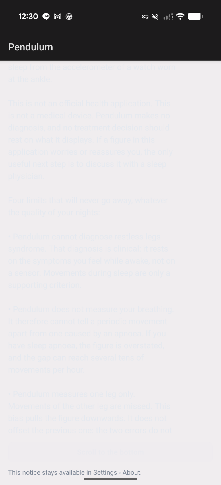

The cause is neither the palette nor `PendulumScreen`. **The `:phone` module declared no
`android:theme`.** Without that attribute, Android does not apply a neutral theme: `selectDefaultTheme`
picks `Theme.DeviceDefault.Light.DarkActionBar` as soon as `targetSdk` goes past 17. The name describes
exactly what was on screen — **light** window background, **dark** action bar.

Three measurements, in this order:

| Measurement | Command | Result |
|---|---|---|
| The installed manifest carries no theme | `aapt2 dump xmltree --file AndroidManifest.xml base.apk` | the `application` element has `label`, `icon`, `name`, `debuggable`, `allowBackup`, `supportsRtl`, `extractNativeLibs`, `fullBackupContent`, `roundIcon`, `appComponentFactory`, `dataExtractionRules` — **and no `theme`** |
| The background actually displayed | sampling of the screenshot | `#F0EDEF` on the content area, `#1C1B1C` on the title bar |
| The text contrast | `#E6EAF0` (`PendulumColors.Dark.textPrimary`) on `#F0EDEF` | **1.06:1** |

Compose paints no background of its own. Everywhere the composition painted one by accident — the
`Scaffold` of `PendulumNavHost`, whose `containerColor` is `colorScheme.background` — the window's
light background was covered over and the defect invisible. The first-launch onboarding is a plain
`Column` without a `Scaffold`: it is the only place where the window stayed visible.

**And that is also why the title bar looked right: it was not ours.** No composable of the product
draws a `TopAppBar` carrying "Pendulum". It was the framework's action bar, and the name of the
default theme announces that it is dark.

The `:wear` module, for its part, had always declared its theme (`Theme.Pendulum`, `windowBackground`
set to `@android:color/black`), and its Compose palette sets `background = Color.Black`. The two
agree: the watch never had this defect.

### 14.2 After

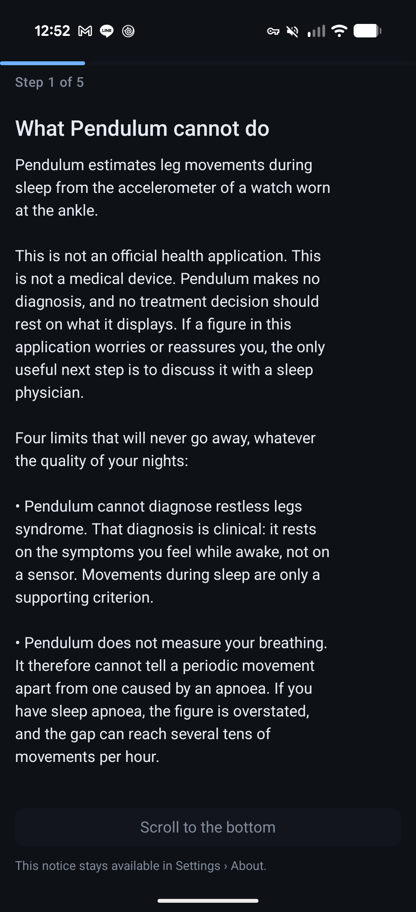

The blocked button carries its reason, and that reason is legible — it was rendered with Material's
default disabled colours, measured at **3.02:1** on the device, while `BoutonMotive` already existed
with the right hues (4.93:1).

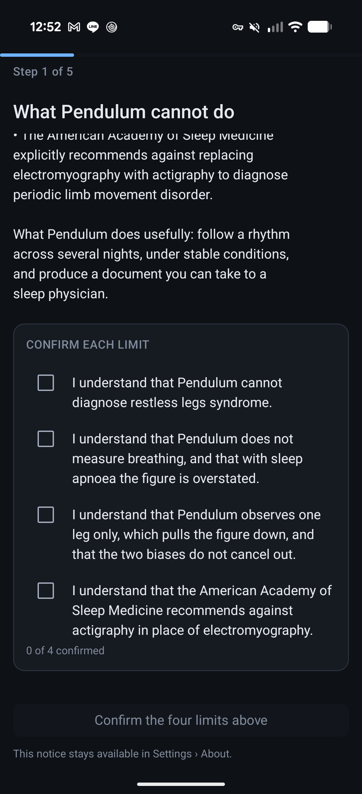
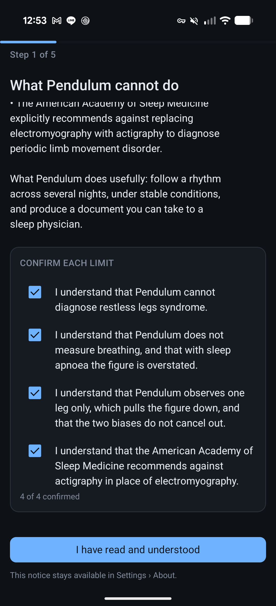

### 14.3 The five onboarding steps

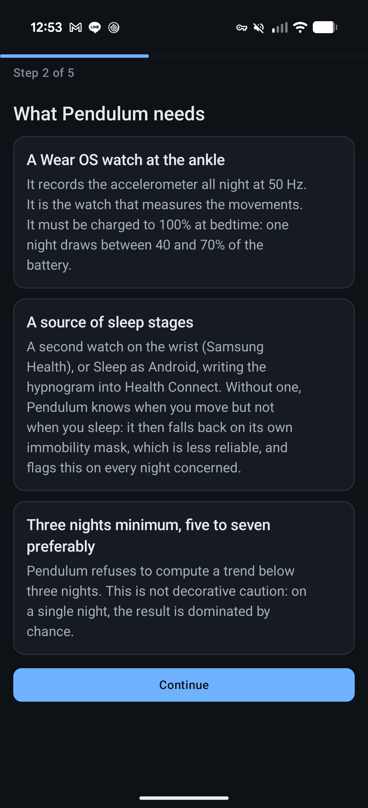
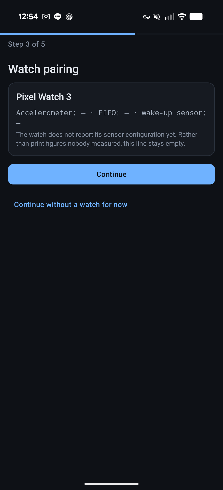

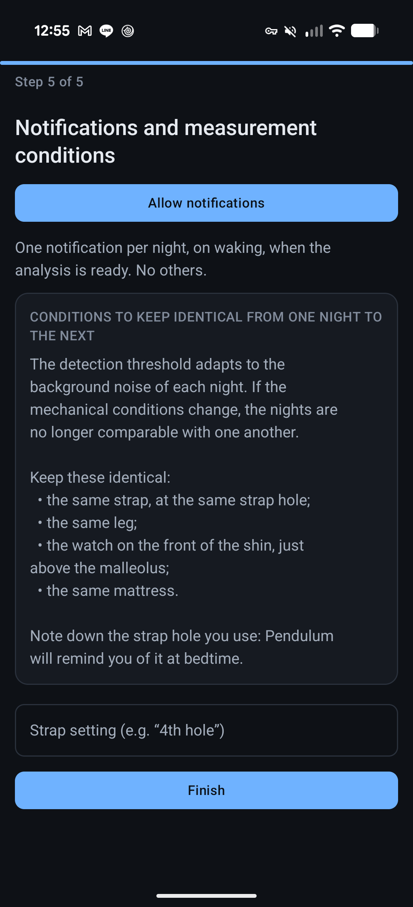

### 14.4 The application


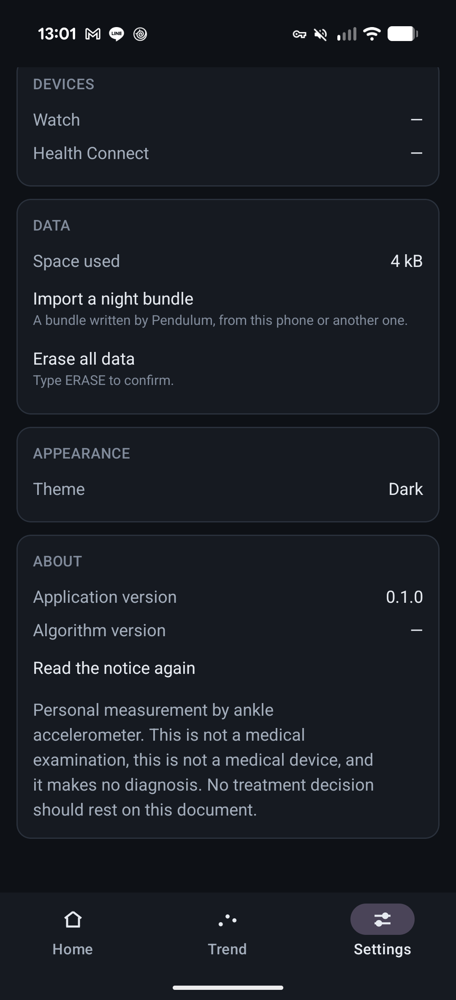

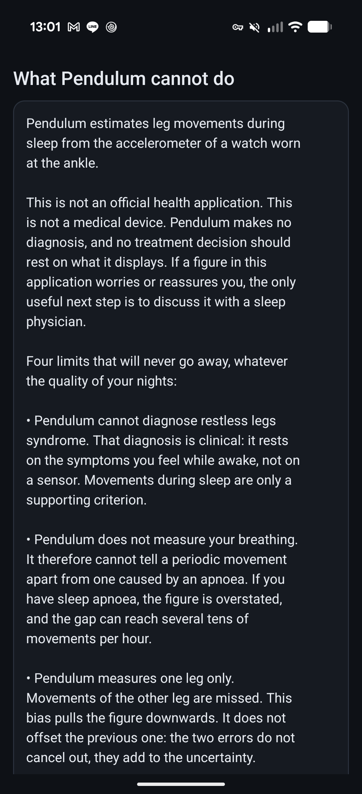

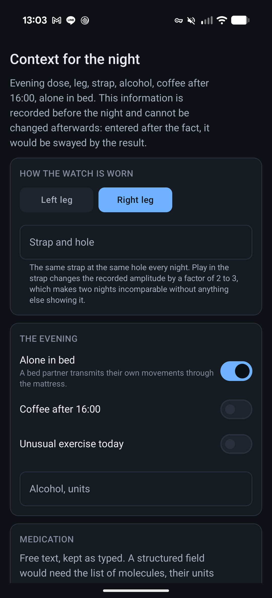

### 14.5 The watch


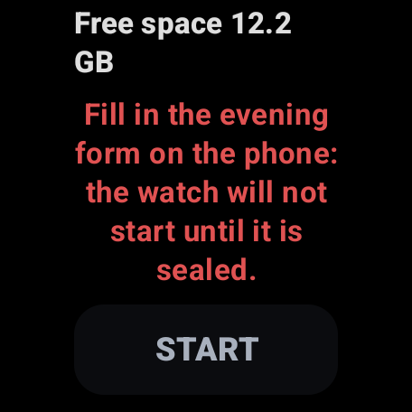

### 14.6 Five screens could not be seen, and that is a finding

On a fresh install, the night list, the detail of a night, the questionnaire, the comparison and the
export **have no gate at all**. `TrendScreen` only places a `LigneAction` towards the nights, the
comparison and the questionnaire in the `TendanceUiState.Pret` branch, that is from three eligible
nights onward; the HISTORY card on the home screen carries its button disabled. None of these
screens was therefore captured, and they were not captured **without fabricating nights**. Injecting
fake nights into the database to photograph screens is exactly the defect that moving
`ApercuDonnees` to `src/debug` corrected.

The questionnaire deserves a design question: it is a screening, it depends on no night, and today
it is unreachable until the third.

> **Lifted since, and by the very path this paragraph called for**: a night seeding that lives in
> `src/debug` alone — nothing in `src/main`, no code, no manifest, no string, checked against the dex
> files and the manifest of the release variant. The nights go through `NightSynth` and the same
> steps as `NightAnalyzer`, so they are plausible instead of round. The five screens finally have a
> gate, and the shipped product still has no button for fabricating a night. See §14.9.

### 14.7 What else the screenshots showed, and which was not corrected

> **Record of 4 August, kept as it is. Six of these twelve lines have moved since** — five corrected,
> one that looks corrected and is not. §14.9 says which is which, and what that re-reading rests on.

| Screen | Finding |
|---|---|
| Settings › Measurement | `Arrêt automatique  →  Automatic stop`: the row's value is the constant already serving as its label (`ReglagesUi.arretAutomatique = Textes.Reglages.ARRET_AUTO`). What it ought to say is a product decision. |
| Trend, fresh install | "Sleep access revoked — the permission to read sleep has been **withdrawn**". It was never granted. On a first launch, the screen announces a withdrawal that did not take place. |
| Trend | The "Nights recorded" label is rendered far from the three pills it describes, at the bottom of the card, with no value beside it. |
| Home | The disabled buttons repeat word for word the state line just above ("No recording open" twice, "No night recorded yet" twice). |
| Onboarding, step 4 | An active "Allow Health Connect" button is immediately followed by an inactive "Allow Health Connect first" button. The second is the *Continue* button carrying its reason; the two read as duplicates. |
| Onboarding, step 3 | The monospaced sensor-check line (`Accelerometer: — · FIFO: — · wake-up sensor: —`) does not fit the width and pushes its last dash alone onto the next line. |
| Onboarding step 5, erasure | The bulleted lists have no hanging indent: the second line of a bullet starts again at the left margin, under the bullet and not under the text. |
| Evening form | "Jambe droite" is preselected. A default answer on a form that seals once deserves to be an explicit choice. |
| Watch | "Free space 12.2 / GB": the value and its unit are separated by a line break. |
| Watch | The "fill in the evening form" blocker is rendered in **error red**. `PendulumColors`' semantic rule says that anything that is a *situation* and not a *failure* is shown in `attention`. An unsealed context is a situation. |
| Watch | On the round screen, the scrolled text passes under the edge: at `y = 27` of a 456 px disc, the visible width is `[120, 336]`, and "Free space 12.2" starts at `x = 80`. |
| Stacked screens | The scrolling content reaches the bottom edge of the window, under the navigation gesture area. Nothing is lost — the content scrolls — but the last line reads as cut off. |

### 14.8 The state left on the devices

The application's private data was backed up before the session
(`run-as com.pendulum tar cf -`), then **restored and read back**: `files/` again contains only
`profileInstalled`, hence no step counter, and the application reopens on "Step 1 of 5".
No permission was granted — the Health Connect step was passed through its escape hatch.
No recording was started, no context was sealed, nothing was uninstalled.

`connectedAndroidTest` was **not** run: `GardeFousTest` calls `eraseEverything()` and the
orchestrator uninstalls the package at the end of the run.

### 14.9 What came next — re-read in the code on 12 August 2026

§14.7 is a record dated 4 August, and it stays one: nothing in it is erased. What follows says only
what those lines have become, **checked file by file in today's code** and not inferred from a
commit message. A line of §14.7 that does not appear below has not been checked; do not read it as
corrected.

| Finding from §14.7 | State | Where it is held |
|---|---|---|
| `Arrêt automatique → Automatic stop`, the value repeated its label | **Corrected** | `ViewModels.kt` sets `settings_auto_stop_value`, which says *on the charger, on waking, or after 10 h* — a value, no longer an echo |
| Sleep source displayed as a raw package name | **Corrected, halfway** | `Mapping.nomDApplication` is called by both sites, the nights and the settings, which used to diverge. But it is a string transformation, not `PackageManager.getApplicationLabel`: `com.google.android.apps.healthdata` becomes "Healthdata". Legible, and it is not the name of the application |
| The unsealed-context blocker rendered in error red | **Corrected** | `IssueId.estUnePanne` splits the seven blockers into *failure* and *situation*; an unsealed context, refused notifications and the bench override are situations and come out in amber. `SeveriteDesBloqueursTest` locks the split |
| The scrolled text passing under the edge of the round glass | **Corrected** | The padding moved from the wrong side of the scroll to the right one (`2cacd67`); the inset is now derived from the shape of the screen |
| The "Ready" title while a blocker exists | **Corrected, with an accepted residue** | `RecordScreen` picks `idle_title_blocked` ("Not ready") as soon as preflight refuses the start. The residue is written in the code: **as long as preflight has not returned its verdict, the title still says "Ready"**. It is a window of a few hundred milliseconds, and it is the same defect in miniature |
| "Free space 12.2 / GB", the value separated from its unit by a line break | **NOT corrected** | See below |

**The free-space case deserves to be written out in full, because it is instructive.** Two
corrections have touched this line since 4 August — the text no longer passes under the glass, and
the decimal separator is forced to `Locale.UK` — and **neither of the two addresses the line break**.
The string remains `Free space %1$s`, `Preflight.formatBytes` returns `12.2 GB` with an ordinary
U+0020 space, hence a legal break opportunity, and the `Text` that displays it sets neither
`softWrap = false` nor a non-breaking space — there is no U+00A0 anywhere in the repository. The
horizontal padding of the round screen is now `side × 0.18` on each side: the usable width has
**decreased**, so the break is more likely than before, not less.

This is exactly the trap this log exists to avoid. Three commits bear on this line, their messages
are accurate, and a hurried reader would conclude that the line is settled. It is not, and the only
way to know was to go and read `Preflight.formatBytes` and the `Text` that consumes it.

**Still open, and not re-checked here**: the six other lines of §14.7 — the "Nights recorded" label
placed far from its pills, the disabled buttons that repeat the state line, the two Health Connect
buttons that read as duplicates, the monospaced sensor-check line that overflows, the bullets
without a hanging indent, and "Jambe droite" preselected on a form that seals once. The "Sleep
access revoked" message on a permission never granted is being dealt with as this is written, but
its cause string (`error_hc_02_cause`) has not changed yet.
